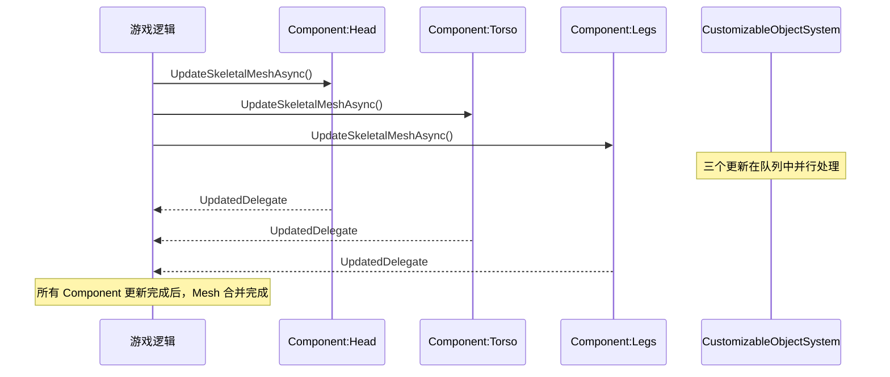

# Mutable多Component高级管理与性能优化

> 学完本课，你将掌握：多 Component 高级管理、纹理压缩策略、16-bit Bone Index 支持。

## 概述

前 5 课覆盖了 Mutable 的核心机制。本课深入**多 Component 高级用法**、**纹理压缩策略**、**Bone Index 支持**等进阶性能优化主题。

## 多 Component 高级管理

### Component 命名与查找

```cpp
// CustomizableSkeletalComponent.h 约 L71
UFUNCTION(BlueprintCallable, Category = CustomizableSkeletalComponent)
void SetComponentName(const FName& Name);

UFUNCTION(BlueprintCallable, Category = CustomizableSkeletalComponent)
FName GetComponentName() const;
```

**最佳实践**：
- 在 Mutable Editor 中**显式命名每个 Component**（如 `"Head"`、`"Torso"`、`"Legs"`）
- C++ 侧通过 `SetComponentName()` 绑定，不是靠 `ComponentIndex`（已废弃）

### 多 Component 更新同步



**关键**：Mutable 会**自动合并**多个 Component 的 Mesh 到同一个 `USkeletalMesh`。

### 监听所有 Component 更新完成

```cpp
// 维护一个计数器
int32 PendingUpdates = 3;

void AMyCharacter::OnMutableComponentUpdated()
{
    PendingUpdates--;
    if (PendingUpdates == 0)
    {
        // 所有 Component 更新完成
        OnAllComponentsReady();
    }
}
```

## 纹理压缩策略

### 压缩选项（`ECustomizableObjectTextureCompression`）

> 源码：`CustomizableObjectSystem.h` 约 L58-L66

| 枚举值 | 说明 | 速度 | 质量 |
|--------|------|------|------|
| `None` | 不压缩（最大质量、最大内存） | 最快 | 最高 |
| `Fast` | Mutable 快速压缩（推荐） | 快 | 中 |
| `HighQuality` | UE 高质量压缩（100x 慢） | **极慢** | 最高 |

### C++ 设置压缩级别

```cpp
// CustomizableObject.h 约 L205
UPROPERTY(EditAnywhere, Category = Compile)
ECustomizableObjectTextureCompression TextureCompression =
    ECustomizableObjectTextureCompression::Fast;
```

**实战建议**：
- 编辑器编译：`Fast`（迭代速度快）
- 最终打包：`HighQuality`（质量优先，可接受长编译时间）
- 运行时 Baking：`Fast`（Baking 可能频繁触发）

## 骨骼影响权重（Bone Influence）

### 16-bit Bone Index 支持

> 源码：`CustomizableObjectInstance.h` 约 L206-L207

```cpp
UENUM(BlueprintType)
enum class EUpdateResult : uint8
{
    // ...
    Error16BitBoneIndex // 更新失败：不支持 16bit Bone Index
};
```

**问题**：UE5 支持最多 12 个骨骼影响（`Twelve = 12`），但 Mutable 运行时生成可能需要 16-bit 索引。

**解决方案**：
```cpp
// CustomizableObjectSystem.h 约 L187
bool IsSupport16BitBoneIndexEnabled() const;

// 在 Project Settings > Mutable > Support 16 Bit Bone Index 中启用
```

## 总结与要点

| # | 要点 |
|---|------|
| 1 | 多 Component 通过 `ComponentName` 区分，Mutable 自动合并 Mesh |
| 2 | 纹理压缩：`Fast` 用于开发，`HighQuality` 用于最终打包 |
| 3 | 16-bit Bone Index 需要在 Project Settings 中启用 |

## 下一步

下一课：[[30-tutorials/mutable/07-Mutable集成实战与常见陷阱|集成实战与常见陷阱]] — GAS 集成、网络同步、常见坑与规避方法。

## 相关页面

- [[30-tutorials/mutable/05-编译Baking与性能优化|编译、Baking 与性能优化]] — 前置知识
- [[30-tutorials/mutable/04-SkeletalComponent与运行时更新详解|SkeletalComponent 与运行时更新]] — 多 Component 更新机制

<!-- nav:auto -->

---

**导航**: ← [[30-tutorials/mutable/05-编译Baking与性能优化|05-编译Baking与性能优化]] · [[30-tutorials/mutable/07-Mutable集成实战与常见陷阱|07-Mutable集成实战与常见陷阱]] →

<!-- /nav:auto -->
