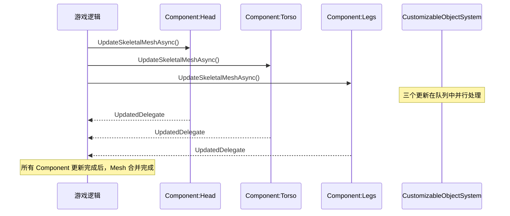

# Mutable高级主题与常见陷阱

> 学完本课，你将掌握：多 Component 高级管理、纹理压缩策略、与项目集成的实战经验、常见坑与规避方法。

## 概述

前 5 课覆盖了 Mutable 的核心机制。本课深入**多 Component 高级用法**、**性能调优**、**与项目集成**的实战经验。

## 多 Component 高级管理

### Component 命名与查找

```cpp
// CustomizableSkeletalComponent.h 约 L71
UFUNCTION(BlueprintCallable, Category = CustomizableSkeletalComponent)
void SetComponentName(const FName& Name);

UFUNCTION(BlueprintCallable, Category = CustomizableSkeletalComponent)
FName GetComponentName() const;
```

**最佳实践**：
- 在 Mutable Editor 中**显式命名每个 Component**（如 `"Head"`, `"Torso"`, `"Legs"`）
- C++ 侧通过 `SetComponentName()` 绑定，不是靠 `ComponentIndex`（已废弃）

### 多 Component 更新同步



**关键**：Mutable 会**自动合并**多个 Component 的 Mesh 到同一个 `USkeletalMesh`。

### 监听所有 Component 更新完成

```cpp
// 维护一个计数器
int32 PendingUpdates = 3;

void AMyCharacter::OnMutableComponentUpdated()
{
    PendingUpdates--;
    if (PendingUpdates == 0)
    {
        // 所有 Component 更新完成
        OnAllComponentsReady();
    }
}
```

## 纹理压缩策略

### 压缩选项（`ECustomizableObjectTextureCompression`）

> 源码：`CustomizableObjectSystem.h` L58-L66

| 枚举值 | 说明 | 速度 | 质量 |
|--------|------|------|------|
| `None` | 不压缩（最大质量、最大内存） | 最快 | 最高 |
| `Fast` | Mutable 快速压缩（推荐） | 快 | 中 |
| `HighQuality` | UE 高质量压缩（100x 慢） | **极慢** | 最高 |

### C++ 设置压缩级别

```cpp
// CustomizableObject.h 约 L205
UPROPERTY(EditAnywhere, Category = Compile)
ECustomizableObjectTextureCompression TextureCompression =
    ECustomizableObjectTextureCompression::Fast;
```

**实战建议**：
- 编辑器编译：`Fast`（迭代速度快）
- 最终打包：`HighQuality`（质量优先，可接受长编译时间）
- 运行时 Baking：`Fast`（Baking 可能频繁触发）

## 骨骼影响权重（Bone Influence）

### 16-bit Bone Index 支持

> 源码：`CustomizableObjectInstance.h` L206-L207

```cpp
enum class EUpdateResult : uint8
{
    // ...
    Error16BitBoneIndex // 更新失败：不支持 16bit Bone Index
};
```

**问题**：UE5 支持最多 12 个骨骼影响（`Twelve = 12`），但 Mutable 运行时生成可能需要 16-bit 索引。

**解决方案**：
```cpp
// CustomizableObjectSystem.h 约 L187
bool IsSupport16BitBoneIndexEnabled() const;

// 在 Project Settings > Mutable > Support 16 Bit Bone Index 中启用
```

## 与 GAS 集成

Mutable 常与 **Gameplay Ability System（GAS）** 配合使用（换装触发 Ability）：

```cpp
// 在 Ability 中触发换装
void ULyraGameplayAbility::ActivateAbilityFromEvent(
    const FGameplayEventData& EventData)
{
    // 获取 Mutable Component
    if (UCustomizableSkeletalComponent* MutableComp =
        GetActorFromActorInfo()->FindComponentByClass<UCustomizableSkeletalComponent>())
    {
        // 设置参数（从 EventData 读取）
        if (UCustomizableObjectInstance* Inst = MutableComp->GetCustomizableObjectInstance())
        {
            Inst->SetBoolParameter(TEXT("bHelmet"), true);
            MutableComp->UpdateSkeletalMeshAsyncResult(
                FInstanceUpdateDelegate::CreateUObject(this, &ThisClass::OnMeshUpdated));
        }
    }
}

void ULyraGameplayAbility::OnMeshUpdated(const FUpdateContext& Result)
{
    if (Result.UpdateResult == EUpdateResult::Success)
    {
        // Mesh 更新完成，继续 Ability 逻辑
        EndAbility(CurrentSpecHandle, CurrentActorInfo, CurrentActivationInfo);
    }
}
```

## 与网络同步配合

### 问题：客户端换装如何同步到服务器？

**方案 1：复制参数值（推荐）**

```cpp
// 在 Character 的 Header 中
UPROPERTY(ReplicatedUsing = OnRep_Appearance)
FString AppearanceProfile;  // 序列化的参数 JSON

UFUNCTION()
void OnRep_Appearance();
```

```cpp
// CPP
void ALyraCharacter::OnRep_Appearance()
{
    // 从 JSON 反序列化参数
    ApplyAppearanceFromJSON(AppearanceProfile);

    // 触发 Mutable 更新
    if (UCustomizableSkeletalComponent* Comp = ...)
    {
        Comp->UpdateSkeletalMeshAsync();
    }
}
```

**方案 2：复制 Instance 的 Profile Data**

`UCustomizableObject` 支持 `FProfileParameterDat`（`CustomizableObject.h` L70-L107），可序列化/反序列化参数组合。

## 常见坑与规避

### 坑 1：更新未完成就销毁 Actor

**现象**：崩溃或 Mesh 显示异常。
**原因**：`UpdateSkeletalMeshAsync` 是异步的，Actor 销毁时后台任务仍在执行。
**解决**：

```cpp
void AMyCharacter::BeginDestroy()
{
    // 取消 Mutable 更新
    if (UCustomizableSkeletalComponent* Comp = ...)
    {
        // Mutable 内部会自动处理取消逻辑
        Comp->SetCustomizableObjectInstance(nullptr);
    }
    Super::BeginDestroy();
}
```

### 坑 2：LOD 流式加载导致的内存峰值

**现象**：切换到高品质时卡顿。
**原因**：`bEnableLODStreaming=true` 时，LOD 按需加载，可能造成内存峰值。
**解决**：

```
mutable.WorkingMemory=25600   // 限制工作内存（25MB）
mutable.NumMaxStreamedLODs=2  // 限制同时流式 LOD 数量
```

### 坑 3：Baking 后的 Material Instance 丢失参数

**现象**：Baking 后，动态修改材质参数无效。
**解决**：Baking 时设置 `bGenerateConstantMaterialInstancesOnBake = true`，或保留运行时 Mutable Instance。

### 坑 4：编辑器编译成功，运行时更新失败

**现象**：编辑器中预览正常，打包后 `UpdateSkeletalMeshAsync` 返回 `Error`。
**原因**：打包时 `CustomizableObject` 的编译数据（`ResourceData`）未正确 Cook。
**解决**：
1. 确保 `DefaultGame.ini` 中包含 Mutable 的 Cook 规则
2. 使用 `CVarMutableUseBulkData=1`（推荐）
3. 验证 `.uasset` 中包含 `CustomizableObjectResourceData`

## 与项目集成实战

### 步骤 1：启用插件

1. **Edit → Plugins → 搜索 "Mutable" → 勾选 Enabled**
2. 重启编辑器

### 步骤 2：创建第一个 CustomizableObject

1. **Content Browser → 右键 → Mutable → Customizable Object**
2. 双击打开 **Mutable Editor**
3. 添加 **Base Mesh**（角色基础 SkeletalMesh）
4. 添加 **Material**（材质节点）
5. 添加 **Parameters**（参数节点）
6. **Compile**（编译按钮）

### 步骤 3：在 Actor 中使用

1. 在 Actor Blueprint 中添加 **CustomizableSkeletalComponent**
2. 设置 `CustomizableObjectInstance` → 指向你的 `CustomizableObject`
3. 在 Event Graph 中调用 `UpdateSkeletalMeshAsync`
4. 绑定 `On Updated` 事件

### 步骤 4（可选）：C++ 基类集成

```cpp
// 在 C++ Character 中
UPROPERTY(VisibleAnywhere, BlueprintReadOnly)
TObjectPtr<UCustomizableSkeletalComponent> MutableComponent;

AMyCharacter::AMyCharacter()
{
    MutableComponent = CreateDefaultSubobject<UCustomizableSkeletalComponent>(TEXT("Mutable"));
    MutableComponent->SetupAttachment(GetMesh());
}
```

## 总结与要点

| # | 要点 |
|---|------|
| 1 | 多 Component 通过 `ComponentName` 区分，Mutable 自动合并 Mesh |
| 2 | 纹理压缩：`Fast` 用于开发，`HighQuality` 用于最终打包 |
| 3 | 16-bit Bone Index 需要在 Project Settings 中启用 |
| 4 | 网络同步：复制参数 JSON 或 `FProfileParameterDat` |
| 5 | 常见坑：**异步更新未完成就销毁**、**LOD 流式内存峰值**、**打包后 ResourceData 丢失** |

## 系列总结

至此，Mutable 系列教程完结。你已经掌握：

1. **概念层**：Mutable 解决什么问题、与硬变体方案对比
2. **架构层**：`CustomizableObject` / `Instance` / `SkeletalComponent` 三角关系
3. **实战层**：C++ 接口、参数赋值、异步更新、委托回调
4. **优化层**：编译策略、Baking、LOD 流式、内存管理
5. **高级层**：多 Component、纹理压缩、GAS/网络集成、常见坑

## 相关页面

- [[30-tutorials/mutable/05-编译Baking与性能优化|编译、Baking 与性能优化]] — 前置知识
- [[30-tutorials/gas/00-GAS系统总览|GAS 系列概览]] — 与 GAS 集成参考
- [[30-tutorials/network-sync/00-UE网络通信总览|网络同步总览]] — 网络同步参考

<!-- nav:auto -->

---

**导航**: ← [[30-tutorials/mutable/07-Mutable集成实战与常见陷阱|07-Mutable集成实战与常见陷阱]]

<!-- /nav:auto -->
