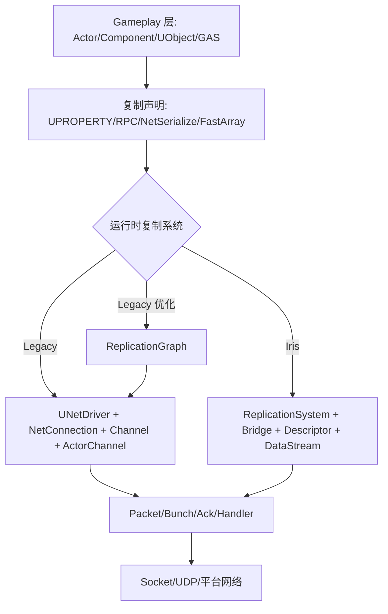
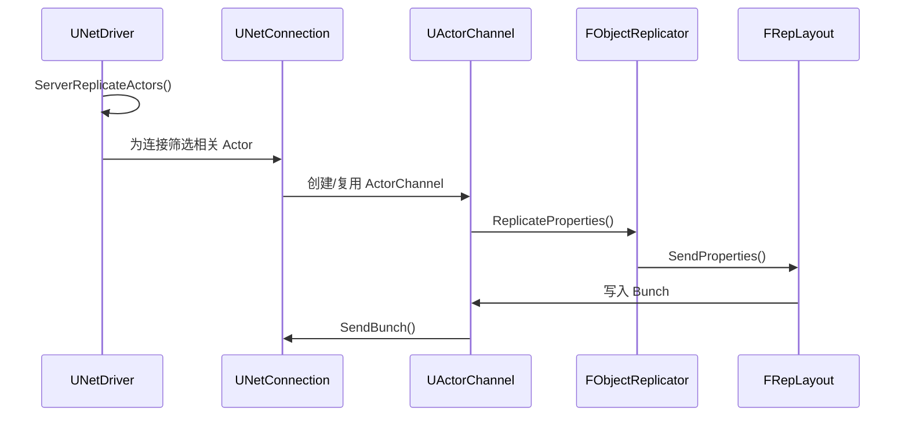
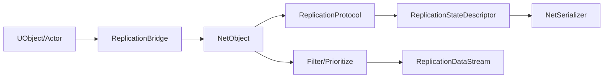

# UE网络通信总览

> 本页重写自旧版“UE 网络通信-总览”，按 UE5.7 同时存在 Legacy 与 Iris 的现实重新组织。

## 总体分层



UE 网络同步可以分成两类问题：

1. **连接与传输**：连接建立、握手、控制消息、Packet、Bunch、Ack、丢包与可靠性。
2. **对象状态复制**：Actor/Component/SubObject 的属性、RPC、对象引用、优先级与相关性。

## Legacy 路径关键对象

| 对象 | 职责 |
|---|---|
| `UNetDriver` | 网络驱动总入口，负责连接、收包发包、复制调度、RPC 路由 |
| `UNetConnection` | 一个远端连接的状态，维护 Channel、包序号、Ack、发送队列 |
| `UChannel` | 连接上的逻辑通道，ControlChannel / ActorChannel 等 |
| `UActorChannel` | Legacy Actor 复制核心通道，负责 Actor 初始创建、属性块、RPC、SubObject |
| `FObjectReplicator` | 某个 UObject/Actor 在某连接上的属性复制状态 |
| `FRepLayout` | Legacy 属性复制布局，描述哪些字段如何比较和序列化 |
| `UPackageMapClient` | UObject 引用与 `FNetworkGUID` 的映射与导出 |

Legacy Actor 复制典型链路：



## Iris 路径关键对象

| 对象 | 职责 |
|---|---|
| `UReplicationSystem` | Iris 复制系统总控，调度对象注册、状态轮询、过滤、优先级、发送接收 |
| `UObjectReplicationBridge` | Gameplay UObject/Actor 与 Iris NetObject 之间的桥接 |
| `FReplicationStateDescriptor` | 描述一个状态的字段、条件、NetSerializer、ChangeMask 等 |
| `FReplicationProtocol` | 一个对象类型的复制协议，由若干状态和 fragment 组成 |
| `FReplicationFragment` | 对象实例与复制状态之间的数据收集/应用单元 |
| `FNetSerializer` | Iris 类型序列化、量化、反量化、差量序列化的核心接口 |
| `FNetToken` | 稳定数据（如名称、Tag、字符串等）的 token 化压缩机制 |

Iris 的核心变化是把“ActorChannel 驱动复制”转向“对象状态驱动复制”：



## 高层 API 与底层路径

UE 的网络 API 有一个容易混淆的点：高层写法可能相同，底层路径可能不同。

例如：

```cpp
UPROPERTY(ReplicatedUsing=OnRep_Health)
float Health;

UFUNCTION(Server, Reliable)
void ServerFire();
```

这些声明在 Legacy 与 Iris 下仍然是业务层入口，但底层属性布局、状态比较、序列化和传输组织方式不同。因此文档后续会分别讲 Legacy 与 Iris。

## Lyra 的特殊性

Lyra 项目当前具备三类网络代码：

- 常规高层复制：`ALyraCharacter`、`ALyraPlayerState` 等。
- ReplicationGraph 工程实现：`ULyraReplicationGraph`，但默认禁用。
- Iris 适配：插件启用、Build 支持、TargetData 结构 NetSerializer 支持与 Bridge Filter 配置。

这使 Lyra 很适合作为“UE5.7 网络同步横向学习样例”。

## 后续阅读

- 连接生命周期：`[[30-tutorials/network-sync/01-连接建立与断开]]`
- Packet / Bunch / Ack：`[[30-tutorials/network-sync/02-PacketBunchAck]]`
- Legacy Actor 复制：`[[30-tutorials/network-sync/03-LegacyActor复制流程]]`
- Iris 总览：`[[30-tutorials/network-sync/iris/00-Iris总览]]`

<!-- nav:auto -->

---

**导航**: [[30-tutorials/network-sync/01-连接建立与断开|01-连接建立与断开]] →

<!-- /nav:auto -->
