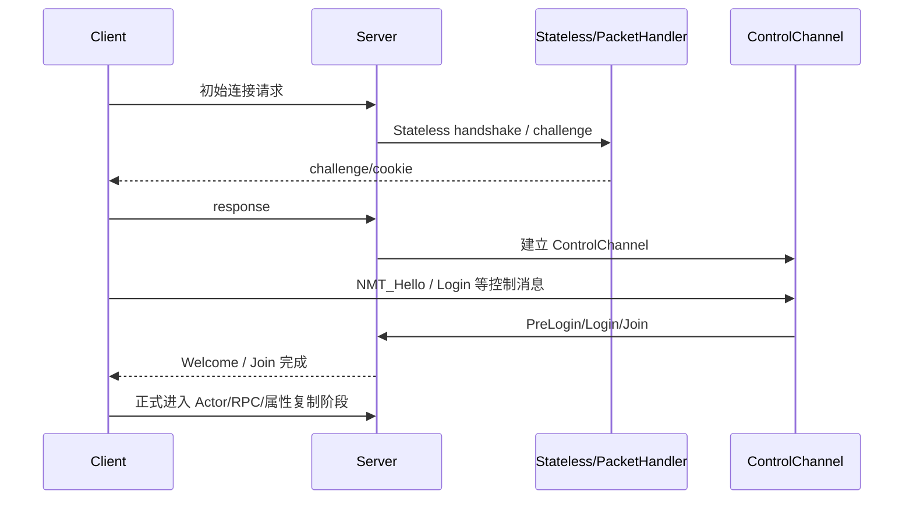
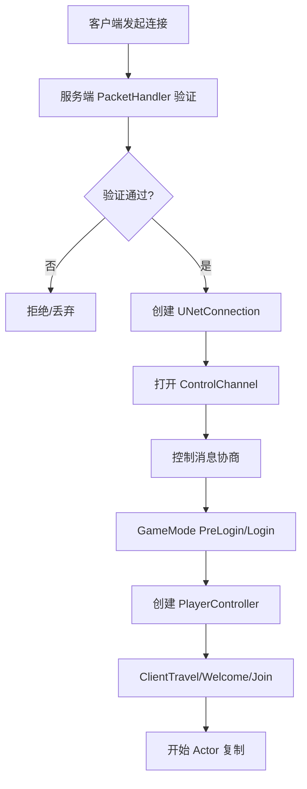

# 连接建立与断开

> 本页描述 UE 网络连接生命周期；本轮已按 UE5.7 源码复核 ControlChannel 登录链路。

## 生命周期总览

UE 连接建立可以粗分成两段：

1. **传输层握手**：PacketHandler / StatelessConnectHandler 负责抵御伪造连接与基础握手。
2. **游戏层登录**：ControlChannel 传输控制消息，完成版本协商、登录、地图加载与加入世界。

## 关键对象

| 对象 | 职责 |
|---|---|
| `UNetDriver` | 创建和管理连接，Tick 收发包 |
| `UNetConnection` | 保存某个客户端连接的状态、Channel、包序号、速率限制 |
| `PacketHandler` | 加密、压缩、握手、防重放等包处理链 |
| `ControlChannel` | 连接初期的控制消息通道 |
| `GameMode` | `PreLogin`、`Login`、`PostLogin`、`HandleStartingNewPlayer` 等游戏层接入逻辑 |
| `PlayerController` | 登录成功后的玩家连接代表 |
| `PlayerState` | 玩家可复制状态，断线/重连时常用于保留部分状态 |

## 连接建立流程

## 控制消息阶段

旧教程中提到的 `NMT_Hello`、`NMT_Challenge`、`NMT_Login`、`NMT_Welcome`、`NMT_Join` 等属于控制消息体系。UE5.7 源码复核后的主链路如下：

| 阶段 | UE5.7 源码符号 | 结论 |
|---|---|---|
| 客户端发起初始加入 | `UPendingNetGame::SendInitialJoin` (`Engine/Private/PendingNetGame.cpp`) | 客户端发送 `NMT_Hello`，携带网络版本、endianness、加密 token 等信息。 |
| 服务端处理 Hello | `UWorld::NotifyControlMessage` (`Engine/Private/World.cpp`) | 服务端校验版本、网络特性和加密要求；通过后调用 `UNetConnection::SendChallengeControlMessage`。 |
| 服务端挑战 | `UNetConnection::SendChallengeControlMessage` | 服务端发送 `NMT_Challenge`。 |
| 客户端登录 | `UPendingNetGame::NotifyControlMessage` | 客户端收到 `NMT_Challenge` 后发送 `NMT_Login`。 |
| 服务端异步预登录 | `AGameModeBase::PreLoginAsync`、`UWorld::PreLoginComplete` | `NMT_Login` 进入 GameMode 预登录，支持异步完成。 |
| 服务端欢迎 | `UWorld::WelcomePlayer` | 预登录完成后发送 `NMT_Welcome`。 |
| 客户端加入 | `UPendingNetGame::SendJoinWithFlags` | 客户端地图准备完成后发送 `NMT_Join` 或 `NMT_JoinNoPawn`。 |
| 服务端生成玩家 | `UWorld::NotifyControlMessage` → `SpawnPlayActor` | 服务端处理 Join，生成 `PlayerController` 并设置 `ReceivedJoin`。 |

不同 OnlineSubsystem、加密/认证插件、平台会在上述主链路外插入额外逻辑；Listen Server 与 Dedicated Server 在本地玩家、URL、地图加载时也有差异。

## 断开连接

断开连接通常涉及：

- `UNetConnection` 关闭。
- Channel 关闭。
- PlayerController 断开或销毁。
- Pawn 取消 possession 或销毁。
- PlayerState 进入 inactive 或销毁。
- GameMode 收到 Logout / cleanup。

Lyra 中 `ALyraPlayerState::OnDeactivated` 当前会把连接类型设为 `InactivePlayer`，但随后默认 `Destroy()`，说明示例项目并未实现复杂的长时间断线保留逻辑。

## 重连与状态保留

如果项目需要重连恢复，通常要明确：

- 哪些状态放在 PlayerState。
- 哪些状态放在后端服务或存档。
- Pawn 是否销毁后重建。
- Inventory / Equipment / ASC 状态是否需要重放或重新授予。
- 网络连接恢复是否复用旧 PlayerController，还是创建新连接并迁移状态。

旧教程中“保留 PlayerController”类方案属于项目级设计，不是 UE 默认流程。进入知识库时必须标注为“可选策略”。

## 已复核与仍需运行时验证

已复核：ControlChannel 主登录消息链路、`PreLoginAsync` 参与路径、`NMT_Welcome` 与 `NMT_Join`/`NMT_JoinNoPawn` 的时序。

仍需运行时验证：PacketHandler/Stateless handshake 的具体 challenge cookie、平台认证插件插入点、seamless travel 与 PIE 多进程差异、项目是否重写 PlayerState inactive 保留策略。

## Lyra 关联

- `ALyraPlayerState::OnDeactivated` / `OnReactivated`：连接类型切换。
- `ALyraGameMode`：玩家接入与 PawnData 分配。
- `ULyraExperienceManagerComponent`：Experience 加载完成后 PlayerState 才设置 PawnData。

<!-- nav:auto -->

---

**导航**: ← [[30-tutorials/network-sync/00-UE网络通信总览|00-UE网络通信总览]] · [[30-tutorials/network-sync/02-PacketBunchAck|02-PacketBunchAck]] →

<!-- /nav:auto -->
