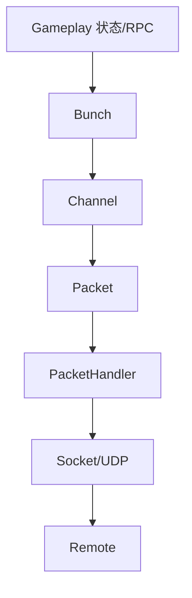
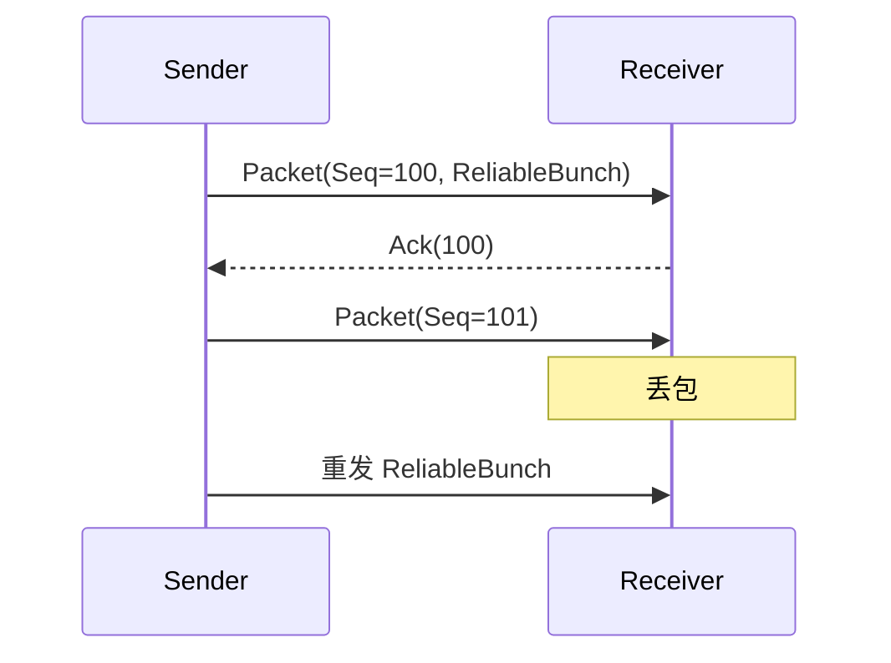
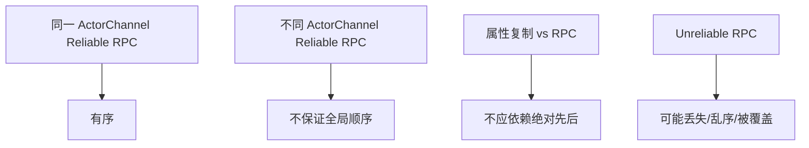

# PacketBunchAck

> 本页重写 UE 传统网络传输概念，强调不要把“可靠 UDP”误解为 TCP。

## 层级关系

- **Packet**：网络层实际发送的包，带包序号、Ack 信息和 Handler 处理结果。
- **Bunch**：UE Channel 上的逻辑数据块，承载属性复制、RPC、控制消息等。
- **Channel**：同一连接上的逻辑通道，例如 ControlChannel、ActorChannel。
- **Ack/Nak**：UE 在 UDP 上实现可靠传输、重发和丢包检测的基础。

## 可靠性模型

UE 网络默认基于 UDP，但在 Channel/Bunch 层实现了可靠数据机制：

要点：

- Reliable Bunch 丢失后会重发。
- Unreliable Bunch 丢失后通常不补。
- 同一 Channel 内 reliable 数据有顺序约束。
- 不同 Channel / 不同 Actor 之间不要假设全局顺序。

## UE5.7 源码复核结论

| 主题 | UE5.7 源码符号 | 结论 |
|---|---|---|
| Packet 头与 Ack 历史 | `FNetPacketNotify::WriteHeader` / `ReadHeader` / `Update` (`Engine/Public/Net/NetPacketNotify.h`, `Engine/Private/Net/NetPacketNotify.cpp`) | Packet 级写入 `Seq`、`AckedSeq` 和 history，接收端更新 Ack/Nak 状态。 |
| 收包分发 Ack/Nak | `UNetConnection::ReceivedPacket`、`ReceivedAck`、`ReceivedNak` (`Engine/Private/NetConnection.cpp`) | PacketNotify 产生 Ack/Nak 后，连接把确认/丢包结果分发给 Channel 和 PackageMap 等状态。 |
| Bunch 发送 | `UChannel::SendBunch` → `PrepBunch` → `SendRawBunch` (`Engine/Private/DataChannel.cpp`) | Bunch 是 Channel 级逻辑数据；可靠 Bunch 会进入 `OutRec` 并分配 Channel reliable sequence。 |
| Bunch 接收排序 | `UChannel::ReceivedRawBunch`、`ReceivedNextBunch` | Reliable Bunch 必须按 `InReliable[ChIndex]+1` 顺序交付，乱序 reliable bunch 会进入 `InRec` 等待前序。 |
| Ack 后清理 | `UChannel::ReceivedAcks` | 可靠 Bunch 被确认后从 `OutRec` 清理；Nak 会触发重发/重脏相关状态。 |
| 数据结构 | `FOutBunch` / `FInBunch` (`Engine/Public/Net/DataBunch.h`) | 属性复制、RPC、控制消息最终都组织为 Channel 上的 Bunch。 |

源码结论：UE 网络不是 TCP；可靠性是在 UDP 上由 Packet Ack + Channel Reliable Bunch 共同实现。可靠保证的边界是“同一 Channel 内可靠 Bunch 有序且等待 Ack”，不是跨 Actor/Channel 的全局顺序。

## 属性复制与 RPC 的差异

| 类型 | 常见可靠性 | 说明 |
|---|---|---|
| 属性复制 | 通常按状态增量发送，可丢当前帧，后续状态会覆盖 | 适合最终一致状态 |
| Reliable RPC | 必须送达，按 Channel 顺序处理 | 适合关键事件，但高频会堆积 |
| Unreliable RPC | 可丢弃 | 适合表现、快照、临时提示 |
| FastArray | 基于属性复制/Delta 机制 | 适合数组状态最终一致 |

Lyra 中 `FastSharedReplication` 是 unreliable multicast，所以它只适合移动快照优化，不适合权威 gameplay 状态。

## Bunch 拆分

当逻辑数据超过单包容量时，UE 可能拆分成 partial bunch。风险点：

- 大 RPC 参数可能导致拆包和可靠队列压力。
- 大数组直接复制可能比 FastArray 更昂贵。
- 大量 reliable RPC 堆积可能阻塞后续 reliable 数据。

实践建议：

- 不要把大批量状态塞进单个 reliable RPC。
- 数组状态优先 FastArray。
- 高频移动/表现数据优先不可靠快照或属性最终一致。

## 顺序保证边界

常见错误：

- 先发 RPC，再指望另一个 Actor 的属性已经同步。
- 在 Client RPC 中立即读取刚复制的 SubObject，未处理对象引用尚未 resolve。
- 用 reliable RPC 同步每帧状态。

## Lyra 示例

- `ALyraCharacter::FastSharedReplication`：unreliable multicast，发送 `FSharedRepMovement` 快照。
- `ULyraWeaponStateComponent::ClientConfirmTargetData`：reliable Client RPC，用于命中确认。
- Inventory / Equipment：使用 FastArray 做状态同步，而不是用 RPC 广播每次变化。

## 仍需运行时验证

旧教程中提到的最大包大小、partial bunch 阈值、乱序缓存大小、带宽限制 CVar、PacketHandler 默认组件会受平台、NetDriver、PacketHandler 配置和运行参数影响。本页已关闭核心可靠性/顺序模型的源码复核，但具体数值不应脱离项目运行配置写死。

<!-- nav:auto -->

---

**导航**: ← [[30-tutorials/network-sync/01-连接建立与断开|01-连接建立与断开]] · [[30-tutorials/network-sync/03-LegacyActor复制流程|03-LegacyActor复制流程]] →

<!-- /nav:auto -->
