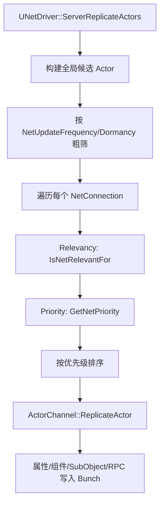

# LegacyActor复制流程

> 传统 Actor 复制路径的核心是 `UNetDriver` 为每个连接筛选 Actor，并通过 `UActorChannel` 复制。

## 总流程

## UE5.7 源码复核结论

Legacy 主入口是 `UNetDriver::ServerReplicateActors`（`Engine/Private/NetDriver.cpp`）。若存在 `ReplicationDriver`，会先委托给 ReplicationGraph 等驱动；否则走传统 Actor 复制。源码阶段可拆为：

| 阶段 | UE5.7 源码符号 | 结论 |
|---|---|---|
| 连接准备 | `ServerReplicateActors_PrepConnections` | 计算本帧参与复制的连接，更新 ViewTarget 等连接视图状态。 |
| 构建候选列表 | `ServerReplicateActors_BuildConsiderList` | 遍历 `NetworkObjectList`，按 `NextUpdateTime`、`RemoteRole`、初始化状态、Level streaming、Dormancy、`NetUpdateFrequency` 过滤，并调用 `Actor->CallPreReplication`。 |
| 连接级处理 | `ServerReplicateActors_ForConnection` | 为连接构建 `FNetViewer`，处理 movement correction 等连接相关准备。 |
| 相关性与优先级 | `ServerReplicateActors_PrioritizeActors` | 做 level loaded、relevancy、owner-only、dormancy、priority 排序。 |
| 复制处理 | `ServerReplicateActors_ProcessPrioritizedActorsRange` | 创建/复用 `UActorChannel`，二次 relevancy，调用 `Channel->ReplicateActor()`；带宽饱和时延后并 `ForceNetUpdate`。 |
| 标记剩余相关 Actor | `ServerReplicateActors_MarkRelevantActors` | 对未处理但仍相关的 Actor 标记 `bPendingNetUpdate`。 |

## 三层过滤

| 层 | 问题 | 常用机制 |
|---|---|---|
| 候选层 | Actor 本轮是否值得考虑？ | `bReplicates`、Dormancy、`NetUpdateFrequency` |
| 连接层 | Actor 是否应该发给该连接？ | `IsNetRelevantFor`、Owner、距离、`bAlwaysRelevant` |
| 带宽层 | 带宽不足时先发谁？ | `GetNetPriority`、`NetPriority`、距离和等待时间 |

这三层不能混淆：提高 `NetPriority` 不会让不相关的 Actor 变相关，也不会绕过 `NetUpdateFrequency` 粗筛。

## Relevancy 常见规则

- `bAlwaysRelevant`：对所有连接相关，适合 GameState 类全局状态，滥用会增加带宽。
- `bOnlyRelevantToOwner`：只发给拥有者连接，适合玩家私有状态。
- `bNetUseOwnerRelevancy`：复用 Owner 的相关性，适合附属于角色/装备的对象。
- 距离裁剪：通过 `NetCullDistanceSquared` 等参数减少远距离 Actor 复制。
- 隐藏且无碰撞对象：可能被判定为不相关。

Lyra 的 `ALyraCharacter` 在构造函数中设置了较大的 `SetNetCullDistanceSquared(900000000.0f)`，体现了角色可见/同步距离的项目级选择。

## ActorChannel 职责

`UActorChannel` 处理：

- 客户端 Actor 初始生成。
- 复制属性块。
- 组件与 SubObject 复制。
- RPC 收发。
- 对象引用导出。
- Channel 关闭后的客户端对象销毁或保留。

当 Actor 对某连接从不相关变为相关，可能打开新的 ActorChannel；从相关变为不相关时，Channel 可能关闭，动态 Actor 客户端副本可能销毁。

## PreReplication

`AActor::PreReplication` 在复制前被调用，适合准备本轮复制数据。

Lyra 示例：`ALyraCharacter::PreReplication` 将当前加速度压缩到 `FLyraReplicatedAcceleration`，再通过属性复制发送给模拟代理。

注意：`PreReplication` 是 Actor 级准备阶段，不代表已经复制给某个具体连接。

## Priority

Priority 决定带宽竞争下的复制顺序：

- 只在“已经相关”的 Actor 之间生效。
- 是相对值，不是绝对值。
- 长时间未复制的 Actor 通常会因等待时间提高有效优先级。
- Pawn、PlayerController、ViewTarget 附近对象通常更重要。

错误做法：把所有 Actor 的 `NetPriority` 同比放大，通常不会改变相对分配。

## ReplicationGraph 的影响

启用 ReplicationGraph 后，Actor 列表由图节点生成，`AActor::IsNetRelevantFor` 不再是主要路径。Lyra 的 `ULyraReplicationGraph` 注释明确说明了这一点。

因此调试相关性问题时必须先确认：

- 是否启用了 RepGraph。
- Actor 被路由到哪个 node。
- 连接收集到哪些 actor list。

## Lyra 关联

- `ALyraCharacter`：普通属性复制 + fast shared movement。
- `ALyraPlayerState`：高频 PlayerState + ASC Mixed 复制。
- `ULyraReplicationGraph`：可选 RepGraph 路由策略。
- `ULyraReplicationGraphNode_PlayerStateFrequencyLimiter`：PlayerState 限频样例。

<!-- nav:auto -->

---

**导航**: ← [[30-tutorials/network-sync/02-PacketBunchAck|02-PacketBunchAck]] · [[30-tutorials/network-sync/04-Legacy属性复制与RPC流程|04-Legacy属性复制与RPC流程]] →

<!-- /nav:auto -->
