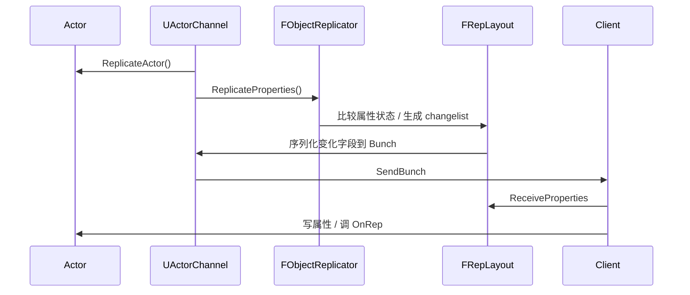
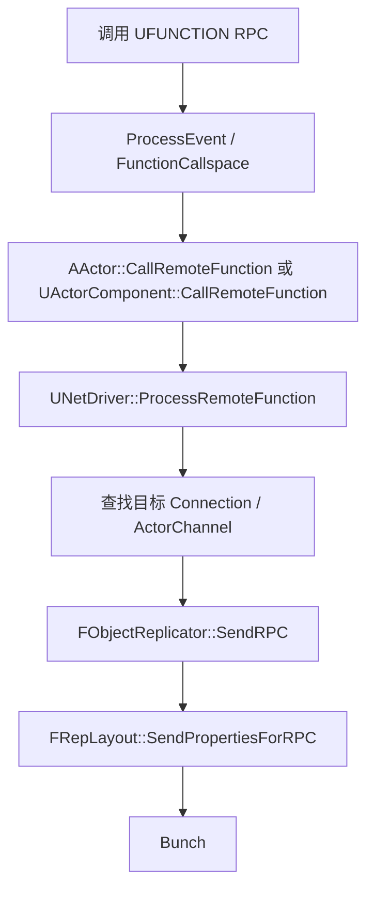
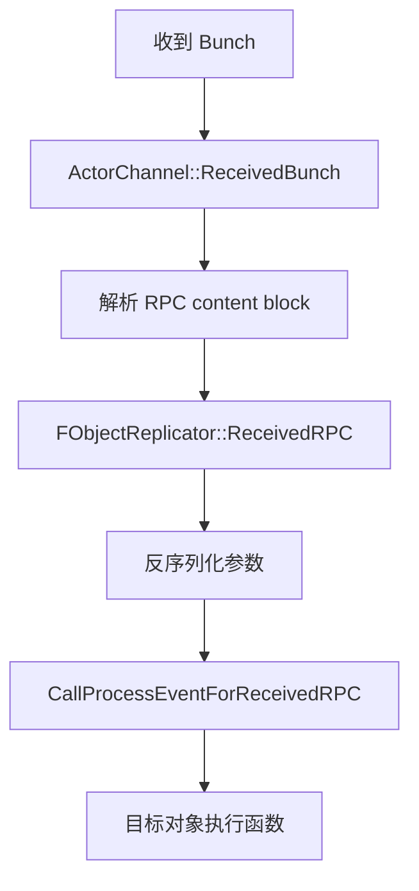

# Legacy属性复制与RPC流程

> 本页关注传统复制系统中属性复制与 RPC 的业务层到网络层链路。

## 属性复制链路



业务层常见写法：

```cpp
UPROPERTY(ReplicatedUsing=OnRep_MyState)
int32 MyState; // [1] 声明需要复制的属性，并指定回调

void AMyActor::GetLifetimeReplicatedProps(TArray<FLifetimeProperty>& OutLifetimeProps) const
{
    Super::GetLifetimeReplicatedProps(OutLifetimeProps);
    DOREPLIFETIME(ThisClass, MyState); // [2] 在寿命周期属性中注册
}
```

## UE5.7 属性复制源码链

| 环节 | UE5.7 源码符号 | 结论 |
|---|---|---|
| Actor 绑定 Channel | `UActorChannel::SetChannelActor` (`Engine/Private/DataChannel.cpp`) | 建立 Actor 与 Channel 映射，并创建 `ActorReplicator`。 |
| Actor 复制入口 | `UActorChannel::ReplicateActor` | 构造 `FOutBunch`；初始打开时 `SerializeNewActor`；随后复制属性、registered subobjects 或 legacy subobjects；最后 `SendBunch`。 |
| 属性复制入口 | `FObjectReplicator::ReplicateProperties` / `ReplicateProperties_r` (`Engine/Private/DataReplication.cpp`) | 更新 changelist，驱动普通属性与 custom delta 属性复制。 |
| 属性布局发送 | `FRepLayout::ReplicateProperties` (`Engine/Private/RepLayout.cpp`) | 按 RepState、changelist、RepFlags 序列化变化字段。 |
| FastArray/custom delta | `FObjectReplicator::ReplicateCustomDeltaProperties` | FastArray 等 `NetDeltaSerialize` 路径在这里参与。 |
| 接收属性 | `FObjectReplicator::ReceivedBunch` → `FRepLayout::ReceiveProperties` | 反序列化属性，写入对象，收集 RepNotify 与 unmapped GUID。 |
| 发送收束 | `FObjectReplicator::PostSendBunch` | 发送后更新相关复制状态。 |

## RepNotify 语义

RepNotify 是“客户端收到属性变化后的回调”，不是 RPC。

注意：

- 服务端直接修改属性不会自动调用 `OnRep`，除非手动调用或使用特定模式。
- 多个属性的 OnRep 顺序不应承载复杂协议。
- 如果属性变化被合并，客户端看到的是最终状态。

Lyra 示例：`ALyraCharacter::OnRep_ReplicatedAcceleration` 解压复制加速度；`OnRep_MyTeamID` 广播团队变化。

## PushModel

Lyra 在 `ALyraPlayerState` 中使用：

- `FDoRepLifetimeParams SharedParams; SharedParams.bIsPushBased = true;`
- `MARK_PROPERTY_DIRTY_FROM_NAME(ThisClass, PawnData, this);`

PushModel 的核心思想是由业务代码显式标脏，减少每帧扫描比较成本。使用时必须保证所有权威端修改都正确 `MARK_PROPERTY_DIRTY`，否则客户端可能收不到变化。

## RPC 发送链路



RPC 类型：

| 类型 | 方向 | 示例用途 |
|---|---|---|
| Server | Client → Server | 输入、请求、TargetData |
| Client | Server → owning Client | 命中确认、私有提示 |
| NetMulticast | Server → 相关客户端 | 表现广播、临时快照 |

## RPC 接收链路



## UE5.7 RPC 源码链

| 环节 | UE5.7 源码符号 | 结论 |
|---|---|---|
| 调用空间判断 | `AActor::GetFunctionCallspace` / `UActorComponent::GetFunctionCallspace` | 判断函数应本地执行还是远端调用。 |
| 远端调用入口 | `AActor::CallRemoteFunction` / `UActorComponent::CallRemoteFunction` | 进入 NetDriver 远程函数处理。 |
| NetDriver RPC 入口 | `UNetDriver::ProcessRemoteFunction`、`InternalProcessRemoteFunctionPrivate` | Legacy 下查找/创建 ActorChannel；若 Channel 未初始复制，可能先强制 `ReplicateActor()`。 |
| RPC 参数序列化 | `UNetDriver::ProcessRemoteFunctionForChannelPrivate`、`FRepLayout::SendPropertiesForRPC` | 设置 reliable 标志，按函数 RepLayout 序列化参数并写入 content block。 |
| 发送策略 | `UChannel::SendBunch` / `UActorChannel::QueueRemoteFunctionBunch` | 普通 RPC 立即发送；unreliable multicast 可能排队并入后续属性复制。 |
| 接收解析 | `FObjectReplicator::ReceivedBunch`、`ReceivedRPC` | 识别 `UFunction`，校验方向、Net 标志、RPCDoS、权限。 |
| RPC 参数接收 | `FRepLayout::ReceivePropertiesForRPC` | 反序列化参数；未映射 GUID 可延迟 reliable RPC。 |
| 执行 | `FObjectReplicator::CallProcessEventForReceivedRPC` | 最终调用目标对象 `ProcessEvent`。 |

## 可靠性选择

- Reliable：关键事件，必须到达，但不能高频滥用。
- Unreliable：表现或可被下一次状态覆盖的数据。

Lyra 示例：

- `ALyraCharacter::FastSharedReplication`：`NetMulticast, unreliable`，移动快照可以丢。
- `ULyraWeaponStateComponent::ClientConfirmTargetData`：`Client, Reliable`，命中确认需要可靠。

## 属性复制 vs RPC

| 需求 | 推荐 |
|---|---|
| 最终状态一致 | 属性复制 |
| 数组元素增量 | FastArray |
| 一次性关键事件 | Reliable RPC |
| 高频表现或快照 | Unreliable RPC / replicated state |
| 客户端输入到服务器 | Server RPC 或 GAS replicated event/TargetData |

不要用 RPC 替代所有状态同步，也不要用属性复制承载必须逐次触发的事件。

## 常见坑

- RPC 目标没有 owning connection，Client RPC 发不出去。
- Actor 未打开 Channel，Multicast 可能触发开 Channel 或被策略限制。
- Reliable RPC 高频发送导致队列阻塞。
- RPC 参数包含尚未映射的 UObject，需处理 unmapped 状态。
- 依赖不同 Actor 的 RPC 顺序。

<!-- nav:auto -->

---

**导航**: ← [[30-tutorials/network-sync/03-LegacyActor复制流程|03-LegacyActor复制流程]] · [[30-tutorials/network-sync/05-RepLayoutFastArrayNetGUID|05-RepLayoutFastArrayNetGUID]] →

<!-- /nav:auto -->
