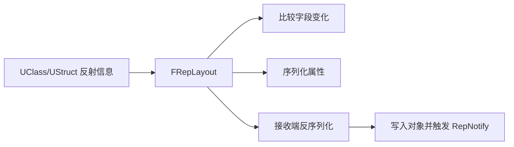
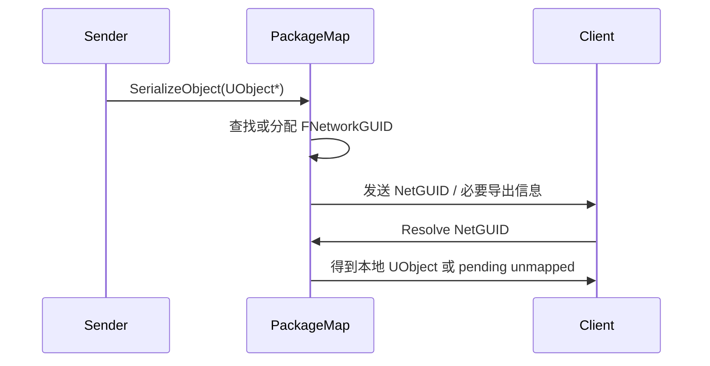

# RepLayoutFastArrayNetGUID

> 本页整合传统属性复制深水区概念，并给出 Lyra 对应样例。

## RepLayout

`FRepLayout` 是 Legacy 属性复制的布局描述：

- 记录复制字段、条件、偏移、命令序列。
- 同类对象共享布局，连接/实例保存各自复制状态。
- 用于属性复制，也用于 RPC 参数序列化。



普通 Struct 默认可递归展开字段；带自定义 `NetSerialize` 的 Struct 通常作为整体序列化。

## UE5.7 RepLayout / ObjectReplicator 复核结论

| 主题 | UE5.7 源码符号 | 结论 |
|---|---|---|
| 对象复制状态 | `FObjectReplicator` (`Engine/Public/Net/DataReplication.h`, `Engine/Private/DataReplication.cpp`) | 每个对象在连接上维护自己的发送/接收复制状态，可用于 Actor、Component、SubObject。 |
| 属性布局 | `FRepLayout` (`Engine/Public/Net/RepLayout.h`, `Engine/Private/RepLayout.cpp`) | 同类对象共享布局；用于普通属性复制，也用于 RPC 参数。 |
| Changelist | `FReplicationChangelistMgr`、`FNetSerializeCB::UpdateChangelistMgr` | 发送端先更新 changelist，再按 RepState 选择需要写出的属性。 |
| 普通属性发送 | `FRepLayout::ReplicateProperties` | 根据 changelist、条件、RepFlags 写出字段。 |
| Custom Delta | `FObjectReplicator::ReplicateCustomDeltaProperties` | FastArray 等 `NetDeltaSerialize` 类型通过 custom delta 路径复制。 |
| 接收属性 | `FRepLayout::ReceiveProperties` | 反序列化字段，处理 unmapped object reference，并收集 RepNotify。 |

## ObjectReplicator

`FObjectReplicator` 是某对象在某连接上的复制状态：

- 保存 shadow state / 历史状态。
- 调用 `FRepLayout` 生成变化。
- 处理属性接收、RepNotify、RPC 接收。
- 对 Actor、Component、SubObject 都可用。

## FastArray

FastArray 解决“数组整体复制成本高”和“元素级 add/change/remove 需要回调”的问题。

标准结构：

```cpp
struct FEntry : public FFastArraySerializerItem
{
    GENERATED_BODY()
};

struct FList : public FFastArraySerializer
{
    GENERATED_BODY()

    UPROPERTY()
    TArray<FEntry> Entries;

    bool NetDeltaSerialize(FNetDeltaSerializeInfo& DeltaParms)
    {
        return FFastArraySerializer::FastArrayDeltaSerialize<FEntry, FList>(Entries, DeltaParms, *this);
    }
};

template<>
struct TStructOpsTypeTraits<FList> : public TStructOpsTypeTraitsBase2<FList>
{
    enum { WithNetDeltaSerializer = true };
};
```

修改规则：

- 新增/修改某元素：`MarkItemDirty(Entry)`。
- 删除/重排/批量变化：`MarkArrayDirty()`。
- 客户端表现：`PostReplicatedAdd`、`PostReplicatedChange`、`PreReplicatedRemove`。

## Lyra FastArray 样例

| 容器 | Entry | 用途 |
|---|---|---|
| `FLyraInventoryList` | `FLyraInventoryEntry` | 背包物品与堆叠数量 |
| `FLyraEquipmentList` | `FLyraAppliedEquipmentEntry` | 装备实例和授予能力 |
| `FLyraVerbMessageReplication` | `FLyraVerbMessageReplicationEntry` | 复制 gameplay message |

Inventory 关键点：

- Entry 中 `Instance` 指向 `ULyraInventoryItemInstance`。
- List 复制条目变化。
- ItemInstance 作为 SubObject 还需要注册/复制。
- 客户端 callback 通过 GameplayMessageSubsystem 广播变化。

Equipment 关键点：

- 装备时创建 `ULyraEquipmentInstance`。
- 服务端授予 AbilitySet。
- 客户端 `PostReplicatedAdd` 调用 `OnEquipped`。
- 移除时先移除 SubObject，再更新 FastArray。

## PackageMap 与 NetGUID

Legacy 中 UObject 引用不能直接发裸指针，而是通过 PackageMap / NetGUID 表示：



对象引用常见状态：

- 静态对象：可由路径或稳定名称解析。
- 动态 Actor：需要创建/导出 NetGUID。
- 动态 SubObject：依赖 Outer、注册复制与生命周期。
- 未映射对象：RPC 或属性可能延迟处理。

## UE5.7 PackageMap / NetGUID 复核结论

| 环节 | UE5.7 源码符号 | 结论 |
|---|---|---|
| 对象引用序列化入口 | `UPackageMapClient::SerializeObject` (`Engine/Private/PackageMapClient.cpp`) | 保存时通过 `GuidCache->GetOrAssignNetGUID(Object)` 获取/分配 NetGUID，再写入网络流。 |
| 写对象引用 | `UPackageMapClient::InternalWriteObject` | 写出 NetGUID；必要时触发 export。 |
| 读对象引用 | `UPackageMapClient::InternalLoadObject` | 读取 NetGUID，先查缓存；若未 resolve，进入 pending/unmapped 流程。 |
| 动态 Actor 初始复制 | `UPackageMapClient::SerializeNewActor` | 服务端序列化 Actor NetGUID；动态 Actor 还会发送 Archetype、Level、Transform 等创建信息。 |
| NetGUID 缓存 | `FNetGUIDCache::ObjectLookup` / `NetGUIDLookup` | 维护 `NetGUID -> Object` 与 `Object -> NetGUID` 双向缓存。 |
| 服务端分配 | `FNetGUIDCache::AssignNewNetGUID_Server` / `RegisterNetGUID_Server` | authority 负责为对象分配并注册 NetGUID。 |
| 客户端注册 | `FNetGUIDCache::RegisterNetGUID_Client` | 客户端根据服务端导出信息注册路径或动态对象 GUID。 |
| 导出 Ack | `UPackageMapClient::NotifyBunchCommit` / `ReceivedAck` / `ReceivedNak` | NetGUID export 与 Packet Ack 挂钩；Nak 会让后续引用再次导出。 |

## Iris 下的关系

Iris 引入 NetRefHandle 和对象引用 serializer，但 UE5.7 中仍存在与 PackageMap 的桥接层。因此文档应避免写成“NetGUID 完全消失”。更准确的说法：

- Legacy 以 PackageMap / NetGUID 作为核心对象引用机制。
- Iris 有自己的对象引用抽象和 serializer。
- 为兼容现有系统，Iris 仍可能与 PackageMap 导出/解析逻辑交互。

## 常见坑

- FastArray Entry 指针被复制了，但 SubObject 本体未注册，客户端无法得到有效对象状态。
- 删除 Entry 后忘记 `MarkArrayDirty`。
- 修改 Entry 内字段后忘记 `MarkItemDirty`。
- callback 中访问尚未 resolve 的 UObject。
- 依赖数组下标作为长期身份，而不是 FastArray 的 item ID / 业务 ID。

<!-- nav:auto -->

---

**导航**: ← [[30-tutorials/network-sync/04-Legacy属性复制与RPC流程|04-Legacy属性复制与RPC流程]] · [[30-tutorials/network-sync/06-ReplicationGraph与Lyra实践|06-ReplicationGraph与Lyra实践]] →

<!-- /nav:auto -->
