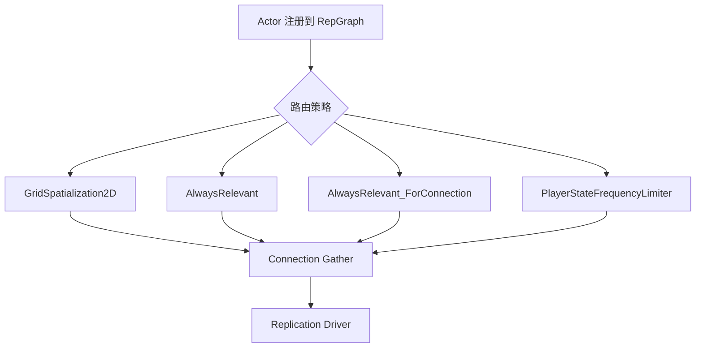

# ReplicationGraph与Lyra实践

> ReplicationGraph 是传统复制系统上的 Actor 相关性与频率优化框架。Lyra 有完整实现，但默认禁用。

## 解决什么问题

普通 Legacy Actor 复制需要为每个连接判断大量 Actor 的相关性。Actor 数量和连接数量上升后，CPU 成本很高。

ReplicationGraph 的思想是：

- 把 Actor 按空间、频率、全局相关、连接相关等规则放入节点。
- 节点维护可复用列表，减少每帧重复计算。
- 每个连接从节点收集候选 Actor。



## Lyra 当前状态

`Config/DefaultGame.ini`：

```ini
[/Script/LyraGame.LyraReplicationGraphSettings]
bDisableReplicationGraph=True ; [1] 默认禁用 RepGraph，使用普通 Actor 复制通道
DefaultReplicationGraphClass=/Script/LyraGame.LyraReplicationGraph ; [2] 指定 Lyra 特有的 RepGraph 派生类
```

结论：

- Lyra 已提供 RepGraph 类与设置。
- 默认配置禁用 RepGraph。
- `PlayerState`、`LevelScriptActor`、`ReplicationGraphDebugActor`、`LyraPlayerController` 被显式配置为 `NotRouted`。
- 启用后需要重新验证相关性、调试命令与性能收益。

## UE5.7 / Lyra 源码复核结论

| 主题 | 源码符号 | 结论 |
|---|---|---|
| 创建入口 | `Lyra::RepGraph::ConditionalCreateReplicationDriver` (`Source/LyraGame/System/LyraReplicationGraph.cpp`) | 仅对 `GameNetDriver` 尝试创建 Lyra RepGraph；若 `bDisableReplicationGraph=True` 直接返回 `nullptr`。 |
| 绑定时机 | `ULyraReplicationGraph::ULyraReplicationGraph` | 通过 `UReplicationDriver::CreateReplicationDriverDelegate()` 绑定创建委托。 |
| 路由策略 | `ULyraReplicationGraph::GetClassNodeMapping` / `GetMappingPolicy` | 根据类默认复制属性、always relevant、owner relevancy 和配置 `ClassSettings` 选择 node mapping。 |
| 全局节点 | `InitGlobalGraphNodes` | 初始化空间网格、全局 always relevant 等节点。 |
| 连接节点 | `InitConnectionGraphNodes` | 为每个连接创建 connection-specific 节点。 |
| PlayerState 限频 | `ULyraReplicationGraphNode_PlayerStateFrequencyLimiter::PrepareForReplication` / `GatherActorListsForConnection` | 每帧只返回 rolling subset 的 PlayerState；`ForceNetUpdate` 不被抑制。 |
| Iris 互斥边界 | `UNetDriver::SetReplicationDriver` (`Engine/Private/NetDriver.cpp`) | UE5.7 源码明确禁止 Iris NetDriver 再挂 Legacy `ReplicationDriver`，因此 RepGraph 与 Iris 不能被理解为同一 NetDriver 上的直接叠加层。 |

## Lyra 节点

`ULyraReplicationGraph` 注释列出当前顶层节点：

| 节点 | 作用 |
|---|---|
| `UReplicationGraphNode_GridSpatialization2D` | 空间网格，处理距离相关 Actor |
| `UReplicationGraphNode_ActorList` | 全局 always relevant Actor |
| `ULyraReplicationGraphNode_AlwaysRelevant_ForConnection` | 每连接 always relevant Actor |
| `ULyraReplicationGraphNode_PlayerStateFrequencyLimiter` | PlayerState 限频复制 |
| `UReplicationGraphNode_TearOff_ForConnection` | TearOff Actor，基类管理 |

## 路由策略

Lyra 根据 Actor 类默认复制属性判断路由：

- 不复制的类：`NotRouted`。
- `bAlwaysRelevant`：全局 always relevant。
- `bOnlyRelevantToOwner` 或 `bNetUseOwnerRelevancy`：连接相关或 owner 相关路径。
- 普通动态 Actor：空间节点。

`DefaultGame.ini` 中还显式配置：

- `PlayerState`：`NotRouted`，由自定义 PlayerState frequency limiter 处理。
- `LevelScriptActor`、`ReplicationGraphDebugActor`、`LyraPlayerController`：`NotRouted`。

## PlayerState 限频

`ULyraReplicationGraphNode_PlayerStateFrequencyLimiter` 的目标是：

- 跟踪所有 PlayerState。
- 每帧只返回一部分 PlayerState。
- owning connection 的 PlayerState 仍可更高频复制。
- 大连接数下减少所有 PlayerState 全量高频复制的成本。

这与 `ALyraPlayerState::SetNetUpdateFrequency(100.0f)` 不矛盾：RepGraph 可以在更高层对非 owner 连接做频率分配。

## FastSharedPath

Lyra RepGraph 还定义了移动快路径相关 CVar：

- `Lyra.RepGraph.EnableFastSharedPath`
- `Lyra.RepGraph.TargetKBytesSecFastSharedPath`
- `Lyra.RepGraph.FastSharedPathCullDistPct`

它与 `ALyraCharacter::FastSharedReplication` 配合，用带宽预算控制移动快照广播。

## 调试命令

Lyra 注释推荐：

- `Net.RepGraph.PrintGraph`
- `Net.RepGraph.PrintGraph class`
- `Net.RepGraph.PrintGraph nclass`
- `Net.RepGraph.PrintAll <Frames> <ConnectionIdx> <Class|Nclass>`
- `Net.RepGraph.PrintAllActorInfo <ActorMatchString>`
- `Lyra.RepGraph.PrintRouting`

调试前先确认 RepGraph 确实启用，否则命令输出不代表当前复制路径。

## 与 Iris 的关系

ReplicationGraph 是 Legacy 复制路径上的优化框架。Iris 有自己的过滤与优先级系统。UE5.7 源码中 `UNetDriver::SetReplicationDriver` 明确限制 Iris NetDriver 不能再设置 Legacy `ReplicationDriver`；因此二者不能被当作同一 NetDriver 上的直接叠加层。文档中不应简单写成“ReplicationGraph 被 Iris 完全替代”，更稳妥的做法是：

- Legacy 项目大 Actor 数量：评估 RepGraph。
- Iris 项目：优先研究 Iris filter / prioritizer。
- 迁移项目：把 RepGraph 路由规则转译成 Iris 过滤策略，并做压力测试。

## 启用前 checklist

- [ ] 修改 `bDisableReplicationGraph=False`。
- [ ] 确认 `DefaultReplicationGraphClass` 可加载。
- [ ] 启动日志确认创建了 `ULyraReplicationGraph`。
- [ ] 打印 routing，确认关键类路由正确。
- [ ] 验证 PlayerController / PlayerState / Pawn / Equipment / Projectile。
- [ ] 压测连接数、Actor 数、移动 Actor 数。

<!-- nav:auto -->

---

**导航**: ← [[30-tutorials/network-sync/05-RepLayoutFastArrayNetGUID|05-RepLayoutFastArrayNetGUID]] · [[30-tutorials/network-sync/07-LegacyReplicationvsIris|07-LegacyReplicationvsIris]] →

<!-- /nav:auto -->
