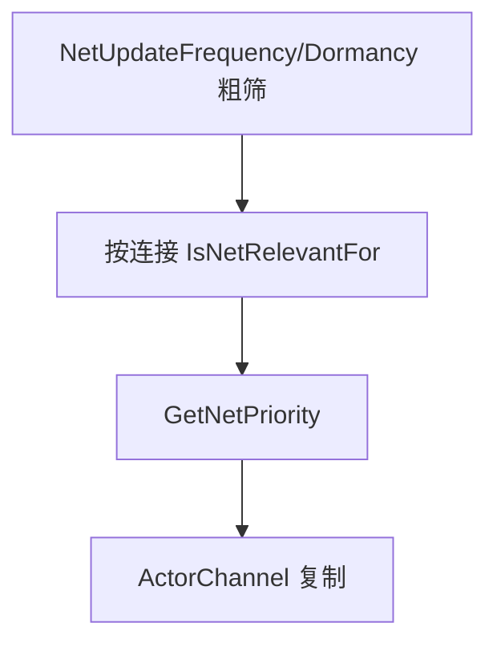
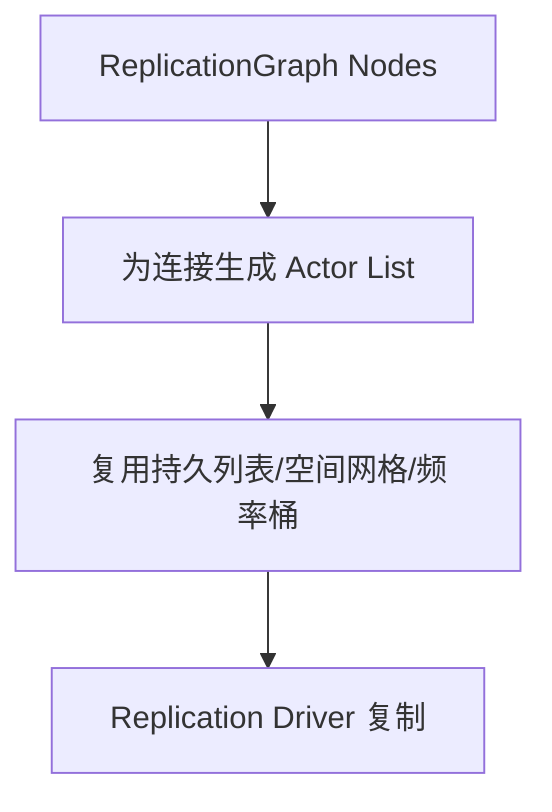
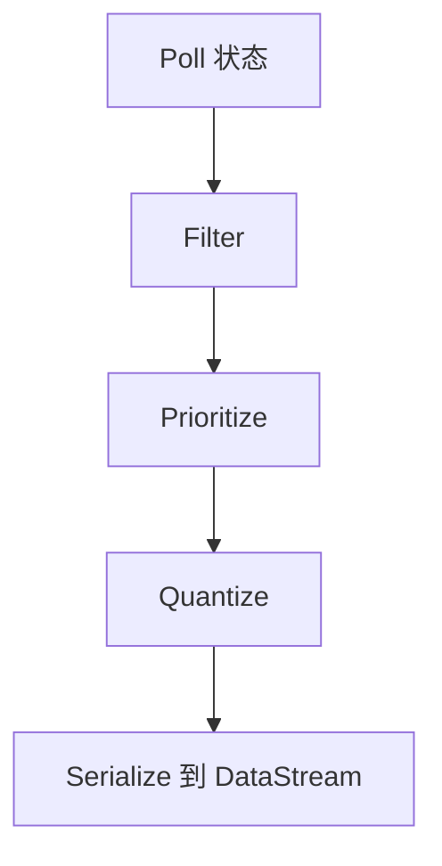

# LegacyReplicationvsIris

> UE5.7 中传统复制与 Iris 的横向对比。本文关注方案边界，不替代具体实现页。

## 一句话结论

- **Legacy Replication**：成熟、默认、资料多，核心围绕 `UNetDriver`、`UActorChannel`、`FObjectReplicator`、`FRepLayout`。
- **ReplicationGraph**：Legacy 路径上的可选优化层，主要优化 Actor 相关性与频率分配。
- **Iris**：UE5 新一代复制系统，重构对象状态描述、序列化、过滤、优先级和 DataStream，但许多高层 Gameplay API 仍可沿用。

## 核心抽象对比

| 维度 | Legacy Replication | Iris |
|---|---|---|
| 驱动入口 | `UNetDriver::ServerReplicateActors` | `UReplicationSystem` / Iris NetDriver 集成 |
| 连接单位 | `UNetConnection` | connection + replication system 内部连接状态 |
| Actor 通道 | `UActorChannel` 是核心复制载体 | 不再以 ActorChannel 作为唯一核心抽象 |
| 属性布局 | `FRepLayout`、`FRepState`、changelist | `FReplicationStateDescriptor`、ChangeMask、Quantized State |
| 对象复制实例 | `FObjectReplicator` | NetObject / ReplicationFragment / Protocol |
| 对象引用 | `PackageMap` / `NetGUID` | NetRefHandle / Object reference serializer，存在 PackageMap 桥接层 |
| 自定义序列化 | `NetSerialize`、`NetDeltaSerialize`、FastArray | `FNetSerializer`、Quantize/Serialize/Apply/Delta |
| 筛选优化 | Relevancy / Priority / Dormancy / RepGraph | Filter / Prioritizer / Poll / Quantize / DataStream |

## 源码复核后的关键差异矩阵

| 对比项 | Legacy UE5.7 源码结论 | Iris UE5.7 源码结论 | Lyra 当前事实 | 迁移影响 |
|---|---|---|---|---|
| 启用入口 | `UNetDriver::ServerReplicateActors` 直接走 Legacy，或委托 Legacy `ReplicationDriver` | `UEngine::WillNetDriverUseIris` 决定 NetDriver 是否创建 `UReplicationSystem` | Iris 插件/Build/配置存在，但未显式配置 `net.Iris.UseIrisReplication=1` | 不能只凭插件启用判断运行路径。 |
| RepGraph | `ReplicationDriver` 是 Legacy 路径优化层 | `UNetDriver::SetReplicationDriver` 禁止 Iris NetDriver 再挂 Legacy `ReplicationDriver` | Lyra RepGraph 默认 `bDisableReplicationGraph=True` | RepGraph 规则迁移 Iris 时应转成 Iris filter/prioritizer 思路。 |
| 属性复制 | `UActorChannel::ReplicateActor` → `FObjectReplicator` → `FRepLayout` | `UReplicationSystem::NetUpdate` → fragment/descriptor/serializer/data stream | Lyra 业务仍使用 `DOREPLIFETIME`、PushModel、RepNotify | 高层声明可复用，但底层脏状态、序列化和时序需重测。 |
| RPC | `ProcessRemoteFunction` → ActorChannel → `FRepLayout::SendPropertiesForRPC` | Iris RPC/DataStream 路径；仍从高层 RPC 声明进入 | Lyra 有 reliable Client RPC 与 unreliable multicast | 不要假设 Legacy 下偶然成立的属性/RPC相对顺序。 |
| SubObject | `ReplicateSubobjects` + `Channel->ReplicateSubobject` 或 registered list | 更依赖 registered subobject list 与 bridge 注册 | Inventory/Equipment 同时实现两条路径 | 动态 UObject 生命周期是迁移重点。 |
| 对象引用 | `UPackageMapClient` / `FNetGUIDCache` | NetRefHandle / object reference serializer，并存在 PackageMap 桥接 | TargetData、Inventory item、Equipment instance 都有对象引用 | 必须测试 unmapped、Join-in-progress、销毁重建。 |
| 自定义序列化 | `NetSerialize` / `NetDeltaSerialize` | `FNetSerializer` + quantized state；自定义 NetSerialize struct 需支持配置 | Lyra TargetData 加入 `SupportsStructNetSerializerList` | 新增字段或新结构体时要同时测 Legacy/Iris。 |

## 高层 API 是否变化

很多业务层声明仍然类似：

- `UPROPERTY(Replicated)`
- `ReplicatedUsing=OnRep_X`
- `GetLifetimeReplicatedProps`
- `UFUNCTION(Server/Client/NetMulticast)`
- `FFastArraySerializer`
- `NetSerialize`

但“声明不变”不代表底层行为完全一样。Iris 下需要特别验证：

- SubObject 注册与反注册。
- 自定义 `NetSerialize` / Iris `NetSerializer` 支持。
- FastArray dirty 判定和元素变化识别。
- OwnerOnly / SkipOwner / InitialOnly 等条件复制。
- Dormancy、Join-in-progress、对象销毁、重连。
- RPC 与属性复制之间的相对时序。

## Actor 筛选与相关性

Legacy 常见逻辑：

ReplicationGraph 启用后：

Iris 更偏向：

## SubObject 对比

| 项 | Legacy | Iris 迁移关注 |
|---|---|---|
| 传统写法 | `ReplicateSubobjects` + `Channel->ReplicateSubobject` | 直接依赖 `UActorChannel` 的逻辑风险高 |
| 新写法 | registered subobject list 也可用于 Legacy | `AddReplicatedSubObject` / `RemoveReplicatedSubObject` 是重点路径 |
| Lyra 示例 | Inventory / Equipment 同时实现两条路径 | 适合做迁移验证样例 |

## FastArray 对比

Legacy 下 FastArray 依赖：

- Entry 继承 `FFastArraySerializerItem`。
- Container 继承 `FFastArraySerializer`。
- `NetDeltaSerialize` 调用 `FastArrayDeltaSerialize`。
- 修改时调用 `MarkItemDirty` / `MarkArrayDirty`。

Iris 下仍需验证：

- 元素是否能被正确识别为新增/变化/删除。
- `operator==` 或 serializer equality 是否影响 dirty 判断。
- Entry 中 UObject 引用是否需要额外 registered subobject。
- Join-in-progress 是否能拿到完整初始状态。

## RPC 对比

| 维度 | Legacy | Iris |
|---|---|---|
| 声明方式 | `UFUNCTION(Server/Client/NetMulticast)` | 高层声明通常仍可用 |
| 发送入口 | `CallRemoteFunction` → `UNetDriver::ProcessRemoteFunction` | 通过 Iris RPC/DataStream 相关路径处理 |
| 顺序 | 同 Channel reliable 有序；跨 Channel 不保证 | 不应假设与 Legacy 完全一致，需验证属性/RPC 相对时序 |
| Lyra 样例 | `FastSharedReplication`、`ClientConfirmTargetData` | 需分别验证 unreliable multicast 和 reliable client RPC |

## 什么时候选什么

| 场景 | 推荐方向 |
|---|---|
| 小规模多人、已有项目稳定运行 | 继续 Legacy，高层 API 简单可靠 |
| Actor 数量大，主要瓶颈是相关性筛选 | 评估 ReplicationGraph |
| 新项目、目标 UE5 长线版本、大规模复制、需要更细粒度过滤/序列化 | 评估 Iris |
| 大量动态 UObject / 自定义序列化 / FastArray | 不管选哪套都必须建专项网络测试 |
| 已经依赖 ActorChannel 内部细节 | 谨慎迁移 Iris，先隔离内部依赖 |

## Lyra 的现实选择

Lyra 当前最值得学习的不是“选择了某一套方案”，而是它同时展示了：

- 高层复制 API 的常规使用。
- FastArray + SubObject 的业务建模方式。
- ReplicationGraph 作为可选优化层的工程实现。
- Iris 插件与项目配置的适配方式。
- GAS 预测和 TargetData 的项目级样例。

因此本文档系列也采用横向结构，而不是把网络同步简化为某一个机制。

## 旧教程结论纠偏矩阵

| 旧教程/旧认知 | UE5.7 源码复核结论 | Lyra 当前事实 | 迁移影响 |
|---|---|---|---|
| 启用 Iris 插件即可使用 Iris | 错。还需要 `IrisNetDriverConfigs` 允许、`net.Iris.UseIrisReplication` / 命令行 / GameMode/GameInstance 决策通过，最终由 `UEngine::WillNetDriverUseIris` 判定。 | 插件和 Build 支持已启用，但项目 `Config/` 未显式设置 `net.Iris.UseIrisReplication=1`。 | 必须看启动日志或运行时验证，不能只看 `.uproject`。 |
| ReplicationGraph 与 Iris 是可叠加优化层 | 不应这样理解。UE5.7 `UNetDriver::SetReplicationDriver` 禁止 Iris NetDriver 再挂 Legacy `ReplicationDriver`。 | Lyra RepGraph 代码存在但默认 `bDisableReplicationGraph=True`。 | 迁移 Iris 时需要把 RepGraph 路由思想转成 Iris filter/prioritizer，而不是直接叠加。 |
| Actor / Pawn 都默认走 Iris Spatial filter | 不准确。FilterConfigs 可覆盖默认空间过滤。 | Lyra 中 `Actor=None`，`Pawn=Spatial`，`PlayerState=None`。 | 分析相关性必须看类级 filter，不要只看 `DefaultSpatialFilterName`。 |
| RPC 与属性复制有稳定全局顺序 | Legacy 也只保证同 Channel reliable 顺序；跨 Actor/Channel 不保证。Iris 下更不应依赖属性/RPC相对时序。 | Weapon TargetData 使用 Server RPC + ClientConfirmTargetData；FastSharedReplication 是 unreliable multicast。 | 需要显式状态机/确认，不要把顺序当协议。 |
| FastArray 只要 Entry 指针复制即可 | 错。FastArray 同步列表结构；Entry 指向的 UObject 状态要靠 SubObject 复制。 | Inventory/Equipment 同时实现 FastArray 与 registered SubObject list。 | Join-in-progress、删除、反注册必须一起测。 |
| NetGUID 在 Iris 下完全消失 | 不准确。Iris 使用 NetRefHandle / object reference serializer，但 UE5.7 仍有与 PackageMap 的桥接。 | Lyra TargetData、Inventory、Equipment 都包含对象引用。 | 迁移时仍要关注 unresolved/unmapped 引用。 |
| `SupportsStructNetSerializerList` 是自定义 Iris serializer 注册 | 不准确。源码语义是允许带自定义 `NetSerialize` / `NetDeltaSerialize` 的结构体使用默认 Iris `StructNetSerializer`。 | Lyra 为 `LyraGameplayAbilityTargetData_SingleTargetHit` 配置了该项。 | 新增 TargetData struct 时要明确是默认 StructNetSerializer 还是专用 serializer。 |

## 迁移检查

迁移到 Iris 或启用 RepGraph 前至少检查：

- `ReplicateSubobjects` 是否仍被依赖。
- 动态 UObject 是否都在创建/销毁时正确注册/反注册。
- FastArray 是否有单测覆盖 add/change/remove。
- RPC 是否依赖与属性复制的同帧顺序。
- `COND_OwnerOnly`、`COND_SkipOwner`、`COND_SimulatedOnly` 是否表现一致。
- `NetUpdateFrequency`、Dormancy、Relevancy、Priority 的调优是否需要迁移到新过滤/优先级系统。

<!-- nav:auto -->

---

**导航**: ← [[30-tutorials/network-sync/06-ReplicationGraph与Lyra实践|06-ReplicationGraph与Lyra实践]] · [[30-tutorials/network-sync/iris/00-Iris总览|00-Iris总览]] →

<!-- /nav:auto -->
