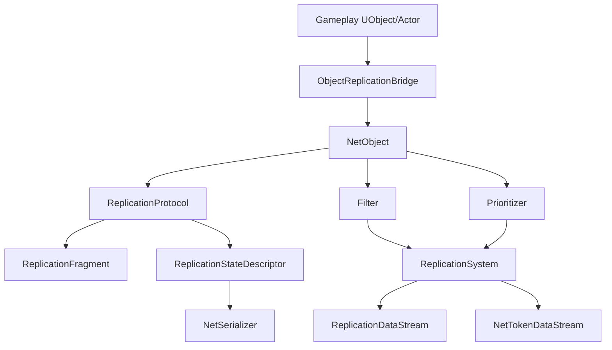

# Iris总览

> Iris 是 UE5 的新一代复制系统。本文关注概念、项目启用点和迁移边界。

## 定位

Iris 的目标是改进传统复制系统的性能、可扩展性和内部架构。它不是简单把所有 Gameplay 代码推倒重写，而是在底层重构对象状态描述、序列化、过滤、优先级和数据流。

常见高层 API 仍可能保留：

- `UPROPERTY(Replicated)`
- `ReplicatedUsing`
- `GetLifetimeReplicatedProps`
- `UFUNCTION(Server/Client/NetMulticast)`
- `NetSerialize`
- FastArray

但底层不再以 `UActorChannel + FRepLayout` 作为唯一核心抽象。

## 核心架构

关键概念：

| 概念 | 作用 |
|---|---|
| `UReplicationSystem` | Iris 总控，管理复制对象、连接、发送接收、过滤、优先级 |
| `UObjectReplicationBridge` | 将 UE 的 UObject/Actor 接入 Iris |
| NetObject | Iris 内部复制对象标识 |
| Replication Protocol | 某类型对象的复制协议 |
| Replication Fragment | 负责从对象实例采集/应用某块状态 |
| Replication State Descriptor | 描述一组可复制字段 |
| NetSerializer | 类型级序列化、量化、差量、应用逻辑 |
| DataStream | Iris 数据流，负责不同类型复制数据的传输 |

## 发送流程

UE5.7 源码中主循环由 `UNetDriver::TickFlush` 调用 `UReplicationSystem::NetUpdate`：

| 阶段 | UE5.7 源码符号 | 结论 |
|---|---|---|
| NetDriver tick | `UNetDriver::TickFlush` (`Engine/Private/NetDriver.cpp`) | 服务端更新 Iris 视图、发送客户端移动校正后调用 `ReplicationSystem->NetUpdate(DeltaSeconds)`；客户端也会更新视图并调用。 |
| 主更新 | `UReplicationSystem::NetUpdate` (`Runtime/Net/Iris/Private/Iris/ReplicationSystem/ReplicationSystem.cpp`) | 依次执行 DataStream `PreSendUpdate`、DirtyObject 刷新、WorldLocation 更新、过滤、Bridge poll、条件更新、量化 DirtyState、scope 更新、ChangeMask 传播、优先级和 DeltaCompression 预处理等。 |
| 发送 | `UReplicationSystem::SendUpdate` / `PostSendUpdate` | 实际包写出通过 DataStreamChannel / ReplicationDataStream；`PostDispatchSendUpdate` 还会处理接收后即时/OOB 发送。 |
| NetDriver 收束 | `UNetDriver::PostDispatchSendUpdate` | `TickPostReceive` → `SendUpdate` → `UDataStreamChannel::PostTickDispatch` → `PostSendUpdate`。 |

接收端大致反向执行：

## Lyra 当前配置

Lyra 已有 Iris 相关配置：

- `LyraStarterGame.uproject`：启用 `Iris` 插件。
- `Source/LyraGame/LyraGame.Build.cs`：调用 `SetupIrisSupport(Target)`。
- `DefaultEngine.ini`：配置 `ReplicationStateDescriptorConfig` 与 `ObjectReplicationBridgeConfig`。
- `SupportsStructNetSerializerList=(StructName=LyraGameplayAbilityTargetData_SingleTargetHit)`：为自定义 TargetData 结构启用 Iris 支持。

但要判断实际运行是否使用 Iris，还必须看 NetDriver 配置、CVar、启动参数和日志。不要只凭插件启用得出“当前一定走 Iris”。当前 Lyra `Config/` 中未发现显式 `net.Iris.UseIrisReplication`、Iris NetDriver 或 `NetDriverDefinitions` 配置，因此只能确认“具备 Iris 插件/构建/部分配置支持”。

## UE5.7 启用决策链源码复核

| 环节 | UE5.7 源码符号 | 结论 |
|---|---|---|
| 全局 CVar 默认值 | `net.Iris.UseIrisReplication` (`Runtime/Net/Iris/Private/Iris/IrisConfig.cpp`) | UE5.7 源码默认值为 `0`，即默认不启用 Iris。 |
| 命令行覆盖 | `UE::Net::GetUseIrisReplicationCmdlineValue`、`FIrisCoreModule::StartupModule` | `-UseIrisReplication=1/0` 会在 IrisCore 模块启动时提前覆盖 CVar。 |
| NetDriver 允许列表 | `FIrisNetDriverConfig`、`UEngine::GetIrisNetDriverConfig` (`Engine.h`, `UnrealEngine.cpp`) | `IrisNetDriverConfigs` 只是说明某个 NetDriver 是否允许使用 Iris；`bCanUseIris` 是门槛，不等于实际启用。 |
| 最终决策 | `UEngine::WillNetDriverUseIris` | 基础逻辑是 `bConfigCanUseIris && ShouldUseIrisReplication()`，再叠加 `GameInstance`、PIE 跟随服务端、命令行覆盖等规则。 |
| NetDriver 初始化 | `UNetDriver::InitBase` (`Engine/Private/NetDriver.cpp`) | 非 Iris 服务端创建 Legacy `ReplicationDriver`；Iris 路径创建 `UReplicationSystem`。 |
| 创建 Iris 系统 | `UNetDriver::CreateReplicationSystem` | 创建并挂接 `UReplicationSystem`。 |
| RepGraph 限制 | `UNetDriver::SetReplicationDriver` | Iris NetDriver 不允许再挂 Legacy `ReplicationDriver`，因此不能把 Iris 与 ReplicationGraph 当作同一 NetDriver 上可直接叠加的机制。 |

结论：Lyra 已具备 Iris 编译和配置支持，但项目配置中未显式设置 `net.Iris.UseIrisReplication=1`；因此不能仅凭插件启用判断运行时一定使用 Iris。

## 与 Legacy 的关键差异

| 维度 | Legacy | Iris |
|---|---|---|
| 核心驱动 | ActorChannel | ReplicationSystem / NetObject |
| 属性描述 | RepLayout | ReplicationStateDescriptor |
| 序列化 | Property NetSerialize / RepLayout | NetSerializer + Quantized State |
| 相关性 | Actor relevancy / RepGraph | Filter |
| 优先级 | Actor priority | Prioritizer |
| 对象引用 | PackageMap / NetGUID | NetRefHandle / ObjectReference serializer，兼容桥接 |
| SubObject | `ReplicateSubobjects` 或 registered list | 更依赖 registered subobject list |

## 迁移重点

Iris 迁移不是“开关打开就结束”，重点检查：

- SubObject 是否全部使用注册/反注册生命周期。
- FastArray 是否在 Iris 下正确识别变化。
- 自定义 `NetSerialize` 是否需要 Iris 配置或 NetSerializer。
- RPC 与属性复制时序是否仍满足 gameplay。
- OwnerOnly、SkipOwner、SimulatedOnly 等条件复制是否一致。
- RepGraph 路由是否需要迁移到 Iris filter。

## 文档边界

本页是入口。细节见：

- `[[30-tutorials/network-sync/iris/01-IrisReplicationStateDescriptor]]`
- `[[30-tutorials/network-sync/iris/02-IrisNetSerializer]]`
- `[[30-tutorials/network-sync/iris/03-IrisNetToken]]`
- `[[30-tutorials/network-sync/iris/04-Iris属性复制与RPC流程]]`
- `[[30-tutorials/network-sync/iris/05-Iris迁移检查清单]]`

<!-- nav:auto -->

---

**导航**: ← [[30-tutorials/network-sync/07-LegacyReplicationvsIris|07-LegacyReplicationvsIris]] · [[30-tutorials/network-sync/iris/01-IrisReplicationStateDescriptor|01-IrisReplicationStateDescriptor]] →

<!-- /nav:auto -->
