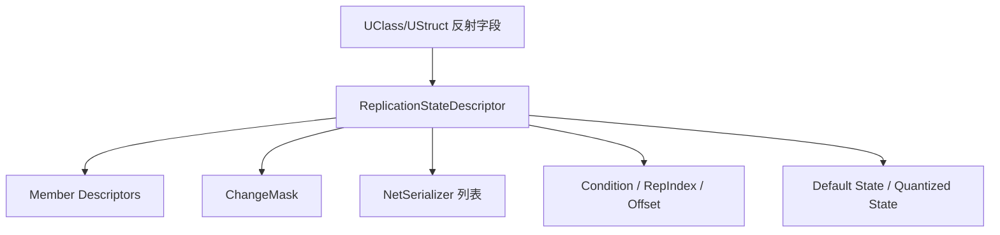

# IrisReplicationStateDescriptor

> `FReplicationStateDescriptor` 是 Iris 中描述“某组复制状态如何存储、比较、序列化、应用”的核心结构。

## 作用

在 Legacy 中，`FRepLayout` 描述属性复制布局；在 Iris 中，对应概念变成更细的 state descriptor / protocol / fragment 体系。



Descriptor 关心：

- 字段数量、偏移、类型。
- 每个字段使用哪个 `FNetSerializer`。
- 哪些字段受条件复制控制。
- ChangeMask 如何表示字段变化。
- 默认状态与量化状态布局。
- 对象引用字段如何收集。

## UObject Descriptor 分组

Iris 会按对象类型构建复制协议。UObject/Actor 可能被拆成多组状态，例如：

- 普通 lifetime replicated 属性。
- init-only 状态。
- 条件复制状态。
- RPC 参数状态。
- FastArray 或特殊 fragment。

这种拆分让 Iris 可以更细粒度地过滤、量化和应用状态。

## ChangeMask

ChangeMask 用于标记哪些字段发生变化：


它是 Iris 增量复制的重要基础。对数组、结构体、嵌套状态等复杂类型，ChangeMask 的粒度和策略取决于 descriptor 与 serializer。

## Struct 与自定义序列化

普通结构体可以继续按字段展开，便于 Iris 理解内部字段变化；但自定义 `NetSerialize` 的结构体往往被视为整体，需要确保：

- 设置 `WithNetSerializer=true`。
- Iris 能找到对应支持方式。
- 必要时在配置中加入 `SupportsStructNetSerializerList`。

Lyra 示例：

`FLyraGameplayAbilityTargetData_SingleTargetHit` 自定义 `NetSerialize`，并在 `DefaultEngine.ini` 中加入：

```ini
[/Script/IrisCore.ReplicationStateDescriptorConfig]
+SupportsStructNetSerializerList=(StructName=LyraGameplayAbilityTargetData_SingleTargetHit)
```

## RepIndex 与条件复制

Descriptor 会保存字段与复制索引、条件之间的关系。迁移时需要重点验证：

- `COND_OwnerOnly`
- `COND_SkipOwner`
- `COND_SimulatedOnly`
- `COND_InitialOnly`
- 自定义 active override / PushModel 场景

原因是 Iris 下条件判断与 state grouping 可能不同于 Legacy 的 RepLayout 心智模型。

## 对象引用

Descriptor 还需要知道哪些字段包含 UObject 引用，供 Iris 收集依赖、导出引用、处理 unmapped 状态。

常见风险：

- FastArray Entry 指向动态 SubObject，但 SubObject 未注册。
- 引用在接收端尚未 resolve，callback 过早访问。
- 对象销毁与引用清理顺序不一致。

## UE5.7 源码复核结论

| 主题 | UE5.7 源码符号 | 结论 |
|---|---|---|
| Descriptor 构建入口 | `FReplicationStateDescriptorBuilder` (`Runtime/Net/Iris/Private/Iris/ReplicationState/ReplicationStateDescriptorBuilder.cpp`) | Iris 从反射字段、函数/RPC、条件与 serializer 信息构建 `FReplicationStateDescriptor`。 |
| 自定义 NetSerialize struct | `ReplicationStateDescriptorBuilder.cpp` 中 custom serialization 分支 | 带自定义序列化的结构体不会简单按普通字段展开；若不在支持列表内，运行时会按配置/环境发出警告或走 fallback。 |
| Lyra TargetData 支持 | `UReplicationStateDescriptorConfig::SupportsStructNetSerializerList` (`ReplicationStateDescriptorConfig.h`) | 配置项语义是“即使 struct 实现了自定义 `NetSerialize` / `NetDeltaSerialize`，也允许使用默认 Iris `StructNetSerializer`”。Lyra 在 `DefaultEngine.ini` 中显式加入 `LyraGameplayAbilityTargetData_SingleTargetHit`。 |
| Lifetime condition 上限 | `UObjectReplicationBridge.cpp` 中 `static_assert(ELifetimeCondition::COND_Max <= 127)` | Iris bridge 对 UE lifetime condition 有编码假设；新增条件枚举需关注上限。 |
| 对象引用 | Descriptor + serializer reference collection | UObject 引用字段需要被 descriptor/serializer 收集，供 Iris 建立依赖和处理 unmapped。 |
| ChangeMask | `ChangeMaskCache`、descriptor member mask | ChangeMask 是 Iris 增量复制核心；复杂容器粒度取决于对应 serializer，而不是所有类型都按同一粒度处理。 |

仍需项目级验证：`TMap` / `TSet` 在当前项目用法下的支持边界、TArray 大规模变化性能、RepTag 自定义策略，以及 DefaultStateBuffer 对具体对象类型的初始化成本。

## 阅读建议

理解 descriptor 时不要只看字段表，还要同时看：

- `[[30-tutorials/network-sync/iris/02-IrisNetSerializer]]`：字段如何序列化。
- `[[30-tutorials/network-sync/iris/04-Iris属性复制与RPC流程]]`：descriptor 如何参与发送/接收。
- `[[30-tutorials/network-sync/05-RepLayoutFastArrayNetGUID]]`：与 Legacy RepLayout 对照。

<!-- nav:auto -->

---

**导航**: ← [[30-tutorials/network-sync/iris/00-Iris总览|00-Iris总览]] · [[30-tutorials/network-sync/iris/02-IrisNetSerializer|02-IrisNetSerializer]] →

<!-- /nav:auto -->
