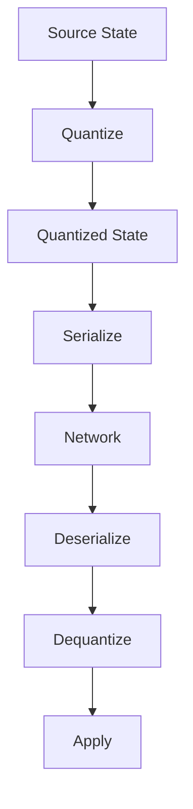
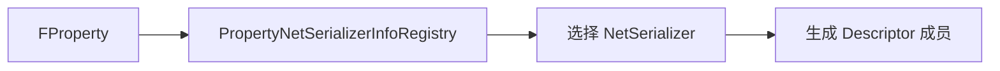

# IrisNetSerializer

> `FNetSerializer` 是 Iris 中描述“某种类型如何量化、序列化、反序列化、比较、应用”的核心接口。

## 为什么需要 NetSerializer

Legacy 中常见自定义方式是：

- `bool NetSerialize(FArchive& Ar, UPackageMap* Map, bool& bOutSuccess)`
- `bool NetDeltaSerialize(FNetDeltaSerializeInfo& DeltaParms)`

Iris 将这些能力抽象到更统一的 `FNetSerializer`：

## 核心操作

| 操作 | 含义 |
|---|---|
| Quantize | 将源数据转换为适合网络传输的量化状态 |
| Dequantize | 将量化状态恢复为目标对象可用数据 |
| Serialize | 将量化状态写入 bitstream |
| Deserialize | 从 bitstream 读取量化状态 |
| SerializeDelta / DeserializeDelta | 基于 baseline 做差量传输 |
| IsEqual | 比较源状态或量化状态是否相同 |
| Validate | 检查数据是否合法 |
| CloneDynamicState / FreeDynamicState | 处理动态内存状态 |
| CollectNetReferences | 收集 UObject/NetObject 引用 |
| Apply | 将接收状态应用到对象字段 |

## 量化状态

量化的价值：

- 减少带宽，例如 float/vector/rotator 压缩。
- 避免重复做昂贵转换。
- 让 delta 比较基于网络表示，而不总是基于源对象布局。

Lyra 的 `FSharedRepMovement` 是 Legacy `NetSerialize` 例子；Iris 内部有诸如 vector、rotator、HitResult、GameplayTag 等专用 serializer。

## Property NetSerializer Registry

Iris 需要从 UE 反射属性映射到对应 NetSerializer。大致流程：

如果类型没有专用 serializer，可能走 LastResort 或结构体 serializer。性能敏感类型应考虑专用 serializer。

## Struct NetSerializer

结构体有几种情况：

1. 普通结构体：Iris 可按字段生成子 descriptor。
2. 带 `NetSerialize` 的结构体：可能作为整体处理，需要支持配置。
3. 容器/动态状态：需要额外处理动态内存、引用、delta。

Lyra 的 `FLyraGameplayAbilityTargetData_SingleTargetHit` 属于第 2 类。

## Forwarding Serializer

某些 serializer 会将操作转发给子 serializer，例如数组、结构体等容器类型。理解它有助于分析：

- TArray 元素如何复制。
- Struct 内字段如何被递归处理。
- 动态状态如何分配与释放。

## UE5.7 源码复核结论

| 主题 | UE5.7 源码符号 | 结论 |
|---|---|---|
| Serializer 基础类型 | `FNetSerializer` (`Runtime/Net/Iris/Public/Iris/Serialization/NetSerializer.h`) | UE5.7 中 serializer 以函数指针表描述 `Quantize`、`Serialize`、`Deserialize`、`Dequantize`、`IsEqual`、`Validate`、delta、动态状态和引用收集等能力。 |
| 默认属性注册 | `DefaultPropertyNetSerializerInfos.cpp`、`PropertyNetSerializerInfoRegistry.cpp` | 反射属性到 serializer 的映射由 registry 管理；没有专用 serializer 时可能走 struct / array / last-resort 路径。 |
| 容器 serializer | `ArrayPropertyNetSerializer.cpp`、`StructNetSerializer.cpp`、`LastResortPropertyNetSerializer.cpp` | TArray、Struct 等容器通过 forwarding/子 serializer 处理元素、动态状态和引用。 |
| 对象引用 | `ObjectNetSerializer.cpp`、`RemoteObjectReferenceNetSerializer.cpp` | UObject/NetObject 引用不是裸指针写出，需要 serializer 收集和编码引用。 |
| 示例 serializer | `GameplayTagNetSerializer.cpp`、`HitResultNetSerializer.cpp`、`RepMovementNetSerializer.cpp` | UE5.7 已为 GameplayTag、HitResult、RepMovement 等常见高频类型提供专用 serializer。 |
| 自定义类型接入 | `ReplicationStateDescriptorBuilder.cpp` + `PropertyNetSerializerInfoRegistry` | 自定义 `NetSerialize` struct 可通过支持列表或自定义 serializer 接入；Lyra TargetData 采用 `SupportsStructNetSerializerList` 方式。 |
| 声明/实现宏 | `UE_NET_DECLARE_SERIALIZER` / `UE_NET_IMPLEMENT_SERIALIZER` (`NetSerializer.h` 示例与各 serializer 头/源文件) | UE5.7 serializer 示例要求声明 config、`Version`、`SourceType`、可选 `QuantizedType`、`ConfigType`，并用宏声明/实现 serializer。 |
| trait 类型 | `NetSerializer.h` 示例 | `bIsForwardingSerializer`、`bHasConnectionSpecificSerialization`、`bHasCustomNetReference`、`bHasDynamicState`、`bUseDefaultDelta` 等 trait 为 `static constexpr bool`。 |

落地自定义 serializer 时必须检查：声明/实现宏、trait 字段、必需函数、registry 绑定、对象引用收集、动态状态释放和 delta 支持。旧教程中的宏名/API 示例不能脱离 UE5.7 源码直接复用。

## 与 Legacy NetSerialize 的关系

| Legacy | Iris |
|---|---|
| 每个 struct 自己实现 `NetSerialize` | 类型能力集中在 `FNetSerializer` |
| `FArchive` 直接读写 | bitstream + quantized state |
| Delta 常由 `NetDeltaSerialize` 实现 | serializer 可提供 delta 接口 |
| 对 UObject 引用依赖 `UPackageMap` | serializer 收集/序列化对象引用，存在桥接层 |

## Lyra 建议

- 已有 `NetSerialize` 类型先通过配置验证能在 Iris 下工作。
- 高频类型再考虑专用 Iris NetSerializer。
- 新增 TargetData 字段后，必须同时测试 Legacy 和 Iris 路径。
- 对包含 UObject 引用的结构体，必须测试 unmapped 和 Join-in-progress。

<!-- nav:auto -->

---

**导航**: ← [[30-tutorials/network-sync/iris/01-IrisReplicationStateDescriptor|01-IrisReplicationStateDescriptor]] · [[30-tutorials/network-sync/iris/03-IrisNetToken|03-IrisNetToken]] →

<!-- /nav:auto -->
