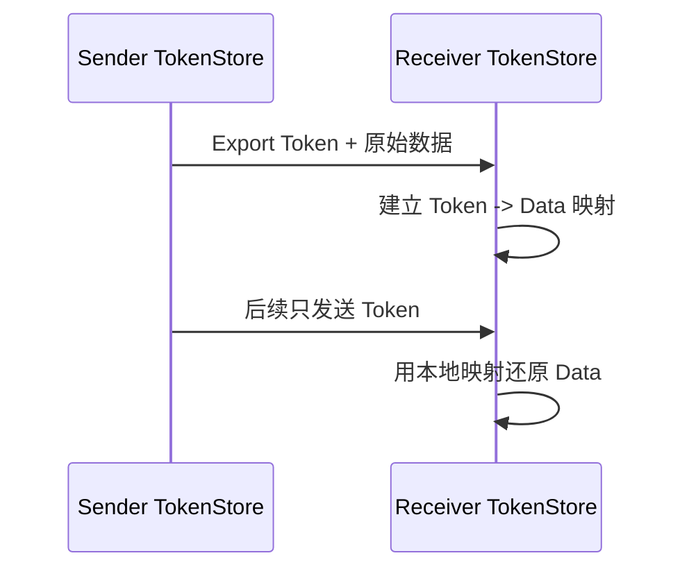
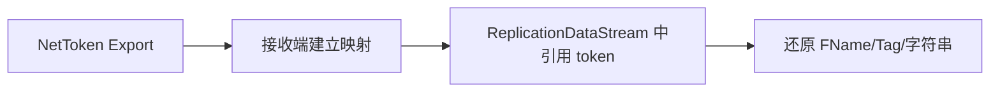

# IrisNetToken

> NetToken 用于把稳定、可重复出现的数据压缩成网络 token，减少重复传输成本。

## 解决的问题

网络同步中经常重复传输稳定数据：

- `FName`
- GameplayTag
- 字符串常量
- 类型/路径/配置名
- 某些结构化稳定数据

如果每次都发送完整字符串或路径，成本很高。NetToken 的思路是：首次导出完整数据，之后用短 token 表示。

## 核心概念

| 概念 | 作用 |
|---|---|
| `FNetToken` | 网络上传输的 token 标识 |
| `FNetTokenStore` | 保存 token 与原始数据的映射 |
| `FNetTokenStoreKey` | 原始数据查找 token 的 key |
| `NetTokenDataStream` | 负责 token 导出数据的传输 |
| TypeId | 区分不同 token 类型 |

## 发送/接收顺序

NetTokenDataStream 通常需要先于依赖它的复制数据处理，否则接收端看到 token 但没有映射，无法还原原始数据。

## 与 GameplayTag 的关系

GameplayTag 本身已有快速复制配置；Iris 体系中也可能通过 token/serializer 优化稳定数据。重写文档时要区分：

- GameplayTags 配置中的 FastReplication。
- Iris NetToken 的通用稳定数据 token 化。
- 具体类型 serializer 是否使用 NetToken。

Lyra 的 `DefaultGameplayTags.ini` 已启用 `FastReplication=True`，这与网络带宽优化相关。

## UE5.7 源码复核结论

| 主题 | UE5.7 源码符号 | 结论 |
|---|---|---|
| Token 存储 | `FNetTokenStore` (`Runtime/Net/Iris/Private/Iris/ReplicationSystem/NetTokenStore.cpp`) | 维护 token 与原始数据的映射，并负责导入/导出 token 数据。 |
| Token 数据流 | `UNetTokenDataStream` / `NetTokenDataStream.cpp` | 负责把需要导出的 token 数据作为独立 DataStream 内容发送给对端。 |
| 导出上下文 | `FNetTokenExportContext` (`Runtime/Net/Core/Private/Net/Core/NetToken/NetTokenExportContext.cpp`) | serializer 在写出依赖 token 的数据时，通过 export context 收集需要导出的 token。 |
| 与复制数据顺序 | NetTokenDataStream + ReplicationDataStream | 接收端必须先建立 token 映射，后续 ReplicationDataStream 中引用 token 的数据才能还原。实际顺序由 DataStream 调度保证，排查问题时应同时看两个 stream。 |
| 类型范围 | `FNetToken` (`Runtime/Net/Core/Public/Net/Core/NetToken/NetToken.h`) | UE5.7 明确定义 `TokenTypeIdBits=3`、`TokenBits=20`、`MaxTypeIdCount=1 << 3`、`MaxNetTokenCount=1 << 20`。 |
| 位布局 | `FNetToken` union bitfield | 32 位值中包含 `Index:20`、`TypeId:3`、`bIsAssignedByAuthority:1`，其余为 padding。 |
| authority 标记 | `FNetToken::IsAssignedByAuthority` | Token 可区分 authority 分配与本地临时分配，客户端和服务端可能先生成不同 token，再由权威 token 替换/映射。 |

UE5.7 具体位布局已复核：`Index` 20 bit、`TypeId` 3 bit、authority 1 bit；每类 token 理论上最多 `1,048,576` 个，类型最多 `8` 类。

## 风险

- 接收端未收到 token export 就处理依赖数据。
- 客户端本地临时 token 与服务端权威 token 替换逻辑处理错误。
- token store 生命周期跨连接/重连处理错误。
- 把频繁变化的数据错误 token 化，反而增加导出成本。

## 调试建议

排查 Iris 下名称、Tag、字符串还原问题时，同时观察：

- token 是否已导出。
- 接收端 token store 是否有映射。
- 依赖 token 的复制数据是否晚于 export 处理。
- 丢包/重发后映射是否仍一致。

<!-- nav:auto -->

---

**导航**: ← [[30-tutorials/network-sync/iris/02-IrisNetSerializer|02-IrisNetSerializer]] · [[30-tutorials/network-sync/iris/04-Iris属性复制与RPC流程|04-Iris属性复制与RPC流程]] →

<!-- /nav:auto -->
