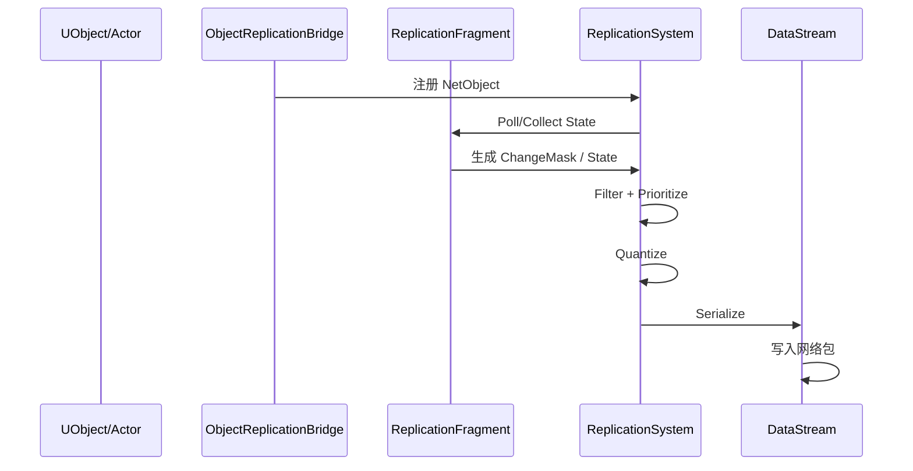
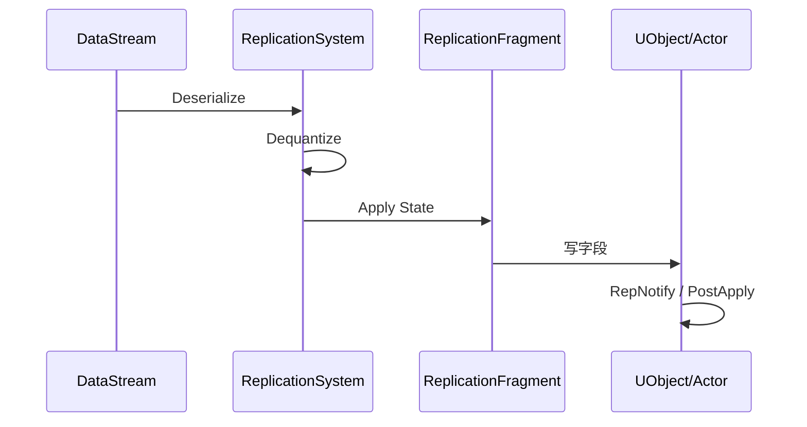
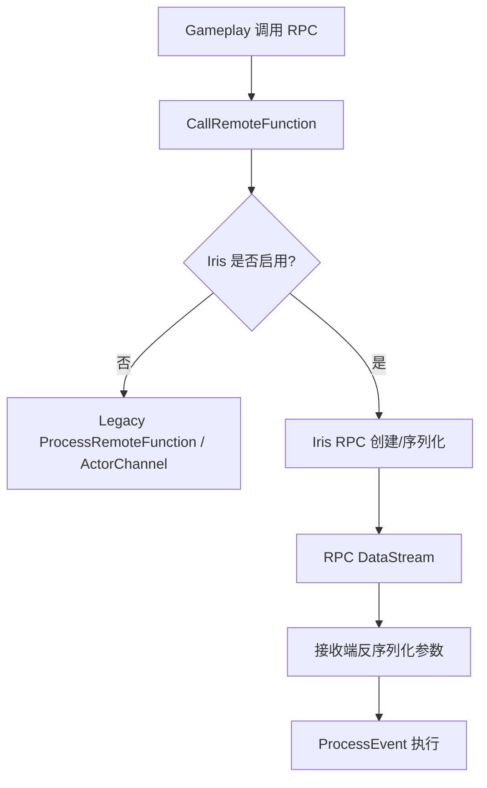

# Iris属性复制与RPC流程

> 本页解释 Iris 下属性复制和 RPC，并补入 UE5.7 `UReplicationSystem` / `UObjectReplicationBridge` 源码链路。

## 属性发送流程

与 Legacy 的对比：

- Legacy：`ActorChannel -> FObjectReplicator -> FRepLayout -> Bunch`。
- Iris：`ReplicationSystem -> Fragment/Descriptor -> NetSerializer -> DataStream`。

## UE5.7 Iris 属性复制源码链

| 环节 | UE5.7 源码符号 | 结论 |
|---|---|---|
| NetDriver tick | `UNetDriver::TickFlush` | Iris NetDriver 在 tick flush 中调用 `ReplicationSystem->NetUpdate(DeltaSeconds)`。 |
| 主更新 | `UReplicationSystem::NetUpdate` | 执行 DataStream `PreSendUpdate`、DirtyObject 刷新、WorldLocation 更新、过滤、Bridge poll、条件更新、量化、scope 更新、ChangeMask 传播、优先级和 delta compression 预处理。 |
| Bridge poll | `UObjectReplicationBridge::PreSendUpdate` / registered fragments | Bridge 负责从 UObject/Actor fragment 收集复制状态，并与 NetObject 管理器交互。 |
| 写出 | `UReplicationSystem::SendUpdate` / `PostSendUpdate` | 通过 DataStreamChannel / ReplicationDataStream 写出复制数据，并在 post send 阶段收束状态。 |
| 对象注册 | `UObjectReplicationBridge` 注册路径 | UObject/Actor 会被桥接为 NetObject；SubObject 需要注册到 root/owner 关系中。 |
| SubObject 关系 | `UObjectReplicationBridge::GetRootObjectOfSubObject`、dependent/creation dependency 相关函数 | Iris 需要知道 SubObject 的 root、依赖和创建顺序，避免对象引用先于对象本体到达。 |

## 属性接收流程

关键点：

- 接收端可能先创建/resolve 对象，再应用状态。
- 对象引用可能处于 unmapped，需延迟处理。
- OnRep 仍是业务层重要回调，但触发时机要以 Iris 实测为准。

## RPC 流程

Iris 下 RPC 仍从业务层 `UFUNCTION(Server/Client/NetMulticast)` 进入，但底层打包和传输会在 Iris 启用时进入 Iris RPC/DataStream 路径。UE5.7 的关键分叉仍在 `UNetDriver::ProcessRemoteFunction` 附近：Legacy 走 ActorChannel/FRepLayout，Iris 则交给 ReplicationSystem/RPC DataStream 相关逻辑。

## RPC 与属性的时序

迁移 Iris 时不要假设：

- 某个属性一定早于某个 RPC 到达。
- 某个 SubObject 一定在引用它的 RPC 前完成 resolve。
- Legacy 下偶然稳定的顺序在 Iris 下仍稳定。

如果业务依赖顺序，应改为：

- 在同一对象同一状态中携带必要数据。
- 使用显式确认/状态机。
- RPC 参数避免依赖尚未复制的对象。
- 对 unmapped 引用做等待或重试。

## Lyra 重点场景

### TargetData

`ULyraGameplayAbility_RangedWeapon`：

1. 客户端本地构造 `FGameplayAbilityTargetDataHandle`。
2. `CallServerSetReplicatedTargetData` 发给服务器。
3. 服务器校验并 Commit。
4. `ClientConfirmTargetData` 返回命中确认。

`FLyraGameplayAbilityTargetData_SingleTargetHit` 自定义 `NetSerialize`，并在 Iris descriptor config 中声明支持。

### FastSharedReplication

`ALyraCharacter::FastSharedReplication` 是 `NetMulticast, unreliable`。在 Iris 下同样需要确认：

- unreliable multicast 覆盖哪些客户端。
- 是否与属性复制快照产生时序差异。
- 丢包时客户端是否能通过后续状态恢复。

### SubObject

Inventory / Equipment 的 SubObject 复制需要验证：

- `ReadyForReplication` 是否被正确调用。
- `AddReplicatedSubObject` 是否在对象创建后执行。
- 移除时是否先反注册。
- FastArray Entry 与 SubObject 状态到达顺序是否可靠。

## 调试建议

- 对属性：断点放在 Poll/Apply/OnRep 与业务 setter。
- 对 RPC：断点放在调用端、序列化端、接收端 `ProcessEvent`。
- 对对象引用：观察对象是否 registered、是否 resolve、是否 pending unmapped。
- 对 FastArray：分别测试 add/change/remove 和 Join-in-progress。

<!-- nav:auto -->

---

**导航**: ← [[30-tutorials/network-sync/iris/03-IrisNetToken|03-IrisNetToken]] · [[30-tutorials/network-sync/iris/05-Iris迁移检查清单|05-Iris迁移检查清单]] →

<!-- /nav:auto -->
