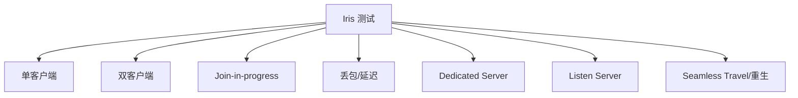

# Iris迁移检查清单

> 用于把 Legacy 项目或模块迁移到 Iris 前的工程检查。Lyra 可作为样例，但不能省略测试。

## 0. 先确认目标

- [ ] 是为了学习 Iris，还是解决真实性能瓶颈？
- [ ] 瓶颈是带宽、CPU、Actor 相关性、序列化，还是 RPC/状态建模？
- [ ] 是否已经用 Network Profiler / Insights / RepGraph 调试确认瓶颈？
- [ ] 是否需要保留 Legacy 回退开关？

## 1. 启用条件

- [ ] `.uproject` 启用 `Iris` 插件。
- [ ] C++ target/module 调用 `SetupIrisSupport(Target)`。
- [ ] NetDriver 在 `IrisNetDriverConfigs` 中 `bCanUseIris=true`。
- [ ] `net.Iris.UseIrisReplication=1` 或 `-UseIrisReplication=1` 生效。
- [ ] GameInstance / GameMode 没有请求不兼容的复制系统。
- [ ] 启动日志能证明 `UNetDriver` 创建了 `UReplicationSystem`。
- [ ] Listen Server 与 Dedicated Server 都测试。

UE5.7 源码结论：`net.Iris.UseIrisReplication` 默认值为 `0`；命令行可以覆盖；`IrisNetDriverConfigs` 是“允许使用 Iris”的门槛而不是实际启用本身；`UNetDriver::SetReplicationDriver` 禁止 Iris NetDriver 再挂 Legacy `ReplicationDriver`。Lyra 已满足插件和构建支持，但当前仓库配置中未发现显式运行时启用 Iris 的 CVar/NetDriver 配置，实际运行路径仍需日志验证。

## 2. 普通属性与 RepNotify

- [ ] `UPROPERTY(Replicated)` 初始同步正确。
- [ ] `ReplicatedUsing` 变化时触发正确。
- [ ] 服务端本地是否需要手动调用 OnRep 已明确。
- [ ] PushModel 属性所有修改点都标脏。
- [ ] 条件复制在 owner/simulated 场景下正确。

Lyra 样例：`ReplicatedAcceleration`、`MyTeamID`、`PawnData`、`ReplicatedViewRotation`。

## 3. RPC

- [ ] Server RPC 有权调用，非法客户端请求被拒绝或校验。
- [ ] Client RPC 的 owning connection 正确。
- [ ] Multicast 不依赖所有客户端必达。
- [ ] Reliable RPC 调用频率可控。
- [ ] RPC 参数中的 UObject 引用可 resolve。

Lyra 样例：`ClientConfirmTargetData`、`FastSharedReplication`。

## 4. SubObject

- [ ] 不再只依赖 `ReplicateSubobjects`。
- [ ] 动态对象创建后调用 `AddReplicatedSubObject`。
- [ ] 移除前调用 `RemoveReplicatedSubObject`。
- [ ] `ReadyForReplication` 中注册已有对象。
- [ ] 对象 Outer、生命周期和 GC 安全。
- [ ] Join-in-progress 能收到当前对象集合。

Lyra 样例：Inventory 与 Equipment。

## 5. FastArray

- [ ] add/change/remove 都有测试。
- [ ] 修改元素后 `MarkItemDirty`。
- [ ] 删除/批量变化后 `MarkArrayDirty`。
- [ ] Entry 内 UObject 引用对应 SubObject 已注册。
- [ ] callback 不做服务器权威逻辑。
- [ ] Iris 下 dirty/equality 语义已验证。

## 6. 自定义序列化

- [ ] `NetSerialize` 类型设置 `WithNetSerializer=true`。
- [ ] Iris 下需要的结构体加入 `SupportsStructNetSerializerList` 或自定义 NetSerializer。
- [ ] 新增字段保持兼容或有版本处理。
- [ ] 包含对象引用时能收集引用。
- [ ] 丢包/重发/Join-in-progress 测试通过。

Lyra 样例：`FLyraGameplayAbilityTargetData_SingleTargetHit`。

## 7. Relevancy / Filter / Priority

- [ ] 原有 `IsNetRelevantFor` 逻辑是否仍生效？
- [ ] RepGraph 节点路由是否需要迁移？
- [ ] OwnerOnly、TeamOnly、距离裁剪是否有 Iris filter 对应策略？
- [ ] 优先级是否与 gameplay 重要性匹配？
- [ ] 带宽不足时关键 Actor 不会饥饿。

## 8. GAS 与预测

- [ ] ASC replication mode 符合设计。
- [ ] Ability 激活预测和服务器确认正确。
- [ ] TargetData 被服务器校验。
- [ ] PredictionKey 被消费，不泄漏历史数据。
- [ ] GameplayCue / Tag 在 owner 与 simulated 上表现一致。

## 9. 测试矩阵

最小通过标准：

- 登录、重生、断开、重连无异常。
- Pawn、PlayerState、Inventory、Equipment、Weapon、GAS 都能同步。
- 关键 RPC 不丢失、不误发。
- 带宽与 CPU 没有明显回退。
- 回退 Legacy 开关仍可用。

<!-- nav:auto -->

---

**导航**: ← [[30-tutorials/network-sync/iris/04-Iris属性复制与RPC流程|04-Iris属性复制与RPC流程]] · [[30-tutorials/network-sync/iris/06-IrisObjectReplicationBridge与SubObject|06-IrisObjectReplicationBridge与SubObject]] →

<!-- /nav:auto -->
