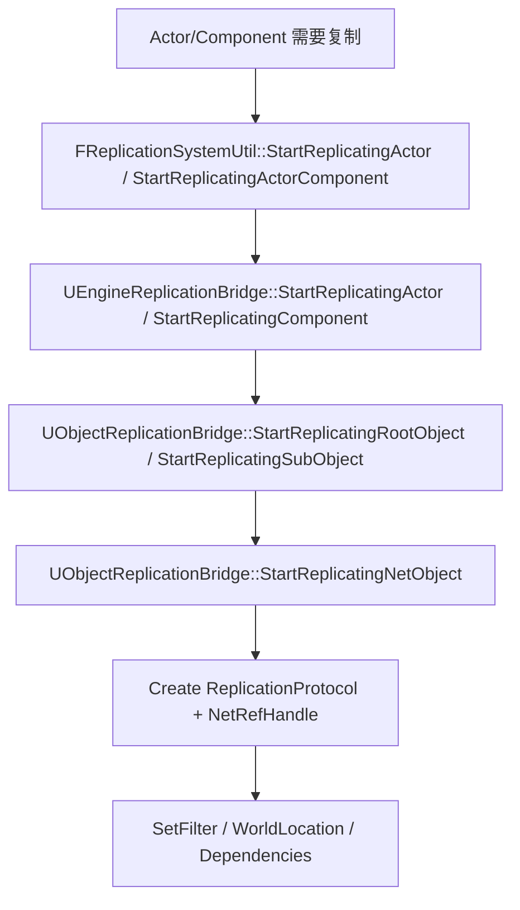

# IrisObjectReplicationBridge与SubObject

> 本页补充 Iris 中 UObject/Actor 接入复制系统的源码边界。核心对象是 `UObjectReplicationBridge` 与 Engine 层的 `UEngineReplicationBridge`。

## 定位

`UObjectReplicationBridge` 是 UObject 进入 Iris 的桥：

- 把 UObject/Actor 转成 `FNetRefHandle`。
- 注册 Replication Fragments。
- 创建 Replication Protocol。
- 绑定 root object / subobject 关系。
- 配置 filter / priority / world location。
- 写入远端创建信息。
- 处理远端实例化、销毁与 subobject detach。

Engine 层的 `UEngineReplicationBridge` 负责把 `AActor`、`UActorComponent`、registered subobject 映射到上述通用桥接能力。

## 开始复制调用链

UE5.7 中 `BeginReplication()` 已是兼容回调，真实主路径是：

新的回调是：

- `AActor::OnReplicationStartedForIris()`
- `UActorComponent::OnReplicationStartedForIris()`

`BeginReplication()` 仍可能在成功开始复制后被兼容调用，但默认实现为空且已 deprecated。

## UE5.7 源码复核结论

| 主题 | 源码符号 | 结论 |
|---|---|---|
| 通用桥类 | `UObjectReplicationBridge` (`Runtime/Net/Iris/Public/Iris/ReplicationSystem/ObjectReplicationBridge.h`) | 提供 root/subobject 开始复制、dependent object、creation dependency 等通用 API。 |
| NetObject 注册 | `UObjectReplicationBridge::StartReplicatingNetObject` (`ObjectReplicationBridge.cpp`) | 创建 fragments、协议和 `FNetRefHandle`；失败会返回 invalid handle。 |
| Root object | `StartReplicatingRootObject` | root object 设置 filter、world location、pre-update trait 等。 |
| SubObject | `StartReplicatingSubObject` | 要求 root handle 已复制；模板对象不能作为 subobject 复制。 |
| Filter | `AssignDynamicFilter`、`ReplicationSystem->SetFilter` | root object 可使用显式 filter，也可走 bridge config 的动态 filter。 |
| Root/SubObject 查询 | `GetRootObjectOfAnyObject`、`GetRootObjectOfSubObject` | Iris 维护 subobject 到 root object 的关系。 |
| Dependent object | `AddDependentObject` / `RemoveDependentObject` | 用于表达对象依赖，通知 filtering 子系统。 |
| Creation dependency | `AddCreationDependencyLink` / `RemoveCreationDependencyLink` | 用于确保子对象/依赖对象创建顺序。 |
| 远端创建信息 | `WriteNetRefHandleCreationInfo` / `CreateNetRefHandleFromRemote` | 发送端写出创建信息，接收端据此创建/绑定远端对象。 |
| 远端销毁 | `DetachSubObjectInstancesFromRemote` / `DetachInstanceFromRemote` | root 销毁前会 detach subobject，确保回调和清理顺序。 |

## Filter 配置

Lyra 当前 `DefaultEngine.ini`：

| ClassName | DynamicFilterName |
|---|---|
| `/Script/Engine.LevelScriptActor` | `NotRouted` |
| `/Script/Engine.Actor` | `None` |
| `/Script/Engine.Info` | `None` |
| `/Script/Engine.PlayerState` | `None` |
| `/Script/Engine.Pawn` | `Spatial` |
| `/Script/EntityActor.SimObject` | `None` |

同时 `DefaultSpatialFilterName=Spatial`。注意 `Actor=None`，`Pawn=Spatial`；不要把默认空间过滤误解为所有 Actor 都使用 `Spatial`。

## DataStream 与 RPC 边界

Iris 发送数据依赖 DataStream：

| 主题 | 源码符号 | 结论 |
|---|---|---|
| 连接 DataStream 初始化 | `FReplicationConnections::InitDataStreamManager` | 为连接初始化 `UDataStreamManager`，并关联 ReplicationReader/Writer。 |
| 复制数据流 | `UReplicationDataStream::Init` / `BeginWrite` / `WriteData` / `ReadData` | 对象状态和 attachments 通过 replication data stream 传输。 |
| 写出队列 | `FReplicationWriter::QueueNetObjectAttachments` / `Write` | RPC 等 attachment 与对象状态一起进入 writer 调度。 |
| RPC blob | `FNetRPC::Create` / `SerializeWithObject` / `DeserializeWithObject` / `CallFunction` | RPC 被封装为 NetBlob，携带目标对象与函数参数。 |
| RPC handler | `UNetRPCHandler::CreateRPC` / `OnNetBlobReceived` | 负责创建和接收 RPC blob。 |
| Blob manager | `FNetBlobManager::SendMulticastRPC` / `SendUnicastRPC` | 区分 multicast / unicast RPC 的发送。 |

## 对 Lyra 的意义

Inventory / Equipment 中的 `AddReplicatedSubObject`、`RemoveReplicatedSubObject`、`ReadyForReplication` 正是 Iris 迁移重点：

- FastArray Entry 只同步列表结构。
- SubObject 本体需要被 bridge 注册为 NetObject。
- SubObject 与 owner/root 的关系必须稳定。
- 移除前必须反注册，避免客户端持有悬挂引用。
- Join-in-progress 需要 root、subobject、FastArray 三者初始状态一致。

## 常见坑

- 只实现 `ReplicateSubobjects`，没有 registered subobject list，迁移 Iris 风险高。
- 动态 UObject Outer 不稳定，导致 root/subobject 关系不清。
- FastArray 先到、SubObject 尚未创建或 unresolved，callback 直接读对象导致空引用。
- 忘记 `RemoveReplicatedSubObject`，客户端对象生命周期异常。
- 误以为 `BeginReplication()` 是 UE5.7 Iris 的主入口。

<!-- nav:auto -->

---

**导航**: ← [[30-tutorials/network-sync/iris/05-Iris迁移检查清单|05-Iris迁移检查清单]]

<!-- /nav:auto -->
