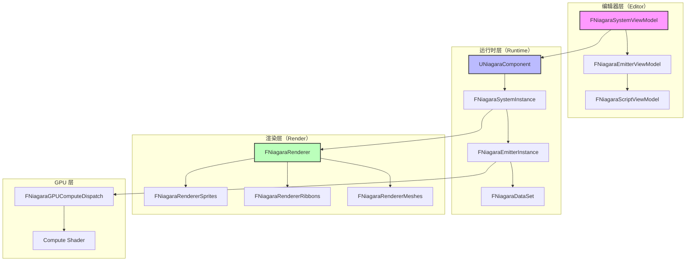
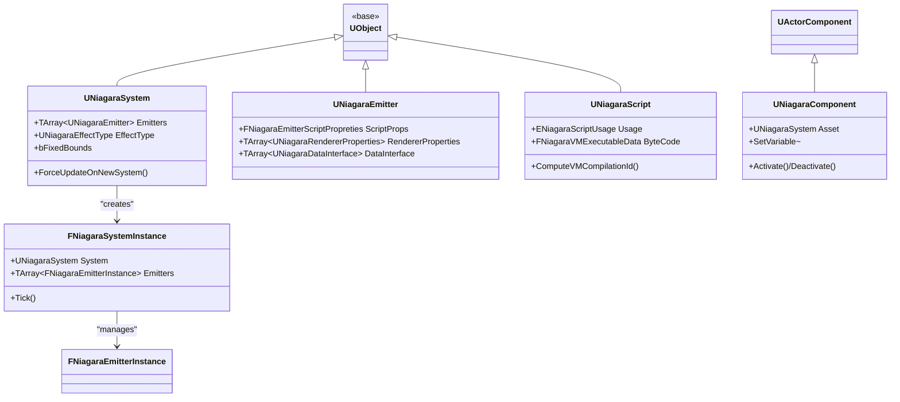
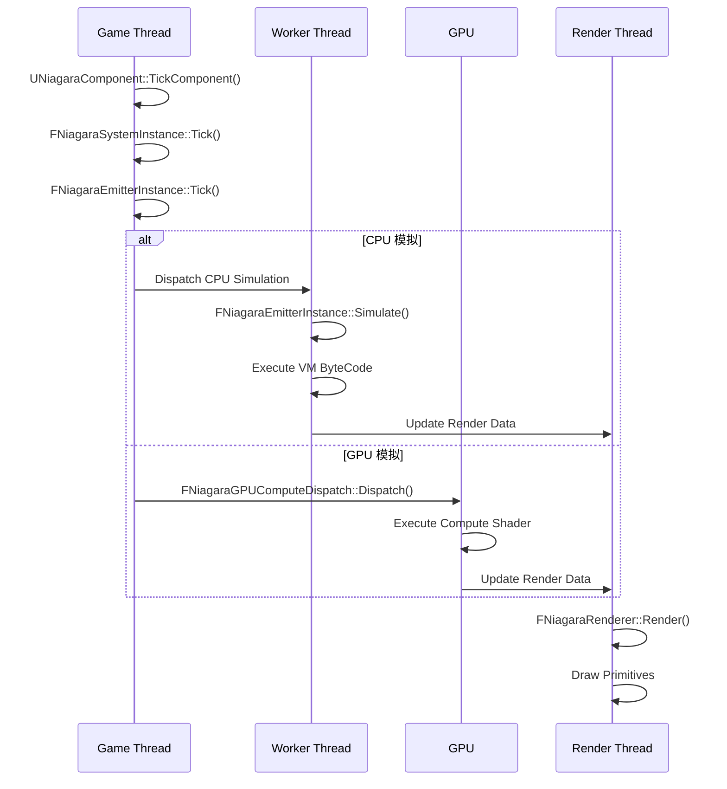

# Niagara系统框架深度分析-概览

> 本文档系列旨在深入分析 Unreal Engine 5.7 的 Niagara 粒子系统框架，并结合 LyraStarterGame 项目源码，帮助开发者理解 Niagara 的设计原理、实现细节及最佳实践。

## 文档系列导航

本系列共 8 个专题文档，按**由简到繁、先总体后细节**的原则组织：

| 序号 | 文档 | 内容概要 | 目标读者 |
|------|------|----------|----------|
| 01 | **Overview（本文档）** | Niagara 系统概览、架构图、术语表 | 初学者 / 技术美术 |
| 02 | [Core Framework](02-Niagara系统核心框架深度分析.md) | UNiagaraSystem / UNiagaraEmitter 深度分析 | 中级 / 引擎程序员 |
| 03 | [Scripts & Modules](03-Niagara脚本与模块系统深度分析.md) | UNiagaraScript、模块系统、Vector VM | 中级 / 技术美术 |
| 04 | [CPU Simulation](04-NiagaraCPU粒子模拟流程深度分析.md) | CPU 粒子模拟、发射器实例、数据流 | 高级 / 引擎程序员 |
| 05 | [GPU Simulation](05-NiagaraGPU粒子模拟流程深度分析.md) | GPU 计算着色器、FNiagaraGPUComputeDispatch | 高级 / 图形程序员 |
| 06 | [Data Interface](06-Niagara数据接口系统.md) | 数据接口系统、内置 DI、自定义 DI 开发 | 中级 / 引擎程序员 |
| 07 | [Rendering & Optimization](07-Niagara渲染器和性能优化系统.md) | 渲染器、性能优化、可伸缩性 | 高级 / 渲染程序员 |
| 08 | [Lyra Implementation](08-Lyra项目中的Niagara系统应用实例.md) | Lyra 中的 Niagara 应用实例 | Lyra 开发者 |

---

## 一、Niagara 系统架构概览

### 1.1 核心架构图

### 1.2 核心类层次结构

---

## 二、Niagara 执行流程概览

### 2.1 完整更新流程

### 2.2 关键阶段说明

| 阶段 | 位置 | 说明 |
|------|------|------|
| **Tick** | `UNiagaraComponent::TickComponent()` | 每帧入口，更新系统实例 |
| **Simulate** | `FNiagaraEmitterInstance::Simulate()` | 执行粒子模拟，运行 VM 字节码 |
| **Render** | `FNiagaraRenderer::Render()` | 渲染粒子（Sprite/Mesh/Ribbon） |
| **GPU Dispatch** | `FNiagaraGPUComputeDispatch::Dispatch()` | 调度 GPU 计算着色器 |

---

## 三、核心概念术语表

### 3.1 基础概念

| 术语 | 英文 | 说明 |
|------|------|------|
| **Niagara 系统** | Niagara System | 完整的粒子系统资产（`.uasset`） |
| **发射器** | Emitter | 系统中的一个粒子发射器 |
| **模块** | Module | 可复用的粒子逻辑单元 |
| **脚本** | Script | Niagara VM 可执行脚本 |
| **数据接口** | Data Interface | 连接外部数据的接口 |
| **渲染器** | Renderer | 定义粒子渲染方式 |
| **参数集合** | Parameter Collection | 全局参数共享 |

### 3.2 高级概念

| 术语 | 英文 | 说明 |
|------|------|------|
| **Vector VM** | Vector Virtual Machine | Niagara 虚拟机，执行粒子逻辑 |
| **DataSet** | Data Set | 粒子数据存储（SOA 布局） |
| **GPU 模拟** | GPU Simulation | 在 GPU 上执行粒子模拟 |
| **Sim Cache** | Simulation Cache | 缓存粒子模拟结果 |
| **可伸缩性** | Scalability | 根据平台性能调整粒子效果 |
| **事件** | Event | 粒子间通信机制 |

### 3.3 Lyra 特有应用

| 术语 | 说明 |
|------|------|
| **Damage Pop** | 伤害数字弹出效果（使用 Niagara 渲染） |
| **Context Effects** | 基于上下文触发特效（集成 Niagara） |
| **Number Pop Component** | Lyra 伤害数字组件（封装 Niagara） |

---

## 四、源码位置索引

### 4.1 引擎源码（UE5.7）

**核心类（Plugins/FX/Niagara/Source/Niagara/）**：

| 类 | 文件路径 |
|---------|----------|
| `UNiagaraSystem` | `Classes/NiagaraSystem.h` |
| `UNiagaraEmitter` | `Classes/NiagaraEmitter.h` |
| `UNiagaraScript` | `Classes/NiagaraScript.h` |
| `UNiagaraComponent` | `Classes/NiagaraComponent.h` |
| `UNiagaraDataInterface` | `Classes/NiagaraDataInterface.h` |
| `FNiagaraSystemInstance` | `Private/NiagaraSystemInstance.h` |
| `FNiagaraEmitterInstance` | `Private/NiagaraEmitterInstance.h` |
| `FNiagaraDataSet` | `Classes/NiagaraDataSet.h` |
| `FNiagaraGPUComputeDispatch` | `Private/NiagaraGpuComputeDispatch.h` |
| `FNiagaraRenderer` | `Private/NiagaraRenderer.h` |

**Editor 模块（Plugins/FX/Niagara/Source/NiagaraEditor/）**：

| 类 | 文件路径 |
|---------|----------|
| `FNiagaraSystemViewModel` | `Public/ViewModels/NiagaraSystemViewModel.h` |
| `FNiagaraEmitterViewModel` | `Public/ViewModels/NiagaraEmitterViewModel.h` |
| `FNiagaraScriptViewModel` | `Public/ViewModels/NiagaraScriptViewModel.h` |

### 4.2 Lyra 源码

| 类/资源 | 文件路径 |
|---------|----------|
| `ULyraNumberPopComponent_NiagaraText` | `Source/LyraGame/Feedback/NumberPops/LyraNumberPopComponent_NiagaraText.h/cpp` |
| `ULyraDamagePopStyleNiagara` | `Source/LyraGame/Feedback/NumberPops/LyraDamagePopStyleNiagara.h` |
| `ULyraContextEffectComponent` | `Source/LyraGame/ContextEffects/LyraContextEffectComponent.h/cpp` |

---

## 五、后续文档预览

### 5.1 下一篇文档：Core Framework

[02-Niagara系统核心框架深度分析](02-Niagara系统核心框架深度分析.md) 将深入分析：

1. **UNiagaraSystem 深度分析**
   - 源码路径：`Plugins/FX/Niagara/Source/Niagara/Classes/NiagaraSystem.h`
   - 核心属性：`Emitters`, `EffectType`, `bFixedBounds`
   - 关键方法：`ForceUpdateOnNewSystem()`, `SpawnSystem()`

2. **UNiagaraEmitter 深度分析**
   - 源码路径：`Plugins/FX/Niagara/Source/Niagara/Classes/NiagaraEmitter.h`
   - 核心属性：`ScriptProps`, `RendererProperties`, `DataInterface`
   - 发射器模块系统

3. **UNiagaraScript 深度分析**
   - 源码路径：`Plugins/FX/Niagara/Source/Niagara/Classes/NiagaraScript.h`
   - 脚本类型：`Spawn`, `Update`, `Event`
   - 编译流程：`FNiagaraVMExecutableData`

### 5.2 文档系列学习路径

```mermaid
graph LR
    A["01 Overview"] --> B["02 Core Framework"]
    B --> C["03 Scripts & Modules"]
    C --> D["04 CPU Simulation"]
    D --> E["05 GPU Simulation"]
    E --> F["06 Data Interface"]
    F --> G["07 Rendering & Opt"]
    G --> H["08 Lyra Implementation"]

    style A fill:#f9f,stroke:#333,stroke-width:2px
    style H fill:#bfb,stroke:#333,stroke-width:2px
```

**建议学习路径**：
- **初学者**：01 → 02 → 06 → 08
- **中级开发者**：01 → 02 → 03 → 06
- **高级开发者**：02 → 04 → 05 → 07

---

## 六、参考资料

1. [Unreal Engine 5 官方文档 - Niagara 特效系统](https://docs.unrealengine.com/5.0/zh-CN/niagara-effects-system-in-unreal-engine/)
2. [Niagara 源码分析](https://github.com/EpicGames/UnrealEngine/tree/5.7/Engine/Plugins/FX/Niagara)
3. [Lyra 示例项目 - 伤害数字实现](https://docs.unrealengine.com/5.0/zh-CN/lyra-sample-game-in-unreal-engine/)
4. [UE5 Niagara GPU 模拟详解](https://docs.unrealengine.com/5.0/zh-CN/)

---

> **最后更新**：2026-05-17
> **状态**：current
> **维护者**：AI Agent (project-wiki skill)

<!-- nav:auto -->

---

**导航**: [[30-tutorials/niagara/02-Niagara系统核心框架深度分析|02-Niagara系统核心框架深度分析]] →

<!-- /nav:auto -->
