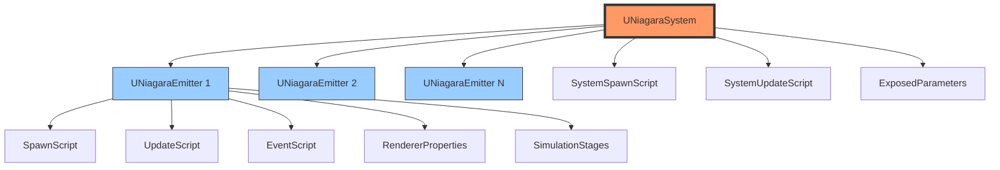
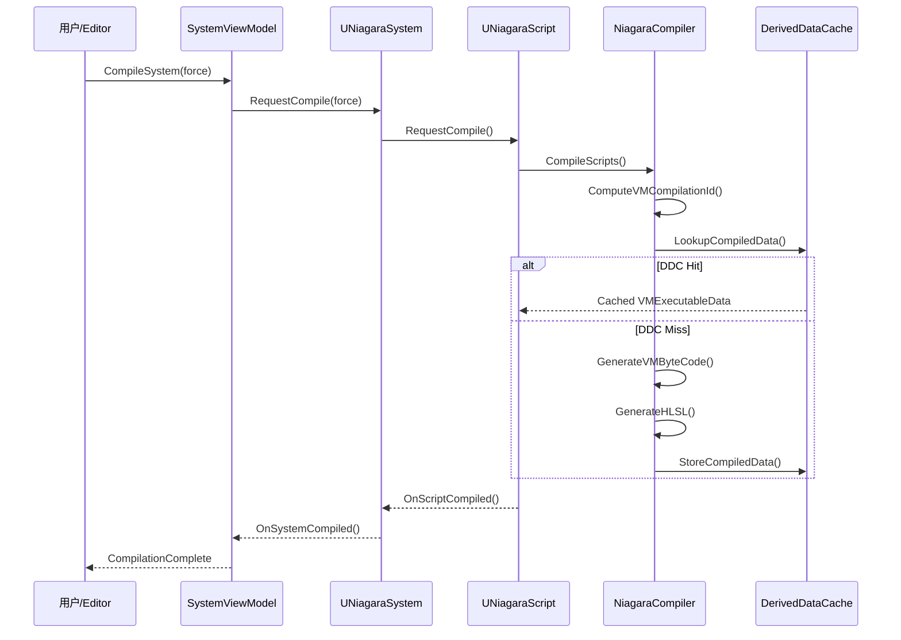

# Niagara系统核心框架深度分析

> **基于 UE 5.7 的 Niagara 源码分析**
>
> Niagara 是 Unreal Engine 5 的底层 VFX 系统，提供了完全可编程的粒子模拟框架。

## 目录

- [1. 架构总览](#1-架构总览)
- [2. UNiagaraSystem 深度分析](#2-uniagarasystem-深度分析)
- [3. UNiagaraEmitter 深度分析](#3-uniagaraemitter-深度分析)
- [4. UNiagaraScript 深度分析](#4-uniagarascript-深度分析)
- [5. Editor ViewModel 分析](#5-editor-viewmodel-分析)
- [6. 编译流程](#6-编译流程)
- [7. 资产配置与序列化](#7-资产配置与序列化)

---

## 1. 架构总览

Niagara 系统的核心架构采用三层设计：



### 核心类关系

| 类名 | 职责 | 源码路径 |
|-------|------|----------|
| `UNiagaraSystem` | 顶层容器，管理多个 Emitter | `Niagara/Classes/NiagaraSystem.h` |
| `UNiagaraEmitter` | 粒子发射器，定义粒子行为 | `Niagara/Classes/NiagaraEmitter.h` |
| `UNiagaraScript` | 可执行脚本，定义模拟逻辑 | `Niagara/Classes/NiagaraScript.h` |
| `FNiagaraSystemViewModel` | Editor ViewModel，管理 UI 交互 | `NiagaraEditor/Public/ViewModels/NiagaraSystemViewModel.h` |
| `FNiagaraEmitterViewModel` | Emitter ViewModel，管理 Emitter UI | `NiagaraEditor/Public/ViewModels/NiagaraEmitterViewModel.h` |

---

## 2. UNiagaraSystem 深度分析

`UNiagaraSystem` 是 Niagara 系统的顶层资产类，继承自 `UFXSystemAsset` 和 `INiagaraParameterDefinitionsSubscriber`。

### 2.1 类声明

**源码位置**: `Engine/Plugins/FX/Niagara/Source/Niagara/Classes/NiagaraSystem.h:233-235`

```cpp
/**
 * A Niagara System contains multiple Niagara Emitters to create various effects.
 * Niagara Systems can be placed in the world, unlike Emitters, and expose User Parameters to configure an effect at runtime.
 */
UCLASS(BlueprintType, MinimalAPI, meta = (LoadBehavior = "LazyOnDemand"))
class UNiagaraSystem : public UFXSystemAsset, public INiagaraParameterDefinitionsSubscriber
```

**关键设计点**:
- `LoadBehavior = "LazyOnDemand"`: 延迟加载，优化内存
- 实现 `INiagaraParameterDefinitionsSubscriber`: 支持参数定义订阅

### 2.2 核心属性

#### EmitterHandles

**源码位置**: `NiagaraSystem.h:917-918`

```cpp
/** Handles to the emitter this System will simulate. */
UPROPERTY()
TArray<FNiagaraEmitterHandle> EmitterHandles;
```

`FNiagaraEmitterHandle` 是 Emitter 的句柄，允许 System 引用 Emitter 资产而不拥有其数据。

#### EffectType

**源码位置**: `NiagaraSystem.h:899-900`

```cpp
/**
 * An effect types defines settings shared between systems, for example scalability and validation rules.
 * Things like environment fx usually have a different effect type than gameplay relevant fx such as weapon impacts.
 * This way whole classes of effects can be adjusted at once.
 */
UPROPERTY(EditAnywhere, Category = "System")
TObjectPtr<UNiagaraEffectType> EffectType;
```

`UNiagaraEffectType` 定义了可伸缩性（Scalability）和验证规则，允许批量调整特效类别。

#### 固定边界 (FixedBounds)

**源码位置**: `NiagaraSystem.h:807-808, 979-981`

```cpp
/** Whether or not fixed bounds are enabled. */
UPROPERTY(EditAnywhere, Category = "System", meta = (SkipSystemResetOnChange = "true", InlineEditConditionToggle))
uint32 bFixedBounds : 1;

/** The fixed bounding box value for the whole system. When placed in the level and the bounding box is not visible to the camera, the effect is culled from rendering. */
UPROPERTY(EditAnywhere, Category = "System", meta = (SkipSystemResetOnChange = "true", EditCondition = "bFixedBounds"))
FBox FixedBounds;
```

#### 系统脚本

**源码位置**: `NiagaraSystem.h:936-942`

```cpp
/** The script which defines the System parameters, and which generates the bindings from System
    parameter to emitter parameter. */
UPROPERTY()
TObjectPtr<UNiagaraScript> SystemSpawnScript;

/** The script which defines the System parameters, and which generates the bindings from System
    parameter to emitter parameter. */
UPROPERTY()
TObjectPtr<UNiagaraScript> SystemUpdateScript;
```

#### 编译数据

**源码位置**: `NiagaraSystem.h:945-953`

```cpp
//** Post compile generated data used for initializing Emitter Instances during runtime. */
TArray<TSharedRef<const FNiagaraEmitterCompiledData>> EmitterCompiledData;

//** Post compile generated data used for initializing System Instances during runtime. */
UPROPERTY()
FNiagaraSystemCompiledData SystemCompiledData;

/** Variables exposed to the outside world for tweaking*/
UPROPERTY()
FNiagaraUserRedirectionParameterStore ExposedParameters;
```

### 2.3 关键方法

#### ForceUpdateOnNewSystem

虽然源码中没有直接的 `ForceUpdateOnNewSystem()` 方法，但 System 更新通过以下方法实现：

**源码位置**: `NiagaraSystem.h:525`

```cpp
NIAGARA_API void UpdateSystemAfterLoad();
```

#### SpawnSystem / InitializeSystem

System 的实例化由 `UNiagaraComponent` 管理，System 本身提供初始化数据：

**源码位置**: `NiagaraSystem.h:322-323`

```cpp
/** Returns true if this system is valid and can be instanced. False otherwise. */
bool IsValid() const { return FPlatformProperties::RequiresCookedData() ? bIsValidCached : IsValidInternal(); }
```

#### RequestCompile

**源码位置**: `NiagaraSystem.h:438`

```cpp
/** Request that any dirty scripts referenced by this system be compiled.*/
NIAGARA_API bool RequestCompile(bool bForce, FNiagaraSystemUpdateContext* OptionalUpdateContext = nullptr, const ITargetPlatform* TargetPlatform = nullptr);
```

#### 执行顺序计算

**源码位置**: `NiagaraSystem.h:714-727`

```cpp
/** Computes the order in which the emitters in the Emitters array will be ticked and stores the results in EmitterExecutionOrder. */
NIAGARA_API void ComputeEmittersExecutionOrder();

/** Computes the order in which renderers will render */
NIAGARA_API void ComputeRenderersDrawOrder();
```

执行顺序考虑 Emitter 之间的数据依赖关系，通过 `FNiagaraEmitterExecutionIndex` 管理：

**源码位置**: `NiagaraSystem.h:176-184`

```cpp
struct FNiagaraEmitterExecutionIndex
{
    FNiagaraEmitterExecutionIndex() { bStartNewOverlapGroup = false; EmitterIndex = 0; }

    /** Flag to denote if the batcher should start a new overlap group, i.e. when we have a dependency ensure we don't overlap with the emitter we depend on. */
    uint32 bStartNewOverlapGroup : 1;
    /** Emitter index to use */
    uint32 EmitterIndex : 31;
};
```

### 2.4 可伸缩性 (Scalability)

**源码位置**: `NiagaraSystem.h:910-914`

```cpp
UPROPERTY(EditAnywhere, Category = "Scalability", meta = (DisplayInScalabilityContext))
FNiagaraSystemScalabilityOverrides SystemScalabilityOverrides;

UPROPERTY(EditAnywhere, Category = "Scalability", meta = (DisplayInScalabilityContext))
FNiagaraPlatformSet Platforms;
```

可伸缩性系统允许根据平台性能和质量设置动态调整特效。

---

## 3. UNiagaraEmitter 深度分析

`UNiagaraEmitter` 定义了粒子的生成、更新和渲染行为。

### 3.1 类声明

**源码位置**: `Engine/Plugins/FX/Niagara/Source/Niagara/Classes/NiagaraEmitter.h:593-595`

```cpp
/**
 *  Niagara Emitters are particle spawners that can be reused for different effects by putting them into Niagara systems.
 *  Emitters render their particles using different renderers, such as Sprite Renderers or Mesh Renderers to produce different effects.
 */
UCLASS(MinimalAPI)
class UNiagaraEmitter : public UNiagaraEmitterBase, public INiagaraParameterDefinitionsSubscriber, public FNiagaraVersionedObject
```

### 3.2 版本化数据 (Versioned Data)

UE 5.3+ 引入了版本化 Emitter 数据，`FVersionedNiagaraEmitterData` 存储特定版本的数据：

**源码位置**: `NiagaraEmitter.h:238-241`

```cpp
/** Struct containing all of the data that can be different between different emitter versions.*/
USTRUCT(BlueprintInternalUseOnly)
struct FVersionedNiagaraEmitterData
{
    GENERATED_BODY()
```

#### 核心属性 (在 FVersionedNiagaraEmitterData 中)

**Spawn/Update 脚本**:

**源码位置**: `NiagaraEmitter.h:360-364`

```cpp
UPROPERTY()
FNiagaraEmitterScriptProperties UpdateScriptProps;

UPROPERTY()
FNiagaraEmitterScriptProperties SpawnScriptProps;
```

**EventHandler**:

**源码位置**: `NiagaraEmitter.h:324-325`

```cpp
UPROPERTY(meta=(NiagaraNoMerge))
TArray<FNiagaraEventScriptProperties> EventHandlerScriptProps;
```

**Renderer**:

**源码位置**: `NiagaraEmitter.h:508`

```cpp
UPROPERTY()
TArray<TObjectPtr<UNiagaraRendererProperties>> RendererProperties;
```

**SimulationStages**:

**源码位置**: `NiagaraEmitter.h:510-511`

```cpp
UPROPERTY(meta = (NiagaraNoMerge))
TArray<TObjectPtr<UNiagaraSimulationStageBase>> SimulationStages;
```

### 3.3 发射器模块系统

`FNiagaraEmitterScriptProperties` 结构定义了脚本及其事件接收/生成属性：

**源码位置**: `NiagaraEmitter.h:137-156`

```cpp
USTRUCT()
struct FNiagaraEmitterScriptProperties
{
    GENERATED_BODY()
    
    UPROPERTY()
    TObjectPtr<UNiagaraScript> Script;

    UPROPERTY()
    TArray<FNiagaraEventReceiverProperties> EventReceivers;

    UPROPERTY()
    TArray<FNiagaraEventGeneratorProperties> EventGenerators;

    NIAGARA_API void InitDataSetAccess();
};
```

### 3.4 事件系统 (Event System)

#### 事件接收器

**源码位置**: `NiagaraEmitter.h:38-73`

```cpp
USTRUCT()
struct FNiagaraEventReceiverProperties
{
    GENERATED_BODY()

    /** The name of this receiver. */
    UPROPERTY(EditAnywhere, Category = "Event Receiver")
    FName Name;

    /** The name of the EventGenerator to bind to. */
    UPROPERTY(EditAnywhere, Category = "Event Receiver")
    FName SourceEventGenerator;

    /** The name of the emitter from which the Event Generator is taken. */
    UPROPERTY(EditAnywhere, Category = "Event Receiver")
    FName SourceEmitter;
};
```

#### 事件生成器

**源码位置**: `NiagaraEmitter.h:76-100`

```cpp
USTRUCT()
struct FNiagaraEventGeneratorProperties
{
    GENERATED_BODY()

    /** Max Number of Events that can be generated per frame. */
    UPROPERTY(EditAnywhere, Category = "Event Receiver")
    int32 MaxEventsPerFrame = 64;

    UPROPERTY()
    FName ID;

    UPROPERTY()
    FNiagaraDataSetCompiledData DataSetCompiledData;
};
```

#### 事件脚本属性

**源码位置**: `NiagaraEmitter.h:159-204`

```cpp
USTRUCT()
struct FNiagaraEventScriptProperties : public FNiagaraEmitterScriptProperties
{
    GENERATED_BODY()
            
    /** Controls which particles have the event script run on them.*/
    UPROPERTY(EditAnywhere, Category="Event Handler Options")
    EScriptExecutionMode ExecutionMode;

    /** Controls whether or not particles are spawned as a result of handling the event. */
    UPROPERTY(EditAnywhere, Category="Event Handler Options")
    uint32 SpawnNumber;

    /** Id of the Emitter Handle that generated the event. */
    UPROPERTY(EditAnywhere, Category="Event Handler Options")
    FGuid SourceEmitterID;

    /** The name of the event generated. */
    UPROPERTY(EditAnywhere, Category="Event Handler Options")
    FName SourceEventName;
};
```

### 3.5 模拟目标 (Simulation Target)

**源码位置**: `NiagaraEmitter.h:303-304`

```cpp
UPROPERTY(EditAnywhere, BlueprintReadWrite, Category = "Emitter", meta = (SegmentedDisplay))
ENiagaraSimTarget SimTarget = ENiagaraSimTarget::CPUSim;
```

- `CPUSim`: CPU 模拟，支持所有功能
- `GPUComputeSim`: GPU 模拟，高性能但功能受限

---

## 4. UNiagaraScript 深度分析

`UNiagaraScript` 是 Niagara 的可执行脚本类，类似于 Blueprint，包含图形节点网络。

### 4.1 类声明

**源码位置**: `Engine/Plugins/FX/Niagara/Source/Niagara/Classes/NiagaraScript.h:781-784`

```cpp
/** Scripts are function graphs that define the runtime execution for a Niagara system (similar to a Blueprint).
 *
 * There are three types of scripts:
 * 1) Module: can be added as a standalone part to the emitter stack and encapsulates a single behavior
 * 2) Dynamic input: has a single output value and can be added to any input in the stack
 * 3) Function: usually reserved for helper functions; can only be called from within modules or dynamic inputs 
 */
UCLASS(MinimalAPI)
class UNiagaraScript : public UNiagaraScriptBase, public FNiagaraVersionedObject
```

### 4.2 脚本类型 (Script Usage)

**源码位置**: `NiagaraScript.h:844-856`

```cpp
// how this script is to be used. cannot be private due to use of GET_MEMBER_NAME_CHECKED
UPROPERTY(AssetRegistrySearchable)
ENiagaraScriptUsage Usage;

/** Specifies a unique id for use when there are multiple scripts with the same usage, e.g. events. */
UPROPERTY()
FGuid UsageId;
```

**脚本类型枚举** (在 `NiagaraCommon.h` 中定义):

| 用法 | 说明 |
|------|------|
| `SystemSpawnScript` | 系统生成时执行 |
| `SystemUpdateScript` | 系统更新时执行 |
| `EmitterSpawnScript` | 发射器生成时执行 |
| `EmitterUpdateScript` | 发射器更新时执行 |
| `ParticleSpawnScript` | 粒子生成时执行 |
| `ParticleUpdateScript` | 粒子更新时执行 |
| `ParticleEventScript` | 事件处理时执行 |
| `ParticleSimulationStageScript` | 模拟阶段执行 |
| `ParticleGPUComputeScript` | GPU 计算脚本 |
| `Module` | 模块脚本 |
| `DynamicInput` | 动态输入脚本 |
| `Function` | 函数脚本 |

### 4.3 FNiagaraVMExecutableData (VM 字节码)

这是脚本编译后的可执行数据：

**源码位置**: `NiagaraScript.h:397-500`

```cpp
/** Struct containing all of the data needed to run a Niagara VM executable script.*/
USTRUCT()
struct FNiagaraVMExecutableData
{
    GENERATED_USTRUCT_BODY()
public:
    NIAGARA_API FNiagaraVMExecutableData();

    /** Byte code to execute for this system. */
    UPROPERTY()
    FNiagaraVMExecutableByteCode ByteCode;

    /** Number of temp registers used by this script. */
    UPROPERTY()
    int32 NumTempRegisters;

    /** Number of user pointers we must pass to the VM. */
    UPROPERTY()
    int32 NumUserPtrs;

    /** Attributes used by this script. */
    UPROPERTY()
    TArray<FNiagaraVariableBase> Attributes;

    /** Information about all data interfaces used by this script. */
    UPROPERTY()
    TArray<FNiagaraScriptDataInterfaceCompileInfo> DataInterfaceInfo;

    /** Array of ordered vm external functions to place in the function table. */
    UPROPERTY()
    TArray<FVMExternalFunctionBindingInfo> CalledVMExternalFunctions;

    /** Scopes we'll track with stats.*/
    UPROPERTY()
    TArray<FNiagaraStatScope> StatScopes;
    // ...
};
```

### 4.4 字节码结构

**源码位置**: `NiagaraScript.h:353-385`

```cpp
USTRUCT()
struct FNiagaraVMExecutableByteCode
{
    GENERATED_USTRUCT_BODY()
private:
    UPROPERTY()
    TArray<uint8> Data;

    UPROPERTY()
    int32 UncompressedSize = INDEX_NONE;

public:
    NIAGARA_API bool HasByteCode() const;
    NIAGARA_API bool IsCompressed() const;
    NIAGARA_API bool Compress();
    NIAGARA_API bool Uncompress();
    // ...
};
```

字节码可以被压缩以节省内存，`Compress()` 和 `Uncompress()` 管理压缩状态。

### 4.5 编译流程

#### ComputeVMCompilationId

**源码位置**: `NiagaraScript.h:974`

```cpp
NIAGARA_API void ComputeVMCompilationId(FNiagaraVMExecutableDataId& Id, const FGuid& VersionGuid, FNiagaraScriptHashCollector* HashCollector = nullptr) const;
```

#### GetComputedVMCompilationId

**源码位置**: `NiagaraScript.h:977-986`

```cpp
const FNiagaraVMExecutableDataId& GetComputedVMCompilationId() const
{
#if WITH_EDITORONLY_DATA
    if (!IsScriptCooked())
    {
        return GetLastGeneratedVMId();
    }
#endif
    return CachedScriptVMId;
}
```

#### FNiagaraVMExecutableDataId

编译标识结构，用于 DDC (Derived Data Cache) 查找：

**源码位置**: `NiagaraScript.h:240-351`

```cpp
/** Struct containing all of the data necessary to look up a NiagaraScript's VM executable results from the Derived Data Cache.*/
USTRUCT()
struct FNiagaraVMExecutableDataId
{
    GENERATED_USTRUCT_BODY()
public:
    /** The version of the compiler that this needs to be built against.*/
    UPROPERTY()
    FGuid CompilerVersionID;

    /** Do we require interpolated spawning */
    UPROPERTY()
    ENiagaraInterpolatedSpawnMode InterpolatedSpawnMode;

    /** The hash of the subgraph this shader primarily represents.*/
    UPROPERTY()
    FNiagaraCompileHash BaseScriptCompileHash;

    /** Compile hashes of any top level scripts the script was dependent on. */
    UPROPERTY()
    TArray<FNiagaraCompileHash> ReferencedCompileHashes;
    // ...
};
```

### 4.6 快速迭代参数 (Rapid Iteration Parameters)

**源码位置**: `NiagaraScript.h:881-882`

```cpp
/** Contains all of the top-level values that are iterated on in the UI. These are usually "Module" variables in the graph. They don't necessarily have to be in the order that they are expected in the uniform table.*/
UPROPERTY()
FNiagaraParameterStore RapidIterationParameters;
```

快速迭代参数允许在 Editor 中快速调整数值而无需重新编译脚本。

---

## 5. Editor ViewModel 分析

Editor ViewModel 层负责管理 Niagara Editor 的 UI 状态和行为。

### 5.1 FNiagaraSystemViewModel

**源码位置**: `Engine/Plugins/FX/Niagara/Source/NiagaraEditor/Public/ViewModels/NiagaraSystemViewModel.h:119-127`

```cpp
/** A view model for viewing and editing a UNiagaraSystem. */
class FNiagaraSystemViewModel 
    : public TSharedFromThis<FNiagaraSystemViewModel>
    , public FGCObject
    , public FEditorUndoClient
    , public FTickableEditorObject
    , public TNiagaraViewModelManager<UNiagaraSystem, FNiagaraSystemViewModel>
    , public INiagaraParameterDefinitionsSubscriberViewModel
    , public UE::MovieScene::ISignedObjectEventHandler
```

#### 核心功能

1. **Emitter Handle 管理**:

**源码位置**: `NiagaraSystemViewModel.h:205-211`

```cpp
/** Gets an array of the view models for the emitter handles owned by this System. */
NIAGARAEDITOR_API const TArray<TSharedRef<FNiagaraEmitterHandleViewModel>>& GetEmitterHandleViewModels() const;

/** Gets an emitter handle view model by ID. */
NIAGARAEDITOR_API TSharedPtr<FNiagaraEmitterHandleViewModel> GetEmitterHandleViewModelById(FGuid InEmitterHandleId);
```

2. **编译管理**:

**源码位置**: `NiagaraSystemViewModel.h:325-328`

```cpp
/** Compiles the spawn and update scripts. */
void CompileSystem(bool bForce);

/** Get the latest status of this view-model's script compilation.*/
ENiagaraScriptCompileStatus GetLatestCompileStatus() const;
```

3. **系统重置**:

**源码位置**: `NiagaraSystemViewModel.h:293-307`

```cpp
/** Resets the System instance to initial conditions. */
void ResetSystem(ETimeResetMode TimeResetMode, EMultiResetMode MultiResetMode, EReinitMode ReinitMode);
```

#### 编辑模式

**源码位置**: `NiagaraSystemViewModel.h:60-68`

```cpp
/** Defines different editing modes for this system view model. */
enum class ENiagaraSystemViewModelEditMode
{
    /** A system asset is being edited. */
    SystemAsset,
    /** An emitter asset is being edited. */
    EmitterAsset,
    /** Special case where an emitter asset is being edited during a merge. */
    EmitterDuringMerge,
};
```

### 5.2 FNiagaraEmitterViewModel

**源码位置**: `Engine/Plugins/FX/Niagara/Source/NiagaraEditor/Public/ViewModels/NiagaraEmitterViewModel.h:33-38`

```cpp
/** The view model for the UNiagaraEmitter objects */
class FNiagaraEmitterViewModel 
    : public TSharedFromThis<FNiagaraEmitterViewModel>
    , public TNiagaraViewModelManager<UNiagaraEmitter, FNiagaraEmitterViewModel>
    , public INiagaraParameterDefinitionsSubscriberViewModel
    , public FGCObject
```

#### 核心功能

1. **Emitter 数据访问**:

**源码位置**: `NiagaraEmitterViewModel.h:72-78`

```cpp
/** Gets the emitter represented by this view model. */
NIAGARAEDITOR_API FVersionedNiagaraEmitter GetEmitter();

/** Gets whether or not this emitter has a parent emitter. */
NIAGARAEDITOR_API bool HasParentEmitter() const;

/** Gets the parent emitter for the emitter represented by this view model. */
NIAGARAEDITOR_API FVersionedNiagaraEmitter GetParentEmitter() const;
```

2. **脚本 ViewModel**:

**源码位置**: `NiagaraEmitterViewModel.h:97-99`

```cpp
/** Geta a view model for the update/spawn Script. */
TSharedRef<FNiagaraScriptViewModel> GetSharedScriptViewModel();

NIAGARAEDITOR_API UNiagaraSummaryViewModel* GetSummaryHierarchyViewModel();
```

3. **事件处理**:

**源码位置**: `NiagaraEmitterViewModel.h:132-135`

```cpp
/** Add an event script to the owned emitter. */
NIAGARAEDITOR_API void AddEventHandler(FNiagaraEventScriptProperties& EventScriptProperties, bool bResetGraphForOutput = false);
```

---

## 6. 编译流程

### 6.1 编译架构



### 6.2 编译标识计算

**源码位置**: `NiagaraScript.h:974`

`ComputeVMCompilationId()` 计算脚本的编译标识，考虑以下因素：

1. **CompilerVersionID**: 编译器版本
2. **BaseScriptCompileHash**: 脚本图表的哈希
3. **ReferencedCompileHashes**: 依赖脚本的编译哈希
4. **ScriptVersionID**: 脚本版本
5. **AdditionalDefines**: 额外定义

### 6.3 GPU 脚本编译

**源码位置**: `NiagaraScript.h:1109-1116`

```cpp
/** Are the GPU scripts compiled by the system or by the script itself? */
static bool AreGpuScriptsCompiledBySystem();

/** Cache GPU shader for cooking. */
void CacheResourceShadersForCooking(EShaderPlatform ShaderPlatform, TArray<TUniquePtr<FNiagaraShaderScript>>& InOutCachedResources, const ITargetPlatform* TargetPlatform = nullptr);
```

---

## 7. 资产配置与序列化

### 7.1 序列化

**UNiagaraSystem::Serialize**:

**源码位置**: `NiagaraSystem.h:251`

```cpp
NIAGARA_API virtual void Serialize(FArchive& Ar) override;
```

Niagara 资产使用自定义序列化来优化加载性能：

1. **延迟加载**: `LoadBehavior = "LazyOnDemand"`
2. **DDC 集成**: 编译后的 VM 数据存储在 DDC 中
3. **版本兼容**: 通过 `NiagaraCustomVersion` 处理版本升级

### 7.2 版本化系统

**Emitter 版本化**:

**源码位置**: `NiagaraEmitter.h:734-744`

```cpp
/** The exposed version is the version that is used by default when a user adds this emitter somewhere. */
UPROPERTY()
FGuid ExposedVersion;

/** If true then this emitter asset uses active version control to track changes. */
UPROPERTY()
bool bVersioningEnabled = false;

/** Contains all of the versioned emitter data. */
UPROPERTY()
TArray<FVersionedNiagaraEmitterData> VersionData;
```

版本化允许 Emitter 资产维护多个版本，支持非破坏性更新。

### 7.3 Cook 集成

**源码位置**: `NiagaraSystem.h:267-268`

```cpp
NIAGARA_API virtual void BeginCacheForCookedPlatformData(const ITargetPlatform *TargetPlatform) override;
NIAGARA_API virtual bool IsCachedCookedPlatformDataLoaded(const ITargetPlatform* TargetPlatform) override;
```

在 Cook 过程中，Niagara 系统会：
1. 编译所有 GPU 着色器
2. 缓存 VM 可执行数据
3. 烘焙快速迭代参数

---

## 8. 运行时架构

### 8.1 系统实例 (System Instance)

`FNiagaraSystemInstance` 是运行时的系统实例，管理发射器实例和模拟状态。

关键概念：
- **Spawn Script**: 系统生成时执行一次
- **Update Script**: 系统每次更新时执行
- **Emitter Instances**: 每个 Emitter 有一个实例

### 8.2 数据结构

**FNiagaraSystemCompiledData**:

**源码位置**: `NiagaraSystem.h:141-174`

```cpp
USTRUCT()
struct FNiagaraSystemCompiledData
{
    GENERATED_USTRUCT_BODY()

    /** Instance parameter store. */
    UPROPERTY()
    FNiagaraParameterStore InstanceParamStore;

    /** System data set compiled data. */
    UPROPERTY()
    FNiagaraDataSetCompiledData DataSetCompiledData;

    /** Parameter data set bindings. */
    UPROPERTY()
    FNiagaraParameterDataSetBindingCollection SpawnInstanceGlobalBinding;
    // ...
};
```

---

## 9. 性能优化要点

### 9.1 快速迭代参数烘焙

**源码位置**: `NiagaraSystem.h:571-577`

```cpp
/** When enable constant values are baked into the scripts while editing the system. */
UPROPERTY(EditAnywhere, AdvancedDisplay, Category = "Performance", meta=(DisplayName="Bake Rapid Iteration Parameters During Edit"))
uint32 bBakeOutRapidIteration : 1;

/** When enabled constant values are baked into scripts to improve performance. */
UPROPERTY(EditAnywhere, AdvancedDisplay, Category = "Performance", meta=(DisplayName="Bake Rapid Iteration Parameters"))
uint32 bBakeOutRapidIterationOnCook : 1;
```

### 9.2 属性修剪 (Attribute Trimming)

**源码位置**: `NiagaraSystem.h:584-589`

```cpp
/** If true Particle attributes will be removed from the DataSet if they are unnecessary. */
UPROPERTY(EditAnywhere, AdvancedDisplay, Category = "Performance", meta = (DisplayName="Trim Attributes During Edit"))
uint32 bTrimAttributes : 1;

UPROPERTY(EditAnywhere, AdvancedDisplay, Category = "Performance", meta = (DisplayName="Trim Attributes"))
uint32 bTrimAttributesOnCook : 1;
```

### 9.3 GPU 模拟

GPU 模拟可以极大提升性能，但有以下限制：
- 不支持 `ParticleUpdateScript` 中的某些操作
- 数据接口支持有限
- 调试更困难

---

## 10. 总结

Niagara 系统的核心框架采用分层设计：

1. **UNiagaraSystem**: 顶层容器，管理 Emitter 和可伸缩性
2. **UNiagaraEmitter**: 定义粒子行为，包含脚本、渲染器和事件
3. **UNiagaraScript**: 可执行脚本，使用 VM 字节码运行
4. **ViewModel 层**: 管理 Editor UI 交互

**关键设计模式**:
- 版本化数据 (Versioned Data)
- 延迟加载 (Lazy Loading)
- DDC 集成 (Derived Data Cache)
- 快速迭代参数 (Rapid Iteration Parameters)
- 可伸缩性系统 (Scalability System)

**源码文件索引**:

| 文件 | 路径 |
|------|------|
| NiagaraSystem.h | `Engine/Plugins/FX/Niagara/Source/Niagara/Classes/NiagaraSystem.h` |
| NiagaraEmitter.h | `Engine/Plugins/FX/Niagara/Source/Niagara/Classes/NiagaraEmitter.h` |
| NiagaraScript.h | `Engine/Plugins/FX/Niagara/Source/Niagara/Classes/NiagaraScript.h` |
| NiagaraSystemViewModel.h | `Engine/Plugins/FX/Niagara/Source/NiagaraEditor/Public/ViewModels/NiagaraSystemViewModel.h` |
| NiagaraEmitterViewModel.h | `Engine/Plugins/FX/Niagara/Source/NiagaraEditor/Public/ViewModels/NiagaraEmitterViewModel.h` |

<!-- nav:auto -->

---

**导航**: ← [[30-tutorials/niagara/01-Niagara系统框架深度分析-概览|01-Niagara系统框架深度分析-概览]] · [[30-tutorials/niagara/03-Niagara脚本与模块系统深度分析|03-Niagara脚本与模块系统深度分析]] →

<!-- /nav:auto -->
