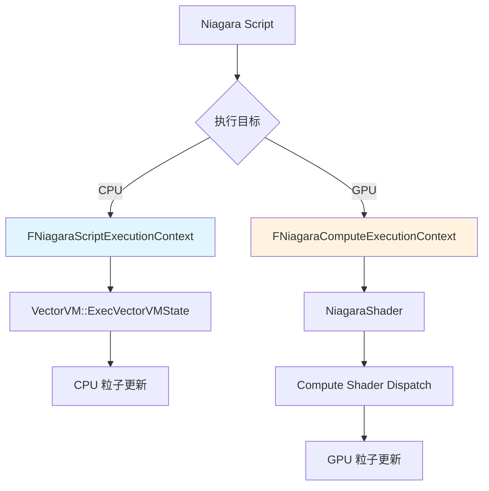
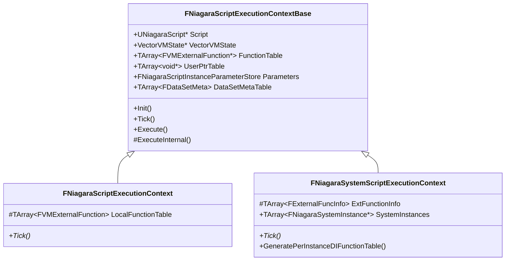
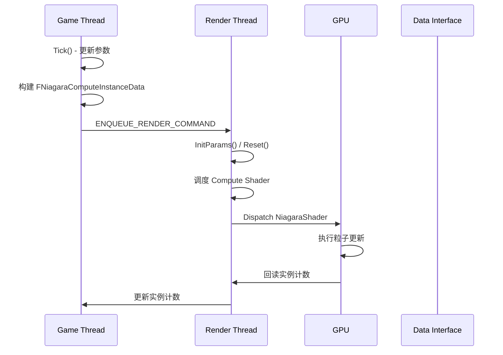
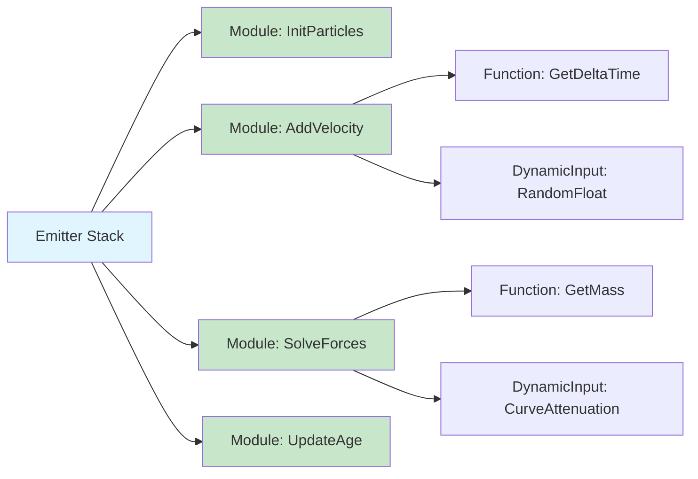
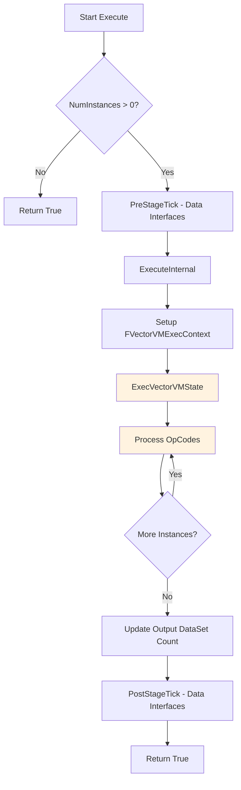
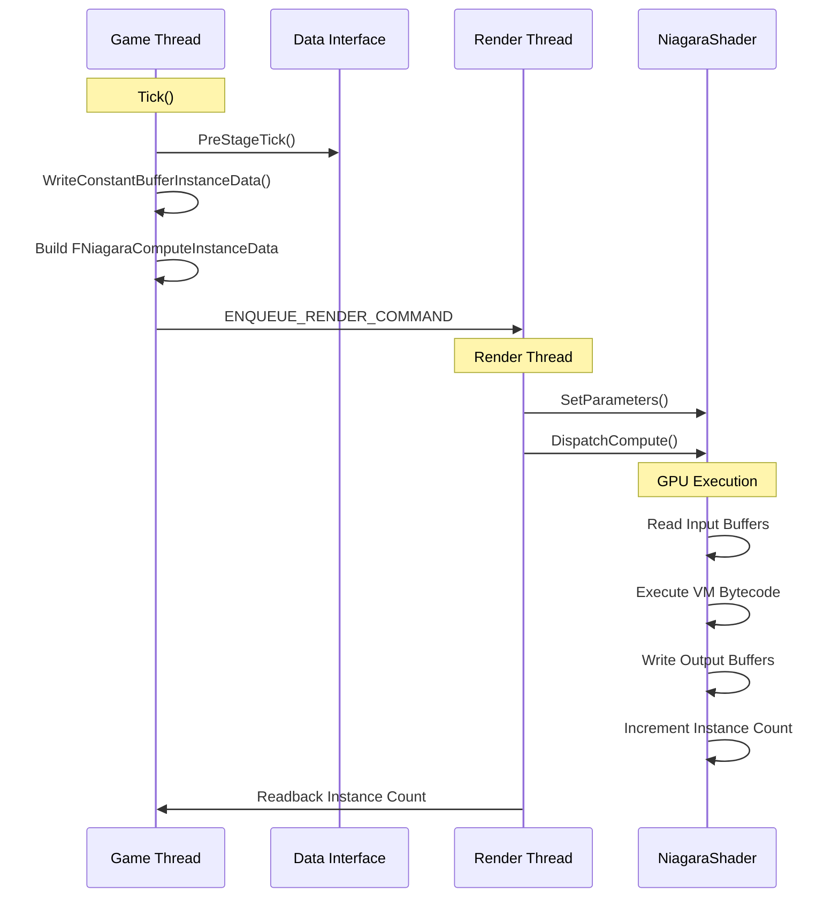
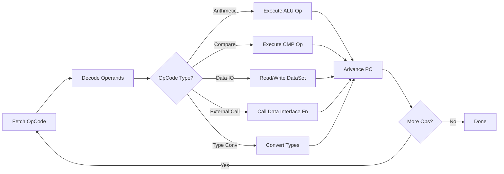

# Niagara脚本与模块系统深度分析

> 本文档深入分析 UE5 Niagara 的脚本执行系统和模块架构，涵盖 CPU/GPU 执行路径、Vector VM 原理及模块依赖机制。

## 目录

1. [概述](#1-概述)
2. [UNiagaraScript 与 FNiagaraVMExecutableData](#2-uniagarascript-与-fniagaravmexecutabledata)
3. [FNiagaraScriptExecutionContext（CPU 执行）](#3-fniagarascriptexecutioncontextcpu-执行)
4. [FNiagaraComputeExecutionContext（GPU 执行）](#4-fniagaracomputeexecutioncontextgpu-执行)
5. [Vector VM 执行原理](#5-vector-vm-执行原理)
6. [模块系统](#6-模块系统)
7. [执行流程图](#7-执行流程图)

---

## 1. 概述

Niagara 的脚本系统是基于 **Vector VM（虚拟机）** 的跨平台执行引擎，支持 CPU 和 GPU 两种执行路径：



### 核心组件

| 组件 | 职责 | 源码位置 |
|--------|------|----------|
| `UNiagaraScript` | 脚本资产基类，管理版本和编译数据 | `NiagaraScript.h:782` |
| `FNiagaraVMExecutableData` | VM 可执行数据（字节码、参数布局） | `NiagaraScript.h:398` |
| `FNiagaraScriptExecutionContextBase` | CPU 执行上下文基类 | `NiagaraScriptExecutionContext.h:128` |
| `FNiagaraComputeExecutionContext` | GPU 执行上下文 | `NiagaraComputeExecutionContext.h:66` |
| `VectorVM::Runtime::FVectorVMState` | Vector VM 运行时状态 | `VectorVMRuntime.h:8` |

---

## 2. UNiagaraScript 与 FNiagaraVMExecutableData

### 2.1 UNiagaraScript 结构

`UNiagaraScript` 是 Niagara 脚本的资产类，支持版本控制和多种脚本类型。

```cpp
// Engine/Plugins/FX/Niagara/Source/Niagara/Classes/NiagaraScript.h:782
UCLASS(MinimalAPI)
class UNiagaraScript : public UNiagaraScriptBase, public FNiagaraVersionedObject
{
    GENERATED_UCLASS_BODY()
public:
    UNiagaraScript();

    // 版本化数据
    UPROPERTY()
    TArray<FVersionedNiagaraScriptData> VersionData;
    
    // 暴露的版本 GUID
    UPROPERTY()
    FGuid ExposedVersion;
    
    // 是否启用版本控制
    UPROPERTY()
    uint32 bVersioningEnabled : 1;
    
    // 已解析的数据接口
    TArray<FNiagaraScriptResolvedDataInterfaceInfo> ResolvedDataInterfaces;
    
    // 执行就绪的参数存储
    FNiagaraScriptExecutionParameterStore* GetExecutionReadyParameterStore(ENiagaraSimTarget SimTarget);
};
```

### 2.2 脚本类型枚举

```cpp
// 脚本的三种主要类型：
// 1. Module: 可添加到 Emitter Stack 的独立行为模块
// 2. Dynamic Input: 单个输出值，可连接到任意输入
// 3. Function: 辅助函数，只能从 Module 或 Dynamic Input 调用
```

### 2.3 FNiagaraVMExecutableData 结构

这是 VM 执行的核心数据结构，包含字节码和所有执行所需元数据。

```cpp
// Engine/Plugins/FX/Niagara/Source/Niagara/Classes/NiagaraScript.h:398
USTRUCT()
struct FNiagaraVMExecutableData
{
    GENERATED_USTRUCT_BODY()
public:
    // [1] VM 执行核心数据
    UPROPERTY()
    FNiagaraVMExecutableByteCode ByteCode;

    UPROPERTY()
    int32 NumTempRegisters;

    UPROPERTY()
    int32 NumUserPtrs;
```
脚本参数与字面量数据：
```cpp
    // [2] 脚本参数与字面量
    UPROPERTY()
    FNiagaraParameters Parameters;

    UPROPERTY()
    FNiagaraParameters InternalParameters;

    UPROPERTY()
    TArray<uint8> ScriptLiterals;
```
数据接口与外部函数绑定：
```cpp
    // [3] 数据接口与外部函数绑定
    UPROPERTY()
    TArray<FNiagaraVariableBase> Attributes;

    UPROPERTY()
    TArray<FNiagaraScriptDataInterfaceCompileInfo> DataInterfaceInfo;

    UPROPERTY()
    TArray<FVMExternalFunctionBindingInfo> CalledVMExternalFunctions;

    TArray<FVMExternalFunction> CalledVMExternalFunctionBindings;
```
数据集访问与编译状态：
```cpp
    // [4] 数据集、统计作用域与编译状态
    UPROPERTY()
    TArray<FNiagaraDataSetID> ReadDataSets;

    UPROPERTY()
    TArray<FNiagaraDataSetProperties> WriteDataSets;

    UPROPERTY()
    TArray<FNiagaraStatScope> StatScopes;

    UPROPERTY()
    ENiagaraScriptCompileStatus LastCompileStatus;

    UPROPERTY()
    TArray<uint8> ExperimentalContextData;

    UPROPERTY()
    uint32 bNeedsGPUContextInit : 1;

    UPROPERTY()
    uint32 bReadsSignificanceIndex : 1;
};
```

### 2.4 FNiagaraVMExecutableByteCode 压缩

字节码支持 Zlib 压缩以节省内存：

```cpp
// Engine/Plugins/FX/Niagara/Source/Niagara/Private/NiagaraScript.cpp:264
struct FNiagaraVMExecutableByteCode
{
    // 字节码数据
    TArray<uint8> Data;
    
    // 如果已压缩，记录未压缩大小；否则为 INDEX_NONE
    int32 UncompressedSize = INDEX_NONE;

    bool IsCompressed() const
    {
        return HasByteCode() && UncompressedSize != INDEX_NONE;
    }
```
使用 Zlib 对字节码进行内存压缩，只有当压缩率有效时才存储压缩数据：
```cpp
    bool Compress()
    {
        if (FCompression::CompressMemory(
            NAME_Zlib, CompressedData.GetData(), CompressedSize,
            Data.GetData(), Data.Num(), COMPRESS_BiasMemory))
        {
            if (CompressedSize < OriginalSize)
            {
                Data = MoveTemp(CompressedData);
                UncompressedSize = OriginalSize;
            }
        }
    }
```
解压缩恢复原始字节码：
```cpp
    bool Uncompress()
    {
        if (IsCompressed())
        {
            TArray<uint8> UncompressedData;
            UncompressedData.SetNumUninitialized(UncompressedSize);
            FCompression::UncompressMemory(
                NAME_Zlib, UncompressedData.GetData(), UncompressedSize,
                Data.GetData(), Data.Num());
            Data = MoveTemp(UncompressedData);
            UncompressedSize = INDEX_NONE;
        }
    }
};
```

### 2.5 版本化系统

Niagara Script 支持完整的版本控制，允许迭代更新而不破坏现有资产：

```cpp
// Engine/Plugins/FX/Niagara/Source/Niagara/Classes/NiagaraScript.h:618
USTRUCT()
struct FVersionedNiagaraScriptData
{
    // 版本信息
    UPROPERTY()
    FNiagaraAssetVersion Version;
    
    // Module 使用位掩码（哪些 ScriptUsage 可用）
    UPROPERTY()
    int32 ModuleUsageBitmask;
    
    // 提供的依赖（例如 'ProvidesNormalizedAge'）
    UPROPERTY()
    TArray<FName> ProvidedDependencies;
    
    // 需要的依赖
    UPROPERTY()
    TArray<FNiagaraModuleDependency> RequiredDependencies;
    
    // 是否废弃
    UPROPERTY()
    bool bDeprecated;
    
    // 废弃后的推荐替代 Script
    UPROPERTY()
    TObjectPtr<UNiagaraScript> DeprecationRecommendation;
    
    // 库可见性
    UPROPERTY()
    ENiagaraScriptLibraryVisibility LibraryVisibility;
    
    // 数值输出类型选择模式
    UPROPERTY()
    ENiagaraNumericOutputTypeSelectionMode NumericOutputTypeSelectionMode;
};
```

---

## 3. FNiagaraScriptExecutionContext（CPU 执行）

### 3.1 执行上下文层级结构



### 3.2 初始化流程

`FNiagaraScriptExecutionContextBase::Init()` 设置 Vector VM 状态和数据接口绑定：

```cpp
// Engine/Plugins/FX/Niagara/Source/Niagara/Private/NiagaraScriptExecutionContext.cpp:52
bool FNiagaraScriptExecutionContextBase::Init(
    FNiagaraSystemInstance* Instance,
    UNiagaraScript* InScript,
    ENiagaraSimTarget InTarget)
{
    Script = InScript;
    
    // 从 Script 初始化参数存储
    Parameters.InitFromOwningContext(Script, InTarget, true);
    
    // 检查是否有插值参数（用于插值生成）
    HasInterpolationParameters = Script && 
        Script->GetComputedVMCompilationId().HasInterpolatedParameters();
    
    // 分配 Vector VM 状态（从实验性 Context Data）
    VectorVMState = VectorVM::Runtime::AllocVectorVMState(
        Script->GetVMExecutableData().ExperimentalContextData);
    
    return true;
}
```

### 3.3 数据绑定

`BindData()` 将 `FNiagaraDataSet` 的寄存器和 ID 表绑定到 VM 执行上下文：

```cpp
// Engine/Plugins/FX/Niagara/Source/Niagara/Private/NiagaraScriptExecutionContext.cpp:109
void FNiagaraScriptExecutionContextBase::BindData(
    int32 Index, 
    FNiagaraDataSet& DataSet,
    int32 StartInstance,
    bool bUpdateInstanceCounts)
{
    FNiagaraDataBuffer* Input = DataSet.GetCurrentData();
    FNiagaraDataBuffer* Output = DataSet.GetDestinationData();

    // 初始化 DataSetInfo
    DataSetInfo.SetNum(FMath::Max(DataSetInfo.Num(), Index + 1));
    DataSetInfo[Index].Init(&DataSet, Input, StartInstance, bUpdateInstanceCounts);

    // 设置寄存器视图（Input/Output）
    FDataSetMeta::FInputRegisterView InputRegisters = 
        Input ? Input->ReadRegisterTable() : FDataSetMeta::FInputRegisterView();
    FDataSetMeta::FOutputRegisterView OutputRegisters = 
        Output ? Output->EditRegisterTable() : FDataSetMeta::FOutputRegisterView();

    // 初始化 DataSetMeta 表
    DataSetMetaTable.SetNum(FMath::Max(DataSetMetaTable.Num(), Index + 1));
    DataSetMetaTable[Index].Init(
        InputRegisters, OutputRegisters, StartInstance,
        Output ? &Output->GetIDTable() : nullptr,
        &DataSet.GetFreeIDTable(),
        DataSet.GetNumFreeIDsPtr(),
        &DataSet.NumSpawnedIDs,
        DataSet.GetMaxUsedIDPtr(),
        DataSet.GetIDAcquireTag(),
        &DataSet.GetSpawnedIDsTable());
}
```

### 3.4 执行流程

`Execute()` 是主要的执行入口，处理 Data Interface 的 Pre/Post Stage Tick：

```cpp
// Engine/Plugins/FX/Niagara/Source/Niagara/Private/NiagaraScriptExecutionContext.cpp:192
bool FNiagaraScriptExecutionContextBase::Execute(
    FNiagaraSystemInstance* Instance,
    float DeltaSeconds,
    uint32 NumInstances,
    const FScriptExecutionConstantBufferTable& ConstantBufferTable)
{
    if (NumInstances == 0) return true;

    // Pre-Stage Tick（数据接口预处理）
    DIStageTickHandler.PreStageTick(Instance, DeltaSeconds);

    if (GbExecVMScripts != 0)
    {
        // 执行 VM（调用 ExecuteInternal）
        const bool bSuccess = ExecuteInternal(NumInstances, ConstantBufferTable);

        // 更新输出 DataSet 的实例计数
        for (int Idx = 0; Idx < DataSetInfo.Num(); Idx++)
        {
            FNiagaraDataSetExecutionInfo& Info = DataSetInfo[Idx];
            if (Info.bUpdateInstanceCount && Info.GetOutput())
            {
                Info.GetOutput()->SetNumInstances(
                    Info.StartInstance + DataSetMetaTable[Idx].DataSetAccessIndex + 1);
            }
        }
    }

    // Post-Stage Tick（数据接口后处理）
    DIStageTickHandler.PostStageTick(Instance, DeltaSeconds);
    return true;
}
```

### 3.5 Vector VM 实际执行

`ExecuteInternal()` 设置 VM 执行上下文并调用 `ExecVectorVMState()`：

```cpp
// Engine/Plugins/FX/Niagara/Source/Niagara/Private/NiagaraScriptExecutionContext.cpp:236
bool FNiagaraScriptExecutionContextBase::ExecuteInternal(
    uint32 NumInstances,
    const FScriptExecutionConstantBufferTable& ConstantBufferTable)
{
    TRACE_CPUPROFILER_EVENT_SCOPE(VectorVM_Experimental);
    
    // 设置 VM 执行上下文
    VectorVM::Runtime::FVectorVMExecContext ExecCtx;
    ExecCtx.VVMState               = VectorVMState;
    ExecCtx.DataSets               = DataSetMetaTable;
    ExecCtx.ExtFunctionTable       = FunctionTable;
    ExecCtx.UserPtrTable           = UserPtrTable;
    ExecCtx.NumInstances           = NumInstances;
    ExecCtx.ConstantTableData      = ConstantBufferTable.Buffers.GetData();
    ExecCtx.ConstantTableNumBytes  = ConstantBufferTable.BufferSizes.GetData();
    ExecCtx.ConstantTableCount     = ConstantBufferTable.Buffers.Num();

    // 执行 Vector VM
    if (VectorVMState)
    {
        VectorVM::Runtime::ExecVectorVMState(&ExecCtx);
    }

    return true;
}
```

### 3.6 Data Interface 函数表绑定

 Tick 阶段会将 Data Interface 的外部函数绑定到 VM 函数表：

```cpp
// Engine/Plugins/FX/Niagara/Source/Niagara/Private/NiagaraScriptExecutionContext.cpp:285
bool FNiagaraScriptExecutionContext::Tick(
    FNiagaraSystemInstance* ParentSystemInstance,
    ENiagaraSimTarget SimTarget)
{
    // 如果需要重新绑定 Data Interfaces
    if (Parameters.GetInterfacesDirty())
    {
        const FNiagaraVMExecutableData& ScriptExecutableData = 
            Script->GetVMExecutableData();
        const TArray<UNiagaraDataInterface*>& DataInterfaces = GetDataInterfaces();
```
填充 UserPtrTable，将每个 Data Interface 的实例数据指针注册到 VM 可用表中：
```cpp
        // [1] 填充 UserPtrTable（Data Interface 实例数据）
        if (ParentSystemInstance)
        {
            UserPtrTable.SetNumZeroed(
                ScriptExecutableData.NumUserPtrs, EAllowShrinking::No);
            for (int32 i = 0; i < DataInterfaces.Num(); i++)
            {
                UNiagaraDataInterface* Interface = DataInterfaces[i];
                int32 UserPtrIdx = ScriptExecutableData.DataInterfaceInfo[i].UserPtrIdx;
                if (UserPtrIdx != INDEX_NONE)
                {
                    if (void* InstData = 
                        ParentSystemInstance->FindDataInterfaceInstanceData(Interface))
                    {
                        UserPtrTable[UserPtrIdx] = InstData;
                    }
                }
            }
        }
```
遍历脚本引用的所有外部函数，优先从快速路径库获取，否则从 Data Interface 动态绑定：
```cpp
        // [2] 绑定外部函数到 FunctionTable
        const int32 FunctionCount = 
            ScriptExecutableData.CalledVMExternalFunctions.Num();
        FunctionTable.Reset(FunctionCount);
        FunctionTable.AddZeroed(FunctionCount);
        
        for (int32 FunctionIt = 0; FunctionIt < FunctionCount; ++FunctionIt)
        {
            const FVMExternalFunctionBindingInfo& BindingInfo = 
                ScriptExecutableData.CalledVMExternalFunctions[FunctionIt];
            
            FVMExternalFunction FuncBind;
            if (UNiagaraFunctionLibrary::GetVectorVMFastPathExternalFunction(
                    BindingInfo, FuncBind) && FuncBind.IsBound())
            {
                LocalFunctionTable.Add(FuncBind);
                continue;
            }
            
            for (int32 i = 0; i < DataInterfaces.Num(); i++)
            {
                if (ScriptExecutableData.DataInterfaceInfo[i].Name == BindingInfo.OwnerName)
                {
                    UNiagaraDataInterface* ExternalInterface = DataInterfaces[i];
                    void* InstData = (UserPtrIdx == INDEX_NONE) ? 
                        nullptr : UserPtrTable[UserPtrIdx];
                    
                    ExternalInterface->GetVMExternalFunction(
                        BindingInfo, InstData, LocalFunction);
                    break;
                }
            }
        }
    }
    return true;
}
```

---

## 4. FNiagaraComputeExecutionContext（GPU 执行）

### 4.1 GPU 执行上下文结构

```cpp
// Engine/Plugins/FX/Niagara/Source/Niagara/Classes/NiagaraComputeExecutionContext.h:66
struct FNiagaraComputeExecutionContext : public INiagaraComputeDataBufferInterface
{
    // 主数据集
    class FNiagaraDataSet* MainDataSet;
    
    // GPU 脚本
    UNiagaraScript* GPUScript;
    class FNiagaraShaderScript* GPUScript_RT;
    
    // 常量缓冲区布局
    uint32 ExternalCBufferLayoutSize = 0;
    TRefCountPtr<FNiagaraRHIUniformBufferLayout> ExternalCBufferLayout;
    
    // 合并参数存储（含 Data Interfaces）
    FNiagaraScriptInstanceParameterStore CombinedParamStore;
    
    // Data Interface Proxies（渲染线程端）
    TArray<FNiagaraDataInterfaceProxy*> DataInterfaceProxies;
    
    // 渲染用数据缓冲
    FNiagaraDataBufferRef DataToRender = nullptr;
    FNiagaraDataBufferRef TranslucentDataToRender = nullptr;
    
    // 渲染线程数据
    FNiagaraDataBuffer* DataBuffers_RT[2] = { nullptr, nullptr };  // 双缓冲
    uint32 BufferSwapsThisFrame_RT = 0;
    uint32 CountOffset_RT = INDEX_NONE;
    uint32 CurrentNumInstances_RT = 0;
    uint32 CurrentMaxInstances_RT = 0;
    
    // 生成信息（Game Thread）
    FNiagaraGpuSpawnInfo GpuSpawnInfo_GT;
    bool bResetPending_GT = true;
};
```

### 4.2 GPU 执行流程概览



### 4.3 初始化与参数绑定

```cpp
// Engine/Plugins/FX/Niagara/Source/Niagara/Private/NiagaraComputeExecutionContext.cpp:41
void FNiagaraComputeExecutionContext::InitParams(
    UNiagaraScript* InGPUComputeScript,
    const FNiagaraSimStageExecutionDataPtr& InSimStageExecData,
    ENiagaraSimTarget InSimTarget)
{
    GPUScript = InGPUComputeScript;
    SimStageExecData = InSimStageExecData;
    
    // 初始化参数存储
    CombinedParamStore.InitFromOwningContext(
        InGPUComputeScript, InSimTarget, true);
    
    // 检查是否有插值参数
    HasInterpolationParameters = GPUScript && 
        GPUScript->GetComputedVMCompilationId().HasInterpolatedParameters();
}
```

### 4.4 常量缓冲区构建

GPU 执行需要将参数写入常量缓冲区：

```cpp
// Engine/Plugins/FX/Niagara/Source/Niagara/Private/NiagaraComputeExecutionContext.cpp:257
uint8* FNiagaraComputeExecutionContext::WriteConstantBufferInstanceData(
    uint8* InTargetBuffer,
    FNiagaraComputeInstanceData& InstanceData) const
{
    const int32 InterpFactor = HasInterpolationParameters ? 2 : 1;

    InstanceData.ExternalParamDataSize = InterpFactor * GetConstantBufferSize();
    InstanceData.ExternalParamData = InTargetBuffer;

    // 复制当前帧参数
    const TArray<uint8>& ParameterDataArray = 
        CombinedParamStore.GetParameterDataArray();
    const int32 SourceDataSize = CombinedParamStore.GetExternalParameterSize();
    
    FMemory::Memcpy(
        InstanceData.ExternalParamData, 
        ParameterDataArray.GetData(), 
        SourceDataSize);

    // 如果有插值参数，复制上一帧参数
    if (HasInterpolationParameters)
    {
        FMemory::Memcpy(
            InstanceData.ExternalParamData + ConstantBufferSize,
            ParameterDataArray.GetData() + SourceDataSize,
            SourceDataSize);
    }

    return InTargetBuffer + InstanceData.ExternalParamDataSize;
}
```

### 4.5 Tick 与 Data Interface 验证

```cpp
// Engine/Plugins/FX/Niagara/Source/Niagara/Private/NiagaraComputeExecutionContext.cpp:125
bool FNiagaraComputeExecutionContext::Tick(
    FNiagaraSystemInstance* ParentSystemInstance)
{
    // 验证 Data Interface 类型匹配
    if (CombinedParamStore.GetInterfacesDirty())
    {
#if DO_CHECK
        const TArray<UNiagaraDataInterface*>& DataInterfaces = 
            CombinedParamStore.GetDataInterfaces();
        
        // 检查 Data Interface 类名是否匹配 Shader 期望的
        bool bHasMismatchedDIs = DIClassNames.Num() != DataInterfaces.Num();
        if (!bHasMismatchedDIs)
        {
            for (int32 i = 0; i < DIClassNames.Num(); ++i)
            {
                const UNiagaraDataInterface* UsedDataInterface = DataInterfaces[i];
                const FName UsedClassName = UsedDataInterface ? 
                    UsedDataInterface->GetClass()->GetFName() : NAME_None;
                bHasMismatchedDIs |= DIClassNames[i] != UsedClassName;
            }
        }

        if (bHasMismatchedDIs)
        {
            UE_LOG(LogNiagara, Error, 
                TEXT("Niagara GPU Execution Context Mismatch with DataInterfaces"));
            return false;
        }
#endif
        
        CombinedParamStore.Tick();
    }
    return true;
}
```

### 4.6 Simulation Stage 支持

`FNiagaraComputeExecutionContext` 支持多阶段模拟：

```cpp
// 检查是否为输出阶段
bool IsOutputStage(FNiagaraDataInterfaceProxy* DIProxy, uint32 SimulationStageIndex) const;

// 检查是否为输入阶段
bool IsInputStage(FNiagaraDataInterfaceProxy* DIProxy, uint32 SimulationStageIndex) const;

// 检查是否为迭代阶段
bool IsIterationStage(FNiagaraDataInterfaceProxy* DIProxy, uint32 SimulationStageIndex) const;

// 查找迭代 Data Interface
FNiagaraDataInterfaceProxyRW* FindIterationInterface(
    const TArray<FNiagaraDataInterfaceProxyRW*>& InProxies, 
    uint32 SimulationStageIndex) const;
```

---

## 5. Vector VM 执行原理

### 5.1 Vector VM 架构

Vector VM 是 Niagara 的自定义虚拟机，设计用于高效执行 SIMD 风格的粒子计算。

```cpp
// Engine/Source/Runtime/VectorVM/Public/VectorVMRuntime.h:6
namespace VectorVM::Runtime
{
    // VM 状态（从字节码分配）
    struct FVectorVMState;
    
    // 执行上下文（传递给 ExecVectorVMState）
    struct FVectorVMExecContext
    {
        FVectorVMState* VVMState;               // VM 状态
        TArrayView<FDataSetMeta> DataSets;      // DataSet 元数据
        TArrayView<const FVMExternalFunction*> ExtFunctionTable;  // 外部函数表
        TArrayView<void*> UserPtrTable;         // UserPtr 表
        int32 NumInstances;                      // 实例数量
        const uint8* const* ConstantTableData;  // 常量表
        const int* ConstantTableNumBytes;        // 常量表大小
        int32 ConstantTableCount;                // 常量表数量
    };
    
    // 分配/释放 VM 状态
    VECTORVM_API FVectorVMState* AllocVectorVMState(TConstArrayView<uint8> ContextData);
    VECTORVM_API void FreeVectorVMState(FVectorVMState* State);
    
    // 执行 VM
    VECTORVM_API void ExecVectorVMState(FVectorVMExecContext* ExecCtx);
}
```

### 5.2 OpCode 结构

Vector VM 使用类型化操作码，支持 float/int/bool 操作：

```cpp
// Engine/Source/Runtime/VectorVM/Public/VectorVM.h:32
enum class EVectorVMOp : uint8
{
    // 基本运算
    add, sub, mul, div, mad, lerp,     // 0-5
    rcp, rsq, sqrt, neg, abs,           // 7-11
    exp, exp2, log, log2,               // 12-15
    sin, cos, tan, asin, acos, atan,   // 16-21
    
    // 比较运算
    cmplt, cmple, cmpgt, cmpge,         // 37-40
    cmpeq, cmpneq,                      // 41-42
    select,                             // 43
    
    // 整数运算
    addi, subi, muli, divi,            // 44-47
    clampi, mini, maxi, absi, negi,    // 48-52
    
    // 位运算
    bit_and, bit_or, bit_xor, bit_not,  // 61-64
    bit_lshift, bit_rshift,              // 65-66
    
    // 类型转换
    f2i, i2f, f2b, b2f, i2b, b2i,   // 71-76
    
    // 数据读写
    inputdata_float, outputdata_float,    // 77, 83
    acquireindex,                        // 86
    external_func_call,                  // 87
    
    // 合并操作（Fortnite 优化）
    mad_add, mad_sub0, mad_mul,         // 130-132
    mul_add, mul_sub0, mul_mul,         // 137-139
    
    NumOpcodes
};
```

### 5.3 操作数位置

每个操作数可以是寄存器或常量：

```cpp
// Engine/Source/Runtime/VectorVM/Public/VectorVM.h:42
enum class EVectorVMOperandLocation : uint8
{
    Register,   // 操作数在寄存器中
    Constant,   // 操作数是常量
    Num
};
```

### 5.4 VM 标志位

```cpp
// Engine/Source/Runtime/VectorVM/Public/VectorVM.h:529
enum EVectorVMFlags
{
    VMFlag_OptSaveIntermediateState = 1 << 0,  // 保存中间状态（调试）
    VMFlag_OptOmitStats              = 1 << 1,  // 跳过统计（性能）
    VMFlag_LargeScript              = 1 << 2,  // 大脚本（16位寄存器索引）
    VMFlag_HasRandInstruction       = 1 << 3,  // 包含随机指令
    VMFlag_DataMapCacheSetup        = 1 << 4,  // 数据映射缓存已设置
};
```

### 5.5 外部函数调用机制

VM 通过 `FVMExternalFunction` 委托调用 Data Interface 的函数：

```cpp
// Engine/Source/Runtime/VectorVM/Public/VectorVM.h:358
DECLARE_DELEGATE_OneParam(FVMExternalFunction, 
    FVectorVMExternalFunctionContext& /*Context*/);

// 外部函数上下文 - 提供寄存器访问
struct FVectorVMExternalFunctionContext
{
    // 寄存器数据指针数组
    MS_ALIGN(32) uint32** RegisterData GCC_ALIGN(32);
    uint8* RegInc;  // 寄存器增量
    
    int RegReadCount;   // 已读取的寄存器数
    int NumRegisters;   // 总寄存器数
    
    int StartInstance;   // 起始实例
    int NumInstances;    // 实例数量
    int NumLoops;       // 循环次数
    
    void** UserPtrTable;  // UserPtr 表
    TArrayView<FDataSetMeta> DataSets;  // DataSet 元数据
    
    // 获取下一个寄存器（支持常量或寄存器）
    inline float* GetNextRegister(int32* OutAdvanceOffset);
};
```

### 5.6 性能优化技术

1. **合并操作（Merged Ops）**：将频繁出现的操作序列合并为单个 OpCode
2. **常量折叠**：编译时将常量表达式计算为字面量
3. **SIMD 风格执行**：每次处理 4 个实例（VECTOR_WIDTH = 128 bits）
4. **双缓冲**：输入输出使用不同的寄存器区域
5. **字节码压缩**：使用 Zlib 压缩减少内存占用

```cpp
// 合并操作示例：mad_add = mul + add
// 原始：temp = mul(a, b); result = add(temp, c);
// 合并：result = mad(a, b, c);  // 单个 OpCode

// Engine/Source/Runtime/VectorVM/Public/VectorVM.h:149
/* Merged ops -- combined ops that show up frequently together in Fortnite */
VVM_OP_XM( mad_add,  Op, 4, 1, f, 0, 0, VVM_INS_PARAM_FFFFFF )  /* 130 */
VVM_OP_XM( mul_add,  Op, 3, 1, f, 0, 0, VVM_INS_PARAM_FFFFFF )  /* 139 */
```

---

## 6. 模块系统

### 6.1 模块类型

Niagara 模块分为三种类型，定义在 `ENiagaraScriptUsage` 中：

| 类型 | 说明 | 使用示例 |
|------|------|----------|
| `Module` | 可添加到 Emitter Stack 的独立行为 | `AddVelocity`、`SolveForces` |
| `DynamicInput` | 单个输出值，可连接到任意输入 | `RandomVector`、`CurveValue` |
| `Function` | 辅助函数，只能被调用 | `HLSL` 内置函数包装 |

### 6.2 FNiagaraModuleDependency（模块依赖）

模块可以声明依赖关系，确保执行顺序：

```cpp
// Engine/Plugins/FX/Niagara/Source/Niagara/Classes/NiagaraScript.h:121
USTRUCT()
struct FNiagaraModuleDependency
{
    // 依赖模块的 ID（例如 'ProvidesNormalizedAge'）
    UPROPERTY()
    FName Id;
    
    // 依赖类型：PreDependency 或 PostDependency
    UPROPERTY()
    ENiagaraModuleDependencyType Type;
    
    // 约束：SameScript 或 AllScripts
    UPROPERTY()
    ENiagaraModuleDependencyScriptConstraint ScriptConstraint;
    
    // 版本约束（例如 '1.2+' 或 '1.2-2.0'）
    UPROPERTY()
    FString RequiredVersion;
    
    // 仅在指定 Script Usage 中评估
    UPROPERTY()
    int32 OnlyEvaluateInScriptUsage;
};
```

### 6.3 依赖类型

```cpp
// Engine/Plugins/FX/Niagara/Source/Niagara/Classes/NiagaraScript.h:54
UENUM()
enum class ENiagaraModuleDependencyType : uint8
{
    PreDependency,   // 依赖项必须在此模块之前
    PostDependency  // 依赖项必须在此模块之后
};

UENUM()
enum class ENiagaraModuleDependencyScriptConstraint : uint8
{
    SameScript,  // 依赖项必须在同一个 Script Usage 中
    AllScripts   // 依赖项可以在任意 Script Usage 中
};
```

### 6.4 模块使用位掩码

模块可以指定支持哪些 Script Usage：

```cpp
// Engine/Plugins/FX/Niagara/Source/Niagara/Classes/NiagaraScript.h:634
UPROPERTY(EditAnywhere, Category = Script, 
    meta = (Bitmask, BitmaskEnum = "/Script/Niagara.ENiagaraScriptUsage"))
int32 ModuleUsageBitmask;

// 默认支持：Spawn、Spawn(Interpolated)、Update、Event、SimulationStage
ModuleUsageBitmask = 
    (1 << (int32)ENiagaraScriptUsage::ParticleSpawnScript) |
    (1 << (int32)ENiagaraScriptUsage::ParticleSpawnScriptInterpolated) |
    (1 << (int32)ENiagaraScriptUsage::ParticleUpdateScript) |
    (1 << (int32)ENiagaraScriptUsage::ParticleEventScript) |
    (1 << (int32)ENiagaraScriptUsage::ParticleSimulationStageScript);
```

### 6.5 INiagaraModule（模块接口）

`INiagaraModule` 是 Niagara 插件的模块接口，管理编译和生命周期：

```cpp
// Engine/Plugins/FX/Niagara/Source/Niagara/Public/NiagaraModule.h:37
class INiagaraModule : public IModuleInterface
{
public:
    // 编译委托
    DECLARE_DELEGATE_RetVal_ThreeParams(
        int32, FScriptCompiler, 
        const FNiagaraCompileRequestDataBase*, 
        const FNiagaraCompileRequestDuplicateDataBase*, 
        const FNiagaraCompileOptions&);
    
    // 获取编译结果委托
    DECLARE_DELEGATE_RetVal_TwoParams(
        TSharedPtr<FNiagaraVMExecutableData>, 
        FCheckCompilationResult, 
        int32, bool, FNiagaraScriptCompileMetrics&);
    
    // 系统编译委托
    DECLARE_DELEGATE_RetVal_TwoParams(
        FNiagaraCompilationTaskHandle, 
        FOnRequestCompileSystem, 
        UNiagaraSystem*, bool, const ITargetPlatform*);
    
    // 注册脚本编译器
    virtual FDelegateHandle RegisterScriptCompiler(
        FScriptCompiler ScriptCompiler);
    
    // 请求编译系统
    virtual FNiagaraCompilationTaskHandle RequestCompileSystem(
        UNiagaraSystem* System, bool bForce, 
        const ITargetPlatform* TargetPlatform);
};
```

### 6.6 模块组合与复用



### 6.7 数值类型选择

模块可以自动推导输出类型：

```cpp
// Engine/Plugins/FX/Niagara/Source/Niagara/Classes/NiagaraScript.h:711
UPROPERTY(EditAnywhere, Category=Script)
ENiagaraNumericOutputTypeSelectionMode NumericOutputTypeSelectionMode;

// 选项：
// - Largest: 选择最大的输入类型
// - Smallest: 选择最小的输入类型
// - FirstFound: 使用第一个找到的类型
// - None: 不自动选择
```

---

## 7. 执行流程图

### 7.1 CPU 脚本执行流程



### 7.2 GPU 脚本执行流程



### 7.3 字节码执行循环



---

## 8. 总结

### 8.1 关键要点

1. **双执行路径**：CPU 通过 `FNiagaraScriptExecutionContext` 执行 Vector VM；GPU 通过 `FNiagaraComputeExecutionContext` 调度 Compute Shader

2. **Vector VM**：自定义虚拟机，支持合并操作优化，每次处理 4 个实例（SIMD）

3. **模块系统**：支持依赖声明、版本控制、类型自动推导

4. **Data Interface**：通过 `FVMExternalFunction` 委托实现 VM 与外部数据的交互

### 8.2 性能考虑

- 使用合并操作减少 OpCode 数量
- GPU 路径使用双缓冲避免同步
- 字节码压缩减少内存占用
- Per-Instance Data Interface 绑定支持多系统实例

### 8.3 相关源码文件

| 文件 | 说明 |
|------|------|
| `NiagaraScript.h/cpp` | 脚本资产类和可执行数据 |
| `NiagaraScriptExecutionContext.h/cpp` | CPU 执行上下文 |
| `NiagaraComputeExecutionContext.h/cpp` | GPU 执行上下文 |
| `VectorVM.h` | VM OpCode 定义和结构体 |
| `VectorVMRuntime.h/cpp` | VM 运行时执行引擎 |
| `NiagaraModule.h` | 插件模块接口和编译管理 |

---

> 文档版本：1.0  
> 更新日期：2026-05-17  
> UE 版本：5.7  
> 作者：AI 分析

<!-- nav:auto -->

---

**导航**: ← [[30-tutorials/niagara/02-Niagara系统核心框架深度分析|02-Niagara系统核心框架深度分析]] · [[30-tutorials/niagara/04-NiagaraCPU粒子模拟流程深度分析|04-NiagaraCPU粒子模拟流程深度分析]] →

<!-- /nav:auto -->
