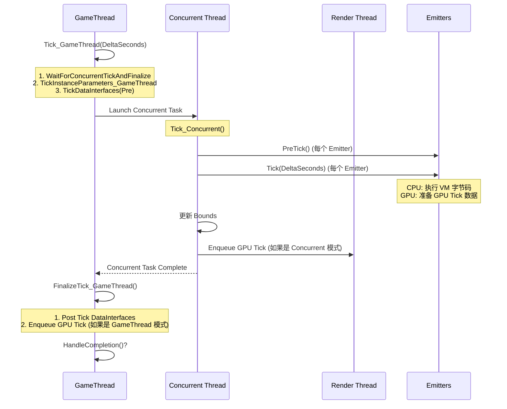
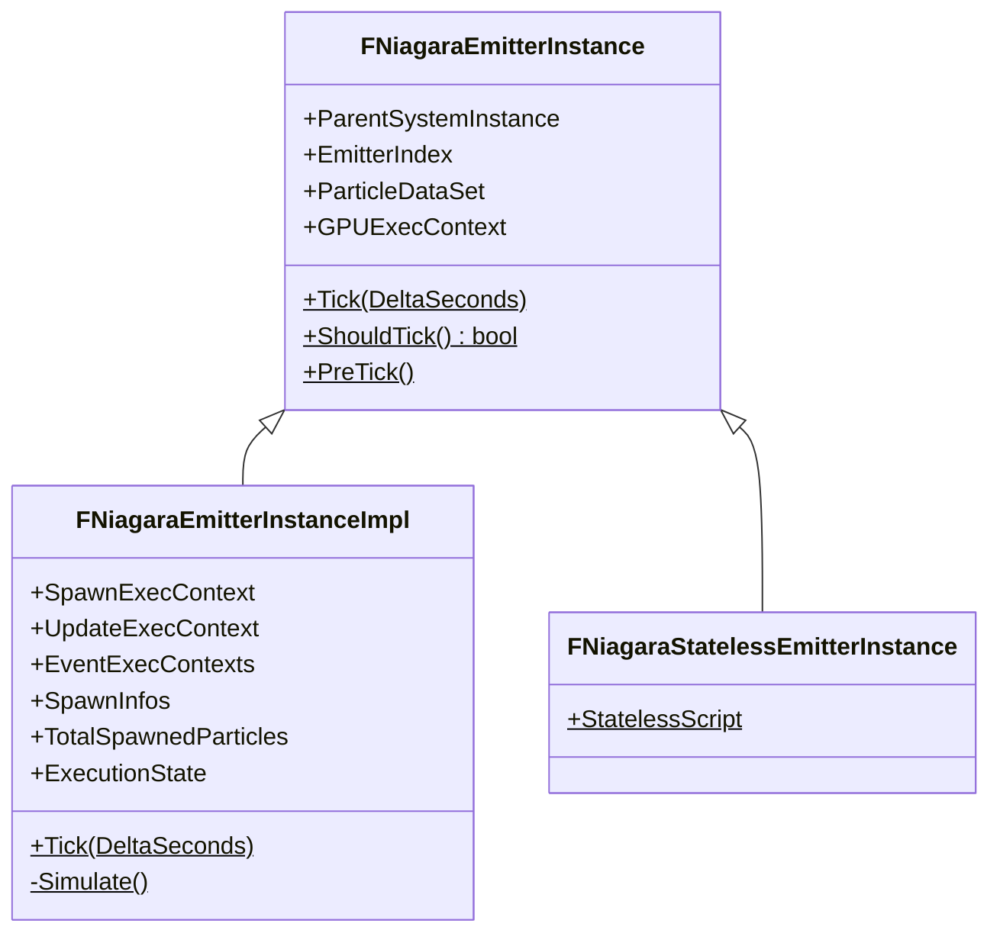
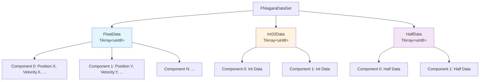
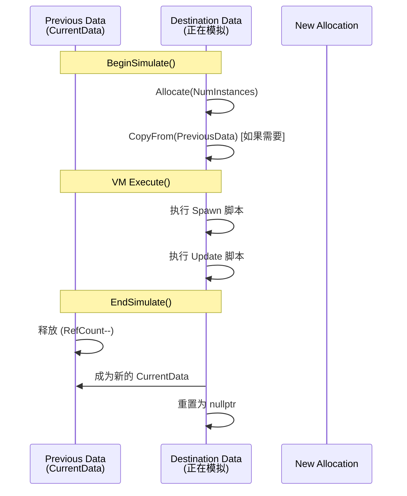
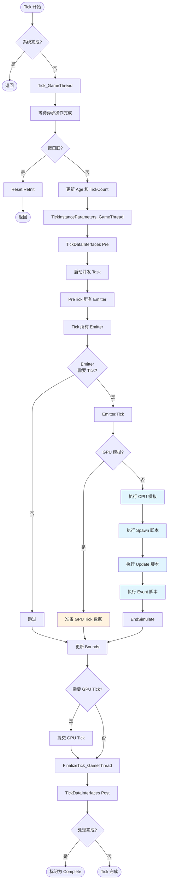

# NiagaraCPU粒子模拟流程深度分析

> **源码版本**: UE 5.7  
> **分析日期**: 2026-05-17  
> **核心文件**: NiagaraSystemInstance.cpp, NiagaraEmitterInstanceImpl.cpp, NiagaraDataSet.h

## 目录

1. [FNiagaraSystemInstance（系统实例）](#1-fniagarasysteminstance系统实例)
2. [FNiagaraEmitterInstance（发射器实例）](#2-fniagaraemitterinstance发射器实例)
3. [FNiagaraDataSet（数据集）](#3-fniagaradataset数据集)
4. [CPU 模拟 Tick 流程](#4-cpu-模拟-tick-流程)

---

## 1. FNiagaraSystemInstance（系统实例）

### 1.1 类概述

`FNiagaraSystemInstance` 是 Niagara 系统在运行时的核心实例对象，负责管理整个 System 的生命周期和 Tick 流程。

**源码位置**: `Engine/Plugins/FX/Niagara/Source/Niagara/Private/NiagaraSystemInstance.cpp`

**关键成员变量** (行 108-149):

```cpp
FNiagaraSystemInstance::FNiagaraSystemInstance(UWorld& InWorld, UNiagaraSystem& InSystem, ...)
    : TickBehavior(InTickBehavior)
      , SystemInstanceIndex(INDEX_NONE)
      , SignificanceIndex(INDEX_NONE)
      , World(&InWorld)
      , System(&InSystem)
      , OverrideParameters(InOverrideParameters)
      , AttachComponent(InAttachComponent)
      , Age(0.0f)
      , LastRenderTime(0.0f)
      , TickCount(0)
      , RandomSeed(0)
      , LODDistance(0.0f)
      , MaxLODDistance(FLT_MAX)
      , bSolo(false)
      , bForceSolo(false)
      // ... 其他成员初始化
```

### 1.2 系统实例生命周期

```mermaid
stateDiagram-v2
    [*] --> Inactive: 创建 FNiagaraSystemInstance
    Inactive --> Active: Activate() / SetRequestedExecutionState(Active)
    Active --> Inactive: Deactivate() / SetRequestedExecutionState(Inactive)
    Inactive --> Complete: 自然结束 / SetRequestedExecutionState(Complete)
    Active --> Complete: 系统完成 / 所有 Emitter 完成
    Complete --> Inactive: Reset(EResetMode::ReInit)
    Inactive --> Disabled: SetRequestedExecutionState(Disabled)
    Disabled --> [*]: Cleanup()
    
    note right of Active
        Tick_GameThread() 
        -> Tick_Concurrent()
        -> FinalizeTick_GameThread()
    end note
```

### 1.3 Tick 流程详解

#### 1.3.1 Tick_GameThread（游戏线程 Tick）

**源码位置**: `NiagaraSystemInstance.cpp:2562`

```cpp
void FNiagaraSystemInstance::Tick_GameThread(float DeltaSeconds)
{
    SCOPE_CYCLE_COUNTER(STAT_NiagaraSystemInst_TickGT);
    
    // 1. 等待异步操作完成
    WaitForConcurrentTickAndFinalize(true);
    
    // 2. 检查附加组件是否有效
    if (GetAttachComponent() == nullptr)
    {
        Complete(true);
        return;
    }
    
    // 3. 检查接口是否需要重新绑定
    if (OverrideParameters->GetInterfacesDirty())
    {
        Reset(EResetMode::ReInit);
        return;
    }
    
    // 4. 更新年龄和 Tick 计数
    CachedDeltaSeconds = DeltaSeconds;
    Age += DeltaSeconds;
    TickCount += 1;
    
    // 5. 更新实例参数（游戏线程部分）
    TickInstanceParameters_GameThread(DeltaSeconds);
    
    // 6. Tick Data Interfaces（前置）
    TickDataInterfaces(DeltaSeconds, false);
}
```

#### 1.3.2 Tick_Concurrent（并发线程 Tick）

**源码位置**: `NiagaraSystemInstance.cpp:2626`

这是实际执行 Emitter Tick 的核心函数：

```cpp
void FNiagaraSystemInstance::Tick_Concurrent(bool bEnqueueGPUTickIfNeeded)
{
    SCOPE_CYCLE_COUNTER(STAT_NiagaraSystemInst_TickCNC);
    
    // [1] 重置 GPU 相关计数
    TotalGPUParamSize = 0;
    ActiveGPUEmitterCount = 0;
    
    // [2] 获取 Emitter 执行顺序并确定哪些需要 Tick
    const TConstArrayView<FNiagaraEmitterExecutionIndex> EmitterExecutionOrder = GetEmitterExecutionOrder();
    
    TBitArray<TInlineAllocator<8>> EmittersShouldTick;
    for (const FNiagaraEmitterExecutionIndex& EmitterExecIdx : EmitterExecutionOrder)
    {
        const FNiagaraEmitterInstance& Emitter = Emitters[EmitterExecIdx.EmitterIndex].Get();
        if (Emitter.ShouldTick())
        {
            EmittersShouldTick.SetRange(EmitterExecIdx.EmitterIndex, 1, true);
        }
    }
```
依次执行 PreTick 和 Tick，同时收集 GPU Emitter 所需的参数缓冲区大小：
```cpp
    // [3] 执行 PreTick 和 Tick
    for (const FNiagaraEmitterExecutionIndex& EmitterExecIdx : EmitterExecutionOrder)
    {
        if (EmittersShouldTick[EmitterExecIdx.EmitterIndex])
        {
            FNiagaraEmitterInstance& Emitter = Emitters[EmitterExecIdx.EmitterIndex].Get();
            Emitter.PreTick();
        }
    }
    
    for (const FNiagaraEmitterExecutionIndex& EmitterExecIdx : EmitterExecutionOrder)
    {
        FNiagaraEmitterInstance& Emitter = Emitters[EmitterExecIdx.EmitterIndex].Get();
        if (EmittersShouldTick[EmitterExecIdx.EmitterIndex])
        {
            Emitter.Tick(CachedDeltaSeconds);
        }
        
        if (!Emitter.IsComplete() && Emitter.GetSimTarget() == ENiagaraSimTarget::GPUComputeSim)
        {
            // ... 计算 GPU 参数缓冲区大小
        }
    }
```
更新局部边界框，并在并发模式下生成 GPU Tick：
```cpp
    // [4] 更新局部边界框并提交 GPU Tick
    // ... 计算 LocalBounds
    
    if (Mode == ENiagaraGPUTickHandlingMode::Concurrent)
    {
        GenerateAndSubmitGPUTick();
    }
}
```

#### 1.3.3 FinalizeTick_GameThread（游戏线程收尾）

**源码位置**: `NiagaraSystemInstance.cpp:2805`

```cpp
void FNiagaraSystemInstance::FinalizeTick_GameThread(bool bEnqueueGPUTickIfNeeded)
{
    // 1. 确保并发工作完成
    check(ConcurrentTickGraphEvent == nullptr || ConcurrentTickGraphEvent->IsComplete());
    ConcurrentTickGraphEvent = nullptr;
    
    // 2. Post Tick Data Interfaces
    TickDataInterfaces(CachedDeltaSeconds, true);
    
    // 3. 提交 GPU Tick（如果需要）
    if (Mode == ENiagaraGPUTickHandlingMode::GameThread)
    {
        GenerateAndSubmitGPUTick();
    }
    
    // 4. 处理延迟 Reset
    if (DeferredResetMode != EResetMode::None)
    {
        Reset(DeferredResetMode);
    }
}
```

### 1.4 Tick 时序图



---

## 2. FNiagaraEmitterInstance（发射器实例）

### 2.1 类层次结构



### 2.2 Emitter Tick 流程

**源码位置**: `NiagaraEmitterInstanceImpl.cpp:1208`

```cpp
void FNiagaraEmitterInstanceImpl::Tick(float DeltaSeconds)
{
    SCOPE_CYCLE_COUNTER(STAT_NiagaraTick);
    
    // [1] 检查完成状态与 InactiveClear
    if (HandleCompletion())
    {
        return;
    }
    
    FNiagaraDataSet& Data = *ParticleDataSet;
    EmitterAge += DeltaSeconds;
    
    if (ExecutionState == ENiagaraExecutionState::InactiveClear)
    {
        if (GPUExecContext)
        {
            GPUExecContext->Reset(ComputeDispatchInterfacePtr.Get());
        }
        Data.ResetBuffers();
        ExecutionState = ENiagaraExecutionState::Inactive;
        return;
    }
```
处理事件生成数据并计算常规 Spawn 数量：
```cpp
    // [2] 处理事件生成与常规 Spawn 计数
    if (EventInstanceData.IsValid())
    {
        for (int32 i = 0; i < NumEventHandlers; i++)
        {
            FNiagaraDataSet* EventSet = ParentSystemInstance->GetEventDataSet(...);
            Info.SetEventData(&EventSet->GetCurrentDataChecked());
            uint32 EventSpawnNum = CalculateEventSpawnCount(...);
        }
    }
    
    uint32 SpawnTotal = 0;
    if (ExecutionState == ENiagaraExecutionState::Active && bAllowSpawning_CNC)
    {
        for (FNiagaraSpawnInfo& Info : SpawnInfos)
        {
            if (Info.Count > 0)
            {
                SpawnTotal += Info.Count;
            }
        }
    }
```
分配缓冲区并根据 SimTarget 分派到 CPU 或 GPU 模拟：
```cpp
    // [3] 分配缓冲区并分派模拟
    int32 RequiredSize = OrigNumParticles + SpawnTotal + EventSpawnTotal;
    int32 AllocationSize = FMath::Max<int32>(AllocationEstimate, RequiredSize);
    AllocationSize = (int32)FMath::Min((uint32)AllocationSize, MaxInstanceCount);
    
    if (EmitterData->SimTarget == ENiagaraSimTarget::GPUComputeSim)
    {
        // GPU 模拟 - 准备 GPU Tick 数据（详见 GPU 模拟文档）
    }
    else
    {
        Tick_CPU(DeltaSeconds, AllocationSize, SpawnTotal, EventSpawnTotal);
    }
}
```

### 2.3 CPU 粒子模拟详细流程

```cpp
void FNiagaraEmitterInstanceImpl::Tick_CPU(float DeltaSeconds, int32 AllocationSize, uint32 SpawnTotal, int32 EventSpawnTotal)
{
    FNiagaraDataSet& Data = *ParticleDataSet;
    
    // [1] 开始模拟并分配缓冲区
    Data.BeginSimulate();
    Data.Allocate(AllocationSize);
```
执行 Spawn 脚本初始化新粒子，然后执行 Update 脚本更新现有粒子：
```cpp
    // [2] 执行 Spawn 脚本（新粒子）
    if (SpawnTotal > 0 || EventSpawnTotal > 0)
    {
        SpawnExecContext.BindData(0, Data, 0, true);
        FScriptExecutionConstantBufferTable SpawnConstantBufferTable;
        BuildConstantBufferTable(SpawnExecContext, SpawnConstantBufferTable);
        SpawnExecContext.Execute(ParentSystemInstance, DeltaSeconds, NumToSpawn, SpawnConstantBufferTable);
    }
    
    // [3] 执行 Update 脚本（现有粒子）
    if (OrigNumParticles > 0)
    {
        Data.GetDestinationDataChecked().SetNumInstances(OrigNumParticles);
        UpdateExecContext.BindData(0, Data, 0, true);
        FScriptExecutionConstantBufferTable UpdateConstantBufferTable;
        BuildConstantBufferTable(UpdateExecContext, UpdateConstantBufferTable);
        UpdateExecContext.Execute(ParentSystemInstance, DeltaSeconds, OrigNumParticles, UpdateConstantBufferTable);
    }
```
处理事件脚本，结束模拟并交换双缓冲：
```cpp
    // [4] 执行 Event 脚本并结束模拟
    for (FNiagaraScriptExecutionContext& EventContext : GetEventExecutionContexts())
    {
        // 处理事件生成
    }
    
    Data.EndSimulate();
    PostTick();
}
```

### 2.4 粒子生成和销毁

#### 粒子生成 (Spawn)

```cpp
// 计算需要生成的粒子数量
uint32 FNiagaraEmitterInstanceImpl::CalculateSpawnCount()
{
    uint32 SpawnTotal = 0;
    
    // 从 SpawnInfos 计算
    for (FNiagaraSpawnInfo& Info : SpawnInfos)
    {
        if (Info.Count > 0)
        {
            SpawnTotal += Info.Count;
        }
    }
    
    // 从事件计算
    if (EventInstanceData.IsValid())
    {
        for (int32 i = 0; i < NumEventHandlers; i++)
        {
            uint32 EventSpawnNum = CalculateEventSpawnCount(...);
            EventInstanceData->EventSpawnTotal += EventSpawnNum;
        }
    }
    
    return SpawnTotal;
}
```

#### 粒子销毁 (Death)

粒子销毁发生在 Update 脚本执行期间，通过 VM 指令设置粒子的 `Alive` 标志为 false：

```cpp
// 在 VM 执行期间
// 粒子数据存储在 FNiagaraDataBuffer 中
// 每个粒子是一个实例，包含多个变量（位置、速度、生命周期等）

// 销毁粒子时：
// 1. 设置 Alive = false
// 2. 在 EndSimulate() 期间或下一帧 BeginSimulate() 期间
//    死粒子被移除，ID 被回收
```

---

## 3. FNiagaraDataSet（数据集）

### 3.1 SOA (Structure of Arrays) 布局

`FNiagaraDataSet` 使用 SOA 布局存储粒子数据，将数据按组件类型分为三个独立缓冲区：



**源码位置**: `NiagaraDataSet.h:213-217`

```cpp
/** Float components of simulation data. */
TArray<uint8> FloatData;
/** Int32 components of simulation data. */
TArray<uint8> Int32Data;
/** Half components of simulation data. */
TArray<uint8> HalfData;
```

### 3.2 数据访问接口

**获取实例数据指针** (`NiagaraDataSet.h:136-142`):

```cpp
// 获取浮点组件数据指针
inline float* GetInstancePtrFloat(uint32 ComponentIdx, uint32 InstanceIdx)
{ 
    return (float*)(GetComponentPtrFloat(ComponentIdx)) + InstanceIdx; 
}

// 获取整数组件数据指针
inline int32* GetInstancePtrInt32(uint32 ComponentIdx, uint32 InstanceIdx)
{ 
    return (int32*)(GetComponentPtrInt32(ComponentIdx)) + InstanceIdx; 
}

// 获取半精度组件数据指针
inline FFloat16* GetInstancePtrHalf(uint32 ComponentIdx, uint32 InstanceIdx)
{ 
    return (FFloat16*)(GetComponentPtrHalf(ComponentIdx)) + InstanceIdx; 
}
```

### 3.3 FNiagaraDataBuffer 详解

`FNiagaraDataBuffer` 是实际存储粒子数据帧的对象：

**源码位置**: `NiagaraDataSet.h:86-260`

**关键成员**:

```cpp
class FNiagaraDataBuffer : public FNiagaraSharedObject
{
    /** Back ptr to our owning data set. */
    FNiagaraDataSet* Owner;
    
    // CPU Data
    TArray<uint8> FloatData;      // 浮点数据缓冲区
    TArray<uint8> Int32Data;      // 32位整数数据缓冲区
    TArray<uint8> HalfData;       // 16位浮点数据缓冲区
    TArray<int32> IDToIndexTable; // ID 到索引的映射表
    
    // GPU Data (仅 GPU 模拟使用)
    FRWBuffer GPUBufferFloat;       // GPU 浮点缓冲区
    FRWBuffer GPUBufferInt;         // GPU 整数缓冲区
    FRWBuffer GPUBufferHalf;        // GPU 半精度缓冲区
    FRWBuffer GPUIDToIndexTable;    // GPU ID 映射表
    
    // 实例计数
    uint32 NumInstances;            // 当前实例数量
    uint32 NumInstancesAllocated;  // 已分配的实例数量
    
    // 跨步 (Stride)
    uint32 FloatStride;   // 浮点组件跨步
    uint32 Int32Stride;   // 整数组件跨步
    uint32 HalfStride;    // 半精度组件跨步
};
```

### 3.4 双缓冲机制

Niagara 使用双缓冲（或三缓冲）机制来支持并发读写：



**源码** (`NiagaraDataSet.h:279-291`):

```cpp
// 开始模拟 - 获取目标缓冲区
FNiagaraDataBuffer& FNiagaraDataSet::BeginSimulate(bool bResetDestinationData)
{
    // 找到一个空闲的缓冲区
    for (FNiagaraDataBuffer* Buffer : Data)
    {
        if (!Buffer->IsInUse())
        {
            DestinationData = Buffer;
            break;
        }
    }
    
    // 如果没找到，分配新缓冲区
    if (DestinationData == nullptr)
    {
        DestinationData = new FNiagaraDataBuffer(this);
        Data.Add(DestinationData);
    }
    
    return *DestinationData;
}

// 结束模拟 - 交换缓冲区
void FNiagaraDataSet::EndSimulate(bool SetCurrentData)
{
    if (SetCurrentData)
    {
        // 交换 CurrentData 和 DestinationData
        FNiagaraDataBuffer* OldCurrent = CurrentData;
        CurrentData = DestinationData;
        DestinationData = nullptr;
        
        // 释放旧数据（如果不在使用中）
        if (OldCurrent && !OldCurrent->IsInUse())
        {
            // 可以重用
        }
    }
}
```

---

## 4. CPU 模拟 Tick 流程

### 4.1 完整 Tick 流程图



### 4.2 VM 字节码执行

CPU 模拟的核心是 Vector VM（虚拟机），它执行编译后的 Niagara 脚本字节码。

**执行上下文** (`FNiagaraScriptExecutionContext`):

```cpp
bool FNiagaraScriptExecutionContext::Execute(
    FNiagaraSystemInstance* SystemInstance,
    float DeltaSeconds,
    int32 NumInstances,
    const FScriptExecutionConstantBufferTable& ConstantBufferTable)
{
    // 1. 获取 VM 可执行数据
    const FNiagaraVMExecutableData& ExecData = Script->GetVMExecutableData();
    
    // 2. 绑定数据到寄存器
    BindDataToRegisters(...);
    
    // 3. 执行字节码
    for (int32 InstructionIndex = 0; InstructionIndex < ExecData.ByteCode.Num(); )
    {
        uint8 OpCode = ExecData.ByteCode[InstructionIndex];
        
        switch (OpCode)
        {
            case ENiagaraVMExecOp::Add_F:
                // 浮点加法
                break;
            case ENiagaraVMExecOp::Mul_F:
                // 浮点乘法
                break;
            // ... 其他操作码
        }
    }
    
    // 4. 调用外部函数（Data Interface 等）
    for (const FVMExternalFunctionBindingInfo& Binding : ExecData.CalledVMExternalFunctions)
    {
        Binding.ExternaFunction(...);
    }
    
    return true;
}
```

### 4.3 Vector VM 优化

Niagara 的 VM 使用 SIMD (Single Instruction Multiple Data) 优化，一次处理多个粒子：

```cpp
// 定义向量宽度（通常是 4 或 8，取决于平台）
#define NIAGARA_VECTOR_WIDTH 4
#define NIAGARA_VECTOR_WIDTH_BYTES (NIAGARA_VECTOR_WIDTH * sizeof(float))

// 在分配缓冲区时对齐到向量宽度
inline int32 GetSafeComponentBufferSize(int32 RequiredSize) const
{
    // 对齐到 VECTOR_WIDTH_BYTES
    return Align(RequiredSize, VECTOR_WIDTH_BYTES) + VECTOR_WIDTH_BYTES;
}
```

### 4.4 性能优化要点

1. **SOA 布局**: 提高缓存命中率，便于 SIMD 优化
2. **双缓冲**: 允许并发读取和写入
3. **ID 池**: 重用死粒子的 ID，避免频繁分配
4. **批量执行**: 一次 VM 执行处理多个粒子

```cpp
// 示例：批量处理粒子更新
void ProcessParticlesInBatch(FNiagaraDataBuffer& Buffer, int32 NumInstances)
{
    const int32 VectorWidth = 4;  // SSE/NEON 宽度
    
    // 处理完整向量
    for (int32 i = 0; i < NumInstances; i += VectorWidth)
    {
        // 加载 4 个粒子的位置
        float* PosX = Buffer.GetInstancePtrFloat(PosXComponent, i);
        float* PosY = Buffer.GetInstancePtrFloat(PosYComponent, i);
        float* PosZ = Buffer.GetInstancePtrFloat(PosZComponent, i);
        
        // SIMD 操作更新位置
        // ...
    }
}
```

---

## 5. 总结

### 5.1 CPU 模拟关键路径

```
Tick_GameThread()
  -> Tick_Concurrent() [并发线程]
    -> Emitter.PreTick()
    -> Emitter.Tick()
      -> DataSet.BeginSimulate()
      -> SpawnExecContext.Execute()  // VM 执行
      -> UpdateExecContext.Execute() // VM 执行
      -> DataSet.EndSimulate()
    -> 更新 Bounds
  -> FinalizeTick_GameThread()
    -> 提交 GPU Tick（如需要）
```

### 5.2 关键源码文件索引

| 文件 | 路径 | 核心类/函数 |
|-----|------|--------------|
| NiagaraSystemInstance.cpp | `.../Private/NiagaraSystemInstance.cpp` | `FNiagaraSystemInstance::Tick_GameThread()` (L2562) |
| | | `FNiagaraSystemInstance::Tick_Concurrent()` (L2626) |
| | | `FNiagaraSystemInstance::FinalizeTick_GameThread()` (L2805) |
| NiagaraEmitterInstanceImpl.cpp | `.../Private/NiagaraEmitterInstanceImpl.cpp` | `FNiagaraEmitterInstanceImpl::Tick()` (L1208) |
| NiagaraDataSet.h | `.../Classes/NiagaraDataSet.h` | `FNiagaraDataSet` (L267) |
| | | `FNiagaraDataBuffer` (L86) |
| NiagaraScriptExecutionContext.cpp | `.../Private/NiagaraScriptExecutionContext.cpp` | `FNiagaraScriptExecutionContext::Execute()` |

---

**文档版本**: 1.0  
**最后更新**: 2026-05-17  
**作者**: AI (CodeBuddy)

<!-- nav:auto -->

---

**导航**: ← [[30-tutorials/niagara/03-Niagara脚本与模块系统深度分析|03-Niagara脚本与模块系统深度分析]] · [[30-tutorials/niagara/05-NiagaraGPU粒子模拟流程深度分析|05-NiagaraGPU粒子模拟流程深度分析]] →

<!-- /nav:auto -->
