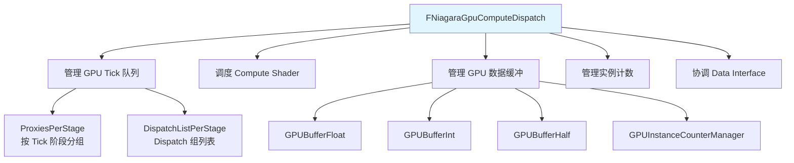
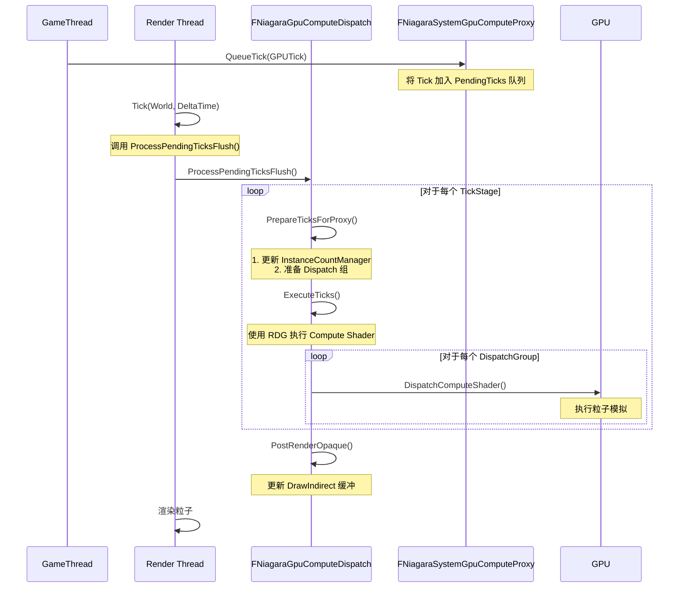
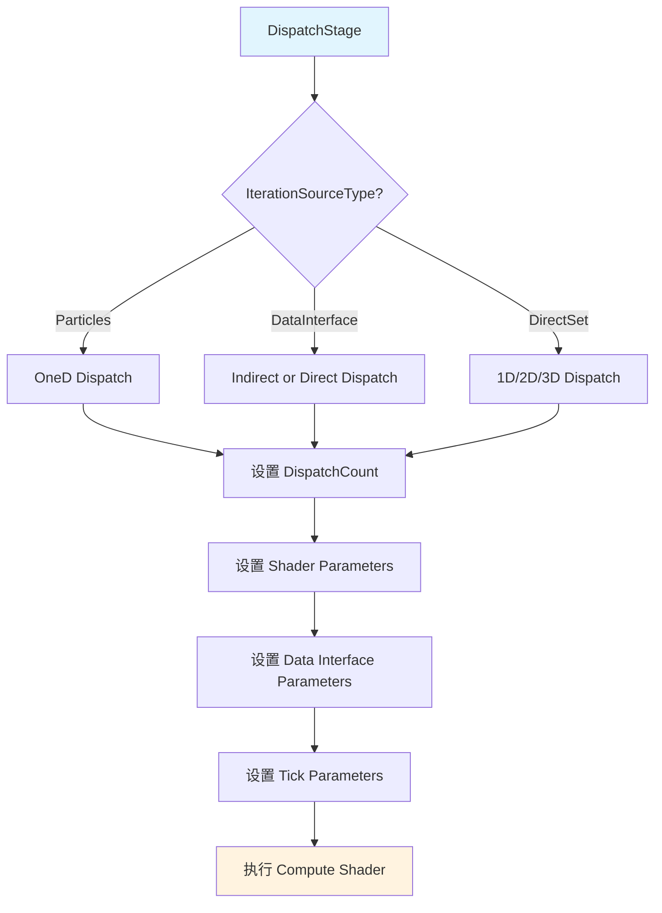
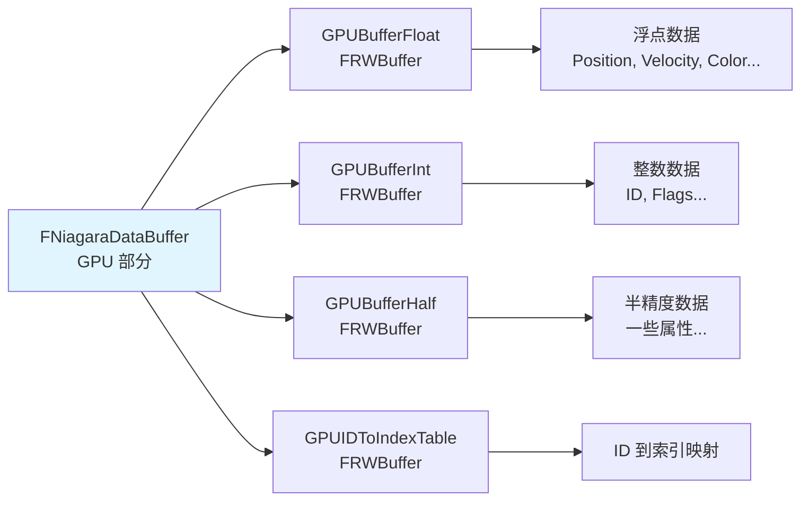
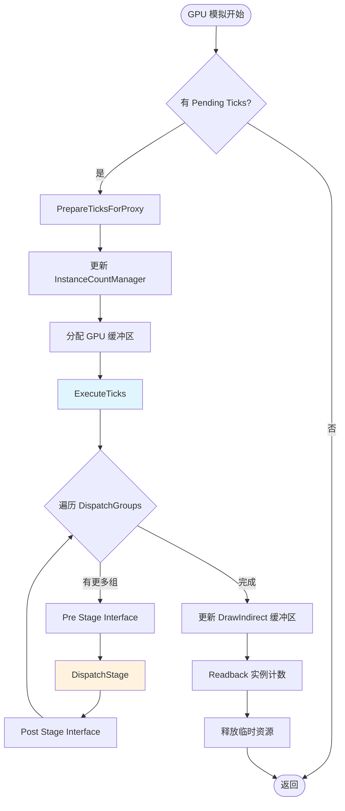

# NiagaraGPU粒子模拟流程深度分析

> **源码版本**: UE 5.7  
> **分析日期**: 2026-05-17  
> **核心文件**: NiagaraGpuComputeDispatch.cpp, NiagaraGpuComputeDispatch.h, NiagaraGPUSystemTick.h

## 目录

1. [FNiagaraGpuComputeDispatch（GPU 调度）](#1-fniagaragpucomputedispatchgpu-调度)
2. [FNiagaraGPUSystemTick（GPU Tick）](#2-fniagaragpusystemtickgpu-tick)
3. [Compute Shader 调度](#3-compute-shader-调度)
4. [GPU 数据缓冲管理](#4-gpu-数据缓冲管理)

---

## 1. FNiagaraGpuComputeDispatch（GPU 调度）

### 1.1 类概述

`FNiagaraGpuComputeDispatch` 是 Niagara GPU 模拟的核心调度类，负责在渲染线程上调度和执行所有 GPU 粒子模拟的 Compute Shader。

**源码位置**: 
- 头文件: `Engine/Plugins/FX/Niagara/Source/Niagara/Public/NiagaraGpuComputeDispatch.h`
- 实现文件: `Engine/Plugins/FX/Niagara/Source/Niagara/Private/NiagaraGpuComputeDispatch.cpp`

**核心职责**:



### 1.2 GPU 调度机制

#### 1.2.1 Tick 阶段 (ENiagaraGpuComputeTickStage)

Niagara GPU 模拟分为多个 Tick 阶段，每个阶段在不同的渲染时机执行：

| 阶段 | 枚举值 | 执行时机 |
|------|---------|----------|
| PreInitViews | 0 | 在 InitViews 之前 |
| PostInitViews | 1 | 在 InitViews 之后 |
| PostOpaqueRender | 2 | 在不透明渲染之后 |
| Max | 3 | 阶段数量上限 |

#### 1.2.2 Proxy 注册和 Tick 提交流程

**Proxy 注册** (`NiagaraGpuComputeDispatch.cpp:262`):

```cpp
void FNiagaraGpuComputeDispatch::AddGpuComputeProxy(FNiagaraSystemGpuComputeProxy* ComputeProxy)
{
    // 1. 根据 TickStage 将 Proxy 分配到对应阶段
    const ENiagaraGpuComputeTickStage::Type TickStage = ComputeProxy->GetComputeTickStage();
    ComputeProxy->ComputeDispatchIndex = ProxiesPerStage[TickStage].Num();
    ProxiesPerStage[TickStage].Add(ComputeProxy);
    
    // 2. 更新特性需求计数
    NumProxiesThatRequireGlobalDistanceField += ComputeProxy->RequiresGlobalDistanceField() ? 1 : 0;
    NumProxiesThatRequireDepthBuffer += ComputeProxy->RequiresDepthBuffer() ? 1 : 0;
    // ...
}
```

**Tick 提交** (游戏线程 → 渲染线程):

```cpp
// 游戏线程：提交 GPU Tick
void FNiagaraSystemInstance::GenerateAndSubmitGPUTick()
{
    if (NeedsGPUTick())
    {
        FNiagaraGPUSystemTick GPUTick;
        InitGPUTick(GPUTick);
        
        // 将 Tick 提交到渲染线程
        ENQUEUE_RENDER_COMMAND(FNiagaraGiveSystemInstanceTickToRT)(
            [RT_Proxy=SystemGpuComputeProxy.Get(), GPUTick](FRHICommandListImmediate& RHICmdList) mutable
            {
                RT_Proxy->QueueTick(GPUTick);
            }
        );
    }
}
```

### 1.3 Tick 处理流程



#### 1.3.1 ProcessPendingTicksFlush

**源码位置**: `NiagaraGpuComputeDispatch.cpp:384`

```cpp
void FNiagaraGpuComputeDispatch::ProcessPendingTicksFlush(FRHICommandListImmediate& RHICmdList, bool bForceFlush)
{
    // [1] 检查是否有 Proxies
    bool bHasProxies = false;
    for (int iTickStage=0; iTickStage < ENiagaraGpuComputeTickStage::Max; ++iTickStage)
    {
        if (ProxiesPerStage[iTickStage].Num() > 0)
        {
            bHasProxies = true;
            break;
        }
    }
    
    if (!bHasProxies)
    {
        return;
    }
```
检查是否需要强制 Flush（基于帧数或挂起 Tick 数量阈值）：
```cpp
    // [2] 检查是否需要强制 Flush
    ++FramesBeforeTickFlush;
    bForceFlush |= FramesBeforeTickFlush >= uint32(GNiagaraTickFlushMaxQueuedFrames);
    
    int32 MaxPendingTicks = 0;
    for (int iTickStage = 0; iTickStage < ENiagaraGpuComputeTickStage::Max; ++iTickStage)
    {
        for (FNiagaraSystemGpuComputeProxy* Proxy : ProxiesPerStage[iTickStage])
        {
            MaxPendingTicks = FMath::Max<int32>(MaxPendingTicks, Proxy->PendingTicks.Num());
        }
    }
    bForceFlush |= MaxPendingTicks >= TickFlushMaxPendingTicks;
    
    if (!bForceFlush)
    {
        return;
    }
```
根据配置模式处理 Pending Ticks（保持队列、虚拟 View 处理、或丢弃）：
```cpp
    // [3] 根据模式处理 Pending Ticks
    FramesBeforeTickFlush = 0;
    switch (GNiagaraTickFlushMode)
    {
        case 0:
            break;
            
        case 1:
            {
                FSceneViewFamilyContext ViewFamily(...);
                FSceneViewInitOptions ViewInitOptions;
                GetRendererModule().CreateAndInitSingleView(RHICmdList, &ViewFamily, &ViewInitOptions);
                
                for (int32 iTickBatch = 0; iTickBatch < MaxPendingTicks; iTickBatch += MaxTicksToFlush)
                {
                    FRDGBuilder GraphBuilder(RHICmdList);
                    GraphBuilder.Execute();
                }
            }
            break;
            
        case 2:
            FinishDispatches();
            break;
    }
}
```

---

## 2. FNiagaraGPUSystemTick（GPU Tick）

### 2.1 Tick 数据结构

`FNiagaraGPUSystemTick` 封装了一次 GPU 模拟所需的所有数据。

**源码位置**: `Engine/Plugins/FX/Niagara/Source/Niagara/Public/NiagaraGPUSystemTick.h`

**核心结构**:

```cpp
struct FNiagaraGPUSystemTick
{
    // 系统实例 ID
    uint64 SystemInstanceID;
    
    // 系统实例指针（游戏线程对象）
    FNiagaraSystemInstance* SystemInstance;
    
    // GPU Compute Proxy
    FNiagaraSystemGpuComputeProxy* SystemGpuComputeProxy;
    
    // 需要模拟的 Emitter 实例数据
    TArray<FNiagaraComputeInstanceData> Instances;
    
    // Data Interface 实例数据
    FNiagaraDIPerInstanceData* DIInstanceData;
    
    // 初始化 Tick 数据
    void Init(FNiagaraSystemInstance* InSystemInstance);
    
    // 构建统一缓冲区
    void BuildUniformBuffers();
    
    // 获取参数
    void GetGlobalParameters(const FNiagaraComputeInstanceData& InstanceData, FNiagaraGlobalParameters* OutParameters);
    void GetSystemParameters(const FNiagaraComputeInstanceData& InstanceData, FNiagaraSystemParameters* OutParameters);
    void GetOwnerParameters(const FNiagaraComputeInstanceData& InstanceData, FNiagaraOwnerParameters* OutParameters);
    void GetEmitterParameters(const FNiagaraComputeInstanceData& InstanceData, FNiagaraEmitterParameters* OutParameters);
};
```

### 2.2 FNiagaraComputeInstanceData

每个需要 GPU 模拟的 Emitter 对应一个 `FNiagaraComputeInstanceData`：

```cpp
struct FNiagaraComputeInstanceData
{
    // Compute Execution Context
    FNiagaraComputeExecutionContext* Context;
    
    // 是否需要 Reset 数据
    bool bResetData;
    
    // Spawn 信息
    FNiagaraGpuSpawnInfo SpawnInfo;
    
    // 模拟阶段信息
    TArray<FPerStageInfo> PerStageInfo;
    
    // 总 Dispatch 数量
    uint32 TotalDispatches;
};
```

### 2.3 GPU Tick 初始化流程

**源码位置**: `NiagaraSystemInstance.cpp:2885`

```cpp
void FNiagaraSystemInstance::InitGPUTick(FNiagaraGPUSystemTick& OutTick)
{
    SCOPE_CYCLE_COUNTER(STAT_NiagaraInitGPUSystemTick);
    check(SystemGpuComputeProxy.IsValid());
    
    // 1. 初始化 Tick 数据
    OutTick.Init(this);
    
    // 2. 填充 Emitter 实例数据
    for (FNiagaraEmitterInstanceRef& EmitterRef : Emitters)
    {
        FNiagaraEmitterInstance* Emitter = EmitterRef.Get();
        
        if (Emitter->GetSimTarget() == ENiagaraSimTarget::GPUComputeSim)
        {
            FNiagaraComputeInstanceData InstanceData;
            InstanceData.Context = Emitter->GetGPUContext();
            InstanceData.bResetData = (Emitter->GetExecutionState() == ENiagaraExecutionState::Active && Emitter->IsFirstTick());
            
            // 填充 Spawn 信息
            // 填充 Simulation Stage 信息
            // ...
            
            OutTick.Instances.Add(MoveTemp(InstanceData));
        }
    }
    
    // 3. 构建统一缓冲区
    OutTick.BuildUniformBuffers();
}
```

---

## 3. Compute Shader 调度

### 3.1 DispatchStage 函数

`DispatchStage()` 是实际执行 Compute Shader 的函数。

**源码位置**: `NiagaraGpuComputeDispatch.cpp:1463`



### 3.2 Shader 参数设置

**关键参数结构** (`FNiagaraShader::FParameters`):

```cpp
struct FParameters
{
    // 实例计数缓冲区
    FShaderResourceParameter RWInstanceCounts;
    
    // 输入粒子数据
    FShaderResourceParameter InputFloat;
    FShaderResourceParameter InputHalf;
    FShaderResourceParameter InputInt;
    
    // 输出粒子数据
    FShaderResourceParameter RWOutputFloat;
    FShaderResourceParameter RWOutputHalf;
    FShaderResourceParameter RWOutputInt;
    
    // ID 映射表
    FShaderResourceParameter RWIDToIndexTable;
    
    // Spawn 信息
    TArray<FShaderParameter> EmitterSpawnInfoOffsets;
    TArray<FShaderParameter> EmitterSpawnInfoParams;
    
    // 模拟阶段信息
    FUintVector4 SimulationStageIterationInfo;
    
    // 全局参数
    FNiagaraGlobalParameters GlobalParameters;
    FNiagaraSystemParameters SystemParameters;
    FNiagaraOwnerParameters OwnerParameters;
    FNiagaraEmitterParameters EmitterParameters;
};
```

**参数绑定** (`NiagaraGpuComputeDispatch.cpp:1591`):

```cpp
void FNiagaraGpuComputeDispatch::DispatchStage(...)
{
    // [1] 获取 Shader 并分配参数结构
    const TShaderRef<FNiagaraShader> ComputeShader = InstanceData.Context->GPUScript_RT->GetShader(SimStageData.StageIndex);
    FNiagaraShader::FParameters* DispatchParameters = GraphBuilder.AllocParameters<FNiagaraShader::FParameters>();
```
设置实例计数和输入/输出 GPU 缓冲区绑定：
```cpp
    // [2] 设置实例计数与输入/输出缓冲区
    DispatchParameters->RWInstanceCounts = GPUInstanceCounterManager.GetInstanceCountBuffer().UAV;
    DispatchParameters->ReadInstanceCountOffset = SimStageData.SourceCountOffset;
    DispatchParameters->WriteInstanceCountOffset = SimStageData.DestinationCountOffset;
    
    if (SimStageData.Source != nullptr)
    {
        DispatchParameters->InputFloat = SimStageData.Source->GetGPUBufferFloat().SRV;
        DispatchParameters->InputHalf = SimStageData.Source->GetGPUBufferHalf().SRV;
        DispatchParameters->InputInt = SimStageData.Source->GetGPUBufferInt().SRV;
    }
    
    if (SimStageData.Destination != nullptr)
    {
        DispatchParameters->RWOutputFloat = SimStageData.Destination->GetGPUBufferFloat().UAV;
        DispatchParameters->RWOutputHalf = SimStageData.Destination->GetGPUBufferHalf().UAV;
        DispatchParameters->RWOutputInt = SimStageData.Destination->GetGPUBufferInt().UAV;
    }
```
设置 Data Interface 和 Tick 级参数，最后提交到 RDG：
```cpp
    // [3] 设置 Data Interface / Tick 参数并提交 RDG Pass
    SetDataInterfaceParameters(GraphBuilder, Tick, InstanceData, ComputeShader, SimStageData, DispatchParameters);
    
    Tick.GetGlobalParameters(InstanceData, &DispatchParameters->GlobalParameters);
    Tick.GetSystemParameters(InstanceData, &DispatchParameters->SystemParameters);
    // ...
    
    GraphBuilder.AddPass(
        RDG_EVENT_NAME("Niagara::DispatchStage"),
        ShaderParametersMetadata,
        DispatchParameters,
        ERDGPassFlags::Compute,
        [ComputeShader, DispatchParameters](FRHICommandList& RHICmdList)
        {
            FComputeShaderUtils::Dispatch(RHICmdList, ComputeShader, DispatchParameters, DispatchCount);
        }
    );
}
```

### 3.3 线程组配置

Niagara GPU 模拟支持多种 Dispatch 类型：

```cpp
enum class ENiagaraGpuDispatchType
{
    OneD,    // 一维 Dispatch (粒子迭代)
    TwoD,    // 二维 Dispatch (Data Interface 迭代)
    ThreeD   // 三维 Dispatch (Data Interface 迭代)
};

// 默认线程组大小
static FIntVector GetDefaultThreadGroupSize(ENiagaraGpuDispatchType DispatchType)
{
    switch (DispatchType)
    {
        case ENiagaraGpuDispatchType::OneD:
            return FIntVector(64, 1, 1);  // 64 线程/组
        case ENiagaraGpuDispatchType::TwoD:
            return FIntVector(8, 8, 1);   // 8x8 线程/组
        case ENiagaraGpuDispatchType::ThreeD:
            return FIntVector(4, 4, 4);   // 4x4x4 线程/组
    }
}
```

---

## 4. GPU 数据缓冲管理

### 4.1 FNiagaraGPUInstanceCountManager

`FNiagaraGPUInstanceCountManager` 管理 GPU 粒子的实例计数缓冲区。

**功能**:
1. 管理实例计数缓冲区 (`InstanceCountBuffer`)
2. 提供 Draw Indirect 缓冲区更新
3. 管理实例计数的 Readback

**核心方法**:

```cpp
class FNiagaraGPUInstanceCountManager
{
public:
    // 调整缓冲区大小
    void ResizeBuffers(FRHICommandListImmediate& RHICmdList, uint32 RequiredSize);
    
    // 获取实例计数缓冲区
    FRWBuffer& GetInstanceCountBuffer() { return InstanceCountBuffer; }
    
    // 获取 Draw Indirect 缓冲区
    FRWBuffer& GetDrawIndirectBuffer() { return DrawIndirectBuffer; }
    
    // 更新 Draw Indirect 缓冲区
    void UpdateDrawIndirectBuffers(FNiagaraGpuComputeDispatch* Dispatcher, FRHICommandListImmediate& RHICmdList, ENiagaraGPUCountUpdatePhase::Type Phase);
    
    // 获取 Readback 数据
    const uint32* GetGPUReadback();
    
    // 释放 Readback 缓冲区
    void ReleaseGPUReadback();
    
private:
    // 实例计数缓冲区（GPU）
    FRWBuffer InstanceCountBuffer;
    
    // Draw Indirect 缓冲区（GPU）
    FRWBuffer DrawIndirectBuffer;
    
    // Readback 缓冲区（CPU 读取 GPU 数据）
    FReadbackBuffer ReadbackBuffer;
};
```

### 4.2 粒子数据缓冲（GPU）

每个 `FNiagaraDataBuffer` 在 GPU 上维护三个缓冲区：



**GPU 缓冲区分配** (`NiagaraDataSet.h:106`):

```cpp
void FNiagaraDataBuffer::AllocateGPU(FRHICommandListBase& RHICmdList, uint32 InNumInstances, ERHIFeatureLevel::Type FeatureLevel, const TCHAR* DebugSimName)
{
    // 计算缓冲区大小
    uint32 FloatBufferSize = InNumInstances * FloatStride * sizeof(float);
    uint32 IntBufferSize = InNumInstances * Int32Stride * sizeof(int32);
    uint32 HalfBufferSize = InNumInstances * HalfStride * sizeof(FFloat16);
    
    // 分配 GPU 缓冲区
    if (FloatBufferSize > 0)
    {
        GPUBufferFloat.Initialize(RHICmdList, TEXT("NiagaraGPUBufferFloat"), sizeof(float), FloatBufferSize / sizeof(float), PF_R32_FLOAT);
    }
    
    if (IntBufferSize > 0)
    {
        GPUBufferInt.Initialize(RHICmdList, TEXT("NiagaraGPUBufferInt"), sizeof(int32), IntBufferSize / sizeof(int32), PF_R32_SINT);
    }
    
    if (HalfBufferSize > 0)
    {
        GPUBufferHalf.Initialize(RHICmdList, TEXT("NiagaraGPUBufferHalf"), sizeof(FFloat16), HalfBufferSize / sizeof(FFloat16), PF_FloatRGBA);
    }
}
```

### 4.3 参数缓冲更新

GPU 模拟需要在每一帧更新参数缓冲区（Global、System、Emitter 参数）：

```cpp
void FNiagaraGPUSystemTick::BuildUniformBuffers()
{
    // 1. 构建 Global Parameters
    FNiagaraGlobalParameters GlobalParameters;
    // 填充引擎时间、DeltaTime、World 信息等
    
    // 2. 构建 System Parameters
    FNiagaraSystemParameters SystemParameters;
    // 填充系统年龄、Tick 计数等
    
    // 3. 构建 Owner Parameters
    FNiagaraOwnerParameters OwnerParameters;
    // 填充 Owner 位置、旋转等
    
    // 4. 构建 Emitter Parameters
    for (FNiagaraComputeInstanceData& InstanceData : Instances)
    {
        FNiagaraEmitterParameters EmitterParameters;
        // 填充 Emitter 年龄、Spawn 总数等
        
        // 创建 Uniform Buffer
        InstanceData.EmitterUniformBuffer = TUniformBufferRef<FNiagaraEmitterParameters>::CreateUniformBufferImmediate(EmitterParameters, UniformBuffer_MultiFrame);
    }
}
```

### 4.4 Free ID 管理

当使用 Persistent IDs 时，需要管理 Free ID 列表：

```cpp
// 在 Dispatch 完成后更新 Free IDs
void FNiagaraGpuComputeDispatch::UpdateFreeIDs(FRHICommandListImmediate& RHICmdList, FNiagaraComputeExecutionContext* ComputeContext)
{
    if (!ComputeContext->MainDataSet->RequiresPersistentIDs())
    {
        return;
    }
    
    // 1. 获取当前 Free ID 缓冲区
    FRWBuffer& GPUFreeIDs = ComputeContext->MainDataSet->GetGPUFreeIDs();
    
    // 2. 执行 Free ID 计算 Shader
    // 该 Shader 会遍历死粒子的 ID 并将其添加到 Free ID 列表
    
    // 3. 更新 ID 到索引的映射表
    FRWBuffer& GPUIDToIndexTable = ComputeContext->MainDataSet->GetGPUIDToIndexTable();
    // ...
}
```

---

## 5. GPU 模拟完整流程总结

### 5.1 流程图



### 5.2 关键源码文件索引

| 文件 | 路径 | 核心类/函数 |
|-----|------|--------------|
| NiagaraGpuComputeDispatch.cpp | `.../Private/NiagaraGpuComputeDispatch.cpp` | `FNiagaraGpuComputeDispatch::Tick()` (L343) |
| | | `FNiagaraGpuComputeDispatch::ProcessPendingTicksFlush()` (L384) |
| | | `FNiagaraGpuComputeDispatch::PrepareTicksForProxy()` (L782) |
| | | `FNiagaraGpuComputeDispatch::ExecuteTicks()` (L1095) |
| | | `FNiagaraGpuComputeDispatch::DispatchStage()` (L1463) |
| NiagaraGpuComputeDispatch.h | `.../Public/NiagaraGpuComputeDispatch.h` | `FNiagaraGpuComputeDispatch` |
| | | `FNiagaraGPUInstanceCountManager` |
| NiagaraGPUSystemTick.h | `.../Public/NiagaraGPUSystemTick.h` | `FNiagaraGPUSystemTick` |
| | | `FNiagaraComputeInstanceData` |
| NiagaraDataSet.h | `.../Classes/NiagaraDataSet.h` | `FNiagaraDataBuffer::AllocateGPU()` (L106) |
| | | `FNiagaraDataBuffer::SwapGPU()` (L107) |

---

## 6. 性能优化要点

### 6.1 GPU 调度优化

1. **批量 Dispatch**: 将多个 Emitter 的 Dispatch 组合到同一个 RDG Pass
2. **Indirect Dispatch**: 使用 Indirect Arguments 缓冲区动态决定 Dispatch 大小
3. **Free ID 批处理**: 一次性处理多个 Emitter 的 Free ID 更新

### 6.2 内存优化

1. **缓冲区重用**: `FNiagaraDataBuffer` 在多个 Tick 之间重用
2. **延迟分配**: 只在需要时分配 GPU 缓冲区 (`GNiagaraBatcherFreeBufferEarly`)
3. **Readback 合并**: 多个 Emitter 的实例计数通过同一个缓冲区 Readback

### 6.3 同步优化

```cpp
// 使用 FRenderCommandFence 确保 GPU 完成
FRenderCommandFence RenderFence;
RenderFence.BeginFence();

// 在需要 CPU 访问 GPU 数据时等待
RenderFence.Wait();

// 使用 UAV Overlap 减少 UAV 屏障
RHICmdList.BeginUAVOverlap(GPUBufferFloat.UAV);
// ... 多个 Dispatch
RHICmdList.EndUAVOverlap(GPUBufferFloat.UAV);
```

---

**文档版本**: 1.0  
**最后更新**: 2026-05-17  
**作者**: AI (CodeBuddy)

<!-- nav:auto -->

---

**导航**: ← [[30-tutorials/niagara/04-NiagaraCPU粒子模拟流程深度分析|04-NiagaraCPU粒子模拟流程深度分析]] · [[30-tutorials/niagara/06-Niagara数据接口系统|06-Niagara数据接口系统]] →

<!-- /nav:auto -->
