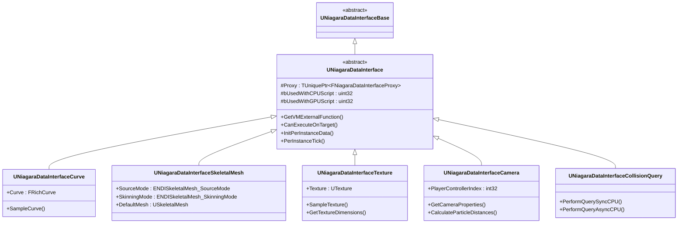
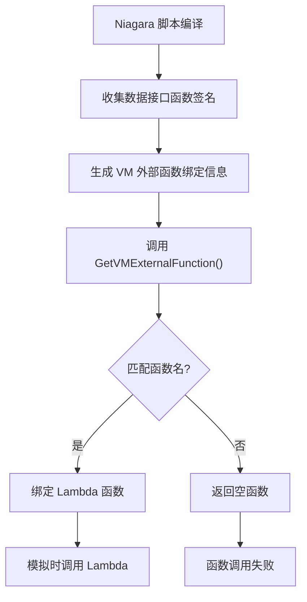
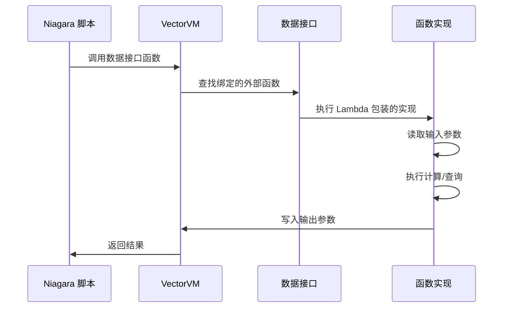
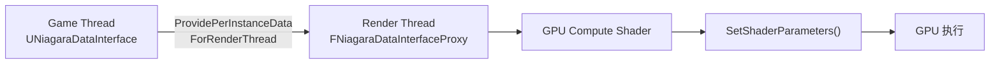
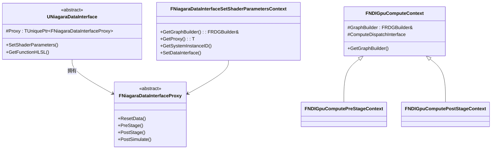

# Niagara数据接口系统

> **Niagara Data Interface 技术深度解析**
>
> 数据接口（Data Interface）是 Niagara 粒子系统与外部环境交互的核心桥梁，允许粒子系统访问游戏世界中的各种数据。

## 目录

1. [概述](#概述)
2. [UNiagaraDataInterface 基类分析](#uniagara-data-interface-基类分析)
3. [核心接口与数据绑定机制](#核心接口与数据绑定机制)
4. [内置数据接口分析](#内置数据接口分析)
5. [数据接口实现原理](#数据接口实现原理)
6. [自定义数据接口开发指南](#自定义数据接口开发指南)
7. [GPU 数据接口实现](#gpu-数据接口实现)
8. [性能优化建议](#性能优化建议)

---

## 概述

**Niagara Data Interface** 是 Niagara VFX 系统的关键扩展机制，它允许粒子系统在模拟过程中读取外部数据或执行复杂计算。数据接口提供了一种类型安全、高性能的方式让粒子与游戏世界进行交互。

### 核心作用

1. **数据访问**：读取曲线、纹理、网格、相机等数据
2. **环境交互**：执行碰撞查询、场景深度采样
3. **动态计算**：采样动画数据、物理模拟结果
4. **GPU 加速**：支持在 GPU 上执行复杂计算



---

## UNiagaraDataInterface 基类分析

`UNiagaraDataInterface` 是所有 Niagara 数据接口的抽象基类，定义了数据接口的核心接口和生命周期管理。

### 源码位置

- **头文件**：`Engine/Plugins/FX/Niagara/Source/Niagara/Classes/NiagaraDataInterface.h`
- **实现文件**：`Engine/Plugins/FX/Niagara/Source/Niagara/Private/NiagaraDataInterface.cpp`

### 类声明

```cpp
// NiagaraDataInterface.h:570-957
UCLASS(abstract, EditInlineNew, MinimalAPI)
class UNiagaraDataInterface : public UNiagaraDataInterfaceBase
{
    GENERATED_UCLASS_BODY()

public:
    NIAGARA_API virtual ~UNiagaraDataInterface() override;

    // 核心接口
    virtual void GetVMExternalFunction(const FVMExternalFunctionBindingInfo& BindingInfo, 
                                     void* InstanceData, 
                                     FVMExternalFunction &OutFunc);
    
    virtual bool CanExecuteOnTarget(ENiagaraSimTarget Target) const;
    
    // 生命周期管理
    virtual bool InitPerInstanceData(void* PerInstanceData, FNiagaraSystemInstance* SystemInstance);
    virtual void DestroyPerInstanceData(void* PerInstanceData, FNiagaraSystemInstance* SystemInstance);
    virtual bool PerInstanceTick(void* PerInstanceData, FNiagaraSystemInstance* SystemInstance, float DeltaSeconds);
    
    // GPU 支持
    virtual void ProvidePerInstanceDataForRenderThread(void* DataForRenderThread, 
                                                      void* PerInstanceData, 
                                                      const FNiagaraSystemInstanceID& SystemInstance);
    
    virtual void SetShaderParameters(const FNiagaraDataInterfaceSetShaderParametersContext& Context) const;
    
protected:
    TUniquePtr<FNiagaraDataInterfaceProxy> Proxy;
    uint32 bRenderDataDirty : 1;
    uint32 bUsedWithCPUScript : 1;
    uint32 bUsedWithGPUScript : 1;
};
```

### 关键虚函数

#### 1. GetVMExternalFunction()

这是数据接口最核心的虚函数，用于将 Niagara VM 外部函数绑定到具体的实现。

```cpp
// NiagaraDataInterface.h:685
virtual void GetVMExternalFunction(const FVMExternalFunctionBindingInfo& BindingInfo, 
                                   void* InstanceData, 
                                   FVMExternalFunction &OutFunc);
```

**参数说明**：
- `BindingInfo`：包含函数签名和参数位置信息
- `InstanceData`：当前实例的数据指针
- `OutFunc`：输出的 VM 外部函数绑定

**实现示例**（以 Curve 数据接口为例）：

```cpp
// NiagaraDataInterfaceCurve.h:43
virtual void GetVMExternalFunction(const FVMExternalFunctionBindingInfo& BindingInfo, 
                                   void* InstanceData, 
                                   FVMExternalFunction &OutFunc) override;
```

#### 2. CanExecuteOnTarget()

确定数据接口可以在哪种模拟目标上执行。

```cpp
// NiagaraDataInterface.h:693
virtual bool CanExecuteOnTarget(ENiagaraSimTarget Target) const;
```

**返回值**：
- `ENiagaraSimTarget::CPUSim`：仅在 CPU 上执行
- `ENiagaraSimTarget::GPUComputeSim`：仅在 GPU 上执行
- `true`：两种目标都支持

**内置数据接口的典型实现**：

```cpp
// Texture 数据接口仅支持 GPU
virtual bool CanExecuteOnTarget(ENiagaraSimTarget Target) const override 
{ 
    return Target == ENiagaraSimTarget::GPUComputeSim; 
}

// SkeletalMesh 和 Camera 支持两种目标
virtual bool CanExecuteOnTarget(ENiagaraSimTarget Target) const override 
{ 
    return true; 
}
```

---

## 核心接口与数据绑定机制

### VM 外部函数绑定机制

Niagara 使用 VectorVM 来执行粒子模拟。数据接口通过 `GetVMExternalFunction()` 将 VM 外部函数绑定到具体的 C++ 实现。

#### 绑定流程



#### 绑定宏定义

Niagara 提供了一系列宏来简化 VM 外部函数的绑定：

```cpp
// NiagaraDataInterface.h:114-146
#define DEFINE_NDI_FUNC_BINDER(ClassName, FuncName)\
struct NDI_FUNC_BINDER(ClassName, FuncName)\
{\
    template<typename ... ParamTypes>\
    static void Bind(UNiagaraDataInterface* Interface, \
                     const FVMExternalFunctionBindingInfo& BindingInfo, \
                     void* InstanceData, \
                     FVMExternalFunction &OutFunc)\
    {\
        auto Lambda = [Interface](FVectorVMExternalFunctionContext& Context) \
                     { static_cast<ClassName*>(Interface)->FuncName<ParamTypes...>(Context); };\
        OutFunc = FVMExternalFunction::CreateLambda(Lambda);\
    }\
};

#define DEFINE_NDI_DIRECT_FUNC_BINDER(ClassName, FuncName)\
struct NDI_FUNC_BINDER(ClassName, FuncName)\
{\
    static void Bind(UNiagaraDataInterface* Interface, FVMExternalFunction &OutFunc)\
    {\
        auto Lambda = [Interface](FVectorVMExternalFunctionContext& Context) \
                     { static_cast<ClassName*>(Interface)->FuncName(Context); };\
        OutFunc = FVMExternalFunction::CreateLambda(Lambda);\
    }\
};
```

#### 参数绑定辅助类

Niagara 提供了 `FNDIInputParam` 和 `FNDIOutputParam` 模板类来处理不同类型的参数：

```cpp
// NiagaraDataInterface.h:1174-1187
template<typename T>
struct FNDIInputParam
{
    static_assert(sizeof(T) == sizeof(float), "Generic template assumes 4 bytes per element");
    VectorVM::FExternalFuncInputHandler<T> Data;    
    inline FNDIInputParam(FVectorVMExternalFunctionContext& Context) : Data(Context) {}
    inline T GetAndAdvance() { return Data.GetAndAdvance(); }
    inline bool IsConstant() const { return Data.IsConstant(); }
};

// NiagaraDataInterface.h:1464-1472
template<typename T>
struct FNDIOutputParam
{
    static_assert(sizeof(T) == sizeof(float), "Generic template assumes 4 bytes per element");
    VectorVM::FExternalFuncRegisterHandler<T> Data;
    inline bool IsValid() const { return Data.IsValid();  }
    inline void SetAndAdvance(T Val) { *Data.GetDestAndAdvance() = Val; }
};
```

**专用特化**（部分示例）：

| 类型 | 输入参数类 | 输出参数类 |
|------|-------------|-------------|
| `FVector2f` | `FNDIInputParam<FVector2f>` | `FNDIOutputParam<FVector2f>` |
| `FVector3f` | `FNDIInputParam<FVector3f>` | `FNDIOutputParam<FVector3f>` |
| `FVector4f` | `FNDIInputParam<FVector4f>` | `FNDIOutputParam<FVector4f>` |
| `FMatrix44f` | `FNDIInputParam<FMatrix44f>` | `FNDIOutputParam<FMatrix44f>` |
| `FNiagaraBool` | `FNDIInputParam<FNiagaraBool>` | `FNDIOutputParam<FNiagaraBool>` |

---

## 内置数据接口分析

### 1. UNiagaraDataInterfaceCurve（曲线数据接口）

**功能**：允许在 Niagara 中采样浮点曲线。

**源码位置**：
- 头文件：`NiagaraDataInterfaceCurve.h`
- 实现：`NiagaraDataInterfaceCurve.cpp`

#### 类定义

```cpp
// NiagaraDataInterfaceCurve.h:14-74
UCLASS(EditInlineNew, Category = "Curves", CollapseCategories, 
       meta = (DisplayName = "Curve for Floats"), MinimalAPI)
class UNiagaraDataInterfaceCurve : public UNiagaraDataInterfaceCurveBase
{
    GENERATED_UCLASS_BODY()

public:
    UPROPERTY(EditAnywhere, Category = "Curve")
    FRichCurve Curve; 

    enum
    {
        CurveLUTNumElems = 1,
    };

    NIAGARA_API virtual void GetVMExternalFunction(
        const FVMExternalFunctionBindingInfo& BindingInfo,
        void* InstanceData, 
        FVMExternalFunction &OutFunc) override;

    template<typename UseLUT>
    void SampleCurve(FVectorVMExternalFunctionContext& Context);
    
    NIAGARA_API virtual bool Equals(const UNiagaraDataInterface* Other) const override;
};
```

#### 核心函数

**SampleCurve** - 采样曲线值：

```cpp
template<typename UseLUT>
void UNiagaraDataInterfaceCurve::SampleCurve(FVectorVMExternalFunctionContext& Context)
{
    // 使用 FNDIInputParam 读取输入参数
    FNDIInputParam<float> XParam(Context);
    FNDIOutputParam<float> ResultParam(Context);
    
    // 遍历所有实例
    for (int32 i = 0; i < Context.GetNumInstances(); ++i)
    {
        float X = XParam.GetAndAdvance();
        float Result = SampleCurveInternal<UseLUT>(X);
        ResultParam.SetAndAdvance(Result);
    }
}
```

**LUT（查找表）优化**：

曲线数据接口使用 LUT 来加速采样：

```cpp
// NiagaraDataInterfaceCurve.h:41
NIAGARA_API virtual TArray<float> BuildLUT(int32 NumEntries) const override;
```

### 2. UNiagaraDataInterfaceSkeletalMesh（骨骼网格数据接口）

**功能**：允许采样骨骼网格体的数据，包括骨骼变换、顶点位置、三角形采样等。

**源码位置**：
- 头文件：`NiagaraDataInterfaceSkeletalMesh.h`
- 实现：`NiagaraDataInterfaceSkeletalMesh.cpp`

#### 类定义

```cpp
// NiagaraDataInterfaceSkeletalMesh.h:687-1008
UCLASS(EditInlineNew, Category = "Meshes", 
       meta = (DisplayName = "Skeletal Mesh Reader"), MinimalAPI)
class UNiagaraDataInterfaceSkeletalMesh : public UNiagaraDataInterface
{
    GENERATED_UCLASS_BODY()

public:
    // 源模式
    UPROPERTY(EditAnywhere, Category = "Mesh")
    ENDISkeletalMesh_SourceMode SourceMode;

    // 默认网格
    UPROPERTY(EditAnywhere, Category = "Mesh")
    TObjectPtr<USkeletalMesh> DefaultMesh;

    // 蒙皮模式
    UPROPERTY(EditAnywhere, Category="Mesh")
    ENDISkeletalMesh_SkinningMode SkinningMode;

    // 采样区域
    UPROPERTY(EditAnywhere, Category="Mesh")
    TArray<FName> SamplingRegions;

    // 过滤骨骼
    UPROPERTY(EditAnywhere, Category = "Skeleton")
    TArray<FName> FilteredBones;

    // 过滤插槽
    UPROPERTY(EditAnywhere, Category = "Skeleton")
    TArray<FName> FilteredSockets;

    NIAGARA_API virtual void GetVMExternalFunction(
        const FVMExternalFunctionBindingInfo& BindingInfo,
        void* InstanceData, 
        FVMExternalFunction &OutFunc) override;
};
```

#### 蒙皮模式枚举

```cpp
// NiagaraDataInterfaceSkeletalMesh.h:332-354
enum class ENDISkeletalMesh_SkinningMode : uint8
{
    Invalid = (uint8)-1,
    
    // 无蒙皮，仅使用参考姿势
    None = 0,
    
    // 按需蒙皮，用于骨骼或插槽采样
    SkinOnTheFly,
    
    // 预蒙皮整个网格，用于大量三角形或顶点读取
    PreSkin,
};
```

#### 实例数据结构

```cpp
// NiagaraDataInterfaceSkeletalMesh.h:552-684
struct FNDISkeletalMesh_InstanceData
{
    // 缓存的骨骼网格组件
    TWeakObjectPtr<USceneComponent> SceneComponent;
    
    // 用户参数绑定
    FNiagaraParameterDirectBinding<UObject*> UserParamBinding;
    
    // 蒙皮数据句柄
    FSkeletalMeshSkinningDataHandle SkinningData;
    
    // UV 映射句柄
    FSkeletalMeshUvMappingHandle UvMapping;
    
    // 连通性数据句柄
    FSkeletalMeshConnectivityHandle Connectivity;
    
    // 变换矩阵
    FMatrix Transform;
    FMatrix PrevTransform;
    
    // GPU 缓冲区
    FSkeletalMeshGpuSpawnStaticBuffers* MeshGpuSpawnStaticBuffers;
    FSkeletalMeshGpuDynamicBufferProxy* MeshGpuSpawnDynamicBuffers;
};
```

### 3. UNiagaraDataInterfaceTexture（纹理数据接口）

**功能**：允许在 Niagara 中采样纹理数据。

**源码位置**：
- 头文件：`NiagaraDataInterfaceTexture.h`
- 实现：`NiagaraDataInterfaceTexture.cpp`

#### 类定义

```cpp
// NiagaraDataInterfaceTexture.h:11-82
UCLASS(EditInlineNew, Category = "Texture", CollapseCategories, 
       meta = (DisplayName = "Texture Sample"), MinimalAPI)
class UNiagaraDataInterfaceTexture : public UNiagaraDataInterface
{
    GENERATED_UCLASS_BODY()

    BEGIN_SHADER_PARAMETER_STRUCT(FShaderParameters, )
        SHADER_PARAMETER(FIntPoint,             TextureSize)
        SHADER_PARAMETER(int32,                 MipLevels)
        SHADER_PARAMETER_RDG_TEXTURE(Texture2D, Texture)
        SHADER_PARAMETER_SAMPLER(SamplerState,  TextureSampler)
    END_SHADER_PARAMETER_STRUCT()

public:
    UPROPERTY(EditAnywhere, Category = "Texture")
    TObjectPtr<UTexture> Texture;

    UPROPERTY(EditAnywhere, Category = "Texture")
    FNiagaraUserParameterBinding TextureUserParameter;

    NIAGARA_API virtual void GetVMExternalFunction(
        const FVMExternalFunctionBindingInfo& BindingInfo,
        void* InstanceData, 
        FVMExternalFunction &OutFunc) override;
        
    NIAGARA_API void SampleTexture(FVectorVMExternalFunctionContext& Context);
    NIAGARA_API void GetTextureDimensions(FVectorVMExternalFunctionContext& Context);
};
```

#### Shader 参数结构

纹理数据接口使用 RDG（Render Dependency Graph）系统来传递 GPU 参数：

```cpp
BEGIN_SHADER_PARAMETER_STRUCT(FShaderParameters, )
    SHADER_PARAMETER(FIntPoint,             TextureSize)      // 纹理尺寸
    SHADER_PARAMETER(int32,                 MipLevels)        // Mip 层级数
    SHADER_PARAMETER_RDG_TEXTURE(Texture2D, Texture)          // 纹理资源
    SHADER_PARAMETER_SAMPLER(SamplerState,  TextureSampler)   // 采样器状态
END_SHADER_PARAMETER_STRUCT()
```

### 4. UNiagaraDataInterfaceCamera（相机数据接口）

**功能**：允许查询相机属性，用于粒子与相机的交互。

**源码位置**：
- 头文件：`NiagaraDataInterfaceCamera.h`
- 实现：`NiagaraDataInterfaceCamera.cpp`

#### 类定义

```cpp
// NiagaraDataInterfaceCamera.h:28-104
UCLASS(EditInlineNew, Category = "Camera", CollapseCategories, 
       meta = (DisplayName = "Camera Query"), MinimalAPI)
class UNiagaraDataInterfaceCamera : public UNiagaraDataInterface
{
    GENERATED_UCLASS_BODY()

    BEGIN_SHADER_PARAMETER_STRUCT(FShaderParameters, )
        SHADER_PARAMETER(int32, SplitscreenMode)
    END_SHADER_PARAMETER_STRUCT();

public:
    // 玩家控制器索引
    UPROPERTY(EditAnywhere, Category = "Camera")
    int32 PlayerControllerIndex = 0;

    // 是否要求当前帧数据
    UPROPERTY(EditAnywhere, Category = "Performance")
    bool bRequireCurrentFrameData = true;

    NIAGARA_API void CalculateParticleDistances(FVectorVMExternalFunctionContext& Context);
    NIAGARA_API void GetCameraFOV(FVectorVMExternalFunctionContext& Context);
    NIAGARA_API void GetCameraProperties(FVectorVMExternalFunctionContext& Context);
};
```

#### 实例数据

```cpp
// NiagaraDataInterfaceCamera.h:16-26
struct FCameraDataInterface_InstanceData
{
    FNiagaraPosition CameraLocation = FVector::ZeroVector;
    FRotator CameraRotation = FRotator::ZeroRotator;
    float CameraFOV = 0.0f;
    ESplitScreenType::Type SplitscreenMode = ESplitScreenType::Type::None;
    FNiagaraLWCConverter LWCConverter;

    // 粒子距离排序队列
    TQueue<FDistanceData, EQueueMode::Mpsc> DistanceSortQueue;
    TArray<FDistanceData> ParticlesSortedByDistance;    
};
```

### 5. UNiagaraDataInterfaceCollisionQuery（碰撞查询数据接口）

**功能**：允许执行碰撞查询，包括射线检测、场景深度采样等。

**源码位置**：
- 头文件：`NiagaraDataInterfaceCollisionQuery.h`
- 实现：`NiagaraDataInterfaceCollisionQuery.cpp`

#### 类定义

```cpp
// NiagaraDataInterfaceCollisionQuery.h:24-82
UCLASS(EditInlineNew, Category = "Collision", 
       meta = (DisplayName = "Collision Query"), MinimalAPI)
class UNiagaraDataInterfaceCollisionQuery : public UNiagaraDataInterface
{
    GENERATED_UCLASS_BODY()

public:
    NIAGARA_API virtual bool InitPerInstanceData(
        void* PerInstanceData, 
        FNiagaraSystemInstance* InSystemInstance) override;

    NIAGARA_API virtual bool PerInstanceTick(
        void* PerInstanceData, 
        FNiagaraSystemInstance* SystemInstance, 
        float DeltaSeconds) override;

    // VM 函数
    NIAGARA_API void PerformQuerySyncCPU(FVectorVMExternalFunctionContext& Context);
    NIAGARA_API void PerformQueryAsyncCPU(FVectorVMExternalFunctionContext& Context);

    virtual bool RequiresGlobalDistanceField() const override { return true; }
    virtual bool RequiresDepthBuffer() const override { return true; }
};
```

#### 碰撞查询批处理

```cpp
// NiagaraDataInterfaceCollisionQuery.h:17-21
struct CQDIPerInstanceData
{
    FNiagaraSystemInstance *SystemInstance;
    FNiagaraDICollisionQueryBatch CollisionBatch;  // 碰撞查询批处理
};
```

---

## 数据接口实现原理

### VM 外部函数绑定详细流程

数据接口的核心工作机制是通过 VectorVM 外部函数绑定来实现的。



### GPU 数据接口实现

GPU 数据接口使用渲染线程代理模式来传递数据。

#### FNiagaraDataInterfaceProxy 结构

```cpp
// NiagaraDataInterface.h:395-428
struct FNiagaraDataInterfaceProxy
{
    FNiagaraDataInterfaceProxy() {}
    virtual ~FNiagaraDataInterfaceProxy()

    virtual int32 PerInstanceDataPassedToRenderThreadSize() const = 0;
    virtual void ConsumePerInstanceDataFromGameThread(
        void* PerInstanceData, 
        const FNiagaraSystemInstanceID& Instance) { check(false); }

    FName SourceDIName;

    // GPU 计算回调
    virtual void ResetData(const FNDIGpuComputeResetContext& Context) { }
    virtual void PreStage(const FNDIGpuComputePreStageContext& Context) {}
    virtual void PostStage(const FNDIGpuComputePostStageContext& Context) {}
    virtual void PostSimulate(const FNDIGpuComputePostSimulateContext& Context) {}
};
```

#### 数据流向



#### SetShaderParameters 实现示例

以纹理数据接口为例：

```cpp
// NiagaraDataInterfaceTexture.cpp
void UNiagaraDataInterfaceTexture::SetShaderParameters(
    const FNiagaraDataInterfaceSetShaderParametersContext& Context) const
{
    // 获取 Proxy 数据
    const FNiagaraDataInterfaceProxyTexture& TextureProxy = Context.GetProxy<FNiagaraDataInterfaceProxyTexture>();
    
    // 设置 Shader 参数
    FShaderParameters* Parameters = Context.GetParameterIncludedStruct<FShaderParameters>();
    
    Parameters->TextureSize = TextureProxy.GetTextureSize();
    Parameters->MipLevels = TextureProxy.GetMipLevels();
    Parameters->Texture = TextureProxy.GetTextureSRV();
    Parameters->TextureSampler = TextureProxy.GetSamplerState();
}
```

---

## 自定义数据接口开发指南

### 开发步骤

#### 1. 继承自 UNiagaraDataInterface

```cpp
// MyDataInterface.h
UCLASS(EditInlineNew, Category = "Custom", meta = (DisplayName = "My Custom DI"), MinimalAPI)
class UMyDataInterface : public UNiagaraDataInterface
{
    GENERATED_BODY()

public:
    UPROPERTY(EditAnywhere, Category = "Data")
    float MyParameter;

    // 重写核心接口
    virtual void GetVMExternalFunction(
        const FVMExternalFunctionBindingInfo& BindingInfo,
        void* InstanceData, 
        FVMExternalFunction &OutFunc) override;
        
    virtual bool CanExecuteOnTarget(ENiagaraSimTarget Target) const override;
    
    virtual bool InitPerInstanceData(
        void* PerInstanceData, 
        FNiagaraSystemInstance* SystemInstance) override;
        
    virtual void DestroyPerInstanceData(
        void* PerInstanceData, 
        FNiagaraSystemInstance* SystemInstance) override;
};
```

#### 2. 实现 GetVMExternalFunction()

```cpp
// MyDataInterface.cpp
void UMyDataInterface::GetVMExternalFunction(
    const FVMExternalFunctionBindingInfo& BindingInfo,
    void* InstanceData, 
    FVMExternalFunction &OutFunc)
{
    // 检查函数名并绑定
    if (BindingInfo.Name == TEXT("MyFunction"))
    {
        // 使用 Lambda 绑定函数
        auto Lambda = [this](FVectorVMExternalFunctionContext& Context) 
        { 
            MyFunctionImpl(Context); 
        };
        OutFunc = FVMExternalFunction::CreateLambda(Lambda);
    }
}

void UMyDataInterface::MyFunctionImpl(FVectorVMExternalFunctionContext& Context)
{
    // 读取输入
    FNDIInputParam<FVector3f> InputParam(Context);
    FNDIOutputParam<float> OutputParam(Context);
    
    // 处理每个实例
    for (int32 i = 0; i < Context.GetNumInstances(); ++i)
    {
        FVector3f Input = InputParam.GetAndAdvance();
        float Result = /* 计算结果 */;
        OutputParam.SetAndAdvance(Result);
    }
}
```

#### 3. 实现 GPU 支持（可选）

如果需要 GPU 支持，需要：

1. 创建 Proxy 结构
2. 实现 `SetShaderParameters()`
3. 编写 HLSL 代码

```cpp
// MyDataInterface.h
struct FNiagaraDataInterfaceProxyMy : public FNiagaraDataInterfaceProxy
{
    virtual int32 PerInstanceDataPassedToRenderThreadSize() const override;
    virtual void ResetData(const FNDIGpuComputeResetContext& Context) override;
};

// MyDataInterface.cpp
void UMyDataInterface::SetShaderParameters(
    const FNiagaraDataInterfaceSetShaderParametersContext& Context) const
{
    // 设置 GPU 参数
}
```

#### 4. 注册到 Niagara 模块

确保在模块启动时注册数据接口：

```cpp
// MyModule.cpp
#include "NiagaraDataInterfaceRegistration.h"

void FMyModule::StartupModule()
{
    // 注册数据接口
    FNiagaraDataInterfaceRegistry::Get().RegisterDataInterface(
        UMyDataInterface::StaticClass(),
        TEXT("MyCustomDataInterface"));
}
```

### 关键虚函数实现检查清单

| 函数 | 必须 | 说明 |
|------|------|------|
| `GetVMExternalFunction()` | 是 | VM 外部函数绑定 |
| `CanExecuteOnTarget()` | 是 | 指定支持的模拟目标 |
| `InitPerInstanceData()` | 否 | 初始化实例数据 |
| `DestroyPerInstanceData()` | 否 | 清理实例数据 |
| `PerInstanceTick()` | 否 | 每帧更新逻辑 |
| `ProvidePerInstanceDataForRenderThread()` | GPU 需要 | 传递数据到渲染线程 |
| `SetShaderParameters()` | GPU 需要 | 设置 Shader 参数 |
| `GetFunctionHLSL()` | GPU 需要 | 生成 HLSL 代码 |

---

## GPU 数据接口实现

### GPU 数据接口架构



### HLSL 代码生成

GPU 数据接口需要生成对应的 HLSL 代码：

```cpp
// NiagaraDataInterfaceTexture.h:59-61
#if WITH_EDITORONLY_DATA
NIAGARA_API virtual bool GetFunctionHLSL(
    const FNiagaraDataInterfaceGPUParamInfo& ParamInfo,
    const FNiagaraDataInterfaceGeneratedFunction& FunctionInfo,
    int FunctionInstanceIndex,
    FString& OutHLSL) override;
#endif
```

**HLSL 模板示例**（纹理采样）：

```hlsl
// NiagaraDataInterfaceTexture.usf
void SampleTexture2D(FNiagaraDataInterfaceArgs Args, float2 UV, out float4 Result)
{
    Result = Texture2DSample(Args.Texture, Args.TextureSampler, UV);
}
```

### RDG 集成

UE 5.0+ 使用 RDG（Render Dependency Graph）系统：

```cpp
void UNiagaraDataInterfaceTexture::SetShaderParameters(
    const FNiagaraDataInterfaceSetShaderParametersContext& Context) const
{
    FRDGBuilder& GraphBuilder = Context.GetGraphBuilder();
    
    // 使用 RDG 创建临时资源
    FRDGTextureRef TextureRDG = /* 获取 RDG 纹理 */;
    
    // 设置参数
    FShaderParameters* Parameters = Context.GetParameterIncludedStruct<FShaderParameters>();
    Parameters->Texture = TextureRDG;
    Parameters->TextureSampler = /* 采样器 */;
}
```

---

## 性能优化建议

### 1. 合理使用 LUT（查找表）

对于曲线等可预处理的数据，使用 LUT 可以大幅提升性能：

```cpp
// 构建 LUT
TArray<float> BuildLUT(int32 NumEntries) const
{
    TArray<float> LUT;
    LUT.Reserve(NumEntries);
    
    for (int32 i = 0; i < NumEntries; ++i)
    {
        float X = (float)i / (float)(NumEntries - 1);
        LUT.Add(Curve.Eval(X));
    }
    
    return LUT;
}
```

### 2. 减少 Game-Render 线程数据传递

仅在数据变化时标记脏：

```cpp
void MarkRenderDataDirty()
{
    bRenderDataDirty = true;
    PushToRenderThread();
}
```

### 3. 使用前一帧数据优化

对于非关键数据，可以使用前一帧的数据来减少同步开销：

```cpp
// NiagaraDataInterfaceCamera.h:44-46
UPROPERTY(EditAnywhere, Category = "Performance")
bool bRequireCurrentFrameData = true;  // 设为 false 可提升性能
```

### 4. 批量处理碰撞查询

使用批处理来减少开销：

```cpp
// 添加到批处理
CollisionBatch.AddQuery(QueryData);

// 在 PostSimulate 中执行批处理
virtual void PostSimulate(const FNDIGpuComputePostSimulateContext& Context) override
{
    // 执行所有挂起的查询
    CollisionBatch.Execute();
}
```

---

## 总结

Niagara 数据接口系统提供了一个灵活、高效的框架，让粒子系统能够：

1. **访问外部数据**：曲线、纹理、网格、相机等
2. **执行复杂计算**：碰撞查询、物理模拟
3. **支持 GPU 加速**：通过 Proxy 和 RDG 系统集成
4. **易于扩展**：清晰的虚函数接口和辅助类

### 核心设计模式

- **策略模式**：通过虚函数实现不同数据接口的行为
- **代理模式**：Game 线程与 Render 线程之间的数据传递
- **模板方法**：使用 `FNDIInputParam` 和 `FNDIOutputParam` 统一参数处理
- **Lambda 绑定**：将成员函数绑定到 VectorVM 外部函数

### 参考资料

- [UE5 Niagara 官方文档](https://docs.unrealengine.com/5.0/zh-CN/niagara-effects-system-in-unreal-engine/)
- Niagara 源码：`Engine/Plugins/FX/Niagara/`
- [VectorVM 文档](https://docs.unrealengine.com/5.0/zh-CN/vectorvm-in-unreal-engine/)

<!-- nav:auto -->

---

**导航**: ← [[30-tutorials/niagara/05-NiagaraGPU粒子模拟流程深度分析|05-NiagaraGPU粒子模拟流程深度分析]] · [[30-tutorials/niagara/07-Niagara渲染器和性能优化系统|07-Niagara渲染器和性能优化系统]] →

<!-- /nav:auto -->
