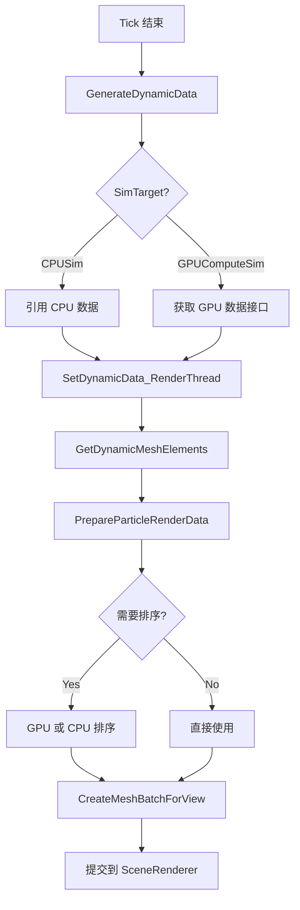
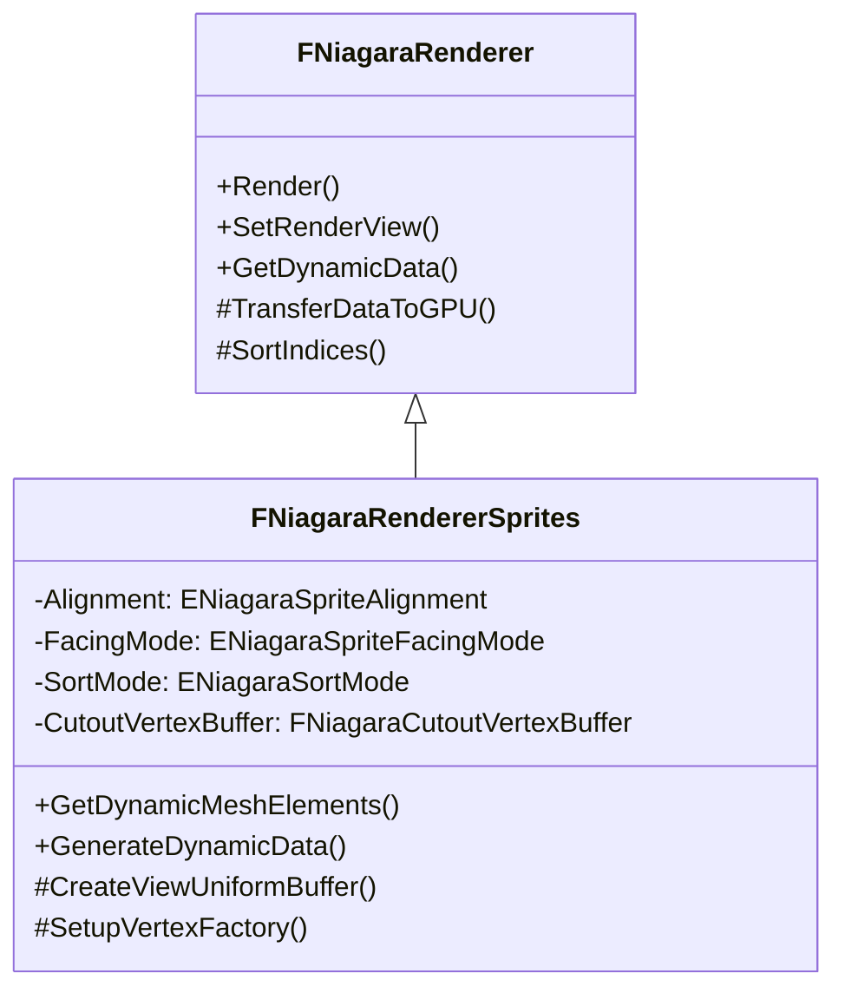
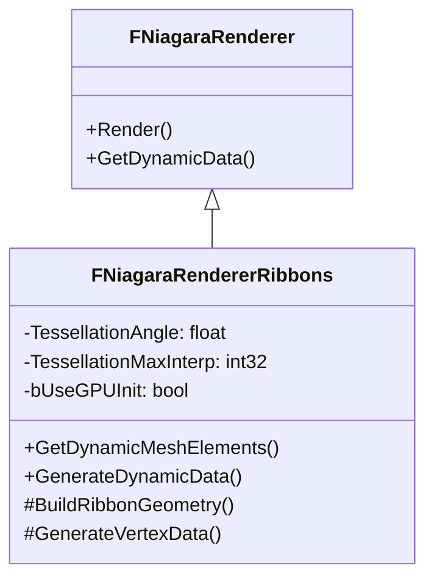
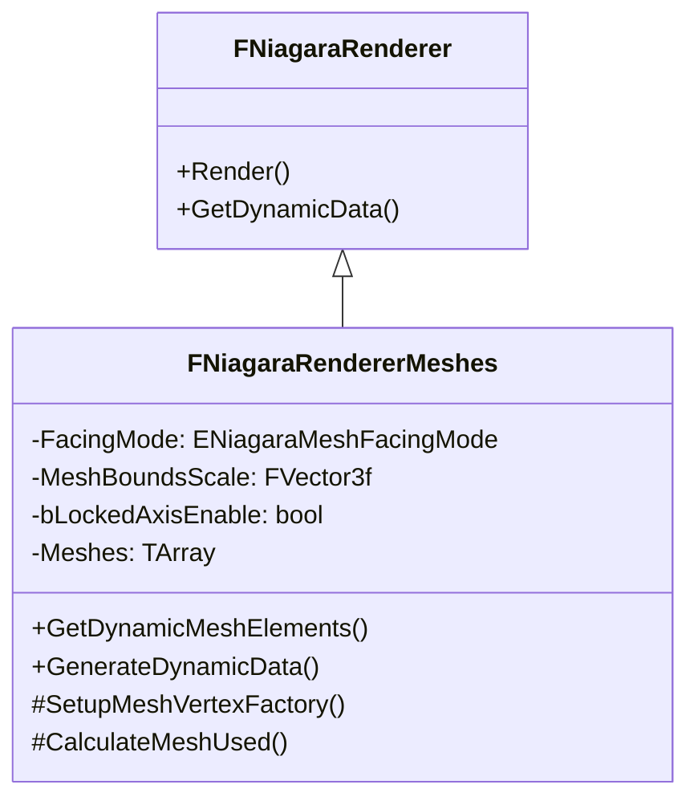
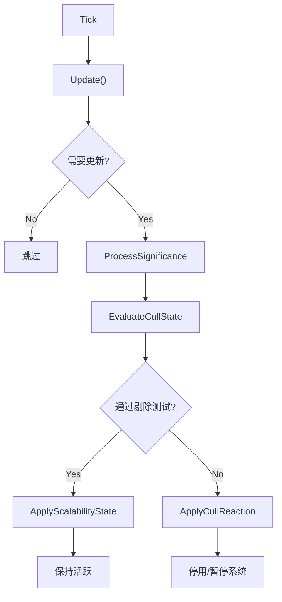
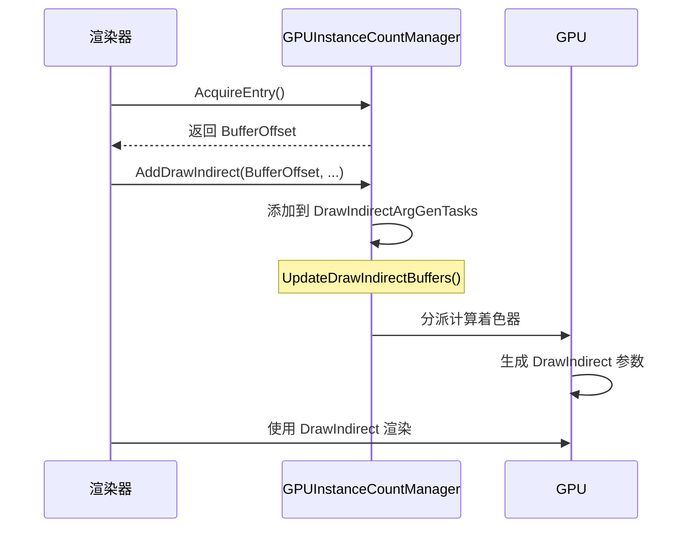
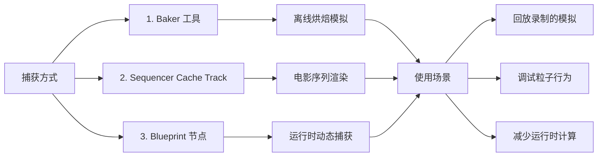
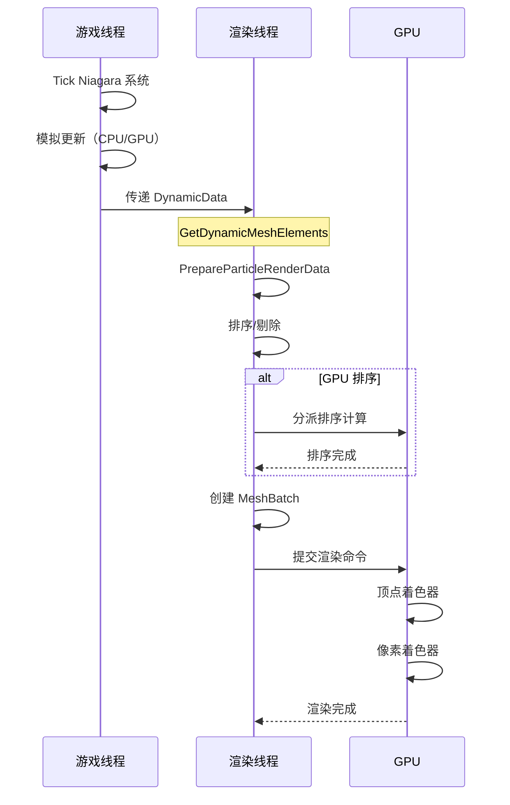

# Niagara渲染器和性能优化系统

> Niagara 渲染器负责将粒子模拟数据转换为 GPU 可渲染的图元，性能优化系统通过可伸缩性管理和 GPU 实例计数来实现大规模特效的高效渲染。

## 目录

- [1. FNiagaraRenderer 渲染器基类](#1-fniagararenderer-渲染器基类)
- [2. 具体渲染器分析](#2-具体渲染器分析)
- [3. 性能优化系统](#3-性能优化系统)
- [4. Sim Cache 系统](#4-sim-cache-系统)
- [5. 渲染数据流](#5-渲染数据流)

---

## 1. FNiagaraRenderer 渲染器基类

### 1.1 类职责

`FNiagaraRenderer` 是所有 Niagara 渲染器的抽象基类，定义了粒子数据到 GPU 渲染的通用接口。

```cpp
// NiagaraRenderer.h (基类定义)
class FNiagaraRenderer
{
public:
    // 核心接口
    virtual void GetDynamicMeshElements(...) = 0;  // 生成渲染图元
    virtual FNiagaraDynamicDataBase* GenerateDynamicData(...) = 0;  // 准备渲染数据
    virtual void CreateRenderThreadResources(FRHICommandListBase&) = 0;
    virtual void ReleaseRenderThreadResources() = 0;
    
    // 排序与剔除
    void SortIndices(const FNiagaraGPUSortInfo& SortInfo, ...);
    int32 SortAndCullIndices(const FNiagaraGPUSortInfo& SortInfo, ...);
    
    // 数据转移
    FParticleRenderData TransferDataToGPU(FRHICommandListBase& RHICmdList, 
        FGlobalDynamicReadBuffer& DynamicReadBuffer,
        const FNiagaraRendererLayout* RendererLayout,
        TConstArrayView<uint32> IntComponents,
        const FNiagaraDataBuffer* SrcData);
};
```

**源码路径**: `Engine/Plugins/FX/Niagara/Source/Niagara/Private/NiagaraRenderer.cpp`

### 1.2 核心接口详解

#### Render() - 渲染入口

虽然 `FNiagaraRenderer` 不直接定义 `Render()`，但渲染流程通过 `GetDynamicMeshElements()` 集成到 UE 的渲染管线中：

```cpp
// NiagaraRenderer.cpp:963
void FNiagaraRendererSprites::GetDynamicMeshElements(
    const TArray<const FSceneView*>& Views,
    const FSceneViewFamily& ViewFamily,
    uint32 VisibilityMap,
    FMeshElementCollector& Collector,
    const FNiagaraSceneProxy* SceneProxy) const
{
    // 1. 准备粒子渲染数据
    FParticleSpriteRenderData ParticleSpriteRenderData;
    PrepareParticleSpriteRenderData(Collector.GetRHICommandList(), 
        ParticleSpriteRenderData, ViewFamily, DynamicDataRender, SceneProxy, 
        ENiagaraGpuComputeTickStage::Last);
    
    // 2. 检查是否有数据可渲染
    if (ParticleSpriteRenderData.SourceParticleData == nullptr) return;
    
    // 3. 为每个 View 创建 MeshBatch
    for (int32 ViewIndex = 0; ViewIndex < Views.Num(); ViewIndex++)
    {
        if (VisibilityMap & (1 << ViewIndex))
        {
            // 创建渲染批次
            FMeshBatch& MeshBatch = Collector.AllocateMesh();
            CreateMeshBatchForView(RHICmdList, ParticleSpriteRenderData, 
                MeshBatch, *View, *SceneProxy, VertexFactory, 
                NumInstances, GPUCountBufferOffset, bNeedsCull);
            Collector.AddMesh(ViewIndex, MeshBatch);
        }
    }
}
```

#### SetRenderView() - 视图设置

通过 `InitializeSortInfo()` 为每个视图设置排序参数：

```cpp
// NiagaraRendererSprites.cpp:412
void FNiagaraRendererSprites::InitializeSortInfo(
    FParticleSpriteRenderData& ParticleSpriteRenderData,
    const FNiagaraSceneProxy& SceneProxy,
    const FSceneView& View,
    int32 ViewIndex,
    FNiagaraGPUSortInfo& OutSortInfo) const
{
    // 设置排序模式
    OutSortInfo.SortMode = SortMode;
    OutSortInfo.ViewOrigin = ViewMatrices.GetViewOrigin();
    OutSortInfo.ViewDirection = ViewMatrices.GetViewMatrix().GetColumn(2);
    
    // 设置 GPU 排序参数
    if (ParticleSpriteRenderData.bSortCullOnGpu)
    {
        OutSortInfo.ParticleDataFloatSRV = ParticleSpriteRenderData.ParticleFloatSRV;
        OutSortInfo.ParticleDataHalfSRV = ParticleSpriteRenderData.ParticleHalfSRV;
        OutSortInfo.GPUParticleCountSRV = ...;
    }
}
```

#### GetDynamicData() - 渲染数据准备

```cpp
// NiagaraRenderer.cpp:307
FNiagaraDynamicDataBase::FNiagaraDynamicDataBase(const FNiagaraEmitterInstance* InEmitter)
{
    SystemInstanceID = InEmitter->GetParentSystemInstance()->GetId();
    
    // CPU 模拟：引用最新数据
    if (InEmitter->GetSimTarget() == ENiagaraSimTarget::CPUSim)
    {
        CPUParticleData = &InEmitter->GetParticleData().GetCurrentDataChecked();
    }
    // GPU 模拟：通过回调获取数据
    else
    {
        ComputeDataBufferInterface = InEmitter->GetComputeDataBufferInterface();
    }
}

// NiagaraRendererSprites.cpp:1224
FNiagaraDynamicDataBase* FNiagaraRendererSprites::GenerateDynamicData(
    const FNiagaraSceneProxy* Proxy,
    const UNiagaraRendererProperties* InProperties,
    const FNiagaraEmitterInstance* Emitter) const
{
    FNiagaraDynamicDataSprites* DynamicData = new FNiagaraDynamicDataSprites(Emitter);
    
    // 设置材质代理
    DynamicData->Material = BaseMaterials_GT[0]->GetRenderProxy();
    DynamicData->SetMaterialRelevance(BaseMaterialRelevance_GT);
    
    // 绑定参数数据
    const FNiagaraParameterStore& ParameterData = Emitter->GetRendererBoundVariables();
    DynamicData->DataInterfacesBound = ParameterData.GetDataInterfaces();
    DynamicData->ParameterDataBound = ParameterData.GetParameterDataArray();
    
    return DynamicData;
}
```

### 1.3 渲染数据准备流程



### 1.4 数据转移到 GPU

`TransferDataToGPU()` 负责将 CPU 粒子数据转移到 GPU 可读的 `FGlobalDynamicReadBuffer`：

```cpp
// NiagaraRenderer.cpp:250
FParticleRenderData FNiagaraRenderer::TransferDataToGPU(
    FRHICommandListBase& RHICmdList,
    FGlobalDynamicReadBuffer& DynamicReadBuffer,
    const FNiagaraRendererLayout* RendererLayout,
    TConstArrayView<uint32> IntComponents,
    const FNiagaraDataBuffer* SrcData)
{
    const int32 NumInstances = SrcData->GetNumInstances();
    
    // 分配 GPU 缓冲区
    FParticleRenderData Allocation;
    Allocation.FloatData = DynamicReadBuffer.AllocateFloat(TotalFloatSize);
    Allocation.HalfData = DynamicReadBuffer.AllocateHalf(TotalHalfSize);
    Allocation.IntData = DynamicReadBuffer.AllocateInt32(TotalIntSize);
    
    // 拷贝 Float 数据
    for (const FNiagaraRendererVariableInfo& VarInfo : RendererLayout->GetVFVariables_RenderThread())
    {
        if (VarInfo.IsHalfType())
        {
            // 拷贝 Half 数据
            FMemory::Memcpy(Dest, SrcComponent, Allocation.HalfStride);
        }
        else
        {
            // 拷贝 Float 数据
            FMemory::Memcpy(Dest, SrcComponent, Allocation.FloatStride);
        }
    }
    
    return Allocation;
}
```

### 1.5 排序系统

Niagara 支持多种排序模式，可以在 CPU 或 GPU 上执行：

```cpp
// NiagaraRenderer.cpp:618
void FNiagaraRenderer::SortIndices(
    const FNiagaraGPUSortInfo& SortInfo,
    const FNiagaraRendererVariableInfo& SortVariable,
    const FNiagaraDataBuffer& Buffer,
    FGlobalDynamicReadBuffer::FAllocation& OutIndices)
{
    // 选择排序算法（基数排序 vs 内省排序）
    const bool bUseRadixSort = GNiagaraRadixSortThreshold != -1 && 
        (int32)NumInstances > GNiagaraRadixSortThreshold;
    
    if (SortInfo.SortMode == ENiagaraSortMode::ViewDepth)
    {
        // 按视图深度排序
        for (uint32 i = 0; i < NumInstances; ++i)
        {
            ParticleOrder[i].SetAsUint<i>(i, 
                FVector::DotProduct(Position - SortInfo.ViewOrigin, SortInfo.ViewDirection));
        }
    }
    else if (SortInfo.SortMode == ENiagaraSortMode::CustomAscending)
    {
        // 按自定义属性排序（升序）
        for (uint32 i = 0; i < NumInstances; ++i)
        {
            ParticleOrder[i].SetAsUint<i>(i, CustomSorting[i]);
        }
    }
    
    // 执行排序
    if (!bUseRadixSort)
    {
        Algo::SortBy(MakeArrayView(ParticleOrder, NumInstances), 
            &FParticleOrderAsUint::OrderAsUint);
    }
    else
    {
        RadixSort32(ParticleOrderResult, ParticleOrder, NumInstances);
    }
}
```

**排序模式枚举** (来自 `NiagaraRenderer.h`):

| 模式 | 描述 |
|------|------|
| `None` | 不排序 |
| `ViewDepth` | 按视图深度排序（从后到前） |
| `ViewDistance` | 按到相机距离排序 |
| `CustomAscending` | 按自定义属性升序 |
| `CustomDecending` | 按自定义属性降序 |

---

## 2. 具体渲染器分析

### 2.1 FNiagaraRendererSprites（精灵渲染器）

#### 类结构



#### 关键属性

```cpp
// NiagaraRendererSprites.cpp:64
FNiagaraRendererSprites::FNiagaraRendererSprites(
    ERHIFeatureLevel::Type FeatureLevel,
    const UNiagaraRendererProperties* InProps,
    const FNiagaraEmitterInstance* Emitter)
    : FNiagaraRenderer(FeatureLevel, InProps, Emitter)
    , Alignment(ENiagaraSpriteAlignment::Unaligned)
    , FacingMode(ENiagaraSpriteFacingMode::FaceCamera)
    , SortMode(ENiagaraSortMode::ViewDistance)
    , bSubImageBlend(false)
    , bSortHighPrecision(false)
    , bGpuLowLatencyTranslucency(true)
{
    const UNiagaraSpriteRendererProperties* Properties = 
        CastChecked<const UNiagaraSpriteRendererProperties>(InProps);
    
    // 从 Properties 读取配置
    Alignment = Properties->Alignment;
    FacingMode = Properties->FacingMode;
    SortMode = Properties->SortMode;
    SubImageSize = FVector2f(Properties->SubImageSize);
    bSubImageBlend = Properties->bSubImageBlend;
}
```

#### 渲染属性类

`FNiagaraSpriteRendererProperties` 定义了精灵渲染器的所有可配置属性：

```cpp
// NiagaraSpriteRendererProperties.h (简化)
UCLASS()
class UNiagaraSpriteRendererProperties : public UNiagaraRendererProperties
{
    UPROPERTY(EditAnywhere, Category = "Rendering")
    ENiagaraSpriteAlignment Alignment;
    
    UPROPERTY(EditAnywhere, Category = "Rendering")
    ENiagaraSpriteFacingMode FacingMode;
    
    UPROPERTY(EditAnywhere, Category = "Rendering")
    ENiagaraSortMode SortMode;
    
    UPROPERTY(EditAnywhere, Category = "Rendering")
    FVector2f PivotInUVSpace;
    
    UPROPERTY(EditAnywhere, Category = "SubUV")
    FVector2f SubImageSize;
    
    UPROPERTY(EditAnywhere, Category = "SubUV")
    bool bSubImageBlend;
};
```

#### 顶点工厂设置

```cpp
// NiagaraRendererSprites.cpp:486
void FNiagaraRendererSprites::SetupVertexFactory(
    FRHICommandListBase& RHICmdList,
    FParticleSpriteRenderData& ParticleSpriteRenderData,
    FNiagaraSpriteVertexFactory& VertexFactory) const
{
    // 设置朝向/对齐模式
    VertexFactory.SetAlignmentMode((uint32)ActualAlignmentMode);
    VertexFactory.SetFacingMode((uint32)ActualFacingMode);
    
    // 设置 Cutout 几何体（用于子图像动画）
    if (bUseCutout)
    {
        VertexFactory.SetCutoutParameters(bUseSubImage, NumCutoutVertexPerSubImage);
        VertexFactory.SetCutoutGeometry(CutoutVertexBuffer.VertexBufferSRV);
    }
    
    VertexFactory.InitResource(RHICmdList);
}
```

### 2.2 FNiagaraRendererRibbons（丝带渲染器）

#### 类结构



#### 曲面细分系统

丝带渲染器支持 GPU 曲面细分以生成平滑的丝带：

```cpp
// NiagaraRendererRibbons.cpp:57-99
// 控制台变量控制曲面细分
float GNiagaraRibbonTessellationAngle = 15.f * (2.f * PI) / 360.f;
int32 GNiagaraRibbonMaxTessellation = 16;
float GNiagaraRibbonTessellationScreenPercentage = 0.002f;

// 曲面细分因子计算
FORCEINLINE float CalculateTessellationFactor(
    float SegmentAngle, 
    float ScreenPercentage)
{
    // 基于角度和屏幕占比计算细分因子
    float TessFactor = FMath::Clamp(
        SegmentAngle / GNiagaraRibbonTessellationAngle,
        1.0f,
        GNiagaraRibbonMaxTessellation);
    return TessFactor;
}
```

#### GPU 初始化

丝带渲染器支持将部分 CPU 计算放到 GPU 上执行：

```cpp
// NiagaraRendererRibbons.cpp:424
struct FNiagaraRibbonGPUInitParameters
{
    const FNiagaraRendererRibbons* Renderer;
    const uint32 NumInstances;
    const uint32 GPUInstanceCountBufferOffset;
    TWeakPtr<FNiagaraRibbonRenderingFrameResources> RenderingResources;
};

// 在 GPU 上生成丝带几何体
void FNiagaraRendererRibbons::BuildRibbonGeometry_GPU(
    FRHICommandListBase& RHICmdList,
    const FNiagaraRibbonGPUInitParameters& InitParams)
{
    // 分派 GPU 计算着色器来生成顶点数据
    TShaderMapRef<FNiagaraRibbonGenerateVerticesCS> ComputeShader(GetGlobalShaderMap(FeatureLevel));
    RHICmdList.SetComputeShader(ComputeShader.GetComputeShader());
    
    // 设置参数并分派
    ComputeShader->SetParameters(RHICmdList, InitParams);
    RHICmdList.DispatchComputeShader(ThreadGroupCountX, 1, 1);
}
```

#### 渲染属性类

```cpp
// NiagaraRibbonRendererProperties.h (简化)
UCLASS()
class UNiagaraRibbonRendererProperties : public UNiagaraRendererProperties
{
    UPROPERTY(EditAnywhere, Category = "Ribbon")
    ENiagaraRibbonDrawDirection DrawDirection;
    
    UPROPERTY(EditAnywhere, Category = "Ribbon")
    float TessellationAngle;
    
    UPROPERTY(EditAnywhere, Category = "Ribbon")
    bool bUseGPUInit;
    
    UPROPERTY(EditAnywhere, Category = "Ribbon")
    ENiagaraRibbonTessellationMode TessellationMode;
};
```

### 2.3 FNiagaraRendererMeshes（网格渲染器）

#### 类结构



#### 网格数据管理

```cpp
// NiagaraRendererMeshes.cpp:204
void FNiagaraRendererMeshes::Initialize(
    const UNiagaraRendererProperties* InProps,
    const FNiagaraEmitterInstance* Emitter,
    const FNiagaraSystemInstanceController& InController)
{
    const UNiagaraMeshRendererProperties* Properties = 
        CastChecked<const UNiagaraMeshRendererProperties>(InProps);
    
    // 遍历所有网格并初始化渲染数据
    MeshArrayInterface->ForEachMesh(
        SystemInstance,
        [this](int32 NumMeshes) { Meshes.Empty(NumMeshes); },
        [this, &Properties](const FNiagaraMeshRendererMeshProperties& MeshProperties)
        {
            FNiagaraRenderableMeshPtr RenderableMesh = 
                MeshProperties.ResolveRenderableMesh(Emitter);
            
            // 为每个 LOD 创建 MeshData
            for (int32 LOD = LODRange.X; LOD < LODRange.Y; ++LOD)
            {
                FMeshData& MeshData = Meshes.AddDefaulted_GetRef();
                MeshData.RenderableMesh = RenderableMesh;
                MeshData.LODLevel = LOD;
                MeshData.PivotOffset = FVector3f(MeshProperties.PivotOffset);
                // ...
            }
        });
}
```

#### 优化：按网格索引剔除

```cpp
// NiagaraRendererMeshes.cpp:465
bool FNiagaraRendererMeshes::CalculateMeshUsed(
    FRHICommandListBase& RHICmdList,
    FParticleMeshRenderData& ParticleMeshRenderData) const
{
    // 优化：仅检查需要渲染的网格
    if (ParticleRendererVisTagOffset != INDEX_NONE)
    {
        const int32* RendererVisValues = 
            reinterpret_cast<const int32*>(DataToRender->GetComponentPtrInt32(ParticleRendererVisTagOffset));
        
        // 快速路径：当实例数较少时，逐个检查可见性
        if (NumInstances <= GNiagaraMeshRendererCalcMeshUsedParticleCount)
        {
            for (int32 i = 0; i < NumInstances; ++i)
            {
                if (RendererVisValues[i] == RendererVisibility)
                {
                    // 标记此网格为使用中
                    MeshUsed[MeshIndex] = true;
                }
            }
        }
    }
}
```

#### 渲染属性类

```cpp
// NiagaraMeshRendererProperties.h (简化)
UCLASS()
class UNiagaraMeshRendererProperties : public UNiagaraRendererProperties
{
    UPROPERTY(EditAnywhere, Category = "Mesh")
    ENiagaraMeshFacingMode FacingMode;
    
    UPROPERTY(EditAnywhere, Category = "Mesh")
    FVector MeshBoundsScale;
    
    UPROPERTY(EditAnywhere, Category = "Mesh")
    bool bLockedAxisEnable;
    
    UPROPERTY(EditAnywhere, Category = "Mesh")
    ENiagaraMeshLODMode LODMode;
    
    UPROPERTY(EditAnywhere, Category = "Mesh")
    TArray<FNiagaraMeshRendererMeshProperties> Meshes;
};
```

---

## 3. 性能优化系统

### 3.1 UNiagaraEffectType（效果类型）

#### 类概述

`UNiagaraEffectType` 是 Niagara 可伸缩性系统的核心，允许对一组效果应用统一的优化设置。

```cpp
// NiagaraEffectType.h:400
UCLASS(config = Niagara, perObjectConfig, MinimalAPI)
class UNiagaraEffectType : public UObject
{
    // 是否允许对本地玩家拥有的 FX 进行剔除
    UPROPERTY(EditAnywhere, Category = "Scalability")
    bool bAllowCullingForLocalPlayers = false;
    
    // 可伸缩性检查频率
    UPROPERTY(EditAnywhere, Category = "Scalability")
    ENiagaraScalabilityUpdateFrequency UpdateFrequency;
    
    // 剔除反应
    UPROPERTY(EditAnywhere, Category = "Scalability")
    ENiagaraCullReaction CullReaction;
    
    // 重要性处理器
    UPROPERTY(EditAnywhere, Instanced, Category = "Scalability")
    TObjectPtr<UNiagaraSignificanceHandler> SignificanceHandler;
    
    // 系统可伸缩性设置
    UPROPERTY(EditAnywhere, Category = "Scalability")
    FNiagaraSystemScalabilitySettingsArray SystemScalabilitySettings;
    
    // 发射器可伸缩性设置
    UPROPERTY(EditAnywhere, Category = "Scalability")
    FNiagaraEmitterScalabilitySettingsArray EmitterScalabilitySettings;
};
```

**源码路径**: `Engine/Plugins/FX/Niagara/Source/Niagara/Classes/NiagaraEffectType.h`

#### 可伸缩性设置

```cpp
// NiagaraEffectType.h:186
USTRUCT()
struct FNiagaraSystemScalabilitySettings
{
    // 应用这些设置的平台
    UPROPERTY(EditAnywhere, Category = "Scalability")
    FNiagaraPlatformSet Platforms;
    
    // 是否启用距离剔除
    UPROPERTY(EditAnywhere, Category = "Scalability")
    uint32 bCullByDistance : 1;
    
    // 是否有效能类型实例计数剔除
    UPROPERTY(EditAnywhere, Category = "Scalability")
    uint32 bCullMaxInstanceCount : 1;
    
    // 剔除距离
    UPROPERTY(EditAnywhere, Category = "Scalability")
    float MaxDistance;
    
    // 最大实例数
    UPROPERTY(EditAnywhere, Category = "Scalability")
    int32 MaxInstances;
    
    // 最大系统实例数
    UPROPERTY(EditAnywhere, Category = "Scalability")
    int32 MaxSystemInstances;
    
    // 剔除代理模式
    UPROPERTY(EditAnywhere, Category = "Scalability")
    ENiagaraCullProxyMode CullProxyMode;
    
    // 全局预算缩放设置
    UPROPERTY(EditAnywhere, Category = "Scalability")
    FNiagaraGlobalBudgetScaling BudgetScaling;
};
```

#### 剔除反应枚举

```cpp
// NiagaraEffectType.h:19
UENUM()
enum class ENiagaraCullReaction
{
    // 系统实例将被停用，粒子允许自然死亡
    Deactivate UMETA(DisplayName = "Kill"),
    
    // 系统实例将被停用且粒子立即销毁
    DeactivateImmediate UMETA(DisplayName = "Kill and Clear"),
    
    // 系统实例将被停用，粒子允许自然死亡，会在通过剔除测试后重新激活
    DeactivateResume UMETA(DisplayName = "Asleep"),
    
    // 系统实例将被停用且粒子立即销毁，会在通过剔除测试后重新激活
    DeactivateImmediateResume UMETA(DisplayName = "Asleep and Clear"),
    
    // 系统实例将被暂停，保持当前状态，在通过剔除测试后恢复 tick
    PauseResume UMETA(DisplayName = "Pause"),
};
```

#### 重要性处理器

重要性处理器用于确定场景中 FX 的相对重要性，以在可伸缩性系统中做出剔除决策。

```cpp
// NiagaraEffectType.h:362
UCLASS(abstract, EditInlineNew, MinimalAPI)
class UNiagaraSignificanceHandler : public UObject
{
    // 计算 FX 的重要性
    virtual void CalculateSignificance(
        TConstArrayView<UNiagaraComponent*> Components,
        TArrayView<FNiagaraScalabilityState> OutState,
        TConstArrayView<FNiagaraScalabilitySystemData> SystemData,
        TArray<int32>& OutIndices) PURE_VIRTUAL(CalculateSignificance, );
};

// 基于距离的重要性处理器
UCLASS(EditInlineNew, meta = (DisplayName = "Distance"))
class UNiagaraSignificanceHandlerDistance : public UNiagaraSignificanceHandler
{
    virtual void CalculateSignificance(...) override;
};

// 基于年龄的重要性处理器
UCLASS(EditInlineNew, meta = (DisplayName = "Age"))
class UNiagaraSignificanceHandlerAge : public UNiagaraSignificanceHandler
{
    virtual void CalculateSignificance(...) override;
};
```

### 3.2 FNiagaraScalabilityManager（可伸缩性管理器）

#### 类职责

`FNiagaraScalabilityManager` 管理使用相同 `UNiagaraEffectType` 的所有 Niagara 组件的运行时可伸缩性状态。

```cpp
// NiagaraScalabilityManager.h:48
USTRUCT()
struct FNiagaraScalabilityManager
{
    // 所属世界管理器
    FNiagaraWorldManager* WorldMan = nullptr;
    
    // 管理的效果类型
    UPROPERTY(Transient)
    TObjectPtr<UNiagaraEffectType> EffectType;
    
    // 管理的组件列表
    UPROPERTY(Transient)
    TArray<TObjectPtr<UNiagaraComponent>> ManagedComponents;
    
    // 可伸缩性状态数组（与 ManagedComponents 并行）
    TArray<FNiagaraScalabilityState> State;
    
    // 系统数据映射
    TMap<UNiagaraSystem*, int32> SystemDataIndexMap;
    TArray<FNiagaraScalabilitySystemData> SystemData;
    
    // 更新可伸缩性状态
    void Update(float DeltaSeconds, bool bNewOnly);
    
    // 注册/注销组件
    void Register(UNiagaraComponent* Component);
    void Unregister(UNiagaraComponent* Component);
};
```

**源码路径**: `Engine/Plugins/FX/Niagara/Source/Niagara/Public/NiagaraScalabilityManager.h`

#### 更新流程



#### 系统数据

```cpp
// NiagaraScalabilityManager.h:30
struct FNiagaraScalabilitySystemData
{
    // 当前活跃实例数
    uint16 InstanceCount = 0;
    
    // 当前剔除代理数
    uint16 CullProxyCount = 0;
    
    // 是否需要为活跃/脏实例计算重要性
    uint16 bNeedsSignificanceForActiveOrDirty : 1;
    
    // 是否需要为已剔除实例计算重要性
    uint16 bNeedsSignificanceForCulled : 1;
};
```

### 3.3 FNiagaraGPUInstanceCountManager（GPU 实例计数管理器）

#### 类职责

`FNiagaraGPUInstanceCountManager` 管理 GPU 粒子计数缓冲区，并提供生成 Draw Indirect 参数的功能。

```cpp
// NiagaraGPUInstanceCountManager.h:44
class FNiagaraGPUInstanceCountManager
{
public:
    // 获取实例计数缓冲区
    const FRWBuffer& GetInstanceCountBuffer() const { return CountBuffer; }
    
    // 获取一个缓冲区条目（来自空闲列表或重新分配）
    uint32 AcquireEntry();
    uint32 AcquireOrAllocateEntry(FRHICommandListImmediate& RHICmdList);
    
    // 释放条目
    void FreeEntry(uint32& BufferOffset);
```
剔除计数与 DrawIndirect 任务管理：
```cpp
    // 剔除计数与 DrawIndirect
    uint32 AcquireCulledEntry();
    FRWBuffer* AcquireCulledCountsBuffer(FRHICommandListImmediate& RHICmdList);
    
    FIndirectArgSlot AddDrawIndirect(
        FRHICommandListBase& RHICmdList,
        uint32 InstanceCountBufferOffset,
        uint32 NumIndicesPerInstance,
        uint32 StartIndexLocation,
        bool bIsInstancedStereoEnabled,
        bool bCulled,
        ENiagaraGpuComputeTickStage::Type ReadyTickStage);
    
    void UpdateDrawIndirectBuffers(
        FNiagaraGpuComputeDispatchInterface* ComputeDispatchInterface,
        FRHICommandList& RHICmdList,
        ENiagaraGPUCountUpdatePhase::Type CountPhase);
    
private:
    // GPU 缓冲区与对象池
    FRWBuffer CountBuffer;
    FRWBuffer CulledCountBuffer;
    
    TArray<FIndirectArgsPoolEntryPtr> DrawIndirectPool;
    TArray<uint32> FreeEntries;
    TArray<FNiagaraDrawIndirectArgGenTaskInfo> DrawIndirectArgGenTasks[ENiagaraGPUCountUpdatePhase::Max];
};
```

**源码路径**: `Engine/Plugins/FX/Niagara/Source/Niagara/Classes/NiagaraGPUInstanceCountManager.h`

#### DrawIndirect 工作流程



#### 间接参数槽

```cpp
// NiagaraGPUInstanceCountManager.h:47
struct FIndirectArgSlot
{
    FBufferRHIRef Buffer;
    FShaderResourceViewRHIRef SRV;
    uint32 Offset = INDEX_NONE;
    
    bool IsValid() const { return Offset != INDEX_NONE; }
};

// DrawIndirect 参数生成任务
struct FNiagaraDrawIndirectArgGenTaskInfo
{
    uint32 InstanceCountBufferOffset;
    uint32 NumIndicesPerInstance;
    uint32 StartIndexLocation;
    uint32 Flags;
};
```

---

## 4. Sim Cache 系统

### 4.1 UNiagaraSimCache（Sim Cache 主类）

#### 类概述

`UNiagaraSimCache` 记录运行中 Niagara 系统的多帧模拟数据，可用于回放录制的模拟或检查捕获的数据以进行调试。

```cpp
// NiagaraSimCache.h:399
UCLASS(BlueprintType, MinimalAPI)
class UNiagaraSimCache : public UObject
{
    // [元数据] 缓存标识与关联系统
    UPROPERTY(VisibleAnywhere, Category = SimCache)
    FGuid CacheGuid;
    
    UPROPERTY(VisibleAnywhere, Category = SimCache)
    TSoftObjectPtr<UNiagaraSystem> SoftNiagaraSystem;
    
    UPROPERTY(VisibleAnywhere, Category = SimCache)
    float DurationSeconds = 0.0f;
```
缓存布局与帧数据存储：
```cpp
    // [数据] 缓存布局与帧数据
    UPROPERTY()
    FNiagaraSimCacheLayout CacheLayout;
    
    UPROPERTY()
    TArray<FNiagaraSimCacheFrame> CacheFrames;
    
    UPROPERTY()
    TMap<FNiagaraVariableBase, TObjectPtr<UObject>> DataInterfaceStorage;
```
缓存读写接口：
```cpp
    // [接口] 缓存读写
    bool BeginWrite(FNiagaraSimCacheCreateParameters InCreateParameters, 
        UNiagaraComponent* NiagaraComponent);
    bool WriteFrame(UNiagaraComponent* NiagaraComponent);
    bool EndWrite(bool bAllowAnalytics = false);
    bool Read(float TimeSeconds, FNiagaraSystemInstance* SystemInstance) const;
    bool ReadFrame(int32 FrameIndex, float FrameFraction, 
        FNiagaraSystemInstance* SystemInstance) const;
};
```

**源码路径**: `Engine/Plugins/FX/Niagara/Source/Niagara/Classes/NiagaraSimCache.h`

### 4.2 缓存原理

#### 属性捕获模式

```cpp
// NiagaraSimCache.h:17
UENUM(BlueprintType)
enum class ENiagaraSimCacheAttributeCaptureMode : uint8
{
    // 捕获所有可用属性，可用于重新启动模拟或调试
    All UMETA(DisplayName = "Capture All Attributes"),
    
    // 仅捕获渲染所需的属性，大小比捕获所有属性小得多
    RenderingOnly UMETA(DisplayName = "Capture Attributes Needed For Rendering"),
    
    // 仅捕获用户提供的显式属性列表
    ExplicitAttributes UMETA(DisplayName = "Capture Explicit Attributes Only"),
};
```

#### 创建参数

```cpp
// NiagaraSimCache.h:42
USTRUCT()
struct FNiagaraSimCacheCreateParameters
{
    // 属性捕获模式
    UPROPERTY(EditAnywhere, BlueprintReadWrite, Category = "SimCache")
    ENiagaraSimCacheAttributeCaptureMode AttributeCaptureMode = 
        ENiagaraSimCacheAttributeCaptureMode::All;
    
    // 是否允许重新基准化（世界空间发射器可以移动到新组件位置）
    UPROPERTY(EditAnywhere, BlueprintReadWrite, Category = "SimCache")
    uint32 bAllowRebasing : 1 = true;
    
    // 是否允许数据接口缓存
    UPROPERTY(EditAnywhere, BlueprintReadWrite, Category = "SimCache")
    uint32 bAllowDataInterfaceCaching : 1 = true;
    
    // 是否允许插值
    UPROPERTY(EditAnywhere, BlueprintReadWrite, Category = "SimCache")
    uint32 bAllowInterpolation : 1 = false;
    
    // 是否允许速度外推
    UPROPERTY(EditAnywhere, BlueprintReadWrite, Category = "SimCache")
    uint32 bAllowVelocityExtrapolation : 1 = false;
    
    // 显式捕获属性列表
    UPROPERTY(EditAnywhere, BlueprintReadWrite, Category = "SimCache")
    TArray<FName> ExplicitCaptureAttributes;
};
```

### 4.3 缓存数据结构

```cpp
// NiagaraSimCache.h:140
USTRUCT()
struct FNiagaraSimCacheDataBuffers
{
    UPROPERTY()
    uint32 NumInstances = 0;
    
    TArrayView<uint8> FloatData;
    TArrayView<uint8> HalfData;
    TArrayView<uint8> Int32Data;
    TArrayView<int32> IDToIndexTable;
    TArrayView<uint32> InterpMapping;
    FByteBulkData BulkData;
};
```
每帧发射器数据包含边界框和粒子数据快照：
```cpp
// NiagaraSimCache.h:174
USTRUCT()
struct FNiagaraSimCacheEmitterFrame
{
    UPROPERTY()
    FBox LocalBounds = FBox(EForceInit::ForceInit);
    
    UPROPERTY()
    int32 TotalSpawnedParticles = 0;
    
    UPROPERTY()
    FNiagaraSimCacheDataBuffers ParticleDataBuffers;
};
```

### 4.4 使用场景



### 4.5 烘焙集成

`UNiagaraBakerSettings` 定义了如何使用 Baker 工具将 Niagara 模拟烘焙到 `UNiagaraSimCache`：

```cpp
// NiagaraBakerSettings.h (简化)
UCLASS()
class UNiagaraBakerSettings : public UObject
{
    // 烘焙开始时间
    UPROPERTY(EditAnywhere, Category = "Baker")
    float StartTime = 0.0f;
    
    // 烘焙持续时间
    UPROPERTY(EditAnywhere, Category = "Baker")
    float Duration = 5.0f;
    
    // 捕获帧率
    UPROPERTY(EditAnywhere, Category = "Baker")
    float FramesPerSecond = 30.0f;
    
    // 缓存创建参数
    UPROPERTY(EditAnywhere, Category = "Baker")
    FNiagaraSimCacheCreateParameters CreateParameters;
    
    // 目标 SimCache 资产
    UPROPERTY(EditAnywhere, Category = "Baker")
    TObjectPtr<UNiagaraSimCache> TargetSimCache;
};
```

---

## 5. 渲染数据流

### 5.1 完整渲染流程



### 5.2 GPU 排序 vs CPU 排序

| 特性 | GPU 排序 | CPU 排序 |
|------|----------|----------|
| **触发条件** | 实例数 > `GNiagaraGPUSortingCPUToGPUThreshold` | 实例数 <= 阈值 |
| **排序算法** | 基数排序 (Radix Sort) | 内省排序 (IntroSort) |
| **内存占用** | 需要 GPU 缓冲区 | 使用 `FGlobalDynamicReadBuffer` |
| **性能特点** | 大规模并行，适合大量实例 | 小规模数据更快 |
| **控制台变量** | `fx.Niagara.GPUSorting` | `Niagara.RadixSortThreshold` |

### 5.3 性能优化建议

1. **使用 EffectType 进行统一管理**
   - 为同类特效（如 ImpactFX、EnvironmentalFX）创建 EffectType
   - 设置合理的 `MaxInstances` 和 `MaxDistance`

2. **合理使用 GPU 排序**
   - 当粒子数 > 400 时，GPU 基数排序更高效
   - 控制台变量：`Niagara.RadixSortThreshold`

3. **丝带渲染器优化**
   - 启用 GPU 初始化 (`bUseGPUInit`) 减轻 CPU 负担
   - 根据屏幕占比调整曲面细分参数

4. **SimCache 使用场景**
   - 离线烘焙复杂模拟，运行时回放
   - 使用 `RenderingOnly` 模式减少缓存大小
   - 启用插值减少捕获帧率需求

---

## 总结

Niagara 的渲染器和性能优化系统构成了一个完整的特效渲染解决方案：

- **FNiagaraRenderer** 提供了统一的渲染接口，支持多种粒子类型
- **具体渲染器**（Sprites/Ribbons/Meshes）实现了专门的渲染逻辑
- **UNiagaraEffectType** 和 **FScalabilityManager** 提供了可伸缩的运行时优化
- **FGPUInstanceCountManager** 高效管理 GPU 实例计数和 DrawIndirect 参数
- **UNiagaraSimCache** 支持离线烘焙和运行时回放，减少计算开销

这些系统协同工作，使 Niagara 能够在保持高质量视觉效果的同时，实现大规模特效的高效渲染。

---

> 最后更新：2026-05-17

<!-- nav:auto -->

---

**导航**: ← [[30-tutorials/niagara/06-Niagara数据接口系统|06-Niagara数据接口系统]] · [[30-tutorials/niagara/08-Lyra项目中的Niagara系统应用实例|08-Lyra项目中的Niagara系统应用实例]] →

<!-- /nav:auto -->
