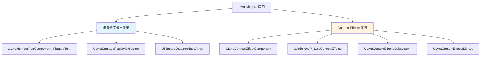
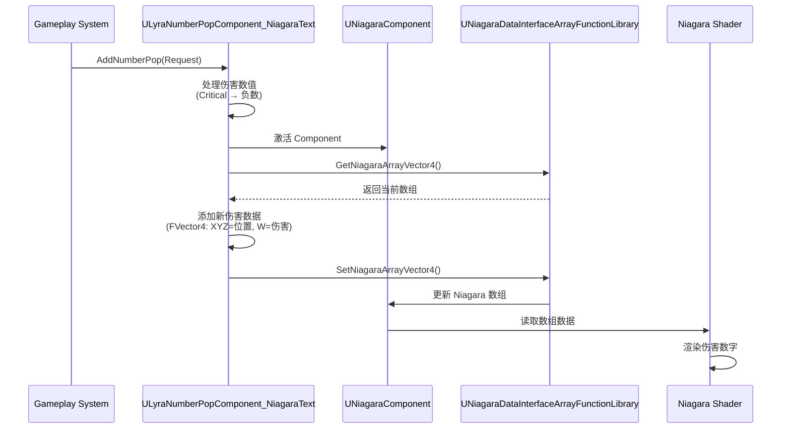
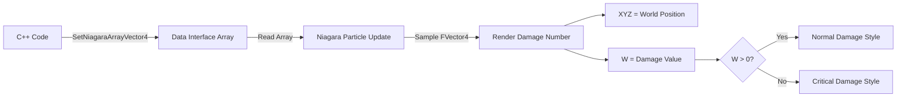
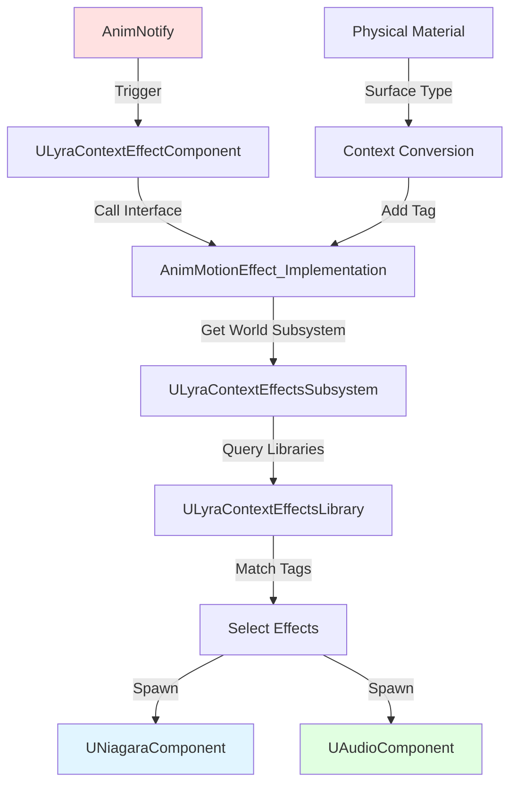
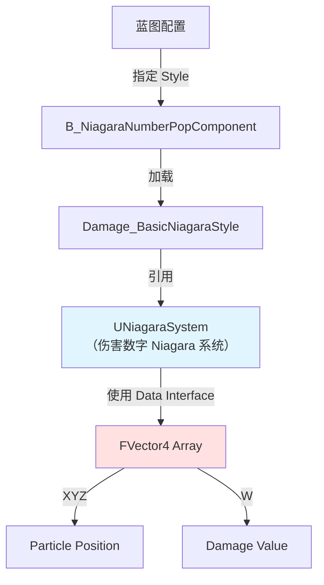

# Lyra项目中的Niagara系统应用实例

> 本文档深入分析 LyraStarterGame 项目中 Niagara 系统的实际应用，包括伤害数字弹出系统和 Context Effects 系统中的 Niagara 集成。

## 目录

1. [概述](#概述)
2. [伤害数字弹出系统（Damage Pop）](#伤害数字弹出系统damage-pop)
3. [Context Effects 系统中的 Niagara 集成](#context-effects-系统中的-niagara-集成)
4. [Lyra 中的 Niagara 资产](#lyra-中的-niagara-资产)
5. [总结与最佳实践](#总结与最佳实践)

---

## 概述

LyraStarterGame 项目中 Niagara 系统主要用于两个核心场景：

1. **伤害数字弹出（Damage Number Pop）**：使用 Niagara 粒子系统渲染伤害数值
2. **Context Effects 系统**：通过动画通知触发 Niagara 特效（脚步声、武器特效等）



---

## 伤害数字弹出系统（Damage Pop）

### 系统架构

伤害数字弹出系统使用 Niagara 粒子系统来渲染伤害数值，通过 Data Interface Array 将伤害数据从 C++ 传递到 Niagara 着色器。



### ULyraNumberPopComponent_NiagaraText 详解

#### 头文件定义

**文件路径**：`Source/LyraGame/Feedback/NumberPops/LyraNumberPopComponent_NiagaraText.h`

```cpp
UCLASS(Blueprintable)
class ULyraNumberPopComponent_NiagaraText : public ULyraNumberPopComponent
{
    GENERATED_BODY()

public:
    ULyraNumberPopComponent_NiagaraText(const FObjectInitializer& ObjectInitializer = FObjectInitializer::Get());

    //~ULyraNumberPopComponent interface
    virtual void AddNumberPop(const FLyraNumberPopRequest& NewRequest) override;
    //~End of ULyraNumberPopComponent interface

protected:
    TArray<int32> DamageNumberArray;

    /** Style patterns to attempt to apply to the incoming number pops */
    UPROPERTY(EditDefaultsOnly, Category = "Number Pop|Style")
    TObjectPtr<ULyraDamagePopStyleNiagara> Style;

    // Niagara Component used to display the damage
    UPROPERTY(EditDefaultsOnly, Category = "Number Pop|Style")
    TObjectPtr<UNiagaraComponent> NiagaraComp;
};
```

**关键成员解析**：

| 成员 | 类型 | 说明 |
|------|------|------|
| `DamageNumberArray` | `TArray<int32>` | 伤害数字数组（保留用于扩展） |
| `Style` | `ULyraDamagePopStyleNiagara*` | 伤害样式数据资产，定义使用的 Niagara 系统 |
| `NiagaraComp` | `UNiagaraComponent*` | Niagara 组件实例，用于渲染伤害数字 |

### AddNumberPop() 方法详解

**文件路径**：`Source/LyraGame/Feedback/NumberPops/LyraNumberPopComponent_NiagaraText.cpp:20-55`

```cpp
void ULyraNumberPopComponent_NiagaraText::AddNumberPop(const FLyraNumberPopRequest& NewRequest)
{
    int32 LocalDamage = NewRequest.NumberToDisplay;

    // [1] 处理伤害数值：暴击转为负数，在 Niagara 中用正负区分样式
    if (NewRequest.bIsCriticalDamage)
    {
        LocalDamage *= -1;
    }
```
延迟创建 Niagara 组件，从 Style 数据资产中加载对应的 Niagara 系统：
```cpp
    // [2] 延迟创建 Niagara 组件（单组件复用模式）
    if (!NiagaraComp)
    {
        NiagaraComp = NewObject<UNiagaraComponent>(GetOwner());
        if (Style != nullptr)
        {
            NiagaraComp->SetAsset(Style->TextNiagara);
            NiagaraComp->bAutoActivate = false;
        }
        NiagaraComp->SetupAttachment(nullptr);
        check(NiagaraComp);
        NiagaraComp->RegisterComponent();
    }

    NiagaraComp->Activate(false);
    NiagaraComp->SetWorldLocation(NewRequest.WorldLocation);
```
通过 Data Interface Array 将伤害数据打包为 FVector4（XYZ=位置，W=伤害）传递到 Niagara：
```cpp
    // [3] 通过 Data Interface Array 传递伤害数据到 Niagara
    TArray<FVector4> DamageList = UNiagaraDataInterfaceArrayFunctionLibrary::GetNiagaraArrayVector4(
        NiagaraComp, Style->NiagaraArrayName);
    
    DamageList.Add(FVector4(
        NewRequest.WorldLocation.X,
        NewRequest.WorldLocation.Y,
        NewRequest.WorldLocation.Z,
        LocalDamage));
    
    UNiagaraDataInterfaceArrayFunctionLibrary::SetNiagaraArrayVector4(
        NiagaraComp, Style->NiagaraArrayName, DamageList);
}
```

**核心流程解析**：

1. **伤害数值处理**（第 22-28 行）：
   - 获取伤害数值 `NumberToDisplay`
   - 如果是 Critical Damage，将数值转为负数（Niagara 中可通过正负判断样式）

2. **Niagara 组件延迟创建**（第 30-43 行）：
   - 使用延迟创建模式（`NewObject` + `RegisterComponent`）
   - 从 `Style` 数据资产中加载 Niagara 系统资产
   - 设置 `bAutoActivate = false`，手动控制激活时机

3. **数据传递到 Niagara**（第 46-53 行）：
   - 激活 Niagara 组件
   - 设置世界位置
   - **关键**：通过 `UNiagaraDataInterfaceArrayFunctionLibrary` 读写 Niagara Data Interface Array
   - 将伤害数据打包为 `FVector4`（XYZ = 位置，W = 伤害值）

### 数据结构设计

#### FLyraNumberPopRequest

**文件路径**：`Source/LyraGame/Feedback/NumberPops/LyraNumberPopComponent.h:14-42`

```cpp
USTRUCT(BlueprintType)
struct FLyraNumberPopRequest
{
    GENERATED_BODY()

    // The world location to create the number pop at
    UPROPERTY(EditAnywhere, BlueprintReadWrite, Category = "Lyra|Number Pops")
    FVector WorldLocation;

    // Tags related to the source/cause of the number pop (for determining a style)
    UPROPERTY(EditAnywhere, BlueprintReadWrite, Category = "Lyra|Number Pops")
    FGameplayTagContainer SourceTags;

    // Tags related to the target of the number pop (for determining a style)
    UPROPERTY(EditAnywhere, BlueprintReadWrite, Category = "Lyra|Number Pops")
    FGameplayTagContainer TargetTags;

    // The number to display
    UPROPERTY(EditAnywhere, BlueprintReadWrite, Category = "Lyra|Number Pops")
    int32 NumberToDisplay = 0;

    // Whether the number is 'critical' or not
    UPROPERTY(EditAnywhere, BlueprintReadWrite, Category = "Lyra|Number Pops")
    bool bIsCriticalDamage = false;
};
```

### ULyraDamagePopStyleNiagara 样式定义

**文件路径**：`Source/LyraGame/Feedback/NumberPops/LyraDamagePopStyleNiagara.h`

```cpp
UCLASS()
class ULyraDamagePopStyleNiagara : public UDataAsset
{
    GENERATED_BODY()

public:
    // Name of the Niagara Array to set the Damage informations
    UPROPERTY(EditDefaultsOnly, Category = "DamagePop")
    FName NiagaraArrayName;

    // Niagara System used to display the damages
    UPROPERTY(EditDefaultsOnly, Category = "DamagePop")
    TObjectPtr<UNiagaraSystem> TextNiagara;
};
```

**关键属性解析**：

| 属性 | 类型 | 说明 |
|------|------|------|
| `NiagaraArrayName` | `FName` | Niagara Data Interface Array 的名称，用于 C++ 和 Niagara 之间的数据传递 |
| `TextNiagara` | `UNiagaraSystem*` | 用于渲染伤害数字的 Niagara 系统资产 |

### 数据传递机制：Data Interface Array

Lyra 使用 **Niagara Data Interface Array** 在 C++ 和 Niagara 之间传递伤害数据：



**数据流步骤**：

1. **C++ 端写入数据**：
   ```cpp
   // 1. 获取当前数组
   TArray<FVector4> DamageList = UNiagaraDataInterfaceArrayFunctionLibrary::GetNiagaraArrayVector4(
       NiagaraComp, Style->NiagaraArrayName);
   
   // 2. 添加新数据（XYZ=位置，W=伤害）
   DamageList.Add(FVector4(Location.X, Location.Y, Location.Z, Damage));
   
   // 3. 写回 Niagara
   UNiagaraDataInterfaceArrayFunctionLibrary::SetNiagaraArrayVector4(
       NiagaraComp, Style->NiagaraArrayName, DamageList);
   ```

2. **Niagara 端读取数据**：
   - 在 Niagara 系统中，通过 **Data Interface** 读取 `FVector4` 数组
   - 每个粒子从数组中采样一个元素
   - 使用 XYZ 作为生成位置
   - 使用 W 作为伤害值（正数=普通，负数=暴击）

---

## Context Effects 系统中的 Niagara 集成

### 系统概述

Context Effects 系统是 Lyra 中用于处理上下文相关特效的框架，支持通过 **Gameplay Tag** 匹配不同的声音和粒子特效。



### ULyraContextEffectComponent 详解

**文件路径**：`Source/LyraGame/Feedback/ContextEffects/LyraContextEffectComponent.h`

#### 类定义

```cpp
UCLASS(MinimalAPI, ClassGroup=(Custom), 
       hidecategories = (Variable, Tags, ComponentTick, ComponentReplication, Activation, Cooking, AssetUserData, Collision), 
       CollapseCategories, meta=(BlueprintSpawnableComponent))
class ULyraContextEffectComponent : public UActorComponent, public ILyraContextEffectsInterface
{
    GENERATED_BODY()

public:
    UE_API ULyraContextEffectComponent();

protected:
    UE_API virtual void BeginPlay() override;
    UE_API virtual void EndPlay(const EEndPlayReason::Type EndPlayReason) override;

public:
    // AnimMotionEffect Implementation
    UFUNCTION(BlueprintCallable)
    UE_API virtual void AnimMotionEffect_Implementation(
        const FName Bone, const FGameplayTag MotionEffect, 
        USceneComponent* StaticMeshComponent,
        const FVector LocationOffset, const FRotator RotationOffset,
        const UAnimSequenceBase* AnimationSequence,
        const bool bHitSuccess, const FHitResult HitResult,
        FGameplayTagContainer Contexts,
        FVector VFXScale = FVector(1), float AudioVolume = 1, float AudioPitch = 1) override;
```
组件的上下文配置与运行时追踪属性：
```cpp
    // [配置] 上下文转换与默认特效库
    UPROPERTY(EditAnywhere, BlueprintReadOnly)
    bool bConvertPhysicalSurfaceToContext = true;

    UPROPERTY(EditAnywhere)
    FGameplayTagContainer DefaultEffectContexts;

    UPROPERTY(EditAnywhere)
    TSet<TSoftObjectPtr<ULyraContextEffectsLibrary>> DefaultContextEffectsLibraries;

private:
    // [运行时] 当前上下文与活跃特效组件追踪
    UPROPERTY(Transient)
    FGameplayTagContainer CurrentContexts;

    UPROPERTY(Transient)
    TSet<TSoftObjectPtr<ULyraContextEffectsLibrary>> CurrentContextEffectsLibraries;

    UPROPERTY(Transient)
    TArray<TObjectPtr<UAudioComponent>> ActiveAudioComponents;

    UPROPERTY(Transient)
    TArray<TObjectPtr<UNiagaraComponent>> ActiveNiagaraComponents;
};
```

**核心功能**：

1. **上下文管理**：
   - `DefaultEffectContexts`：默认上下文标签
   - `CurrentContexts`：当前生效的上下文（运行时）
   - `bConvertPhysicalSurfaceToContext`：自动将物理材质表面类型转换为 Context Tag

2. **特效库管理**：
   - `DefaultContextEffectsLibraries`：默认加载的特效库
   - `CurrentContextEffectsLibraries`：当前生效的特效库（运行时）

3. **活跃组件追踪**：
   - `ActiveAudioComponents`：追踪当前播放的音频组件
   - `ActiveNiagaraComponents`：追踪当前播放的 Niagara 组件

#### AnimMotionEffect_Implementation 详解

**文件路径**：`Source/LyraGame/Feedback/ContextEffects/LyraContextEffectComponent.cpp:61-149`

```cpp
void ULyraContextEffectComponent::AnimMotionEffect_Implementation(
    const FName Bone, const FGameplayTag MotionEffect,
    USceneComponent* StaticMeshComponent,
    const FVector LocationOffset, const FRotator RotationOffset,
    const UAnimSequenceBase* AnimationSequence,
    const bool bHitSuccess, const FHitResult HitResult,
    FGameplayTagContainer Contexts,
    FVector VFXScale, float AudioVolume, float AudioPitch)
{
    // [1] 准备组件数组与聚合当前 Contexts
    TArray<UAudioComponent*> AudioComponentsToAdd;
    TArray<UNiagaraComponent*> NiagaraComponentsToAdd;
    FGameplayTagContainer TotalContexts;

    TotalContexts.AppendTags(Contexts);
    TotalContexts.AppendTags(CurrentContexts);
```
将检测到的物理材质表面直接转换成对应的 Context tag：
```cpp
    // [2] 检查是否需要将物理表面类型转换为 Context
    if (bConvertPhysicalSurfaceToContext)
    {
        TWeakObjectPtr<UPhysicalMaterial> PhysicalSurfaceTypePtr = HitResult.PhysMaterial;
        if (PhysicalSurfaceTypePtr.IsValid())
        {
            TEnumAsByte<EPhysicalSurface> PhysicalSurfaceType = PhysicalSurfaceTypePtr->SurfaceType;
            if (const ULyraContextEffectsSettings* LyraContextEffectsSettings = GetDefault<ULyraContextEffectsSettings>())
            {
                if (const FGameplayTag* SurfaceContextPtr = LyraContextEffectsSettings->SurfaceTypeToContextMap.Find(PhysicalSurfaceType))
                {
                    TotalContexts.AddTag(*SurfaceContextPtr);
                }
            }
        }
    }
```
缓存当前活跃的 Audio 和 Niagara 组件，并通过 Subsystem 生成新的 Context Effects：
```cpp
    // [3] 缓存当前活跃组件并通过 Subsystem 生成特效
    for (UAudioComponent* ActiveAudioComponent : ActiveAudioComponents)
    {
        if (ActiveAudioComponent) AudioComponentsToAdd.Add(ActiveAudioComponent);
    }
    for (UNiagaraComponent* ActiveNiagaraComponent : ActiveNiagaraComponents)
    {
        if (ActiveNiagaraComponent) NiagaraComponentsToAdd.Add(ActiveNiagaraComponent);
    }

    if (const UWorld* World = GetWorld())
    {
        if (ULyraContextEffectsSubsystem* LyraContextEffectsSubsystem = World->GetSubsystem<ULyraContextEffectsSubsystem>())
        {
            TArray<UAudioComponent*> AudioComponents;
            TArray<UNiagaraComponent*> NiagaraComponents;

            LyraContextEffectsSubsystem->SpawnContextEffects(
                GetOwner(), StaticMeshComponent, Bone,
                LocationOffset, RotationOffset, MotionEffect, TotalContexts,
                AudioComponents, NiagaraComponents, VFXScale, AudioVolume, AudioPitch);

            AudioComponentsToAdd.Append(AudioComponents);
            NiagaraComponentsToAdd.Append(NiagaraComponents);
        }
    }
```
最后更新活跃组件列表，防止组件泄漏：
```cpp
    // [4] 更新并缓存当前活跃组件列表
    ActiveAudioComponents.Empty();
    ActiveAudioComponents.Append(AudioComponentsToAdd);
    ActiveNiagaraComponents.Empty();
    ActiveNiagaraComponents.Append(NiagaraComponentsToAdd);
}
```

**执行流程**：

1. **上下文聚合**（第 70-74 行）：
   - 合并传入的 `Contexts` 和组件默认的 `CurrentContexts`

2. **物理表面类型转换**（第 76-100 行）：
   - 如果启用了 `bConvertPhysicalSurfaceToContext`
   - 从 `HitResult` 中获取物理材质
   - 通过 `ULyraContextEffectsSettings` 将 `EPhysicalSurface` 转换为 `FGameplayTag`
   - 添加到 `TotalContexts`

3. **清理失效组件**（第 102-118 行）：
   - 遍历 `ActiveAudioComponents` 和 `ActiveNiagaraComponents`
   - 移除已经被销毁的组件

4. **调用 Subsystem 生成特效**（第 120-138 行）：
   - 获取 `ULyraContextEffectsSubsystem`
   - 调用 `SpawnContextEffects()` 生成 Audio 和 Niagara 组件
   - 将新生成的组件添加到活跃列表

5. **更新活跃组件列表**（第 141-147 行）：
   - 清空旧列表
   - 添加所有有效组件（包括新生成的）

### UAnimNotify_LyraContextEffects 动画通知

**文件路径**：`Source/LyraGame/Feedback/ContextEffects/AnimNotify_LyraContextEffects.h`

#### 类定义

```cpp
UCLASS(MinimalAPI, const, hidecategories=Object, CollapseCategories, Config = Game, 
       meta=(DisplayName="Play Context Effects"))
class UAnimNotify_LyraContextEffects : public UAnimNotify
{
    GENERATED_BODY()

public:
    UE_API UAnimNotify_LyraContextEffects();

    // [1] 核心特效标识与变换偏移
    UPROPERTY(EditAnywhere, BlueprintReadWrite, Category = "AnimNotify", meta = (DisplayName = "Effect", ExposeOnSpawn = true))
    FGameplayTag Effect;

    UPROPERTY(EditAnywhere, BlueprintReadWrite, Category = "AnimNotify", meta = (ExposeOnSpawn = true))
    FVector LocationOffset = FVector::ZeroVector;

    UPROPERTY(EditAnywhere, BlueprintReadWrite, Category = "AnimNotify", meta = (ExposeOnSpawn = true))
    FRotator RotationOffset = FRotator::ZeroRotator;
```
VFX 和音频的播放参数配置：
```cpp
    // [2] VFX 与音频播放参数
    UPROPERTY(EditAnywhere, BlueprintReadWrite, Category = "AnimNotify", meta = (ExposeOnSpawn = true))
    FLyraContextEffectAnimNotifyVFXSettings VFXProperties;

    UPROPERTY(EditAnywhere, BlueprintReadWrite, Category = "AnimNotify", meta = (ExposeOnSpawn = true))
    FLyraContextEffectAnimNotifyAudioSettings AudioProperties;
```
骨骼附件与射线检测配置：
```cpp
    // [3] 骨骼附件与射线检测配置
    UPROPERTY(EditAnywhere, BlueprintReadWrite, Category = "AttachmentProperties", meta = (ExposeOnSpawn = true))
    uint32 bAttached : 1;

    UPROPERTY(EditAnywhere, BlueprintReadWrite, Category = "AttachmentProperties", meta = (ExposeOnSpawn = true, EditCondition = "bAttached"))
    FName SocketName;

    UPROPERTY(EditAnywhere, BlueprintReadWrite, Category = "AnimNotify", meta = (ExposeOnSpawn = true))
    uint32 bPerformTrace : 1;

    UPROPERTY(EditAnywhere, BlueprintReadWrite, Category = "AnimNotify", meta = (ExposeOnSpawn = true, EditCondition = "bPerformTrace"))
    FLyraContextEffectAnimNotifyTraceSettings TraceProperties;
};
```

**关键属性**：

| 属性 | 类型 | 说明 |
|------|------|------|
| `Effect` | `FGameplayTag` | 要触发的特效标签（用于匹配 Library 中的特效） |
| `LocationOffset` | `FVector` | 相对于 Socket 的位置偏移 |
| `RotationOffset` | `FRotator` | 相对于 Socket 的旋转偏移 |
| `VFXProperties` | `FLyraContextEffectAnimNotifyVFXSettings` | VFX 缩放设置 |
| `AudioProperties` | `FLyraContextEffectAnimNotifyAudioSettings` | 音频音量和音调设置 |
| `bAttached` | `bool` | 是否附加到骨骼/Socket |
| `SocketName` | `FName` | 附加的 Socket 名称 |
| `bPerformTrace` | `bool` | 是否执行射线检测（用于获取物理表面类型） |
| `TraceProperties` | `FLyraContextEffectAnimNotifyTraceSettings` | 射线检测配置 |

#### Notify 方法实现

**文件路径**：`Source/LyraGame/Feedback/ContextEffects/AnimNotify_LyraContextEffects.cpp:45-200`

```cpp
void UAnimNotify_LyraContextEffects::Notify(
    USkeletalMeshComponent* MeshComp, 
    UAnimSequenceBase* Animation,
    const FAnimNotifyEventReference& EventReference)
{
    Super::Notify(MeshComp, Animation, EventReference);

    if (MeshComp && (AActor* OwningActor = MeshComp->GetOwner()))
    {
        // [1] 执行射线检测（如果需要获取地面材质）
        bool bHitSuccess = false;
        FHitResult HitResult;
        FCollisionQueryParams QueryParams;

        if (TraceProperties.bIgnoreActor)
        {
            QueryParams.AddIgnoredActor(OwningActor);
        }
        QueryParams.bReturnPhysicalMaterial = true;

        if (bPerformTrace)
        {
            FVector TraceStart = bAttached ? 
                MeshComp->GetSocketLocation(SocketName) : 
                MeshComp->GetComponentLocation();

            if (UWorld* World = OwningActor->GetWorld())
            {
                bHitSuccess = World->LineTraceSingleByChannel(
                    HitResult, TraceStart, 
                    (TraceStart + TraceProperties.EndTraceLocationOffset),
                    TraceProperties.TraceChannel, QueryParams, 
                    FCollisionResponseParams::DefaultResponseParam);
            }
        }
```
收集所有实现了 Context Effects 接口的对象（Actor 及其 Components）：
```cpp
        // [2] 收集实现了 Context Effects 接口的对象
        FGameplayTagContainer Contexts;
        TArray<UObject*> LyraContextEffectImplementingObjects;

        if (OwningActor->Implements<ULyraContextEffectsInterface>())
        {
            LyraContextEffectImplementingObjects.Add(OwningActor);
        }

        for (const auto Component : OwningActor->GetComponents())
        {
            if (Component && Component->Implements<ULyraContextEffectsInterface>())
            {
                LyraContextEffectImplementingObjects.Add(Component);
            }
        }
```
遍历调用每个对象的 AnimMotionEffect 接口，触发实际的 Niagara 和 Audio 特效：
```cpp
        // [3] 遍历触发每个对象的 AnimMotionEffect
        for (UObject* Obj : LyraContextEffectImplementingObjects)
        {
            if (Obj)
            {
                ILyraContextEffectsInterface::Execute_AnimMotionEffect(
                    Obj,
                    (bAttached ? SocketName : FName("None")),
                    Effect, MeshComp, LocationOffset, RotationOffset,
                    Animation, bHitSuccess, HitResult, Contexts, 
                    VFXProperties.Scale,
                    AudioProperties.VolumeMultiplier, 
                    AudioProperties.PitchMultiplier);
            }
        }
    }
}
```

**执行流程**：

```mermaid
sequenceDiagram
    participant Anim as Animation System
    participant Notify as UAnimNotify_LyraContextEffects
    participant Actor as Owning Actor
    participant Component as ULyraContextEffectComponent
    participant Subsystem as ULyraContextEffectsSubsystem
    participant Library as ULyraContextEffectsLibrary

    Anim->>Notify: Notify() 触发
    Notify->>Notify: 执行射线检测?<br/>(bPerformTrace)
    Notify->>Notify: 获取 HitResult
    Notify->>Actor: 检查是否实现接口
    Notify->>Component: 检查是否实现接口
    Notify->>Component: Execute_AnimMotionEffect()
    Component->>Component: 聚合 Contexts
    Component->>Component: 转换物理表面类型
    Component->>Subsystem: SpawnContextEffects()
    Subsystem->>Subsystem: 查找 Actor 的 Library Set
    Subsystem->>Library: GetEffects(Effect, Contexts)
    Library-->>Subsystem: 返回 Sounds + NiagaraSystems
    Subsystem->>Subsystem: SpawnSoundAttached()
    Subsystem->>Subsystem: SpawnSystemAttached()
```

### ULyraContextEffectsSubsystem 特效管理系统

**文件路径**：`Source/LyraGame/Feedback/ContextEffects/LyraContextEffectsSubsystem.h`

#### 类定义

```cpp
UCLASS(MinimalAPI)
class ULyraContextEffectsSubsystem : public UWorldSubsystem
{
    GENERATED_BODY()
    
public:
    UFUNCTION(BlueprintCallable, Category = "ContextEffects")
    UE_API void SpawnContextEffects(
        const AActor* SpawningActor,
        USceneComponent* AttachToComponent,
        const FName AttachPoint,
        const FVector LocationOffset,
        const FRotator RotationOffset,
        FGameplayTag Effect,
        FGameplayTagContainer Contexts,
        TArray<UAudioComponent*>& AudioOut,
        TArray<UNiagaraComponent*>& NiagaraOut,
        FVector VFXScale = FVector(1),
        float AudioVolume = 1,
        float AudioPitch = 1);

    UFUNCTION(BlueprintCallable, Category = "ContextEffects")
    UE_API bool GetContextFromSurfaceType(
        TEnumAsByte<EPhysicalSurface> PhysicalSurface, 
        FGameplayTag& Context);

    UFUNCTION(BlueprintCallable, Category = "ContextEffects")
    UE_API void LoadAndAddContextEffectsLibraries(
        AActor* OwningActor, 
        TSet<TSoftObjectPtr<ULyraContextEffectsLibrary>> ContextEffectsLibraries);

    UFUNCTION(BlueprintCallable, Category = "ContextEffects")
    UE_API void UnloadAndRemoveContextEffectsLibraries(AActor* OwningActor);

private:
    UPROPERTY(Transient)
    TMap<TObjectPtr<AActor>, TObjectPtr<ULyraContextEffectsSet>> ActiveActorEffectsMap;
};
```

**核心功能**：

1. **SpawnContextEffects()**：根据 Effect Tag 和 Contexts 生成 Audio 和 Niagara 组件
2. **GetContextFromSurfaceType()**：将物理表面类型转换为 Context Tag
3. **LoadAndAddContextEffectsLibraries()**：为 Actor 加载特效库
4. **UnloadAndRemoveContextEffectsLibraries()**：卸载 Actor 的特效库

#### SpawnContextEffects 实现

**文件路径**：`Source/LyraGame/Feedback/ContextEffects/LyraContextEffectsSubsystem.cpp:20-89`

```cpp
void ULyraContextEffectsSubsystem::SpawnContextEffects(
    const AActor* SpawningActor,
    USceneComponent* AttachToComponent,
    const FName AttachPoint,
    const FVector LocationOffset,
    const FRotator RotationOffset,
    FGameplayTag Effect,
    FGameplayTagContainer Contexts,
    TArray<UAudioComponent*>& AudioOut,
    TArray<UNiagaraComponent*>& NiagaraOut,
    FVector VFXScale,
    float AudioVolume,
    float AudioPitch)
{
    // [1] 从 Actor 的特效库中查找匹配的 Sound 和 Niagara System
    if (TObjectPtr<ULyraContextEffectsSet>* EffectsLibrariesSetPtr = ActiveActorEffectsMap.Find(SpawningActor))
    {
        if (ULyraContextEffectsSet* EffectsLibraries = *EffectsLibrariesSetPtr)
        {
            TArray<USoundBase*> TotalSounds;
            TArray<UNiagaraSystem*> TotalNiagaraSystems;

            for (ULyraContextEffectsLibrary* EffectLibrary : EffectsLibraries->LyraContextEffectsLibraries)
            {
                if (EffectLibrary && EffectLibrary->GetContextEffectsLibraryLoadState() == EContextEffectsLibraryLoadState::Loaded)
                {
                    TArray<USoundBase*> Sounds;
                    TArray<UNiagaraSystem*> NiagaraSystems;
                    EffectLibrary->GetEffects(Effect, Contexts, Sounds, NiagaraSystems);
                    TotalSounds.Append(Sounds);
                    TotalNiagaraSystems.Append(NiagaraSystems);
                }
                else if (EffectLibrary && EffectLibrary->GetContextEffectsLibraryLoadState() == EContextEffectsLibraryLoadState::Unloaded)
                {
                    EffectLibrary->LoadEffects();
                }
            }
```
根据匹配结果生成 Audio 和 Niagara 组件：
```cpp
            // [2] 生成匹配的 Audio 组件
            for (USoundBase* Sound : TotalSounds)
            {
                UAudioComponent* AudioComponent = UGameplayStatics::SpawnSoundAttached(
                    Sound, AttachToComponent, AttachPoint, LocationOffset, RotationOffset, 
                    EAttachLocation::KeepRelativeOffset,
                    false, AudioVolume, AudioPitch, 0.0f, nullptr, nullptr, true);
                AudioOut.Add(AudioComponent);
            }

            // [3] 生成匹配的 Niagara 组件
            for (UNiagaraSystem* NiagaraSystem : TotalNiagaraSystems)
            {
                UNiagaraComponent* NiagaraComponent = UNiagaraFunctionLibrary::SpawnSystemAttached(
                    NiagaraSystem, AttachToComponent, AttachPoint, LocationOffset,
                    RotationOffset, VFXScale, EAttachLocation::KeepRelativeOffset, 
                    true, ENCPoolMethod::None, true, true);
                NiagaraOut.Add(NiagaraComponent);
            }
        }
    }
}
```

**核心逻辑**：

1. **查找 Actor 的特效库**（第 35-38 行）：
   - 从 `ActiveActorEffectsMap` 中查找该 Actor 对应的 `ULyraContextEffectsSet`

2. **遍历特效库**（第 45-66 行）：
   - 调用 `GetEffects()` 根据 Effect Tag 和 Contexts 匹配特效
   - 如果库未加载，调用 `LoadEffects()` 异步加载

3. **生成 Audio 组件**（第 69-76 行）：
   - 使用 `UGameplayStatics::SpawnSoundAttached()` 生成音频

4. **生成 Niagara 组件**（第 79-86 行）：
   - 使用 `UNiagaraFunctionLibrary::SpawnSystemAttached()` 生成 Niagara 特效
   - **这是 Niagara 系统的实际生成点**

### ULyraContextEffectsLibrary 特效库

**文件路径**：`Source/LyraGame/Feedback/ContextEffects/LyraContextEffectsLibrary.h`

#### 数据结构

```cpp
USTRUCT(BlueprintType)
struct FLyraContextEffects
{
    GENERATED_BODY()

    UPROPERTY(EditAnywhere, BlueprintReadOnly)
    FGameplayTag EffectTag;

    UPROPERTY(EditAnywhere, BlueprintReadOnly)
    FGameplayTagContainer Context;

    UPROPERTY(EditAnywhere, BlueprintReadOnly, 
              meta = (AllowedClasses = "/Script/Engine.SoundBase, /Script/Niagara.NiagaraSystem"))
    TArray<FSoftObjectPath> Effects;
};

UCLASS(MinimalAPI, BlueprintType)
class ULyraContextEffectsLibrary : public UObject
{
    GENERATED_BODY()
    
public:
    UPROPERTY(EditAnywhere, BlueprintReadOnly)
    TArray<FLyraContextEffects> ContextEffects;

    UFUNCTION(BlueprintCallable)
    UE_API void GetEffects(
        const FGameplayTag Effect, 
        const FGameplayTagContainer Context,
        TArray<USoundBase*>& Sounds, 
        TArray<UNiagaraSystem*>& NiagaraSystems);

    UFUNCTION(BlueprintCallable)
    UE_API void LoadEffects();

    UE_API EContextEffectsLibraryLoadState GetContextEffectsLibraryLoadState();
};
```

**特效匹配逻辑**：

- `EffectTag`：要匹配的特效标签（如 `MotionEffect.Footstep`）
- `Context`：上下文标签容器（如 `SurfaceType.Ground`、`MaterialType.Metal`）
- `Effects`：关联的 Audio 和 Niagara 资产（软引用）

**GetEffects() 匹配规则**：

1. `EffectTag` 必须精确匹配
2. `Context` 必须完全包含请求的所有标签（AND 关系）
3. 返回所有匹配的 `USoundBase*` 和 `UNiagaraSystem*`

---

## Lyra 中的 Niagara 资产

### 已发现的 Niagara 资产

在 `Content/` 目录中发现了以下 Niagara 相关资产：

| 资产路径 | 类型 | 说明 |
|---------|------|------|
| `Content/Effects/Blueprints/Damage_BasicNiagaraStyle.uasset` | `ULyraDamagePopStyleNiagara` | 基础伤害样式数据资产 |
| `Content/Effects/Blueprints/B_NiagaraNumberPopComponent.uasset` | Blueprint | Niagara 伤害数字组件蓝图 |

### 资产使用流程



---

## 总结与最佳实践

### Niagara 在 Lyra 中的应用模式

1. **伤害数字弹出**：
   - 使用 `UNiagaraDataInterfaceArrayFunctionLibrary` 进行 C++ ↔ Niagara 数据传递
   - 将数据打包到 `FVector4`（XYZ=位置，W=伤害）
   - 支持 Critical Damage 区分（正负值）

2. **Context Effects 系统**：
   - 基于 `FGameplayTag` 的特效匹配系统
   - 支持物理表面类型自动转换为 Context
   - 统一管理 Audio 和 Niagara 特效的生成和生命周期

### 最佳实践

1. **数据传递**：
   - 使用 Data Interface Array 进行批量数据传递
   - 在 C++ 端打包数据，在 Niagara 端解包

2. **性能优化**：
   - 复用 `UNiagaraComponent`（伤害数字系统中单组件多数字）
   - 追踪活跃组件，避免泄漏（`ActiveNiagaraComponents`）

3. **扩展性**：
   - 通过 `ULyraContextEffectsLibrary` 数据资产配置特效
   - 支持运行时动态加载/卸载特效库

---

**参考资源**：

- [Niagara 系统概览](01-Niagara系统框架深度分析-概览.md)
- [Niagara 核心框架](02-Niagara系统核心框架深度分析.md)
- [Unreal Engine 5 官方文档 - Niagara](https://docs.unrealengine.com/5.0/zh-CN/)

---
> 最后更新：2026-05-17

<!-- nav:auto -->

---

**导航**: ← [[30-tutorials/niagara/07-Niagara渲染器和性能优化系统|07-Niagara渲染器和性能优化系统]]

<!-- /nav:auto -->
