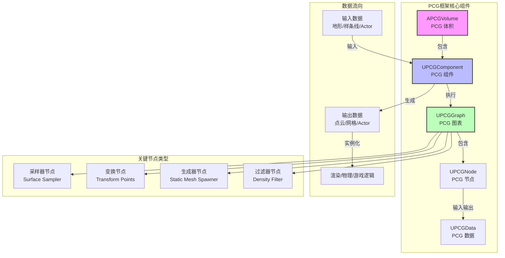
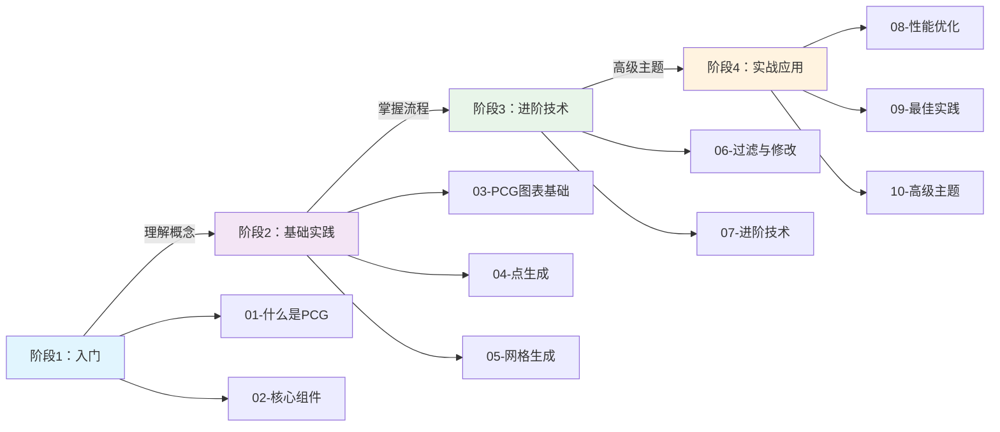

# PCG程序化内容生成框架教程系列

> **一句话定位**：PCG 是 UE5 内置的**节点式程序化生成框架**，让你通过可视化图表定义规则，自动生成大规模游戏世界（植被、建筑、道具等），替代传统的手工摆放或 Houdini 依赖。

---

## 概述：PCG 是什么？

### 核心概念

**PCG（Procedural Content Generation）** 是 Unreal Engine 5.2+ 引入的官方程序化内容生成框架。它的核心价值是：

1. **可视化编程** — 通过节点图表（PCG Graph）定义生成规则，无需编写 C++ 代码
2. **大规模生成** — 支持数百万个实例的高效生成和渲染（基于 HISM/PCG 专用渲染）
3. **非破坏性迭代** — 修改规则后重新生成，不会破坏手工调整的内容
4. **可控性** — 美术/设计师可以通过纹理、样条线、排除体积等方式精细控制生成结果

### PCG 能做什么？

| 应用场景 | 示例 |
|---------|------|
| **植被散布** | 在地形上随机生成树木、草丛、岩石 |
| **城市生成** | 沿道路生成建筑、路灯、围栏 |
| **地牢生成** | 程序化生成房间、走廊、道具 |
| **道具布置** | 在建筑物内部生成家具、装饰品 |
| **自然地貌** | 根据坡度、海拔、纹理生成不同的生态系统 |

---

## 核心架构（Mermaid 图示）



### 架构说明

1. **APCGVolume（PCG 体积）** — 定义生成范围的 Actor，包含一个 UPCGComponent
2. **UPCGComponent（PCG 组件）** — 执行 PCG 图表的核心组件，负责调度生成任务
3. **UPCGGraph（PCG 图表）** — 存储节点和连接关系的资产，定义生成规则
4. **UPCGNode（PCG 节点）** — 图表中的单个节点，执行特定的生成/过滤/变换操作
5. **UPCGData（PCG 数据）** — 节点之间传递的数据（点云、网格、Actor 等）

---

## 核心类源码分析（基于 UE 5.7）

### 1. UPCGComponent（PCG 组件）

**源码位置**：`Engine/Plugins/PCG/Source/PCG/Public/PCGComponent.h`

**核心功能**：
- 作为 `UActorComponent` 的派生类，附加到 `APCGVolume` 上
- 实现 `IPCGraphExecutionSource` 接口，作为图表执行的入口
- 管理生成任务的调度、执行、取消
- 支持三种生成触发模式：
  - `GenerateOnLoad` — 加载时自动生成
  - `GenerateOnDemand` — 通过蓝图/代码手动触发
  - `GenerateAtRuntime` — 由 Runtime Generation Scheduler 调度

**关键代码片段**（L149-L167）：
```cpp
UCLASS(MinimalAPI, BlueprintType, ClassGroup = (Procedural), meta = (BlueprintSpawnableComponent, PrioritizeCategories = "PCG"))
class UPCGComponent : public UActorComponent, public IPCGGraphExecutionSource
{
    GENERATED_BODY()

    // 生成触发模式
    UPROPERTY(BlueprintReadWrite, EditAnywhere, Category = "PCG")
    EPCGComponentGenerationTrigger GenerationTrigger = EPCGComponentGenerationTrigger::GenerateOnLoad;

    // 关联的 PCG 图表
    UPROPERTY(BlueprintReadWrite, EditAnywhere, Category = "PCG")
    TObjectPtr<UPCGGraph> Graph = nullptr;

    // 执行生成
    UFUNCTION(BlueprintCallable, Category = "PCG")
    void Generate();

    // 取消生成
    UFUNCTION(BlueprintCallable, Category = "PCG")
    void CancelGeneration();
};
```

### 2. UPCGGraph（PCG 图表）

**源码位置**：`Engine/Plugins/PCG/Source/PCG/Public/PCGGraph.h`

**核心功能**：
- 存储 PCG 节点（`UPCGNode`）和边（`UPCGEdge`）
- 支持**编译**为执行图（类似蓝图编译）
- 支持**实例化**（`UPCGGraphInstance`），允许参数覆盖
- 支持**子图**（`UPCGSubgraph`），实现模块化复用

**关键概念**：
- **节点（Node）** — 图表中的单个操作单元
- **引脚（Pin）** — 节点的输入输出接口，用于连接节点
- **边（Edge）** — 连接两个引脚的连线，定义数据流向

### 3. FPCGPoint（PCG 点）

**源码位置**：`Engine/Plugins/PCG/Source/PCG/Public/PCGPoint.h`

**核心功能**：
- PCG 中最基本的数据单元 — **点**
- 每个点包含：
  - `Transform` — 位置、旋转、缩放
  - `Density` — 密度值（用于过滤和权重计算）
  - `BoundsMin/BoundsMax` — 点的边界框
  - `Color` — RGBA 颜色值
  - `Steepness` — 坡度影响因子
  - `Seed` — 随机种子

**关键代码片段**（L36-L66）：
```cpp
USTRUCT(BlueprintType)
struct FPCGPoint
{
    GENERATED_BODY()

    // 点的变换（位置、旋转、缩放）
    UPROPERTY(BlueprintReadWrite, EditAnywhere, Category = Properties)
    FTransform Transform;

    // 密度值（0-1），用于权重计算
    UPROPERTY(BlueprintReadWrite, EditAnywhere, Category = Properties)
    float Density = 1.0f;

    // 点的局部边界框
    UPROPERTY(BlueprintReadWrite, EditAnywhere, Category = Properties)
    FVector BoundsMin = -FVector::One();

    UPROPERTY(BlueprintReadWrite, EditAnywhere, Category = Properties)
    FVector BoundsMax = FVector::One();

    // 颜色（RGBA）
    UPROPERTY(BlueprintReadWrite, EditAnywhere, Category = Properties)
    FVector4 Color = FVector4::One();

    // 坡度因子（0=平坦，1=陡峭）
    UPROPERTY(BlueprintReadWrite, EditAnywhere, Category = Properties, meta = (ClampMin = "0", ClampMax = "1"))
    float Steepness = 0.5f;

    // 随机种子
    UPROPERTY(BlueprintReadWrite, EditAnywhere, Category = Properties)
    int32 Seed = 0;
};
```

### 4. UPCGData（PCG 数据基类）

**源码位置**：`Engine/Plugins/PCG/Source/PCG/Public/PCGData.h`

**核心功能**：
- 所有 PCG 数据的基类
- 支持多种数据类型：
  - `Point Data` — 点云数据（最常用）
  - `Spatial Data` — 空间数据（地形、网格）
  - `Param Data` — 参数数据
  - `Actor Data` — Actor 数据

**关键概念**：
- **Metadata** — 每个数据点可以附加元数据（类似 Data Table）
- **Attribute Selector** — 用于选择和修改元数据属性

---

## 与 Lyra 项目的关系

**重要发现**：Lyra 项目（UE5 官方示例）**目前没有直接使用 PCG 框架**。

Lyra 使用的是：
- **GameFeature Plugin** — 模块化游戏功能
- **Modular Gameplay** — 组件化游戏逻辑
- **GAS（Gameplay Ability System）** — 能力系统
- **State Tree** — 行为树替代方案

**但是**，PCG 可以与 Lyra 结合使用：
1. **生成游戏世界** — 使用 PCG 生成 Lyra 的地图（地形、植被、建筑）
2. **生成道具** — 使用 PCG 在 Lyra 的地图上生成武器、道具、敌人
3. **动态关卡** — 使用 PCG 实现 Roguelike 风格的程序化关卡

---

## 系列阅读指南

### 学习路径（4 个阶段）



### 每篇教程的预期学习内容

| 课时 | 标题 | 学习目标 | 难度 |
|------|------|----------|------|
| 00 | 系列概览（本文） | 理解 PCG 是什么、核心架构、学习路径 | ⭐ |
| 01 | 什么是 PCG？ | 理解程序化生成的概念、PCG 的应用场景 | ⭐ |
| 02 | 核心组件详解 | 掌握 PCG Volume、PCG Component、PCG Graph | ⭐⭐ |
| 03 | PCG 图表基础 | 学会创建和编辑 PCG 图表、理解节点系统 | ⭐⭐ |
| 04 | 点生成技术 | 掌握 Surface Sampler、Points From Actor 等采样器 | ⭐⭐ |
| 05 | 网格生成技术 | 学会使用 Static Mesh Spawner 生成实例 | ⭐⭐⭐ |
| 06 | 过滤与修改 | 掌握 Density Filter、Transform Points 等节点 | ⭐⭐⭐ |
| 07 | 进阶技术 | 学习子图、蓝图交互、GPU 加速 | ⭐⭐⭐ |
| 08 | 性能优化 | 掌握 HISM、剔除、LOD、生成策略 | ⭐⭐⭐⭐ |
| 09 | 最佳实践 | 学习大型项目管理、调试技巧、常见陷阱 | ⭐⭐⭐ |
| 10 | 高级主题 | 自定义节点、C++ 扩展、与 Lyra 集成 | ⭐⭐⭐⭐ |

---

## 相关页面

### 前置知识
- [[30-tutorials/ue-framework/00-UE框架概述]] - UE 框架总览（理解 Actor、Component、World）
- [[30-tutorials/ue-framework/40-actor-system/00-AActor架构概述]] - AActor 架构（理解 Actor 生命周期）

### 相关技术
- [[30-tutorials/animation/06-Lyra动画系统实现详解]] - Lyra 动画系统（对比 PCG 的程序化思路）
- [[30-tutorials/niagara/08-Lyra项目中的Niagara系统应用实例]] - Niagara 特效系统（类似的节点式编辑）

### 外部资源
- [UE5 PCG 官方文档](https://dev.epicgames.com/documentation/zh-cn/unreal-engine/procedural-content-generation-framework-in-unreal-engine)
- [PCG 社区教程](https://www.gamedevcore.com/blog/ue5-pcg-tutorial-procedural-generation/)

---

## 下一步

**推荐学习顺序**：
1. 先读 **01-什么是PCG**（理解概念）
2. 再读 **02-核心组件详解**（理解架构）
3. 然后跟着 **03-PCG图表基础** 动手实践
4. 逐步深入后续课时

**实践建议**：
- 每学一个课时，就在 UE5 编辑器中动手尝试
- 从简单的岩石散布开始，逐步增加复杂度
- 遇到问题时，参考 **09-最佳实践** 和 **10-高级主题**

---

<!-- nav:auto -->

---

**导航**: [[30-tutorials/pcg/01-什么是PCG程序化内容生成|01-什么是PCG程序化内容生成]] →

<!-- /nav:auto -->
