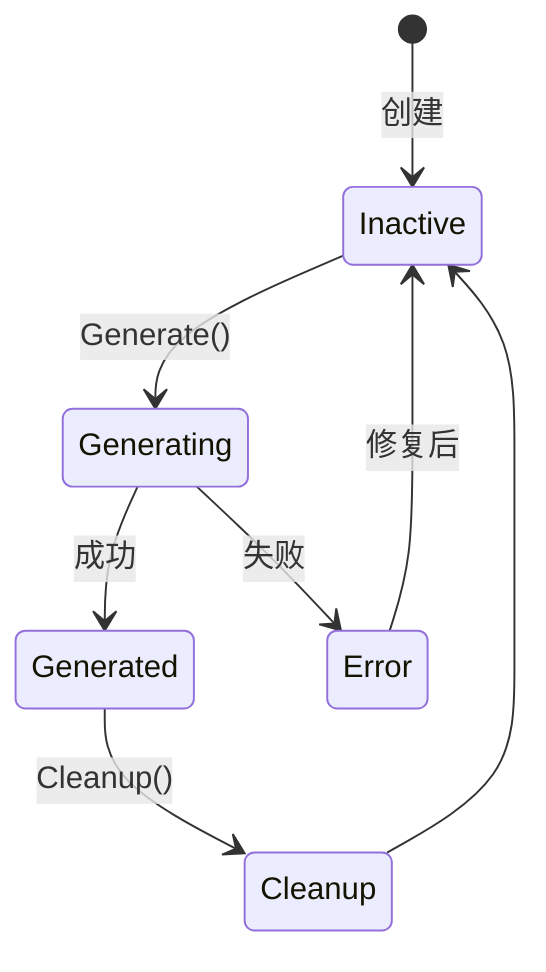
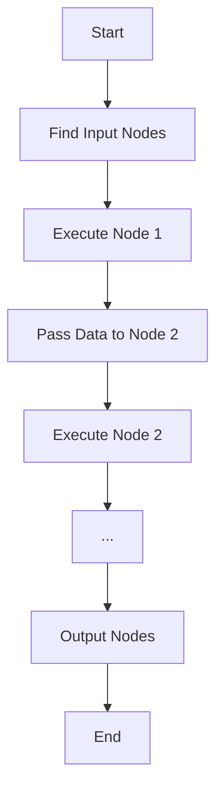
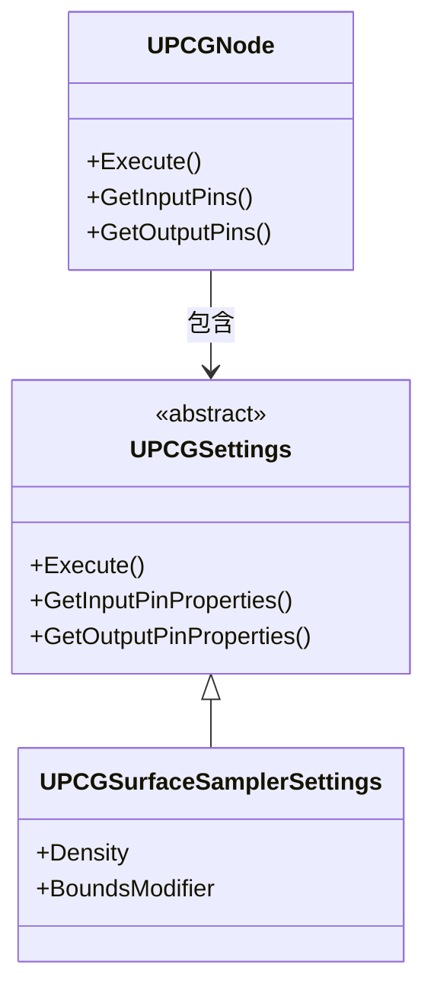

# PCG核心组件详解

> **前置知识**：[01-什么是PCG](./01-什么是PCG程序化内容生成.md)
> **预计阅读时间**：25 分钟

## 概念直觉

### PCG 的"三驾马车"

PCG 框架由三个核心类驱动，它们的关系就像 **工厂生产线**：

```
PCG Volume (工厂厂房)
    ↓ 包含
PCG Component (生产总监)
    ↓ 执行
PCG Graph (生产流程)
    ↓ 包含
PCG Nodes (工人)
    ↓ 处理
PCG Data (原材料 → 成品)
```

**职责划分**：
- **PCG Component**：管理生命周期（生成、销毁、更新）
- **PCG Graph**：定义处理逻辑（节点网络）
- **PCG Node**：执行具体计算（采样、变换、生成）

---

## 技术机制

### 1. UPCGComponent — 执行入口

**源码位置**：`Engine/Plugins/PCG/Source/PCG/Public/PCGComponent.h`

#### 核心职责

```cpp
UCLASS(ClassGroup=(Procedural), meta=(BlueprintSpawnableComponent))
class PCG_API UPCGComponent : public UActorComponent
{
    // ...

    // 核心方法
    UFUNCTION(BlueprintCallable, Category = "PCG")
    void Generate(bool bInForce = false);

    UFUNCTION(BlueprintCallable, Category = "PCG")
    void Cleanup();

    // 关联的 PCG 图表
    UPROPERTY(EditAnywhere, BlueprintReadOnly, Category = "PCG")
    T SoftObjectPtr<UPCGGraph> PCGGraph;

    // 生成状态
    EPCGComponentState GetState() const { return ComponentState; }

    // 是否激活
    UPROPERTY(EditAnywhere, BlueprintReadOnly, Category = "PCG")
    bool bActivated = true;
};
```

#### 生命周期



#### 关键逻辑

**Generate() 执行流程**（简化版）：

```cpp
// PCGComponent.cpp
void UPCGComponent::Generate(bool bInForce)
{
    if (!bActivated) return;

    // 1. 检查是否需要重新生成
    if (!bInForce && !ShouldGenerate())
    {
        return;
    }

    // 2. 清理旧数据
    Cleanup();

    // 3. 获取 PCG Graph
    UPCGGraph* Graph = PCGGraph.LoadSynchronous();
    if (!Graph) return;

    // 4. 执行 Graph
    FPCGExecutionContext Context;
    Graph->Execute(Context, this);

    // 5. 标记完成
    ComponentState = EPCGComponentState::Generated;
}
```

**关键发现**：
- `bActivated` 控制是否启用（可以在运行时动态关闭）
- `PCGGraph` 是 `TSoftObjectPtr`（延迟加载，节省内存）
- `Cleanup()` 必须先调用，避免重复生成

---

### 2. UPCGGraph — 节点网络容器

**源码位置**：`Engine/Plugins/PCG/Source/PCG/Public/PCGGraph.h`

#### 核心职责

```cpp
UCLASS(BlueprintType)
class PCG_API UPCGGraph : public UObject
{
    // ...

    // 执行 Graph
    void Execute(FPCGExecutionContext& InContext, UPCGComponent* InComponent);

    // 获取所有 Node
    const TArray<UPCGNode*>& GetNodes() const { return Nodes; }

    // 获取入口 Node（没有输入连接的 Node）
    TArray<UPCGNode*> GetInputNodes() const;

    // 获取出口 Node（没有输出连接的 Node）
    TArray<UPCGNode*> GetOutputNodes() const;

private:
    // 存储所有 Node
    UPROPERTY()
    TArray<TObjectPtr<UPCGNode>> Nodes;

    // 是否启用 GPU 加速
    UPROPERTY(EditAnywhere, Category = "Performance")
    bool bUseGPU = false;
};
```

#### 执行逻辑

**Graph 执行流程**（简化版）：



**关键发现**：
- Graph 是 **有向无环图（DAG）**
- 执行顺序由 **连接关系** 决定（不是 Node 数组顺序）
- 支持 **并行执行**（无依赖的 Node 可以同时执行）

---

### 3. UPCGNode — 处理单元

**源码位置**：`Engine/Plugins/PCG/Source/PCG/Public/PCGNode.h`

#### 核心职责

```cpp
UCLASS()
class PCG_API UPCGNode : public UObject
{
    // ...

    // 执行 Node
    virtual void Execute(FPCGExecutionContext& InContext);

    // 获取输入 Pin
    const TArray<FPCGPinProperties>& GetInputPins() const;

    // 获取输出 Pin
    const TArray<FPCGPinProperties>& GetOutputPins() const;

    // 获取连接的 Node
    TArray<UPCGNode*> GetConnectedNodes(EPCGPinDirection Direction) const;

protected:
    // 实际的 Settings（定义 Node 的行为）
    UPROPERTY()
    TObjectPtr<UPCGSettings> Settings;

    // 输入/输出连接
    UPROPERTY()
    TArray<FPCGEdge> Edges;
};
```

#### Node 与 Settings 的关系

**重要设计**：Node 是 **容器**，Settings 是 **逻辑**。



**为什么这样设计？**
1. **Node 负责连接**（Graph 拓扑）
2. **Settings 负责逻辑**（可复用）
3. **一个 Settings 可以赋给多个 Node**（模板化）

#### 执行流程

```cpp
// PCGNode.cpp（简化版）
void UPCGNode::Execute(FPCGExecutionContext& InContext)
{
    // 1. 检查 Settings
    if (!Settings) return;

    // 2. 收集输入数据
    TArray<FPCGTaggedData> InputData;
    for (const FPCGEdge& Edge : Edges)
    {
        if (Edge.Direction == EPCGPinDirection::Input)
        {
            InputData.Append(Edge.GetData());
        }
    }

    // 3. 调用 Settings 的 Execute
    TArray<FPCGTaggedData> OutputData = Settings->Execute(InputData, InContext);

    // 4. 传递输出数据
    for (const FPCGEdge& Edge : Edges)
    {
        if (Edge.Direction == EPCGPinDirection::Output)
        {
            Edge.PassData(OutputData);
        }
    }
}
```

---

## 实践案例

### 案例：创建一个自定义 PCG Node

**目标**：创建一个 Node，将所有点的 Scale 设置为随机值。

#### 步骤 1：创建 Settings 类

```cpp
// PCG_RandomScaleSettings.h
UCLASS()
class UPCGRandomScaleSettings : public UPCGSettings
{
    GENERATED_BODY()

public:
    // 最小 Scale
    UPROPERTY(EditAnywhere, Category = "Random Scale")
    float MinScale = 0.5f;

    // 最大 Scale
    UPROPERTY(EditAnywhere, Category = "Random Scale")
    float MaxScale = 2.0f;

protected:
    virtual TArray<FPCGPinProperties> GetInputPinProperties() const override;
    virtual TArray<FPCGPinProperties> GetOutputPinProperties() const override;

    virtual TArray<FPCGTaggedData> Execute(
        const TArray<FPCGTaggedData>& InputData,
        const FPCGExecutionContext& Context) const override;
};
```

#### 步骤 2：实现 Execute 方法

```cpp
// PCG_RandomScaleSettings.cpp
TArray<FPCGTaggedData> UPCGRandomScaleSettings::Execute(
    const TArray<FPCGTaggedData>& InputData,
    const FPCGExecutionContext& Context) const
{
    TArray<FPCGTaggedData> OutputData;

    for (const FPCGTaggedData& Input : InputData)
    {
        // 1. 复制输入数据
        FPCGTaggedData Output = Input;

        // 2. 获取点数据
        const UPCGPointData* PointData = Cast<UPCGPointData>(Input.Data);
        if (!PointData) continue;

        // 3. 创建新的点数据（可写）
        UPCGPointData* NewPointData = NewObject<UPCGPointData>();

        // 4. 遍历所有点
        for (const FPCGPoint& Point : PointData->GetPoints())
        {
            FPCGPoint NewPoint = Point;

            // 5. 设置随机 Scale
            float RandomScale = FMath::RandRange(MinScale, MaxScale);
            NewPoint.Transform.SetScale3D(FVector(RandomScale));

            NewPointData->AddPoint(NewPoint);
        }

        // 6. 添加到输出
        Output.Data = NewPointData;
        OutputData.Add(Output);
    }

    return OutputData;
}
```

#### 步骤 3：注册 Node

```cpp
// 在模块启动时注册
PCG_REGISTER_SETTINGS(UPCGRandomScaleSettings, "Random Scale")
```

#### 步骤 4：在 PCG 图表中使用

1. 打开 PCG Graph
2. 右键 → 搜索 "Random Scale"
3. 连接：
   ```
   [Surface Sampler] → [Random Scale] → [Static Mesh Spawner]
   ```

---

## 常见错误

### Error 1：PCG Component 不执行 Generate

**症状**：`Generate()` 被调用，但没有效果。

**原因**：
```cpp
// PCGComponent.cpp
void UPCGComponent::Generate()
{
    if (!bActivated) return; // ← 检查这个
    // ...
}
```

**解决**：
1. 检查 `bActivated` 是否为 `true`
2. 检查 `PCGGraph` 是否有效
3. 检查 `ComponentState` 是否卡在 `Generating`

### Error 2：Node 执行顺序错误

**症状**：Node A 在 Node B 之前执行，但期望相反。

**原因**：PCG Graph 是 **数据驱动** 的，执行顺序由 **连接关系** 决定，不是 Node 的排列顺序。

**解决**：
```
错误：A → B → C（但 A 依赖 C 的输出）
正确：C → A → B（按数据流向排列）
```

### Error 3：内存泄漏（PCG 数据不释放）

**症状**：多次 Generate 后，内存持续增长。

**原因**：没有调用 `Cleanup()`，或者 `Cleanup()` 没有正确释放数据。

**解决**：
```cpp
// 在 Generate 前必须调用
void UPCGComponent::Generate()
{
    Cleanup(); // ← 重要！
    // ...
}
```

---

## 延伸阅读

### 源码深入
- `Engine/Plugins/PCG/Source/PCG/Private/PCGComponent.cpp` — Generate 完整流程
- `Engine/Plugins/PCG/Source/PCG/Private/PCGGraph.cpp` — Graph 执行逻辑
- `Engine/Plugins/PCG/Source/PCG/Private/PCGNode.cpp` — Node 执行逻辑

### 相关文档
- [PCG Graph 官方文档](https://dev.epicgames.com/documentation/zh-cn/unreal-engine/pcg-graphs-in-unreal-engine)
- [PCG Component 官方文档](https://dev.epicgames.com/documentation/zh-cn/unreal-engine/pcg-components-in-unreal-engine)

### 进阶主题
- **PCG GPU 加速**：如何在 PCGGraph 中启用 GPU 计算
- **PCG 多线程**：如何并行执行无依赖的 Node
- **PCG 自定义 Node**：如何创建自己的 PCG Settings 类

---

## 总结

通过本篇你学到了：

1. **PCG 三大核心类** — UPCGComponent（执行入口）、UPCGGraph（节点网络）、UPCGNode（处理单元）
2. **UPCGComponent** — 管理生成生命周期，支持 GenerateOnLoad / OnDemand / Runtime 三种触发模式
3. **UPCGNode vs Settings** — Node 负责连接拓扑，Settings 负责执行逻辑（可复用）
4. **执行顺序** — 由连接关系决定（数据驱动），支持并行执行

---

## 下一步

→ **下一课**：[03-PCG 数据类型详解](./03-PCG数据类型详解.md) — 深入理解 PCG 的数据系统（Point、Surface、Volume 等）。

<!-- nav:auto -->

---

**导航**: ← [[30-tutorials/pcg/01-什么是PCG程序化内容生成|01-什么是PCG程序化内容生成]] · [[30-tutorials/pcg/03-PCG数据类型详解|03-PCG数据类型详解]] →

<!-- /nav:auto -->
