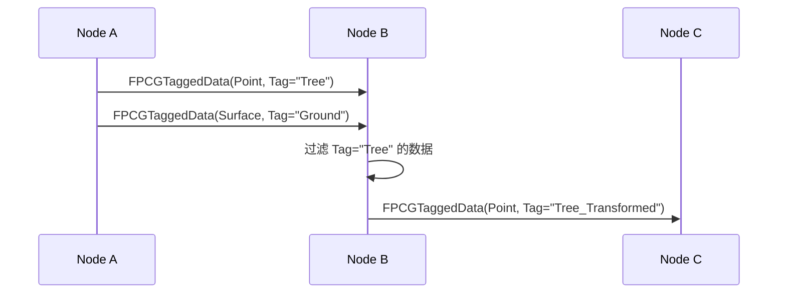

# PCG数据类型详解

> **前置知识**：[02-核心组件详解](./02-PCG核心组件详解.md)
> **预计阅读时间**：30 分钟

## 概念直觉

### PCG 的"数据管道"

PCG 的核心设计：**一切皆数据，节点即变换**。

```
[输入数据] → [Node 1] → [中间数据] → [Node 2] → [输出数据]
```

**类比**：
- **数据** = 流水线上的零件
- **Node** = 加工站
- **Graph** = 流水线布局

### 为什么需要多种数据类型？

不同场景需要不同数据：

| 数据类型 | 用途 | 示例 |
|---------|------|------|
| **Point** | 位置 + 属性 | 树的位置、密度、颜色 |
| **Surface** | 表面信息 | 地形高度、坡度、材质 |
| **Volume** | 体积信息 | 雾效、触发区域 |
| **Landscape** | 地形数据 | 高度图、图层权重 |
| **Texture** | 纹理数据 | 遮罩、噪声 |

---

## 技术机制

### 1. UPCGData — 数据基类

**源码位置**：`Engine/Plugins/PCG/Source/PCG/Public/PCGData.h`

#### 类定义

```cpp
UCLASS(Abstract, BlueprintType)
class PCG_API UPCGData : public UObject
{
    GENERATED_BODY()

public:
    // 获取数据类型名称（用于调试）
    virtual FName GetDataTypeName() const = 0;

    // 获取维度（1D/2D/3D）
    virtual int GetDimension() const { return 0; }

    // 是否支持元数据
    virtual bool SupportsMetadata() const { return false; }

    // 获取元数据（如果有）
    virtual const UPCGMetadata* GetMetadata() const { return nullptr; }

    // 计算哈希（用于缓存）
    virtual uint32 ComputeHash() const = 0;

    // 数据大小（用于性能分析）
    virtual int GetDataSize() const = 0;
};
```

**关键发现**：
- `UPCGData` 是 **抽象类**，不能直接使用
- 子类必须实现 `GetDataTypeName()` 和 `ComputeHash()`
- `SupportsMetadata()` 决定是否可以附加属性（如颜色、密度）

---

### 2. FPCGPoint — 单个点

**源码位置**：`Engine/Plugins/PCG/Source/PCG/Public/PCGPoint.h`

#### 结构体定义

```cpp
struct PCG_API FPCGPoint
{
    // 位置 + 旋转 + 缩放
    FTransform Transform;

    // 密度 [0, 1]（用于混合）
    float Density = 1.0f;

    // 种子（用于随机）
    int32 Seed = 0;

    // 边界（可选）
    FBox Bounds;

    // 元数据（附加属性）
    FPCGMetadata Metadata;

    // 构造函数
    FPCGPoint() = default;
    FPCGPoint(const FTransform& InTransform, float InDensity = 1.0f)
        : Transform(InTransform), Density(InDensity) {}

    // 计算哈希
    uint32 ComputeHash() const;
};
```

**关键属性解释**：

| 属性 | 类型 | 说明 |
|-----|------|------|
| `Transform` | `FTransform` | 位置、旋转、缩放 |
| `Density` | `float` | [0, 1]，用于透明度/混合 |
| `Seed` | `int32` | 随机种子（保证可复现） |
| `Metadata` | `FPCGMetadata` | 附加属性（颜色、ID 等） |

**为什么需要 Seed？**
- PCG 的"随机"是 **确定性随机**
- 相同 Seed → 相同结果（可复现）
- 不同 Seed → 不同变化（多样化）

---

### 3. UPCGBasePointData — 点数据基类

**源码位置**：`Engine/Plugins/PCG/Source/PCG/Public/Data/PCGBasePointData.h`

#### 类定义

```cpp
UCLASS(Abstract, BlueprintType)
class PCG_API UPCGBasePointData : public UPCGData
{
    GENERATED_BODY()

public:
    // 获取所有点（只读）
    const TArray<FPCGPoint>& GetPoints() const { return Points; }

    // 获取所有点（可写）
    TArray<FPCGPoint>& GetMutablePoints() { return Points; }

    // 添加点
    void AddPoint(const FPCGPoint& InPoint);

    // 清空点
    void Clear();

    // 获取点数量
    int GetNumPoints() const { return Points.Num(); }

    // 计算边界
    FBox GetBounds() const;

    // 过滤点（根据 Density）
    void FilterPoints(float DensityThreshold = 0.5f);

protected:
    // 存储点数据
    UPROPERTY()
    TArray<FPCGPoint> Points;

    // 元数据（每个点的属性）
    UPROPERTY()
    TObjectPtr<UPCGMetadata> Metadata;
};
```

**关键发现**：
- `Points` 是 `TArray<FPCGPoint>`（连续内存，高效）
- `Metadata` 存储 **每个点** 的附加属性（不是全局的）
- `FilterPoints()` 可以根据 `Density` 剔除点（优化性能）

---

### 4. UPCGPointData — 具体点数据

**源码位置**：`Engine/Plugins/PCG/Source/PCG/Public/Data/PCGPointData.h`

#### 类定义

```cpp
UCLASS(BlueprintType)
class PCG_API UPCGPointData : public UPCGBasePointData
{
    GENERATED_BODY()

public:
    // 数据类型名称
    virtual FName GetDataTypeName() const override { return FName("Point"); }

    // 获取维度（3D）
    virtual int GetDimension() const override { return 3; }

    // 支持元数据
    virtual bool SupportsMetadata() const override { return true; }

    // 计算哈希
    virtual uint32 ComputeHash() const override;

    // 获取 Metadata
    virtual const UPCGMetadata* GetMetadata() const override { return Metadata; }

    // 克隆数据
    UPCGPointData* Copy() const;

    // 合并两个点数据
    static UPCGPointData* Merge(const TArray<UPCGPointData*>& InPointDatas);
};
```

**为什么需要 `UPCGPointData`？**
- `UPCGBasePointData` 是抽象类，不能直接实例化
- `UPCGPointData` 是 **具体类**，可以直接使用
- 未来可能扩展其他点数据（如 `UPCGPointData2D`）

---

### 5. 其他数据类型

#### UPCGSurfaceData — 表面数据

```cpp
UCLASS(Abstract, BlueprintType)
class PCG_API UPCGSurfaceData : public UPCGData
{
    GENERATED_BODY()

public:
    // 获取表面上的点（采样）
    virtual TArray<FPCGPoint> SampleSurface(
        const FBox& InBounds,
        int32 InNumPoints = 1000
    ) const = 0;

    // 获取高度
    virtual float GetHeightAtLocation(const FVector& InLocation) const = 0;

    // 获取法线
    virtual FVector GetNormalAtLocation(const FVector& InLocation) const = 0;
};
```

**用途**：从地形、网格表面采样点。

#### UPCGLandscapeData — 地形数据

```cpp
UCLASS(BlueprintType)
class PCG_API UPCGLandscapeData : public UPCGSurfaceData
{
    GENERATED_BODY()

public:
    // 关联的 Landscape Actor
    TWeakObjectPtr<ALandscape> Landscape;

    // 获取高度图
    TArray<uint16> GetHeightmap() const;

    // 获取图层权重
    TArray<float> GetLayerWeight(FName LayerName) const;
};
```

**用途**：读取地形高度、图层信息。

---

## 数据流机制

### Tagged Data — 带标签的数据

PCG 使用 `FPCGTaggedData` 包装数据：

```cpp
struct FPCGTaggedData
{
    // 实际数据
    TObjectPtr<const UPCGData> Data = nullptr;

    // 标签（用于过滤）
    FPCGTag Tag;

    // 来源信息
    FPCGSourceInfo Source;
};
```

**为什么需要标签？**
- 一个 Node 可以输出 **多种类型** 的数据
- 下游 Node 根据 **标签** 过滤需要的数据
- 例如：`Surface Sampler` 输出 `Point` + `Surface`，下游 Node 只取 `Point`

### 数据传递流程



---

## 实践案例

### 案例 1：读取点数据并打印信息

**目标**：创建一个 Node，打印所有点的位置和密度。

#### 步骤 1：创建 Settings 类

```cpp
// PCG_PrintPointsSettings.h
UCLASS()
class UPCGPrintPointsSettings : public UPCGSettings
{
    GENERATED_BODY()

protected:
    virtual TArray<FPCGTaggedData> Execute(
        const TArray<FPCGTaggedData>& InputData,
        const FPCGExecutionContext& Context) const override;
};
```

#### 步骤 2：实现 Execute 方法

```cpp
// PCG_PrintPointsSettings.cpp
TArray<FPCGTaggedData> UPCGPrintPointsSettings::Execute(
    const TArray<FPCGTaggedData>& InputData,
    const FPCGExecutionContext& Context) const
{
    // 1. 遍历所有输入数据
    for (const FPCGTaggedData& TaggedData : InputData)
    {
        // 2. 检查是否是点数据
        const UPCGPointData* PointData = Cast<UPCGPointData>(TaggedData.Data);
        if (!PointData) continue;

        // 3. 遍历所有点
        for (const FPCGPoint& Point : PointData->GetPoints())
        {
            // 4. 打印信息
            FVector Location = Point.Transform.GetLocation();
            float Density = Point.Density;

            UE_LOG(LogTemp, Log, TEXT("Point: Location=(%f, %f, %f), Density=%f"),
                Location.X, Location.Y, Location.Z, Density);
        }
    }

    // 5. 原样返回（不修改数据）
    return InputData;
}
```

#### 步骤 3：在 PCG 图表中使用

```
[Surface Sampler] → [Print Points] → [Debug Draw]
```

**运行结果**：Output Log 中会打印所有点的信息。

---

### 案例 2：根据密度过滤点

**目标**：只保留 `Density > 0.5` 的点。

```cpp
TArray<FPCGTaggedData> UPCGFilterByDensitySettings::Execute(
    const TArray<FPCGTaggedData>& InputData,
    const FPCGExecutionContext& Context) const
{
    TArray<FPCGTaggedData> OutputData;

    for (const FPCGTaggedData& TaggedData : InputData)
    {
        const UPCGPointData* PointData = Cast<UPCGPointData>(TaggedData.Data);
        if (!PointData) continue;

        // 创建新的点数据
        UPCGPointData* NewPointData = NewObject<UPCGPointData>();

        // 过滤点
        for (const FPCGPoint& Point : PointData->GetPoints())
        {
            if (Point.Density > 0.5f)
            {
                NewPointData->AddPoint(Point);
            }
        }

        // 添加到输出
        FPCGTaggedData NewTaggedData = TaggedData;
        NewTaggedData.Data = NewPointData;
        OutputData.Add(NewTaggedData);
    }

    return OutputData;
}
```

---

## 常见错误

### Error 1：点数据为空（没有点）

**症状**：Node 执行了，但没有生成任何点。

**原因**：
1. `Surface Sampler` 的 `Bounds Modifier` 没有设置
2. 输入数据不是 `UPCGPointData`
3. 所有点的 `Density` 被过滤为 0

**解决**：
```cpp
// 调试：检查点数量
UE_LOG(LogTemp, Log, TEXT("Num Points: %d"), PointData->GetNumPoints());
```

### Error 2：内存占用过高

**症状**：PCG 生成后，内存增长几十 MB。

**原因**：
- 点数量过多（>100000）
- 没有复用 `UPCGPointData`（每次都 `NewObject`）

**解决**：
1. 降低 `Density`（减少点数量）
2. 使用 `Object Pool`（复用对象）
3. 分块生成（多个 PCG Volume）

### Error 3：随机结果不一致

**症状**：每次 Generate，点的位置和属性都不同。

**原因**：`Seed` 没有设置，或者使用了 `FMath::Rand()`（不是确定性的）。

**解决**：
```cpp
// 错误：使用 Rand()
float RandomScale = FMath::RandRange(0.5f, 2.0f); // ← 每次不同

// 正确：使用 Seed
FPCGPoint Point;
Point.Seed = 12345; // ← 固定 Seed
float RandomScale = FMath::RandRange(0.5f, 2.0f); // ← 相同 Seed → 相同结果
```

---

## 延伸阅读

### 源码深入
- `Engine/Plugins/PCG/Source/PCG/Public/PCGData.h` — 数据基类
- `Engine/Plugins/PCG/Source/PCG/Public/PCGPoint.h` — 点结构体
- `Engine/Plugins/PCG/Source/PCG/Public/Data/PCGBasePointData.h` — 点数据基类
- `Engine/Plugins/PCG/Source/PCG/Public/Data/PCGPointData.h` — 具体点数据

### 相关文档
- [PCG 数据类型官方文档](https://dev.epicgames.com/documentation/zh-cn/unreal-engine/pcg-data-types-in-unreal-engine)
- [PCG 元数据官方文档](https://dev.epicgames.com/documentation/zh-cn/unreal-engine/pcg-metadata-in-unreal-engine)

### 进阶主题
- **PCG 元数据系统**：如何为点添加自定义属性（颜色、ID、标签）
- **PCG 数据缓存**：如何复用计算结果（避免重复计算）
- **PCG 数据序列化**：如何保存/加载 PCG 数据（持久化）

---

## 总结

通过本篇你学到了：

1. **PCG 数据类型** — Point（点）、Surface（表面）、Volume（体积）、Texture（纹理）、Landscape（地形）
2. **Point 数据结构** — 包含位置、旋转、缩放、颜色、ID 等核心属性
3. **元数据系统** — 通过 `FPCGMetadata` 为点添加自定义属性（贪食蛇式存储）
4. **数据流转机制** — 节点间通过 `PCGData` 引脚传递，支持多种数据类型

---

## 下一步

→ **下一课**：[04-PCG 图表基础](./04-PCG图表基础.md) — 学习如何创建和编辑 PCG 图表，理解节点连接机制。

<!-- nav:auto -->

---

**导航**: ← [[30-tutorials/pcg/02-PCG核心组件详解|02-PCG核心组件详解]] · [[30-tutorials/pcg/04-PCG图表基础|04-PCG图表基础]] →

<!-- /nav:auto -->
