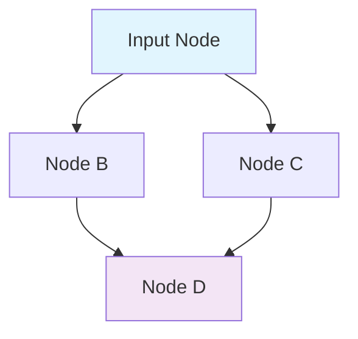

# PCG图表基础

> **前置知识**：[03-PCG 数据类型详解](./03-PCG数据类型详解.md)
> **预计阅读时间**：25 分钟

## 概念直觉

### PCG 图表 = 可视化编程

PCG 图表类似于 **蓝图** 或 **材质编辑器**：

```
[节点 A] → [节点 B] → [节点 C]
    ↓           ↓           ↓
  输入数据  → 处理数据  → 输出数据
```

**核心概念**：
- **节点（Node）**：执行单元（如采样、变换、生成）
- **Pin（引脚）**：数据输入输出口
- **连接（Edge）**：数据流向
- **Graph（图表）**：节点 + 连接的集合

### 为什么用图表而不是代码？

| 方式 | 优点 | 缺点 |
|-----|------|------|
| **图表** | 可视化、易调试、非程序员可用 | 复杂逻辑难以维护 |
| **代码** | 灵活、可复用、版本友好 | 需要编程知识 |

**PCG 的选择**：图表为主，代码为辅（自定义 Node 才需要代码）。

---

## 技术机制

### 1. PCG 图表的文件格式

PCG 图表是 `.uasset` 文件，但可以通过 **文本格式** 查看（启用 `TextForamt` 插件）。

**示例**：简单的 PCG 图表（文本表示）

```json
{
    "PCGGraph": {
        "Nodes": [
            {
                "Class": "PCGSurfaceSamplerSettings",
                "Position": [100, 200],
                "Inputs": [...],
                "Outputs": [...]
            },
            {
                "Class": "PCGTransformPointsSettings",
                "Position": [300, 200],
                "Inputs": [...],
                "Outputs": [...]
            }
        ],
        "Edges": [
            {
                "FromNode": 0,
                "FromPin": "Output",
                "ToNode": 1,
                "ToPin": "Input"
            }
        ]
    }
}
```

### 2. 节点连接机制

#### Pin（引脚）类型

```cpp
// PCGNode.h
struct FPCGPinProperties
{
    // Pin 名称
    FName Name;

    // Pin 类型（输入/输出）
    EPCGPinDirection Direction;

    // 允许的数据类型
    TArray<FName> AllowedDataTypes;

    // 是否允许多个连接
    bool bAllowMultipleConnections = false;
};
```

**示例**：`Surface Sampler` 的 Pin

| Pin | 方向 | 数据类型 | 说明 |
|-----|------|---------|------|
| `In` | Input | `Surface` | 输入表面（可选） |
| `Out` | Output | `Point` | 输出采样点 |
| `Out Surface` | Output | `Surface` | 输出表面（传递） |

#### Edge（连接）

```cpp
// PCGNode.h
struct FPCGEdge
{
    // 源节点
    TWeakObjectPtr<UPCGNode> SourceNode;

    // 源 Pin 名称
    FName SourcePinName;

    // 目标节点
    TWeakObjectPtr<UPCGNode> TargetNode;

    // 目标 Pin 名称
    FName TargetPinName;

    // 传递数据
    void PassData(const TArray<FPCGTaggedData>& InData);
};
```

**关键发现**：
- Edge 是 **弱引用**（`TWeakObjectPtr`），避免循环引用
- 数据通过 `PassData()` 传递（不是共享内存）

---

### 3. 执行顺序

#### 拓扑排序（Topological Sort）

PCG Graph 使用 **拓扑排序** 确定执行顺序：



**执行顺序**（一种可能）：
1. A（输入节点）
2. B、C（并行执行，无依赖）
3. D（等待 B、C 完成）

#### 并行执行

**无依赖的节点可以并行**：

```cpp
// PCGGraph.cpp（简化版）
void UPCGGraph::Execute(FPCGExecutionContext& InContext)
{
    TArray<UPCGNode*> NodesToExecute = GetNodesInExecutionOrder();

    // 并行执行无依赖的节点
    ParallelFor(NodesToExecute.Num(), [&](int32 Index)
    {
        UPCGNode* Node = NodesToExecute[Index];
        if (Node->CanExecuteInParallel())
        {
            Node->Execute(InContext);
        }
    });
}
```

**关键发现**：
- PCG 默认 **不支持并行**（需要手动启用）
- 并行要求：Node 之间 **无数据共享**（纯函数）

---

## 实践案例

### 案例 1：创建第一个 PCG 图表

**目标**：创建一个在地面上生成随机点的图表。

#### 步骤 1：创建 PCG Graph 资产

1. 内容浏览器右键 → `PCG` → `PCG Graph`
2. 命名：`PCG_MyFirstGraph`
3. 双击打开 **PCG 图表编辑器**

#### 步骤 2：添加节点

在图表编辑器中：

1. 右键 → 搜索 `Surface Sampler` → 添加
2. 右键 → 搜索 `Transform Points` → 添加
3. 右键 → 搜索 `Debug Draw` → 添加

#### 步骤 3：连接节点

```
[Surface Sampler]::Out → [Transform Points]::In
[Transform Points]::Out → [Debug Draw]::In
```

**操作**：
1. 点击 `Surface Sampler` 的 `Out` Pin
2. 拖拽到 `Transform Points` 的 `In` Pin
3. 重复连接 `Transform Points` → `Debug Draw`

#### 步骤 4：配置参数

**Surface Sampler**：
- `Density`：1.0（每立方米 1 个点）
- `Bounds Modifier`：`PCG Volume`（使用 Volume 的范围）

**Transform Points**：
- `Scale Min`：(0.8, 0.8, 0.8)
- `Scale Max`：(1.2, 1.2, 1.2)

#### 步骤 5：测试

1. 场景中放置 `PCG Volume`
2. 将 `PCG_MyFirstGraph` 赋值给 Volume 的 `PCG Component`
3. 点击 `Generate`

**预期结果**：Volume 范围内出现蓝色点（Debug Draw）。

---

### 案例 2：使用 Sub Graph（子图表）

**目标**：将常用逻辑封装为 Sub Graph，提高复用性。

#### 步骤 1：创建 Sub Graph

1. 内容浏览器右键 → `PCG` → `PCG Graph`
2. 命名：`PCG_Sub_RandomColor`
3. 双击打开

#### 步骤 2：定义输入/输出

1. 右键 → `Add Input Node`
2. 配置 Input Node：
   - `Input Pin Name`：`In Points`
   - `Allowed Data Types`：`Point`
3. 右键 → `Add Output Node`
4. 配置 Output Node：
   - `Output Pin Name`：`Out Points`
   - `Allowed Data Types`：`Point`

#### 步骤 3：实现逻辑

```
[Input Node] → [Modify Points (设置颜色)] → [Output Node]
```

#### 步骤 4：在主图表中使用 Sub Graph

1. 打开主图表（`PCG_MyFirstGraph`）
2. 右键 → 搜索 `PCG_Sub_RandomColor`
3. 连接：
   ```
   [Surface Sampler] → [PCG_Sub_RandomColor] → [Debug Draw]
   ```

**优势**：
- **复用**：一个 Sub Graph 可以在多个图表中使用
- **整洁**：复杂逻辑封装为单个节点
- **维护**：修改 Sub Graph 自动更新所有引用

---

## 常见错误

### Error 1：节点无法连接（Pin 类型不匹配）

**症状**：拖拽 Pin 时，无法连接到目标 Pin。

**原因**：
- 数据类型不匹配（如 `Point` → `Surface`）
- Pin 方向错误（Input → Input）
- Pin 已被占用（不允许多个连接）

**解决**：
1. 检查 Pin 的 `AllowedDataTypes`
2. 确保从 **Output** 连接到 **Input**
3. 启用 `bAllowMultipleConnections`（如果需要）

### Error 2：执行顺序错误（结果不符合预期）

**症状**：Node A 在 Node B 之前执行，但期望相反。

**原因**：PCG Graph 是 **数据驱动** 的，执行顺序由 **连接关系** 决定。

**错误示例**：
```
[Node B] → [Node A]（但 A 的输出是 B 的输入）
```

**正确示例**：
```
[Node A] → [Node B]（按数据流向排列）
```

**解决方法**：
1. 使用 `GetNodesInExecutionOrder()` 查看执行顺序
2. 调整连接关系（不是节点位置）

### Error 3：图表过于复杂（难以维护）

**症状**：图表有 50+ 个节点，连成一团。

**原因**：没有使用 **Sub Graph** 封装逻辑。

**解决**：
1. 将相关节点组封装为 Sub Graph
2. 使用 `Comment Box`（注释框）分组
3. 启用 `Collapse Nodes`（折叠节点）

---

## 调试技巧

### 1. Debug Draw（可视化调试）

**用途**：在编辑器中显示 PCG 生成的点、线、网格。

**使用方法**：
1. 在图表中添加 `Debug Draw` Node
2. 配置 `Debug Draw`：
   - `Point Color`：点的颜色
   - `Point Size`：点的大小
   - `bDrawLines`：是否绘制连线

### 2. PCG 性能分析器

**用途**：分析每个 Node 的执行时间。

**使用方法**：
1. `Window` → `Developer Tools` → `PCG Profiler`
2. 点击 `Generate`
3. 查看每个 Node 的耗时

**优化建议**：
- 耗时 > 10ms 的 Node 需要优化
- 使用 `Instance` 替代 `Actor`（减少 Draw Call）
- 分块生成（多个 PCG Volume）

### 3. Output Log（日志调试）

**用途**：打印 Node 的中间数据。

**使用方法**：
```cpp
// 在自定义 Node 的 Execute() 中
UE_LOG(LogTemp, Log, TEXT("Num Points: %d"), PointData->GetNumPoints());
```

---

## 延伸阅读

### 官方文档
- [PCG 图表官方文档](https://dev.epicgames.com/documentation/zh-cn/unreal-engine/pcg-graphs-in-unreal-engine)
- [PCG 节点官方文档](https://dev.epicgames.com/documentation/zh-cn/unreal-engine/pcg-nodes-in-unreal-engine)

### 源码深入
- `Engine/Plugins/PCG/Source/PCG/Public/PCGGraph.h` — 图表类定义
- `Engine/Plugins/PCG/Source/PCG/Public/PCGNode.h` — 节点类定义
- `Engine/Plugins/PCG/Source/PCG/Private/PCGGraph.cpp` — 图表执行逻辑

### 社区教程
- [Reids Channel - PCG 图表进阶](https://www.youtube.com/watch?v=PL_9jbU_gxY)
- [PrismaticaDev - PCG Sub Graph 技巧](https://www.youtube.com/watch?v=bkMJOvem3FI)

---

## 总结

通过本篇你学到了：

1. **创建 PCG 图表** — 通过 PCG Component 或 PCG Volume 创建，支持 Sub Graph 复用
2. **节点连接机制** — 输入/输出引脚（Pin），数据类型必须匹配才能连接
3. **执行顺序** — 由连接关系决定（数据驱动），支持并行执行
4. **调试技巧** — Debug Draw（可视化点）、PCG Profiler（性能分析）、Output Log（日志）

---

## 下一步

→ **下一课**：[05-常用 PCG 节点](./05-常用PCG节点详解.md) — 学习 PCG 内置节点的使用方法（Surface Sampler、Transform Points、Static Mesh Spawner 等）。

<!-- nav:auto -->

---

**导航**: ← [[30-tutorials/pcg/03-PCG数据类型详解|03-PCG数据类型详解]] · [[30-tutorials/pcg/05-常用PCG节点详解|05-常用PCG节点详解]] →

<!-- /nav:auto -->
