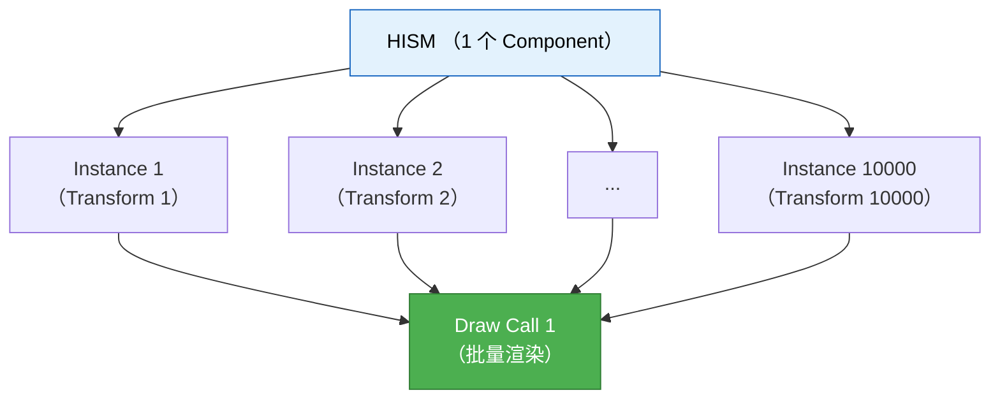
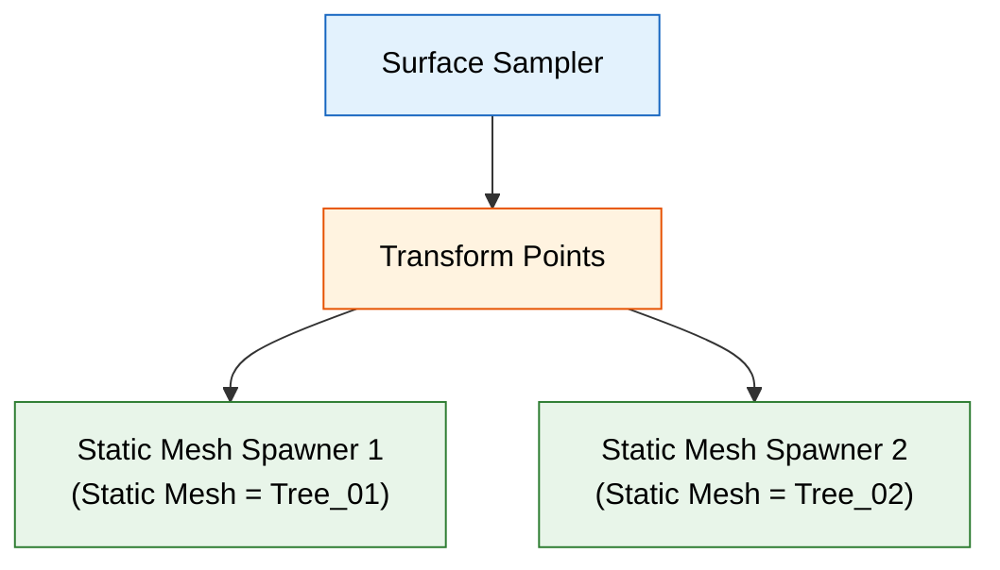

# 实例生成器

> **前置知识**：[06-表面采样实战](./06-表面采样实战.md)
> **预计阅读时间**：30 分钟

## 概念直觉

### 为什么需要"实例"？

**问题**：生成 10000 棵树，每棵都是独立 Actor。

```
10000 个 Actor → 10000 个 Draw Call → FPS 暴跌
```

**解决**：使用 **实例化渲染**（Instanced Rendering）。

```
10000 个实例 → 1 个 Draw Call → FPS 稳定
```

### 实例化的核心思想

**传统方式**（每个 Actor 独立）：
```
Tree_01 (Actor) → Draw Call 1
Tree_02 (Actor) → Draw Call 2
...
Tree_10000 (Actor) → Draw Call 10000
```

**实例化方式**（共享网格）：


---

## 技术机制

### 1. Hierarchical Instanced Static Mesh (HISM)

**源码位置**：`Engine/Source/Runtime/Engine/Classes/Components/HierarchicalInstancedStaticMeshComponent.h`

#### 核心特性

| 特性 | 说明 |
|-----|------|
| **批量渲染** | 多个实例 → 1 个 Draw Call |
| **LOD 支持** | 自动切换 LOD（根据距离） |
| **遮挡剔除** | 被遮挡的实例不渲染 |
| **距离剔除** | 超出距离的实例不渲染 |
| **Hierarchical** | 层次化剔除（O(log N)） |

#### 关键方法

```cpp
class UHierarchicalInstancedStaticMeshComponent : public UMeshComponent
{
public:
    // 添加实例
    int32 AddInstance(const FTransform& InstanceTransform);

    // 添加实例（批量）
    void AddInstances(const TArray<FTransform>& InstanceTransforms);

    // 删除实例
    void RemoveInstance(int32 InstanceIndex);

    // 清空所有实例
    void ClearInstances();

    // 设置静态网格
    void SetStaticMesh(UStaticMesh* InStaticMesh);

    // 设置剔除距离
    void SetCullDistance(float InCullDistance);
};
```

**关键发现**：
- `AddInstance()` 返回 `InstanceIndex`（用于后续修改/删除）
- `AddInstances()`（批量）比循环调用 `AddInstance()` 更快
- `ClearInstances()` 不会删除 Component（只是清空实例）

---

### 2. PCG Static Mesh Spawner 实现

**源码位置**：`Engine/Plugins/PCG/Source/PCG/Public/Elements/PCGStaticMeshSpawner.h`

#### 执行流程（简化版）

```cpp
// PCGStaticMeshSpawner.cpp
TArray<FPCGTaggedData> UPCGStaticMeshSpawnerSettings::Execute(
    const TArray<FPCGTaggedData>& InputData,
    const FPCGExecutionContext& Context) const
{
    // 1. 获取 PCG Component
    UPCGComponent* Component = Context.Component.Get();
    if (!Component) return {};

    // 2. 获取或创建 HISM Component
    UHierarchicalInstancedStaticMeshComponent* HISM =
        Component->GetOrCreateHISM(StaticMesh.LoadSynchronous());

    // 3. 配置 HISM
    HISM->SetCullDistance(CullDistance);
    if (MaterialOverride)
    {
        HISM->SetMaterial(0, MaterialOverride.LoadSynchronous());
    }

    // 4. 添加实例
    TArray<FTransform> InstanceTransforms;
    for (const FPCGTaggedData& TaggedData : InputData)
    {
        const UPCGPointData* PointData = Cast<UPCGPointData>(TaggedData.Data);
        if (!PointData) continue;

        for (const FPCGPoint& Point : PointData->GetPoints())
        {
            InstanceTransforms.Add(Point.Transform);
        }
    }

    HISM->AddInstances(InstanceTransforms, false);

    // 5. 返回空（终端节点）
    return {};
}
```

**关键发现**：
- `GetOrCreateHISM()` 会 **复用** 已有的 HISM（避免重复创建）
- 一个 HISM 只能渲染 **一种网格**（要多种网格需要多个 Node）
- `AddInstances()` 是 **批量添加**（性能优化）

---

### 3. 多种网格混合

**问题**：想生成 3 种树木，但一个 `Static Mesh Spawner` 只能生成一种。

**解决方案 1**：多个 `Static Mesh Spawner`



**解决方案 2**：使用 `PCG Mesh Selector`（网格选择器）

```
[Surface Sampler] → [Mesh Selector] → [Static Mesh Spawner]
                     (根据 Seed 选择网格)
```

**Mesh Selector 配置**：
| Mesh | Weight（权重） |
|------|----------------|
| Tree_01 | 50% |
| Tree_02 | 30% |
| Tree_03 | 20% |

---

## 实践案例

### 案例 1：创建多种树木的混合森林

**目标**：生成 3 种树木，比例 5:3:2。

#### 步骤 1：创建 PCG 图表

```
[Surface Sampler] → [Transform Points] → [Mesh Selector] → [Static Mesh Spawner]
```

#### 步骤 2：配置 Mesh Selector

1. 右键图表 → 搜索 `Mesh Selector` → 添加
2. 配置：
   - `Mesh 1`：`Tree_01`，`Weight`：0.5
   - `Mesh 2`：`Tree_02`，`Weight`：0.3
   - `Mesh 3`：`Tree_03`，`Weight`：0.2

#### 步骤 3：配置 Static Mesh Spawner

- `Static Mesh`：留空（由 Mesh Selector 动态选择）
- `Cull Distance`：5000

#### 步骤 4：测试

**预期结果**：3 种树木混合生成，比例约为 5:3:2。

---

### 案例 2：根据密度动态调整剔除距离

**目标**：密度高的区域（近处）剔除距离近，密度低的区域（远处）剔除距离远。

#### 步骤 1：创建自定义 Node

```cpp
// PCG_DynamicCullDistanceSettings.h
UCLASS()
class UPCGDynamicCullDistanceSettings : public UPCGSettings
{
    GENERATED_BODY()

public:
    // 基础剔除距离
    UPROPERTY(EditAnywhere, Category = "Cull Distance")
    float BaseCullDistance = 5000.0f;

    // 密度影响因子
    UPROPERTY(EditAnywhere, Category = "Cull Distance")
    float DensityFactor = 1000.0f;

protected:
    virtual TArray<FPCGTaggedData> Execute(
        const TArray<FPCGTaggedData>& InputData,
        const FPCGExecutionContext& Context) const override;
};
```

#### 步骤 2：实现 Execute 方法

```cpp
// PCG_DynamicCullDistanceSettings.cpp
TArray<FPCGTaggedData> UPCGDynamicCullDistanceSettings::Execute(
    const TArray<FPCGTaggedData>& InputData,
    const FPCGExecutionContext& Context) const
{
    TArray<FPCGTaggedData> OutputData;

    for (const FPCGTaggedData& TaggedData : InputData)
    {
        const UPCGPointData* PointData = Cast<UPCGPointData>(TaggedData.Data);
        if (!PointData) continue;

        // 创建新的点数据
        UPCGPointData* NewPointData = NewObject<UPCGPointData>();

        for (const FPCGPoint& Point : PointData->GetPoints())
        {
            FPCGPoint NewPoint = Point;

            // 根据密度动态调整剔除距离
            float CullDistance = BaseCullDistance + (1.0f - Point.Density) * DensityFactor;

            // 存储到 Metadata
            NewPoint.Metadata.SetFloat("CullDistance", CullDistance);

            NewPointData->AddPoint(NewPoint);
        }

        // 添加到输出
        FPCGTaggedData NewTaggedData = TaggedData;
        NewTaggedData.Data = NewPointData;
        OutputData.Add(NewTaggedData);
    }

    return OutputData;
}
```

#### 步骤 3：在 Static Mesh Spawner 中使用

```
[Surface Sampler] → [Dynamic Cull Distance] → [Static Mesh Spawner]
```

**预期结果**：密度高的区域（近处）剔除距离近，密度低的区域（远处）剔除距离远。

---

## 常见错误

### Error 1：HISM 没有生成任何实例

**症状**：Generate 后，场景中没有树。

**原因**：
1. `Static Mesh` 未赋值
2. `Surface Sampler` 没有输出点
3. HISM Component 被意外删除

**解决**：
1. 检查 `Static Mesh` 是否赋值
2. 在 `Static Mesh Spawner` 前添加 `Debug Draw`，确认有点数据
3. 检查 HISM Component 是否存在（Outliner 中搜索）

### Error 2：性能爆炸（FPS 暴跌）

**症状**：Generate 后，FPS 从 60 降到 10。

**原因**：
1. 点数量过多（>10000）
2. 没有使用 HISM（每个树都是独立 Actor）
3. `Cull Distance` 设置过大

**解决**：
1. 降低 `Density`
2. 确保 `bUseHISM = true`
3. 设置合理的 `Cull Distance`（如 5000）

### Error 3：多种网格混合失败

**症状**：只有一种树木生成，其他没有。

**原因**：
1. `Mesh Selector` 的 `Weight` 配置错误
2. `Static Mesh Spawner` 的 `Static Mesh` 被固定赋值

**解决**：
1. 检查 `Mesh Selector` 的 `Weight` 总和是否为 1.0
2. 确保 `Static Mesh Spawner` 的 `Static Mesh` 留空（由 Mesh Selector 动态选择）

---

## 延伸阅读

### 官方文档
- [PCG Static Mesh Spawner 官方文档](https://dev.epicgames.com/documentation/zh-cn/unreal-engine/pcg-static-mesh-spawner-in-unreal-engine)
- [HISM 官方文档](https://dev.epicgames.com/documentation/zh-cn/unreal-engine/hierarchical-instanced-static-mesh-component-in-unreal-engine)

### 源码深入
- `Engine/Source/Runtime/Engine/Classes/Components/HierarchicalInstancedStaticMeshComponent.h`
- `Engine/Plugins/PCG/Source/PCG/Public/Elements/PCGStaticMeshSpawner.h`

### 社区教程
- [Reids Channel - PCG 实例生成器详解](https://www.youtube.com/watch?v=PL_9jbU_gxY)
- [PrismaticaDev - PCG 高性能技巧](https://www.youtube.com/watch?v=bkMJOvem3FI)

---

## 总结

通过本篇你学到了：

1. **Static Mesh Spawner** — 用 Static Mesh 替换点，生成可渲染的网格实例
2. **HISM（分层实例化静态网格）** — 高性能实例化渲染，自动 LOD 管理
3. **材质与自定义数据** — 通过 `PerInstanceCustomData` 为每个实例设置不同颜色/参数
4. **性能对比** — HISM 比 Actor 快 10-100 倍（Draw Call 合并）

---

## 下一步

→ **下一课**：[08-生物群系创建](./08-生物群系创建.md) — 学习如何使用 PCG 创建复杂的生物群系（森林、沙漠、雪山等）。

<!-- nav:auto -->

---

**导航**: ← [[30-tutorials/pcg/06-表面采样实战|06-表面采样实战]] · [[30-tutorials/pcg/08-生物群系创建|08-生物群系创建]] →

<!-- /nav:auto -->
