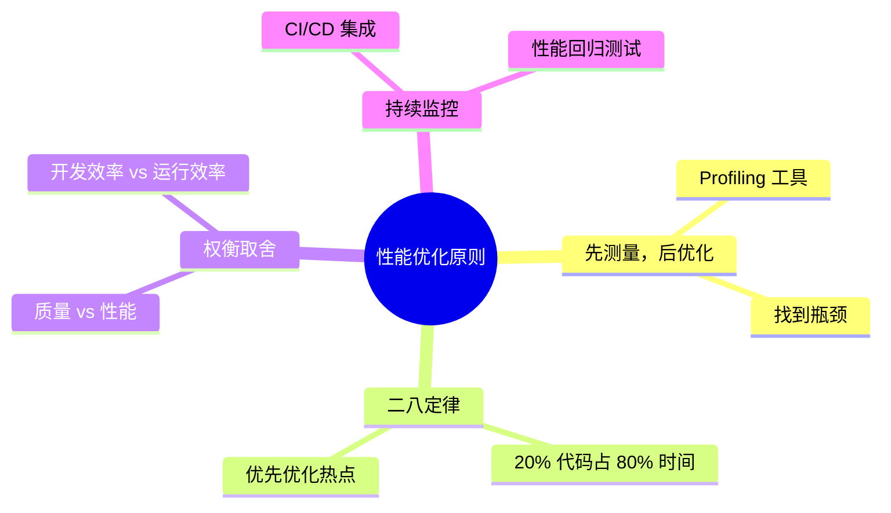
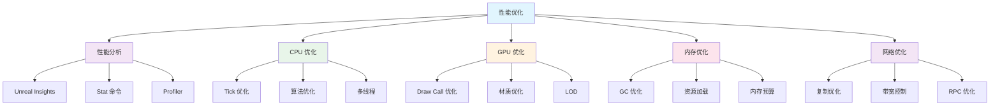

# 性能优化系列概览

> 掌握 UE5 性能分析与优化技术，打造流畅游戏体验

## 系列概述

本系列教程系统讲解 Unreal Engine 5 的性能优化技术，从性能分析工具的使用，到 CPU、GPU、内存、网络等各模块的优化策略，最后通过 Lyra 项目的真实案例，帮助你掌握工业级性能优化方法。

### 为什么需要性能优化？

| 问题 | 影响 | 优化目标 |
|------|------|----------|
| 帧率不稳定 | 游戏卡顿，体验差 | 稳定 60/120 FPS |
| 加载时间长 | 玩家流失 | 快速加载（< 2 秒） |
| 内存占用高 | 崩溃、闪退 | 合理内存预算 |
| 网络延迟高 | 多人游戏体验差 | 低延迟、高吞吐量 |

### 性能优化的核心原则

## 系列大纲

### 阶段一：性能分析基础（2 课时）

| 课时 | 标题 | 核心内容 | 难度 |
|------|------|----------|------|
| 00 | **系列概览** | 性能优化原则、系列导航 | ⭐ |
| 01 | **性能分析工具** | Unreal Insights、Stat 命令、Profiler | ⭐⭐ |

### 阶段二：CPU 性能优化（1 课时）

| 课时 | 标题 | 核心内容 | 难度 |
|------|------|----------|------|
| 02 | **CPU 性能优化** | Tick 优化、算法优化、多线程 | ⭐⭐⭐ |

### 阶段三：GPU 与渲染优化（1 课时）

| 课时 | 标题 | 核心内容 | 难度 |
|------|------|----------|------|
| 03 | **GPU 与渲染优化** | Draw Call、渲染管线、材质优化 | ⭐⭐⭐ |

### 阶段四：内存与网络优化（2 课时）

| 课时 | 标题 | 核心内容 | 难度 |
|------|------|----------|------|
| 04 | **内存优化** | GC、资源加载、内存预算 | ⭐⭐⭐ |
| 05 | **网络性能优化** | 复制优化、带宽控制、RPC | ⭐⭐⭐⭐ |

### 阶段五：Lyra 实战（1 课时）

| 课时 | 标题 | 核心内容 | 难度 |
|------|------|----------|------|
| 06 | **Lyra 性能实战** | 真实项目优化案例 | ⭐⭐⭐⭐ |

## 核心概念全景图

## 与 Lyra 项目的关系

Lyra 项目是 UE5 性能优化的最佳实践参考：

| Lyra 优化技术 | 应用模块 | 教程对应 |
|--------------|----------|----------|
| Modular Gameplay | 组件化架构 | 02-CPU 优化 |
| Replication Graph | 网络复制优化 | 05-网络优化 |
| Iris 复制系统 | 新一代网络复制 | 05-网络优化 |
| 异步资源加载 | 体验系统 | 04-内存优化 |
| LOD 与 Impostor | 角色渲染 | 03-GPU 优化 |

## 学习路径推荐

### 路径 A：完整学习（推荐）

### 路径 B：按需学习

- **渲染程序员** → 01 → 03 → 06
- **网络程序员** → 01 → 05 → 06
- ** gameplay 程序员** → 01 → 02 → 04 → 06

## 前置知识

| 知识领域 |  required  | 推荐教程 |
|----------|------------|----------|
| C++ 基础 | ✅ 必须 | - |
| 蓝图基础 | ✅ 必须 | - |
| Tick 系统 | ✅ 必须 | [[30-tutorials/ue-framework/60-tick-system/00-Tick系统架构概述]] |
| 网络复制 | 📌 推荐 | [[30-tutorials/network-sync/00-UE网络通信总览]] |

## 参考资料

| 资料 | 类型 | 链接 |
|------|------|------|
| UE5 性能优化官方文档 | 官方文档 | [Performance and Profiling](https://docs.unrealengine.com/5.0/en-US/performance-and-profiling/) |
| Unreal Insights 文档 | 官方文档 | [Unreal Insights](https://docs.unrealengine.com/5.0/en-US/unreal-insights-in-unreal-engine/) |
| Lyra 性能分析 | 项目实例 | `Docs/10-architecture/` |

## 相关页面

- [[30-tutorials/ue-framework/60-tick-system/00-Tick系统架构概述]] - Tick 系统概述
- [[30-tutorials/network-sync/00-UE网络通信总览]] - 网络同步概述

## 系列进度

- [x] 00-overview - 系列概览
- [ ] 01-profiling-tools - 性能分析工具
- [ ] 02-cpu-optimization - CPU 性能优化
- [ ] 03-gpu-rendering-optimization - GPU 与渲染优化
- [ ] 04-memory-optimization - 内存优化
- [ ] 05-network-optimization - 网络性能优化
- [ ] 06-lyra-optimization-cases - Lyra 性能实战

<!-- nav:auto -->

---

**导航**: [[30-tutorials/performance-optimization/01-性能分析工具|01-性能分析工具]] →

<!-- /nav:auto -->
