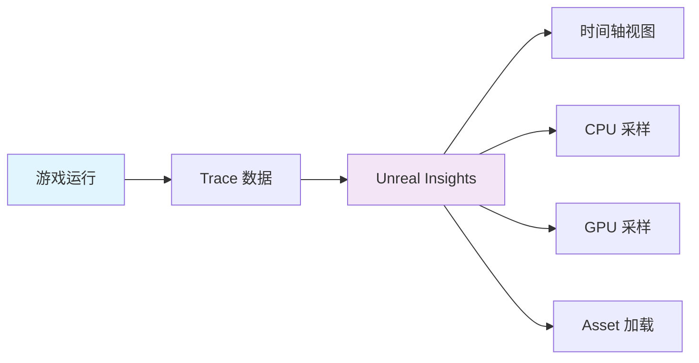
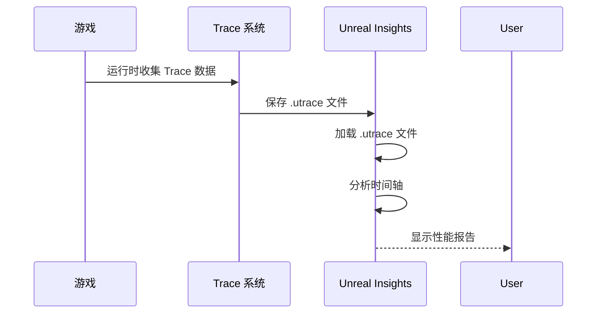
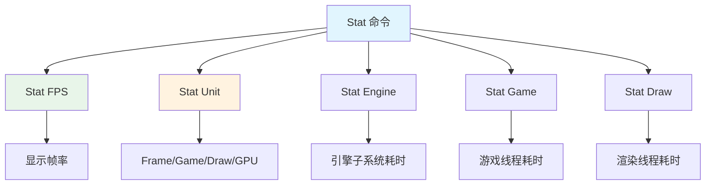
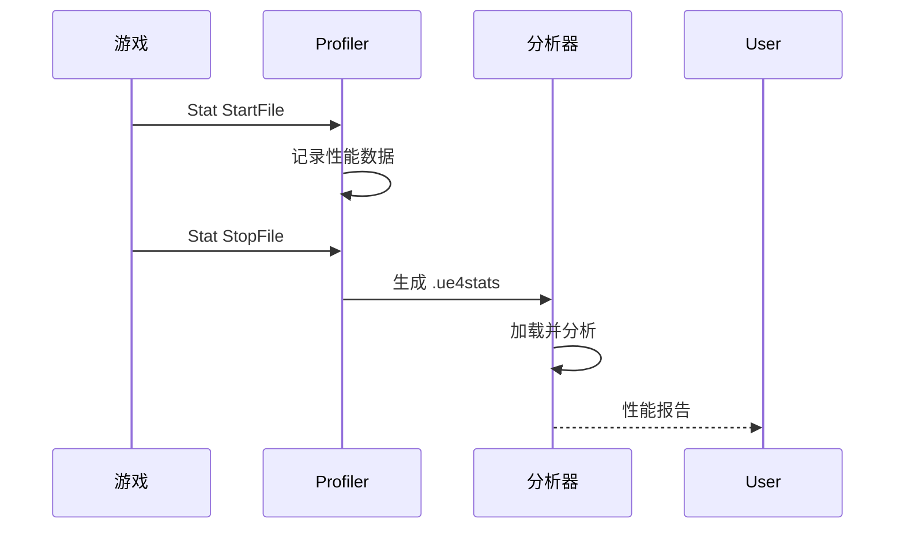
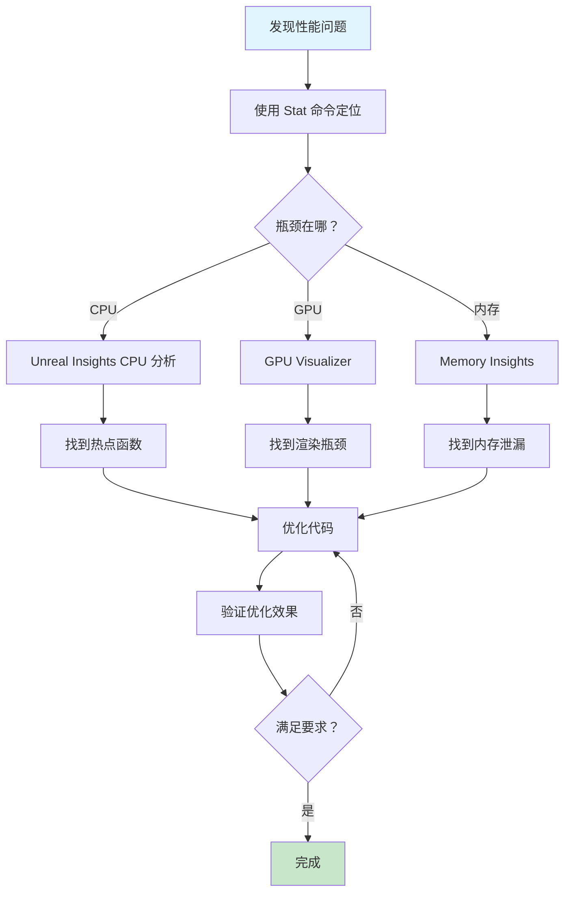

# 性能分析工具

> 掌握 UE5 性能分析工具，找到性能瓶颈

## 概述

性能优化的第一步是**测量**。UE5 提供了强大的性能分析工具套件：
- **Unreal Insights**：新一代性能分析工具
- **Stat 命令**：实时性能监控
- **Profiler**：传统性能分析器
- **GPU Visualizer**：GPU 性能分析

本课将系统讲解这些工具的使用方法。

## 1. Unreal Insights

### 1.1 什么是 Unreal Insights？



Unreal Insights 是 UE5 的**新一代性能分析工具**，替代了旧的 Profiler：
- **跨平台**：支持 Windows、Linux、Android、iOS
- **低开销**：基于 Trace 系统，对性能影响极小
- **多功能**：CPU、GPU、网络、Asset 加载全覆盖

### 1.2 启用 Unreal Insights

#### 方法一：命令行参数

```bash
# 启动游戏时启用 Trace
LyraStarterGame.exe -trace=cpu,gpu,loadtime,file,net

# 常用 Trace 通道
# - cpu: CPU 性能数据
# - gpu: GPU 性能数据
# - loadtime: Asset 加载时间
# - file: 文件 I/O
# - net: 网络数据
# - memory: 内存分配
# - all: 所有通道
```

#### 方法二：编辑器内启用

```
Edit → Project Settings → Engine → General Settings
→ Performance
  → Trace Enabled: true
  → Trace Channels: cpu,gpu,loadtime
```

### 1.3 使用 Unreal Insights 分析



#### 关键视图

| 视图 | 用途 | 快捷键 |
|------|------|--------|
| Timing Insights | CPU/GPU 时间轴 | Ctrl+1 |
| Asset Insights | Asset 加载分析 | Ctrl+2 |
| Network Insights | 网络性能分析 | Ctrl+3 |
| Memory Insights | 内存分配分析 | Ctrl+4 |

#### 实战：分析一帧的性能

```
1. 启动游戏并启用 Trace
2. 运行游戏，复现性能问题
3. 关闭游戏，生成 .utrace 文件
4. 打开 Unreal Insights，加载 .utrace
5. 在 Timing Insights 中找到长帧（Frame Time > 33.33ms）
6. 展开调用栈，找到耗时函数
7. 优化该函数
```

### 1.4 代码示例：自定义 Trace 通道

```cpp
// MyTrace.h
#pragma once

#include "Trace/Trace.h"

// [1] 声明自定义 Trace 通道
UE_TRACE_CHANNEL(MyGameChannel);

// [2] 声明自定义 Trace 事件
UE_TRACE_EVENT_BEGIN(MyCategory, MyEvent)
    UE_TRACE_EVENT_FIELD(const char*, EventName)
    UE_TRACE_EVENT_FIELD(float, Duration)
UE_TRACE_EVENT_END()

// [3] 使用自定义 Trace 事件
void TraceMyEvent(const char* EventName, float Duration)
{
    TRACE_MYCHANNEL_MYEVENT(EventName, Duration);  // [4] 触发 Trace 事件
}
```

## 2. Stat 命令系统

### 2.1 常用 Stat 命令

Stat 命令是**实时性能监控**的主要工具：



#### 基础命令

| 命令 | 说明 | 示例输出 |
|------|------|----------|
| `Stat FPS` | 显示帧率 | `FPS: 60.2` |
| `Stat Unit` | 显示 Frame/Game/Draw/GPU 时间 | `Frame=16.6ms Game=5.2ms Draw=8.1ms GPU=10.3ms` |
| `Stat UnitGraph` | 显示性能曲线图 | 实时曲线 |
| `Stat Memory` | 显示内存使用 | `Physical=2048MB` |
| `Stat Engine` | 显示引擎统计 | `Tick Time=3.2ms` |

#### 高级命令

| 命令 | 说明 | 用途 |
|------|------|------|
| `Stat StartFile` / `Stat StopFile` | 开始/停止性能记录 | 生成 .ue4stats 文件 |
| `Stat NamedEvents` | 显示自定义性能事件 | 分析特定代码段 |
| `Stat GPU` | 显示 GPU 统计 | GPU 瓶颈分析 |
| `Stat Network` | 显示网络统计 | 网络性能分析 |

### 2.2 自定义 Stat

```cpp
// MyGameStats.h
#pragma once

#include "Stats/Stats.h"

// 声明 Stat 组
DECLARE_STATS_GROUP(TEXT("MyGame"), STATGROUP_MyGame, STATCAT_Advanced);

// 声明 Stat 计数器
DECLARE_DWORD_COUNTER_STAT(TEXT("MyCounter"), STAT_MyCounter, STATGROUP_MyGame);
DECLARE_FLOAT_COUNTER_STAT(TEXT("MyTime"), STAT_MyTime, STATGROUP_MyGame);

// 使用 Stat
void MyFunction()
{
    SCOPE_CYCLE_COUNTER(STAT_MyCounter);  // 计数
    FScopeCycleTimer Timer(STAT_MyTime);   // 计时

    // ... 你的代码 ...
}
```

### 2.3 代码示例：性能监控组件

```cpp
// UMyPerformanceMonitorComponent.h
UCLASS(ClassGroup=(Custom), meta=(BlueprintSpawnableComponent))
class MYGAME_API UMyPerformanceMonitorComponent : public UActorComponent
{
    GENERATED_BODY()

public:
    UMyPerformanceMonitorComponent();

protected:
    // [1] Tick 入口
    virtual void BeginPlay() override;
    virtual void TickComponent(float DeltaTime, ELevelTick TickType,
                               FActorComponentTickFunction* ThisTickFunction) override;

private:
    // [2] 性能监控函数
    void MonitorPerformance();

    // [3] 性能指标
    float AverageFrameTime = 0.0f;   // 平均帧时间（毫秒）
    int32 FrameCount = 0;             // 采样帧数
    TArray<float> FrameTimeHistory;    // 帧时间历史（环形缓冲）
};
```

```cpp
// UMyPerformanceMonitorComponent.cpp
#include "UMyPerformanceMonitorComponent.h"
#include "Engine/Engine.h"

UMyPerformanceMonitorComponent::UMyPerformanceMonitorComponent()
{
    PrimaryComponentTick.bCanEverTick = true;
    PrimaryComponentTick.TickInterval = 0.5f;  // [1] 每 0.5 秒更新一次，降低开销
}

void UMyPerformanceMonitorComponent::BeginPlay()
{
    Super::BeginPlay();

    // [2] 启用 Stat 命令（仅编辑器/开发构建）
    GEngine->Exec(GetWorld(), TEXT("Stat FPS"));
    GEngine->Exec(GetWorld(), TEXT("Stat Unit"));
}

void UMyPerformanceMonitorComponent::TickComponent(float DeltaTime, ELevelTick TickType,
                                                   FActorComponentTickFunction* ThisTickFunction)
{
    Super::TickComponent(DeltaTime, TickType, ThisTickFunction);

    MonitorPerformance();  // [3] 每帧调用监控
}

void UMyPerformanceMonitorComponent::MonitorPerformance()
{
    // [4] 记录帧时间（DeltaTime 单位：秒，转换为毫秒）
    float FrameTime = DeltaTime * 1000.0f;
    FrameTimeHistory.Add(FrameTime);

    // [5] 保持最近 120 帧的记录（假设 60 FPS，即 2 秒）
    if (FrameTimeHistory.Num() > 120)
    {
        FrameTimeHistory.RemoveAt(0);
    }

    // [6] 计算平均帧时间
    float TotalTime = 0.0f;
    for (float Time : FrameTimeHistory)
    {
        TotalTime += Time;
    }
    AverageFrameTime = TotalTime / FrameTimeHistory.Num();

    // [7] 报警：平均帧时间 > 33.33ms（< 30 FPS）
    if (AverageFrameTime > 33.33f)
    {
        UE_LOG(LogTemp, Warning, TEXT("Performance Warning: Average Frame Time = %.2f ms"), AverageFrameTime);
    }
}
```

## 3. Profiler（传统工具）

### 3.1 使用 Profiler 分析

虽然 Unreal Insights 是新一代工具，但 Profiler 仍然有用：



#### 使用步骤

1. 在游戏中执行 `Stat StartFile`
2. 复现性能问题
3. 执行 `Stat StopFile`
4. 打开 `Window → Developer Tools → Profiler`
5. 加载生成的 `.ue4stats` 文件
6. 分析性能数据

### 3.2 关键指标

| 指标 | 说明 | 优化目标 |
|------|------|----------|
| Frame Time | 帧时间 | < 16.66ms (60 FPS) |
| Game Thread | 游戏线程时间 | < 8ms |
| Render Thread | 渲染线程时间 | < 8ms |
| GPU | GPU 时间 | < 10ms |
| Tick Time | Tick 总时间 | < 5ms |
| Draw Calls | 绘制调用数 | < 2000 |

## 4. GPU Visualizer（GPU 分析）

### 4.1 使用 GPU Visualizer

GPU Visualizer 是分析 GPU 性能的强大工具：

```
# 控制台命令
r.GPUVisualizer.Start
r.GPUVisualizer.Stop
r.GPUVisualizer.SingleFrame
```

### 4.2 代码示例：GPU 性能分析

```cpp
// 在代码中触发 GPU 分析
void AnalyzeGPUPerformance()
{
    // 开始 GPU 分析
    GEngine->GetGPUProfiler().StartProfiling();

    // ... 渲染代码 ...

    // 结束 GPU 分析
    GEngine->GetGPUProfiler().StopProfiling();

    // 保存结果
    GEngine->GetGPUProfiler().SaveProfilingData(TEXT("GPUProfile.perf"));
}
```

## 5. Lyra 中的性能分析

### 5.1 Lyra 的性能监控

Lyra 项目在多个地方使用了性能分析技术：

| Lyra 位置 | 使用技术 | 源码文件 |
|-----------|----------|----------|
| `LyraCharacter.cpp` `TickCharacter()` | `SCOPE_CYCLE_COUNTER(STAT_LyraCharacterTick)` | `Source/LyraGame/Character/LyraCharacter.cpp` |
| `LyraGameplayAbility.cpp` | `SCOPE_CYCLE_COUNTER` 包裹 GA 执行 | `Source/LyraGame/AbilitySystem/Abilities/LyraGameplayAbility.cpp` |
| `LyraExperienceManagerComponent.cpp` | `CONDITIONAL_SCOPE_CYCLE_COUNTER` | `Source/LyraGame/Experience/LyraExperienceManagerComponent.cpp` |

示例代码（`LyraCharacter.cpp` 片段）：
```cpp
// [Lyra] Source/LyraGame/Character/LyraCharacter.cpp L456 附近
void ALyraCharacter::TickCharacter(float DeltaSeconds)
{
    SCOPE_CYCLE_COUNTER(STAT_LyraCharacterTick);  // [1] 计入性能统计

    if (ULyraCameraComponent* CameraComponent = GetCameraComponent())
    {
        CameraComponent->TickCamera(DeltaSeconds);  // [2] 相机更新
    }

    // [3] 其他 Tick 逻辑...
}
```

### 5.2 使用 Unreal Insights 分析 Lyra

## 总结与要点

### 关键要点

1. **先测量，后优化** - 使用工具找到瓶颈
2. **Unreal Insights 是首选** - 新一代性能分析工具
3. **Stat 命令用于实时监控** - 快速定位问题
4. **自定义 Trace 事件** - 监控关键代码段
5. **持续监控** - 集成到开发流程中

### 性能分析工作流



## 相关页面

- [[30-tutorials/performance-optimization/02-CPU性能优化]] - CPU 性能优化
- [[30-tutorials/ue-framework/60-tick-system/01-FTickFunction与组件Tick详解]] - Tick 函数优化

## 参考资料

<!-- nav:auto -->

---

**导航**: ← [[30-tutorials/performance-optimization/00-性能优化系列概览|00-性能优化系列概览]] · [[30-tutorials/performance-optimization/02-CPU性能优化|02-CPU性能优化]] →

<!-- /nav:auto -->
