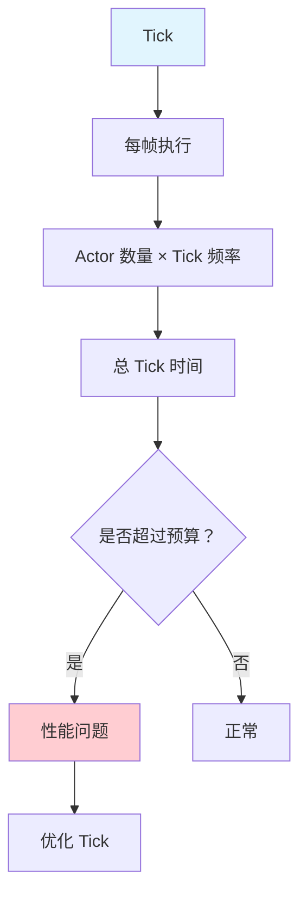
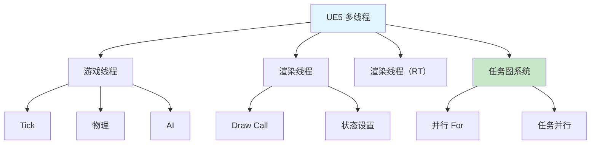
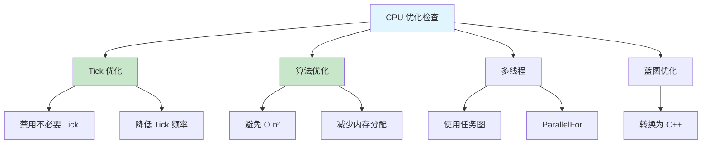

# CPU性能优化

> 优化 CPU 性能，提升游戏帧率

## 概述

CPU 性能瓶颈通常出现在：
- **游戏线程**：Tick、物理模拟、AI 计算
- **渲染线程**：Draw Call、渲染状态切换
- **主线程**：蓝图执行、GC

本课将系统讲解 CPU 性能优化的方法和技巧。

## 1. Tick 优化

### 1.1 Tick 的性能影响



Tick 是 CPU 性能的最大消耗者之一：
- 1000 个 Actor × 每帧 Tick = 大量 CPU 时间
- 复杂的 Tick 逻辑会进一步加剧性能问题

### 1.2 Tick 优化策略

#### 策略一：禁用不必要的 Tick

```cpp
// 在构造函数中禁用 Tick
AMyActor::AMyActor()
{
    PrimaryActorTick.bCanEverTick = false;  // 禁用 Tick
    PrimaryActorTick.bStartWithTickEnabled = false;  // 初始不启用
}
```

```cpp
// 运行时动态禁用 Tick
void AMyActor::BeginPlay()
{
    Super::BeginPlay();

    // 根据条件决定是否启用 Tick
    if (ShouldTick())
    {
        PrimaryActorTick.SetTickFunctionEnable(true);
    }
}
```

#### 策略二：降低 Tick 频率

```cpp
AMyActor::AMyActor()
{
    PrimaryActorTick.bCanEverTick = true;
    PrimaryActorTick.TickInterval = 0.1f;  // 每 0.1 秒 Tick 一次（10 FPS）
}
```

#### 策略三：使用 Tick 函数组

```cpp
// 将不重要的 Tick 放到低优先级组
AMyActor::AMyActor()
{
    PrimaryActorTick.bCanEverTick = true;
    PrimaryActorTick.TickGroup = TG_PrePhysics;  // 在物理模拟前执行
}
```

### 1.3 代码示例：优化的 Tick 管理

```cpp
// UMyTickOptimizerComponent.h
UCLASS(ClassGroup=(Custom), meta=(BlueprintSpawnableComponent))
class MYGAME_API UMyTickOptimizerComponent : public UActorComponent
{
    GENERATED_BODY()

public:
    UMyTickOptimizerComponent();

    // 设置 Tick 间隔
    UFUNCTION(BlueprintCallable, Category="Performance")
    void SetTickInterval(float Interval);

    // 启用/禁用 Tick
    UFUNCTION(BlueprintCallable, Category="Performance")
    void SetTickEnabled(bool bEnabled);

private:
    // 距离裁剪
    void DistanceCulling();

    // Tick 间隔优化
    void AdaptiveTickInterval();

    UPROPERTY(EditAnywhere, Category="Performance")
    float MaxTickDistance = 2000.0f;  // 超过此距离禁用 Tick

    UPROPERTY(EditAnywhere, Category="Performance")
    float MinTickInterval = 0.0f;  // 最小 Tick 间隔

    UPROPERTY(EditAnywhere, Category="Performance")
    float MaxTickInterval = 0.5f;  // 最大 Tick 间隔
};
```

```cpp
// UMyTickOptimizerComponent.cpp
#include "UMyTickOptimizerComponent.h"
#include "GameFramework/Actor.h"
#include "GameFramework/PlayerController.h"
#include "GameFramework/Character.h"

UMyTickOptimizerComponent::UMyTickOptimizerComponent()
{
    PrimaryComponentTick.bCanEverTick = true;
}

void UMyTickOptimizerComponent::SetTickInterval(float Interval)
{
    PrimaryComponentTick.TickInterval = FMath::Clamp(Interval, MinTickInterval, MaxTickInterval);
}

void UMyTickOptimizerComponent::SetTickEnabled(bool bEnabled)
{
    PrimaryComponentTick.SetTickFunctionEnable(bEnabled);
}

void UMyTickOptimizerComponent::DistanceCulling()
{
    AActor* Owner = GetOwner();
    if (!Owner) return;

    // 获取本地玩家位置
    ACharacter* PlayerCharacter = UGameplayStatics::GetPlayerCharacter(Owner->GetWorld(), 0);
    if (!PlayerCharacter) return;

    float Distance = Owner->GetDistanceTo(PlayerCharacter);

    // 超过距离阈值，禁用 Tick
    if (Distance > MaxTickDistance)
    {
        PrimaryComponentTick.SetTickFunctionEnable(false);
    }
    else
    {
        PrimaryComponentTick.SetTickFunctionEnable(true);
    }
}

void UMyTickOptimizerComponent::AdaptiveTickInterval()
{
    AActor* Owner = GetOwner();
    if (!Owner) return;

    // 根据距离动态调整 Tick 间隔
    ACharacter* PlayerCharacter = UGameplayStatics::GetPlayerCharacter(Owner->GetWorld(), 0);
    if (!PlayerCharacter) return;

    float Distance = Owner->GetDistanceTo(PlayerCharacter);
    float Alpha = FMath::Clamp(Distance / MaxTickDistance, 0.0f, 1.0f);
    float Interval = FMath::Lerp(MinTickInterval, MaxTickInterval, Alpha);

    SetTickInterval(Interval);
}
```

## 2. 算法优化

### 2.1 常见性能陷阱

> ⚠️ 以下模式在性能敏感代码中应避免：

| 陷阱 | 后果 | 优化方向 |
|------|--------|----------|
| O(n²) 嵌套循环 | CPU 时间随 n 平方增长 | 使用空间分区（Octree/KDTree） |
| 每帧 `FindObject` / `LoadObject` | 主线程卡顿 | 缓存指针、`BeginPlay` 中加载 |
| 频繁 `TArray::Add` / `Remove` | 内存重分配 | `Reserve()` 预分配 |
| 不必要的 `UObject` 强引用 | 阻止 GC 回收 | 改用 `TWeakObjectPtr` |

### 2.2 优化示例

#### 示例一：避免 O(n²) 算法

```cpp
// ❌ 错误：O(n²) 复杂度
void FindNearestActors_Bad(TArray<AActor*> Actors, AActor* Target, TArray<AActor*>& OutNearest)
{
    for (AActor* Actor : Actors)
    {
        float MinDist = MAX_FLT;
        AActor* Nearest = nullptr;

        for (AActor* OtherActor : Actors)
        {
            float Dist = Actor->GetDistanceTo(OtherActor);
            if (Dist < MinDist)
            {
                MinDist = Dist;
                Nearest = OtherActor;
            }
        }

        OutNearest.Add(Nearest);
    }
}

// ✅ 正确：使用空间分区
void FindNearestActors_Good(UWorld* World, FVector Center, float Radius, TArray<AActor*>& OutActors)
{
    // 使用 Sphere Sweep 或 Octree
    // ...
}
```

#### 示例二：减少内存分配

```cpp
// ❌ 错误：每帧分配内存
void Update_Bad()
{
    TArray<FMyData> TempArray;  // 每帧分配
    TempArray.Add(...);
    // ...
}

// ✅ 正确：复用内存
void AMyActor::Update_Good()
{
    // 使用成员变量，避免每帧分配
    CachedArray.Reset();
    CachedArray.Reserve(100);  // 预分配
    CachedArray.Add(...);
    // ...
}
```

#### 示例三：缓存结果

```cpp
// ❌ 错误：每帧 FindObject
void Tick_Bad(float DeltaTime)
{
    UMyAsset* Asset = LoadObject<UMyAsset>(nullptr, TEXT("/Game/MyAsset"));
    // ...
}

// ✅ 正确：缓存 Asset 指针
void AMyActor::BeginPlay()
{
    Super::BeginPlay();
    CachedAsset = LoadObject<UMyAsset>(nullptr, TEXT("/Game/MyAsset"));
}

void AMyActor::Tick(float DeltaTime)
{
    if (CachedAsset)
    {
        // 使用 CachedAsset
    }
}
```

### 2.3 代码示例：优化的距离查询

```cpp
// 使用空间分区加速查询
void OptimizedDistanceQuery(UWorld* World, FVector Center, float Radius)
{
    // 使用 Collision Query
    TArray<FHitResult> Hits;
    UKismetSystemLibrary::SphereTraceMulti(
        World,
        Center,
        Center + FVector(0, 0, 1),  // 小偏移
        Radius,
        UEngineTypes::ConvertToTraceType(ECC_Pawn),
        false,
        TArray<AActor*>(),
        EDrawDebugTrace::None,
        Hits,
        true
    );

    // 处理 Hit 结果
    for (const FHitResult& Hit : Hits)
    {
        AActor* HitActor = Hit.GetActor();
        // ...
    }
}
```

## 3. 多线程优化

### 3.1 UE5 多线程架构



### 3.2 使用任务图系统

```cpp
// 并行执行任务
void ParallelTaskExample()
{
    TGraphTask<FMyTask>::CreateTask().ConstructAndDispatchWhenReady();
}

// 自定义任务
class FMyTask
{
public:
    FMyTask() {}

    static TStatId GetStatId() { RETURN_QUICK_DECLARE_CYCLE_STAT(FMyTask, STAT_FMyTask); }
    static ESubsequentsMode::Type GetSubsequentsMode() { return ESubsequentsMode::FireAndForget; }

    void DoTask(ENamedThreads::Type CurrentThread, const FGraphEventRef& MyCompletionGraphEvent)
    {
        // 耗时操作
        // ...
    }
};
```

### 3.3 代码示例：并行 For

```cpp
// 使用 ParallelFor 并行处理
void ProcessActorsInParallel(TArray<AActor*> Actors)
{
    ParallelFor(Actors.Num(), [&](int32 Index)
    {
        AActor* Actor = Actors[Index];
        if (Actor)
        {
            // 处理 Actor（线程安全）
            // ...
        }
    });
}
```

## 4. 蓝图优化

### 4.1 蓝图性能陷阱

| 陷阱 | 影响 | 优化方法 |
|------|------|----------|
| 复杂的蓝图节点 | 执行慢 | 转换为 C++ |
| 频繁的 Cast | 性能差 | 使用 Interface |
| 大的事件图 | 难维护 | 拆分为函数 |
| 每帧执行的蓝图 | CPU 压力大 | 降低执行频率 |

### 4.2 优化示例

```cpp
// ❌ 错误：蓝图中的复杂逻辑
// 蓝图节点太多，执行慢

// ✅ 正确：转换为 C++
void UMyComponent::OptimizedFunction()
{
    // C++ 执行更快
    // ...
}
```

## 5. Lyra 中的 CPU 优化

### 5.1 Lyra 的 Tick 优化

### 5.1 Lyra 的 Tick 优化

Lyra 使用了多种 Tick 优化技术，核心在 `ULyraPawnExtensionComponent`：

| 优化技术 | Lyra 实现位置 | 效果 |
|-----------|----------------|------|
| 按需 Tick | `ULyraPawnExtensionComponent::TickComponent` | 避免不必要的 Pawn Tick |
| 距离裁剪 | `ULyraPawnExtensionComponent::CheckPawnReadiness` | 远距离 Pawn 停止 Tick |
| Component 生命周期管理 | `IExperienceReadyInterface::OnExperienceLoaded` | 延迟激活组件 |

关键源码（`ULyraPawnExtensionComponent.cpp` 片段）：
```cpp
// [Lyra] Source/LyraGame/Components/LyraPawnExtensionComponent.cpp
void ULyraPawnExtensionComponent::TickComponent(float DeltaTime, ELevelTick TickType,
                                                  FActorComponentTickFunction* ThisTickFunction)
{
    Super::TickComponent(DeltaTime, TickType, ThisTickFunction);

    // [1] 检查是否应该继续 Tick
    if (!IsPawnReady())
    {
        PrimaryComponentTick.SetTickFunctionEnable(false);  // [2] 禁用 Tick
        return;
    }

    // [3] 执行必要的 Tick 逻辑
    UpdatePawnState(DeltaTime);
}
```

## 总结与要点

### 关键要点

1. **禁用不必要的 Tick** - 最大的性能提升
2. **降低 Tick 频率** - 使用 TickInterval
3. **优化算法** - 避免 O(n²)、减少内存分配
4. **使用多线程** - 任务图系统、ParallelFor
5. **优化蓝图** - 转换为 C++、简化逻辑

### CPU 优化检查清单



## 相关页面

- [[30-tutorials/performance-optimization/03-GPU与渲染优化]] - GPU 与渲染优化

## 参考资料

<!-- nav:auto -->

---

**导航**: ← [[30-tutorials/performance-optimization/01-性能分析工具|01-性能分析工具]] · [[30-tutorials/performance-optimization/03-GPU与渲染优化|03-GPU与渲染优化]] →

<!-- /nav:auto -->
