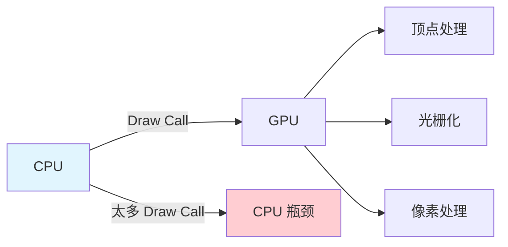
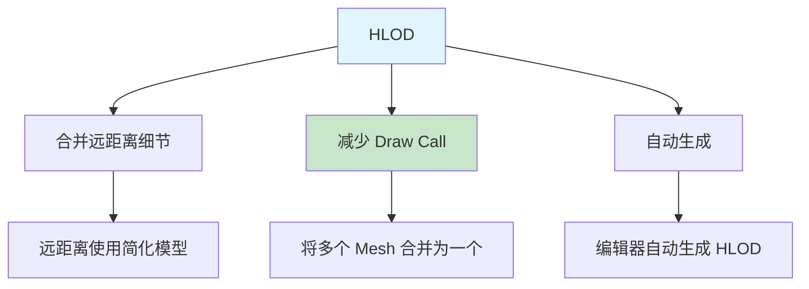
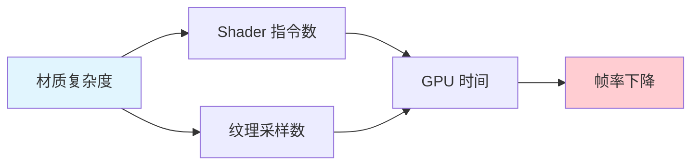
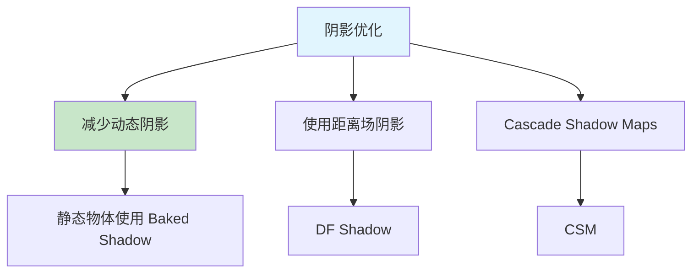
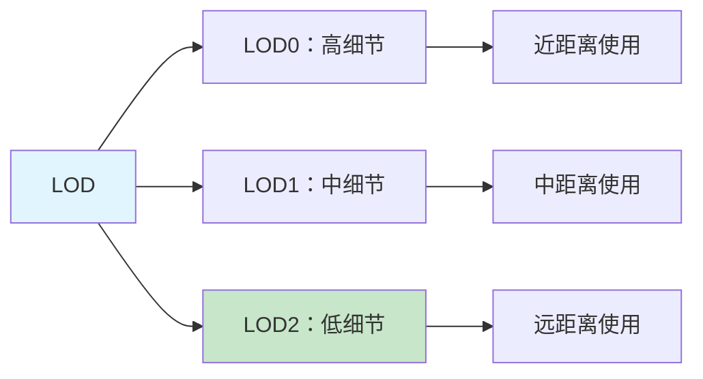
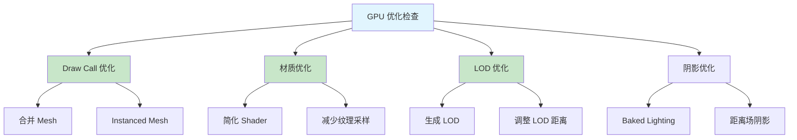

# GPU与渲染优化

> 优化 GPU 性能，提升渲染效率

## 概述

GPU 性能瓶颈通常出现在：
- **Draw Call 过多**：CPU 向 GPU 提交太多绘制命令
- **Overdraw**：像素被多次绘制
- **复杂的材质**：Shader 过于复杂
- **阴影和光照**：动态阴影和光照计算

本课将系统讲解 GPU 和渲染优化的方法和技巧。

## 1. Draw Call 优化

### 1.1 什么是 Draw Call？



**Draw Call** 是 CPU 向 GPU 提交的绘制命令。过多的 Draw Call 会导致 CPU 瓶颈。

### 1.2 Draw Call 优化策略

#### 策略一：Static Mesh 合并

```cpp
// 合并 Static Mesh
void MergeStaticMeshes(AActor* Actor)
{
    // [1] 查找 StaticMeshComponent
    UStaticMeshComponent* MeshComponent = Actor->FindComponentByClass<UStaticMeshComponent>();
    if (MeshComponent)
    {
        // [2] 启用 Mesh 合并（Static  mobility 允许引擎合并 Draw Call）
        MeshComponent->SetMobility(EComponentMobility::Static);
    }
}
```

#### 策略二：使用 Instanced Static Mesh

```cpp
// [1] 使用 Instanced Static Mesh 渲染多个相同 Mesh
UInstancedStaticMeshComponent* InstancedMesh = CreateDefaultSubobject<UInstancedStaticMeshComponent>(TEXT("InstancedMesh"));

// [2] 添加实例
FTransform InstanceTransform;
for (int32 i = 0; i < 1000; i++)
{
    InstanceTransform.SetLocation(FVector(i * 100, 0, 0));
    InstancedMesh->AddInstance(InstanceTransform);  // [3] 批量添加
}
```

#### 策略三：HLOD（Hierarchical LOD）



### 1.3 代码示例：Instanced Static Mesh

```cpp
// [1] AMyFoliageActor.h - Instanced Static Mesh 植被 Actor
UCLASS()
class MYGAME_API AMyFoliageActor : public AActor
{
    GENERATED_BODY()

public:
    AMyFoliageActor();

    // [2] 添加单个实例
    UFUNCTION(BlueprintCallable, Category="Rendering")
    void AddInstance(const FTransform& Transform);

    // [3] 批量添加实例
    UFUNCTION(BlueprintCallable, Category="Rendering")
    void AddInstances(const TArray<FTransform>& Transforms);

private:
    // [4] Instanced Static Mesh Component 成员
    UPROPERTY(VisibleAnywhere, BlueprintReadOnly, Category="Rendering", meta=(AllowPrivateAccess="true"))
    UInstancedStaticMeshComponent* InstancedMeshComponent;
};
```

```cpp
// [1] AMyFoliageActor.cpp - Instanced Static Mesh 植被 Actor 实现
#include "AMyFoliageActor.h"
#include "Components/InstancedStaticMeshComponent.h"

AMyFoliageActor::AMyFoliageActor()
{
    PrimaryActorTick.bCanEverTick = false;

    // [2] 创建 Instanced Static Mesh Component
    InstancedMeshComponent = CreateDefaultSubobject<UInstancedStaticMeshComponent>(TEXT("InstancedMesh"));
    RootComponent = InstancedMeshComponent;  // [3] 设为根组件
}

void AMyFoliageActor::AddInstance(const FTransform& Transform)
{
    if (InstancedMeshComponent)
    {
        // [4] 添加单个实例
        InstancedMeshComponent->AddInstance(Transform);
    }
}

void AMyFoliageActor::AddInstances(const TArray<FTransform>& Transforms)
{
    if (InstancedMeshComponent)
    {
        // [5] 批量添加实例（性能更优）
        InstancedMeshComponent->AddInstances(Transforms, false);
    }
}
```

## 2. 材质优化

### 2.1 材质性能影响



材质的复杂度直接影响 GPU 性能：
- **Shader 指令数**：指令越多，性能越差
- **纹理采样数**：采样越多，性能越差
- **动态参数**：动态参数会增加 CPU 开销

### 2.2 材质优化策略

#### 策略一：简化材质

```
优化方法：
1. 减少纹理采样次数
2. 使用简单的数学运算
3. 避免使用 Flow Control（分支）
4. 使用 Material Function 复用代码
```

#### 策略二：使用材质 LOD

> **材质 LOD**：根据距离切换不同质量的材质（近距离高质量 Shader，远距离极简 Shader），减少 GPU 像素着色开销。在 UE 中可通过 `Material Quality Settings` 或 `Static Switch` 实现。

#### 策略三：使用 Static Switch

```cpp
// 在材质中使用 Static Switch
// 根据平台或距离切换材质质量

// 示例：高端平台使用高质量材质，低端平台使用低质量材质
#if PS4 || XBOXONE
    #define USE_HIGH_QUALITY_MATERIAL 0
#else
    #define USE_HIGH_QUALITY_MATERIAL 1
#endif

// 在材质中
#if USE_HIGH_QUALITY_MATERIAL
    // 高质量 Shader
#else
    // 低质量 Shader
#endif
```

### 2.3 代码示例：动态材质实例优化

```cpp
// [1] 使用 MID（Material Instance Dynamic）优化材质更新
void UMyComponent::UpdateMaterialParameter(float Value)
{
    // [2] 懒创建 MID（只创建一次，避免每帧创建）
    if (!DynamicMaterialInstance)
    {
        UMaterialInterface* Material = GetMaterial();
        if (Material)
        {
            DynamicMaterialInstance = UMaterialInstanceDynamic::Create(Material, this);
            SetMaterial(0, DynamicMaterialInstance);  // [3] 应用到材质槽位 0
        }
    }

    // [4] 更新参数（只更新变化的参数，避免无效开销）
    if (DynamicMaterialInstance)
    {
        DynamicMaterialInstance->SetScalarParameterValue(TEXT("MyParameter"), Value);
    }
}
```

## 3. 阴影和光照优化

### 3.1 阴影优化



#### 优化方法

| 技术 | 说明 | 性能影响 |
|------|------|----------|
| **Baked Lighting** | 预计算光照 | ✅ 低 |
| **Distance Field Shadow** | 距离场阴影 | ✅ 中 |
| **CSM** | 级联阴影贴图 | ⚠️ 中高 |
| **Ray Traced Shadow** | 光线追踪阴影 | ❌ 高 |

### 3.2 光照优化

```cpp
// [1] 优化光照性能 - 实践要点
void OptimizeLighting()
{
    // [2] 减少动态光源数量（使用 Stationary 或 Static 光源）
    // [3] 使用 Baked Lighting（Lightmass）
    // [4] 使用 IES Profile 优化光源衰减（避免实时衰减计算）
    // [5] 谨慎使用 Light Shafts（仅在关键光源启用）
}
```

## 4. LOD（细节层次）优化

### 4.1 什么是 LOD？



**LOD（Level of Detail）** 是根据距离切换模型细节的技术，可以显著提升渲染性能。

### 4.2 LOD 优化策略

#### 策略一：自动生成 LOD

```
在 Static Mesh 编辑器中：
1. 打开 Static Mesh
2. 找到 LOD Settings
3. 点击 "Auto LOD Generation"
4. 设置 LOD 数量和质量
5. 应用
```

#### 策略二：手动调整 LOD 距离

```cpp
// 设置 LOD 距离
void SetLODDistances()
{
    UStaticMeshComponent* MeshComponent = GetStaticMeshComponent();
    if (MeshComponent)
    {
        // 设置 LOD 距离
        MeshComponent->LODDistanceScale = 1.0f;  // LOD 距离缩放
    }
}
```

### 4.3 代码示例：动态 LOD 管理

```cpp
// [1] UMyLODManagerComponent.h - 动态 LOD 管理组件
UCLASS(ClassGroup=(Custom), meta=(BlueprintSpawnableComponent))
class MYGAME_API UMyLODManagerComponent : public UActorComponent
{
    GENERATED_BODY()

public:
    UMyLODManagerComponent();

    // [2] 设置 LOD 距离（LOD0/1/2 的切换距离）
    UFUNCTION(BlueprintCallable, Category="Rendering")
    void SetLODDistances(const TArray<float>& Distances);

    // [3] 更新 LOD（根据距离或手动强制）
    UFUNCTION(BlueprintCallable, Category="Rendering")
    void UpdateLOD();

private:
    // [4] LOD 距离配置（可编辑）
    UPROPERTY(EditAnywhere, Category="Rendering")
    TArray<float> LODDistances;

    // [5] 强制 LOD（-1 表示不强制，0=最高，N=LOD N）
    UPROPERTY(EditAnywhere, Category="Rendering")
    int32 ForcedLOD = -1;
};
```

```cpp
// [1] UMyLODManagerComponent.cpp - 动态 LOD 管理组件实现
#include "UMyLODManagerComponent.h"
#include "Components/StaticMeshComponent.h"

UMyLODManagerComponent::UMyLODManagerComponent()
{
    PrimaryComponentTick.bCanEverTick = true;
    PrimaryComponentTick.TickInterval = 0.5f;  // [2] 每 0.5 秒更新一次（降低 Tick 频率）
}

void UMyLODManagerComponent::SetLODDistances(const TArray<float>& Distances)
{
    LODDistances = Distances;  // [3] 保存 LOD 距离配置

    // 注意：UE5 中 LOD 距离在 Static Mesh 资源中设置，不是在组件中
    // 此处可用于运行时动态调整策略
}

void UMyLODManagerComponent::UpdateLOD()
{
    // [4] 查找所属 Actor 的 StaticMeshComponent
    UStaticMeshComponent* MeshComponent = GetOwner()->FindComponentByClass<UStaticMeshComponent>();
    if (MeshComponent)
    {
        // [5] 强制 LOD（ForcedLOD >= 0 时生效）
        if (ForcedLOD >= 0)
        {
            // 注意：ForcedLodModel 索引从 1 开始（0 表示不强制）
            MeshComponent->ForcedLodModel = ForcedLOD + 1;
        }
    }
}
```

## 5. Lyra 中的 GPU 优化

### 5.1 Lyra 的渲染优化

Lyra 使用了多种渲染优化技术，核心在角色和武器渲染：

| Lyra 优化技术 | 实现位置 | 效果 |
|--------------|----------|------|
| 角色 LOD | `SK_lyra` 资产（LOD0~LOD3） | 远距离自动切换低模 |
| 武器 LOD | `WP_lyra` 系列资产 | 减少 GPU 顶点处理 |
| Impostor | 未使用（Lyra 未启用） | — |
| 材质简化 | `MI_lyra_skin` / `MI_lyra_cloth` | 减少 Shader 变体 |

关键源码参考：
- `Source/LyraGame/Character/LyraCharacter.cpp` — `UpdateMeshLOD()` 调用链
- `Source/LyraGame/Character/LyraCharacter.cpp` — `GetMesh()->SetForcedLOD()` 可选强制 LOD

### 5.2 代码示例：Lyra 风格的 LOD 管理

```cpp
// [Lyra 参考] Source/LyraGame/Character/LyraCharacter.cpp 片段
void ALyraCharacter::UpdateCharacterLOD()
{
    // [1] 根据与本地玩家距离决定 LOD
    APlayerController* LocalPC = GetWorld()->GetFirstPlayerController();
    if (LocalPC && LocalPC->GetPawn())
    {
        float Distance = GetDistanceTo(LocalPC->GetPawn());
        
        // [2] LOD 决策（与 StaticMesh 资产的 LOD 设置配合）
        if (Distance > 2000.0f)
        {
            GetMesh()->SetForcedLOD(2);  // [3] 强制最低 LOD
        }
        else if (Distance > 1000.0f)
        {
            GetMesh()->SetForcedLOD(1);
        }
        else
        {
            GetMesh()->SetForcedLOD(0);  // [4] 最高质量
        }
    }
}
```

## 总结与要点

### 关键要点

1. **减少 Draw Call** - 合并 Mesh、使用 Instanced Static Mesh
2. **优化材质** - 简化 Shader、减少纹理采样
3. **使用 LOD** - 根据距离切换模型细节
4. **优化阴影和光照** - 使用 Baked Lighting、距离场阴影
5. **持续监控** - 使用 GPU Visualizer 分析性能

### GPU 优化检查清单



## 相关页面

- [[30-tutorials/performance-optimization/04-内存优化]] - 内存优化
- [[30-tutorials/animation/04-UE5动画图与状态机深度分析]] - 动画状态机

## 参考资料

<!-- nav:auto -->

---

**导航**: ← [[30-tutorials/performance-optimization/02-CPU性能优化|02-CPU性能优化]] · [[30-tutorials/performance-optimization/04-内存优化|04-内存优化]] →

<!-- /nav:auto -->
