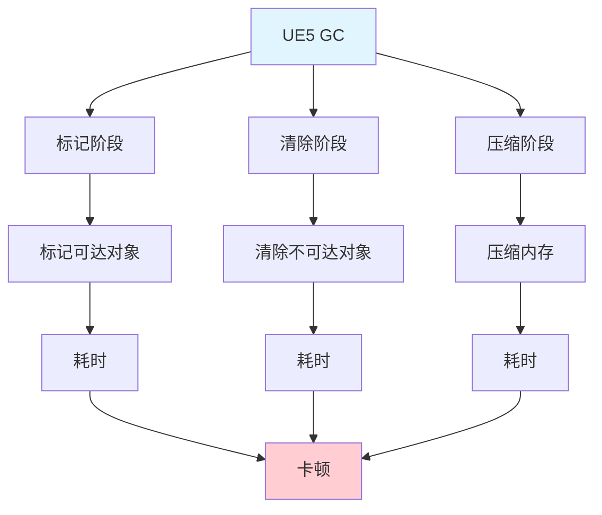
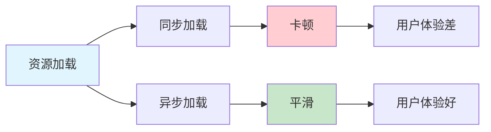
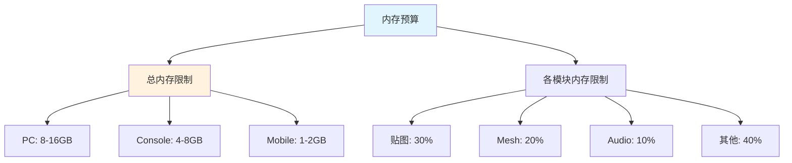
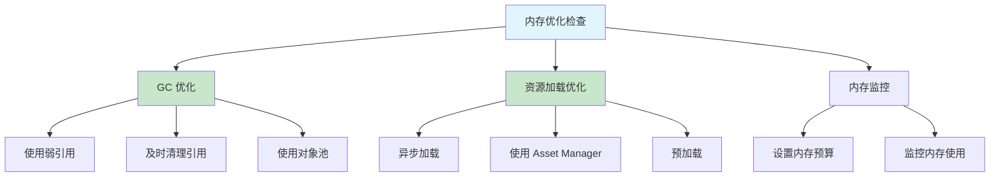

# 内存优化

> 优化内存使用，防止崩溃和卡顿

## 概述

内存问题会导致：
- **内存泄漏**：内存占用持续增长，最终崩溃
- **GC（垃圾回收）卡顿**：GC 触发时游戏卡顿
- **内存碎片**：内存使用效率低
- **OOM（内存不足）**：设备内存不足，崩溃

本课将系统讲解内存优化的方法和技巧。

## 1. 垃圾回收（GC）优化

### 1.1 UE5 的 GC 机制



UE5 使用**标记-清除（Mark-Sweep）** 垃圾回收算法：
1. **标记阶段**：从根集（Root Set）开始，标记所有可达对象
2. **清除阶段**：清除所有未标记的对象
3. **压缩阶段**：压缩内存，减少碎片

### 1.2 GC 性能问题

| 问题 | 原因 | 影响 | 解决方案 |
|------|------|------|----------|
| **GC 卡顿** | GC 在主线程执行 | 游戏卡顿 | 增量 GC、异步 GC |
| **内存泄漏** | 对象被意外引用 | 内存持续增长 | 使用弱引用、及时清理 |
| **GC 时间长** | 对象数量多 | 卡顿时间长 | 减少 UObject 数量 |

### 1.3 GC 优化策略

#### 策略一：使用弱引用

```cpp
// ❌ 错误：强引用阻止 GC
UCLASS()
class MYGAME_API UMyComponent : public UActorComponent
{
    GENERATED_BODY()

private:
    UPROPERTY()
    AMyActor* StrongRef;  // [1] 强引用，阻止 GC 回收
};

// ✅ 正确：弱引用允许 GC
UCLASS()
class MYGAME_API UMyComponent : public UActorComponent
{
    GENERATED_BODY()

private:
    TWeakObjectPtr<AMyActor> WeakRef;  // [2] 弱引用，允许 GC 回收

    void UseWeakRef()
    {
        if (WeakRef.IsValid())  // [3] 使用前检查有效性
        {
            AMyActor* Actor = WeakRef.Get();
        }
    }
};
```

#### 策略二：及时清理引用

```cpp
// ❌ 错误：引用不及时清理
void AMyActor::BeginPlay()
{
    Super::BeginPlay();
    GlobalArray.Add(this);  // 添加到全局数组
}

// ✅ 正确：及时清理引用
void AMyActor::EndPlay(const FEndPlayParameters& EndPlayParams)
{
    Super::EndPlay(EndPlayParams);
    GlobalArray.Remove(this);  // 从全局数组移除
}
```

#### 策略三：使用对象池

```cpp
// 对象池：复用对象，减少 GC 压力
UCLASS()
class MYGAME_API UMyObjectPool : public UObject
{
    GENERATED_BODY()

public:
    // 获取对象
    UMyObject* GetObject();

    // 归还对象
    void ReturnObject(UMyObject* Object);

private:
    // 对象池
    UPROPERTY()
    TArray<UMyObject*> Pool;

    // 空闲对象
    UPROPERTY()
    TArray<UMyObject*> FreeObjects;
};
```

### 1.4 代码示例：优化的 GC 管理

```cpp
// UMyGCOptimizerComponent.h
UCLASS(ClassGroup=(Custom), meta=(BlueprintSpawnableComponent))
class MYGAME_API UMyGCOptimizerComponent : public UActorComponent
{
    GENERATED_BODY()

public:
    UMyGCOptimizerComponent();

    // [1] 设置增量 GC
    UFUNCTION(BlueprintCallable, Category="Performance|GC")
    void EnableIncrementalGC(bool bEnable);

    // [2] 强制 GC
    UFUNCTION(BlueprintCallable, Category="Performance|GC")
    void ForceGC();

private:
    // [3] 监控 GC 时间
    void MonitorGCTime();

    // [4] 上次 GC 时间
    float LastGCTime = 0.0f;

    // [5] GC 间隔
    UPROPERTY(EditAnywhere, Category="Performance|GC")
    float GCInterval = 60.0f;  // 60 秒
};
```

```cpp
// UMyGCOptimizerComponent.cpp
#include "UMyGCOptimizerComponent.h"
#include "HAL/PlatformMisc.h"

UMyGCOptimizerComponent::UMyGCOptimizerComponent()
{
    PrimaryComponentTick.bCanEverTick = true;
    PrimaryComponentTick.TickInterval = 5.0f;  // [6] 每 5 秒检查一次
}

void UMyGCOptimizerComponent::EnableIncrementalGC(bool bEnable)
{
    // [7] 通过控制台命令设置 GC 参数
    GEngine->Exec(GetWorld(), bEnable ? TEXT("gc.MaxObjectsInEditor 2097152") : TEXT("gc.MaxObjectsInEditor 1048576"));
}

void UMyGCOptimizerComponent::ForceGC()
{
    // [8] 强制触发 GC
    GEngine->Exec(GetWorld(), TEXT("gc"));
}

void UMyGCOptimizerComponent::MonitorGCTime()
{
    // [9] 监控 GC 时间，避免卡顿
    float CurrentTime = FPlatformTime::Seconds();
    if (CurrentTime - LastGCTime > GCInterval)
    {
        // [10] 触发增量 GC
        GEngine->Exec(GetWorld(), TEXT("gc"));
        LastGCTime = CurrentTime;
    }
}
```

## 2. 资源加载优化

### 2.1 资源加载性能影响



同步加载会导致游戏卡顿，应该优先使用异步加载。

### 2.2 资源加载优化策略

#### 策略一：使用异步加载

```cpp
// ❌ 错误：同步加载
UMyAsset* LoadAsset_Bad()
{
    return LoadObject<UMyAsset>(nullptr, TEXT("/Game/MyAsset"));
}

// ✅ 正确：异步加载
void LoadAsset_Good(TFunction<void(UMyAsset*)> Callback)
{
    FStreamableManager& StreamableManager = UAssetManager::GetStreamableManager();
    StreamableManager.RequestAsyncLoad(
        FSoftObjectPath(TEXT("/Game/MyAsset")),
        FStreamableDelegate::CreateLambda([Callback]()
        {
            UMyAsset* Asset = LoadObject<UMyAsset>(nullptr, TEXT("/Game/MyAsset"));
            Callback(Asset);
        })
    );
}
```

#### 策略二：使用 Asset Manager

```cpp
// 使用 Asset Manager 管理资源加载
void LoadAssetWithAssetManager()
{
    FSoftObjectPath AssetPath(TEXT("/Game/MyAsset"));
    UAssetManager& AssetManager = UAssetManager::Get();

    AssetManager.LoadAssetAsync(
        AssetPath,
        FStreamableDelegate::CreateLambda([]()
        {
            UMyAsset* Asset = Cast<UMyAsset>(AssetPath.ResolveObject());
            // 使用 Asset
        })
    );
}
```

#### 策略三：预加载资源

```cpp
// 在关卡加载前预加载资源
void PreloadAssets()
{
    TArray<FSoftObjectPath> AssetsToLoad;
    AssetsToLoad.Add(FSoftObjectPath(TEXT("/Game/MyAsset1")));
    AssetsToLoad.Add(FSoftObjectPath(TEXT("/Game/MyAsset2")));

    UAssetManager::GetStreamableManager().RequestAsyncLoad(AssetsToLoad, FStreamableDelegate());
}
```

### 2.3 代码示例：资源加载管理器

```cpp
// UMyAssetLoaderComponent.h
UCLASS(ClassGroup=(Custom), meta=(BlueprintSpawnableComponent))
class MYGAME_API UMyAssetLoaderComponent : public UActorComponent
{
    GENERATED_BODY()

public:
    UMyAssetLoaderComponent();

    // [1] 异步加载资源
    UFUNCTION(BlueprintCallable, Category="Performance|Asset")
    void LoadAssetAsync(const FSoftObjectPath& AssetPath, TFunction<void(UObject*)> Callback);

    // [2] 卸载资源
    UFUNCTION(BlueprintCallable, Category="Performance|Asset")
    void UnloadAsset(const FSoftObjectPath& AssetPath);

private:
    // [3] 正在加载的资源（Handle 管理生命周期）
    TMap<FSoftObjectPath, TSharedPtr<FStreamableHandle>> LoadingAssets;
};
```

```cpp
// UMyAssetLoaderComponent.cpp
#include "UMyAssetLoaderComponent.h"
#include "Engine/AssetManager.h"

UMyAssetLoaderComponent::UMyAssetLoaderComponent()
{
    PrimaryComponentTick.bCanEverTick = false;  // [4] 不需要 Tick
}

void UMyAssetLoaderComponent::LoadAssetAsync(const FSoftObjectPath& AssetPath, TFunction<void(UObject*)> Callback)
{
    if (LoadingAssets.Contains(AssetPath))  // [5] 避免重复加载
    {
        return;
    }

    TSharedPtr<FStreamableHandle> Handle = UAssetManager::GetStreamableManager().RequestAsyncLoad(  // [6] 异步加载
        AssetPath,
        FStreamableDelegate::CreateLambda([AssetPath, Callback]()
        {
            UObject* Asset = AssetPath.ResolveObject();  // [7] 解析加载的资源
            if (Asset && Callback)
            {
                Callback(Asset);
            }
        })
    );

    LoadingAssets.Add(AssetPath, Handle);  // [8] 保存 Handle 防止提前释放
}

void UMyAssetLoaderComponent::UnloadAsset(const FSoftObjectPath& AssetPath)
{
    TSharedPtr<FStreamableHandle>* HandlePtr = LoadingAssets.Find(AssetPath);
    if (HandlePtr)  // [9] 找到对应的 Handle
    {
        (*HandlePtr)->ReleaseHandle();  // [10] 释放 Handle，触发卸载
        LoadingAssets.Remove(AssetPath);
    }
}
```

## 3. 内存预算和监控

### 3.1 内存预算



### 3.2 内存监控

```cpp
// 监控内存使用
void MonitorMemory()
{
    SIZE_T UsedPhysical = 0;
    SIZE_T PeakUsedPhysical = 0;
    FPlatformMemory::GetStats(UsedPhysical, PeakUsedPhysical);

    UE_LOG(LogTemp, Warning, TEXT("Memory: Used=%llu MB, Peak=%llu MB"),
           UsedPhysical / 1024 / 1024,
           PeakUsedPhysical / 1024 / 1024);
}
```

### 3.3 代码示例：内存监控组件

```cpp
// UMyMemoryMonitorComponent.h
UCLASS(ClassGroup=(Custom), meta=(BlueprintSpawnableComponent))
class MYGAME_API UMyMemoryMonitorComponent : public UActorComponent
{
    GENERATED_BODY()

public:
    UMyMemoryMonitorComponent();

    // [1] 获取当前内存使用 (MB)
    UFUNCTION(BlueprintCallable, Category="Performance|Memory")
    float GetUsedMemoryMB() const;

    // [2] 获取峰值内存 (MB)
    UFUNCTION(BlueprintCallable, Category="Performance|Memory")
    float GetPeakMemoryMB() const;

private:
    // [3] 监控内存
    void MonitorMemory();

    // [4] 上次内存日志时间
    float LastMemoryLogTime = 0.0f;

    // [5] 内存日志间隔
    UPROPERTY(EditAnywhere, Category="Performance|Memory")
    float MemoryLogInterval = 10.0f;  // 10 秒
};
```

```cpp
// UMyMemoryMonitorComponent.cpp
#include "UMyMemoryMonitorComponent.h"
#include "HAL/PlatformMemory.h"

UMyMemoryMonitorComponent::UMyMemoryMonitorComponent()
{
    PrimaryComponentTick.bCanEverTick = true;
    PrimaryComponentTick.TickInterval = 1.0f;  // [6] 每 1 秒更新一次
}

float UMyMemoryMonitorComponent::GetUsedMemoryMB() const
{
    // [7] 获取当前物理内存使用量
    return static_cast<float>(FPlatformMemory::GetStats().UsedPhysical / 1024.0 / 1024.0);
}

float UMyMemoryMonitorComponent::GetPeakMemoryMB() const
{
    // [8] 获取峰值物理内存使用量
    return static_cast<float>(FPlatformMemory::GetStats().PeakUsedPhysical / 1024.0 / 1024.0);
}

void UMyMemoryMonitorComponent::MonitorMemory()
{
    float CurrentTime = GetWorld()->GetTimeSeconds();
    if (CurrentTime - LastMemoryLogTime > MemoryLogInterval)  // [9] 达到日志间隔
    {
        float UsedMB = GetUsedMemoryMB();
        float PeakMB = GetPeakMemoryMB();

        // [10] 输出内存日志
        UE_LOG(LogTemp, Warning, TEXT("Memory: Used=%.2f MB, Peak=%.2f MB"), UsedMB, PeakMB);

        LastMemoryLogTime = CurrentTime;
    }
}
```

## 4. Lyra 中的内存优化

### 4.1 Lyra 的内存管理

Lyra 使用了多种内存优化技术，核心在背包和装备系统：

| Lyra 优化技术 | 实现位置 | 效果 |
|--------------|----------|------|
| 对象池（FastArray） | `ULyraInventoryManagerComponent` | 避免 TArray 复制开销 |
| 异步加载 | `ULyraExperienceManagerComponent` | 避免游戏卡顿 |
| 弱引用 | `TWeakObjectPtr<ULyraInventoryItemInstance>` | 允许 GC 回收 |
| `TObjectPtr` | `ULyraEquipmentManagerComponent` | 安全的对象引用 |

关键源码参考：
- `Source/LyraGame/Inventory/LyraInventoryManagerComponent.cpp` — `FastArray` 的 `PostReplicatedAdd()` 使用移动语义
- `Source/LyraGame/Experience/LyraExperienceManagerComponent.cpp` — `LoadExperience()` 使用 `FStreamableHandle` 异步加载

### 4.2 代码示例：Lyra 风格的内存管理

```cpp
// [Lyra 参考] Source/LyraGame/Inventory/LyraInventoryManagerComponent.h 片段
class ULyraInventoryManagerComponent : public UPawnComponent
{
    // [1] 使用 FastArray 避免 TArray 复制开销
    UPROPERTY()
    FLyraInventoryList InventoryList;

    // [2] 使用 TWeakObjectPtr 允许 GC 回收
    TArray<TWeakObjectPtr<ULyraInventoryItemInstance>> CachedItems;
};

// [Lyra 参考] Source/LyraGame/Experience/LyraExperienceManagerComponent.cpp 片段
void ULyraExperienceManagerComponent::LoadExperience()
{
    // [3] 异步加载，避免卡顿
    TSubclassOf<ULyraExperienceDefinition> ExperienceClass = ...;
    UAssetManager& AssetManager = UAssetManager::Get();

    // [4] 使用 FStreamableHandle 管理异步加载生命周期
    TSharedPtr<FStreamableHandle> Handle = AssetManager.LoadAssetAsync(
        ExperienceClass,
        FStreamableDelegate::CreateUObject(this, &ThisClass::OnExperienceLoaded)
    );
}
```

## 总结与要点

### 关键要点

1. **优化 GC** - 使用弱引用、及时清理引用、使用对象池
2. **异步加载资源** - 避免同步加载导致卡顿
3. **监控内存使用** - 设置内存预算，避免 OOM
4. **使用 Asset Manager** - 统一管理资源加载
5. **持续监控** - 使用 Memory Insights 分析内存

### 内存优化检查清单



## 相关页面

- [[30-tutorials/performance-optimization/05-网络性能优化]] - 网络性能优化

## 参考资料

<!-- nav:auto -->

---

**导航**: ← [[30-tutorials/performance-optimization/03-GPU与渲染优化|03-GPU与渲染优化]] · [[30-tutorials/performance-optimization/05-网络性能优化|05-网络性能优化]] →

<!-- /nav:auto -->
