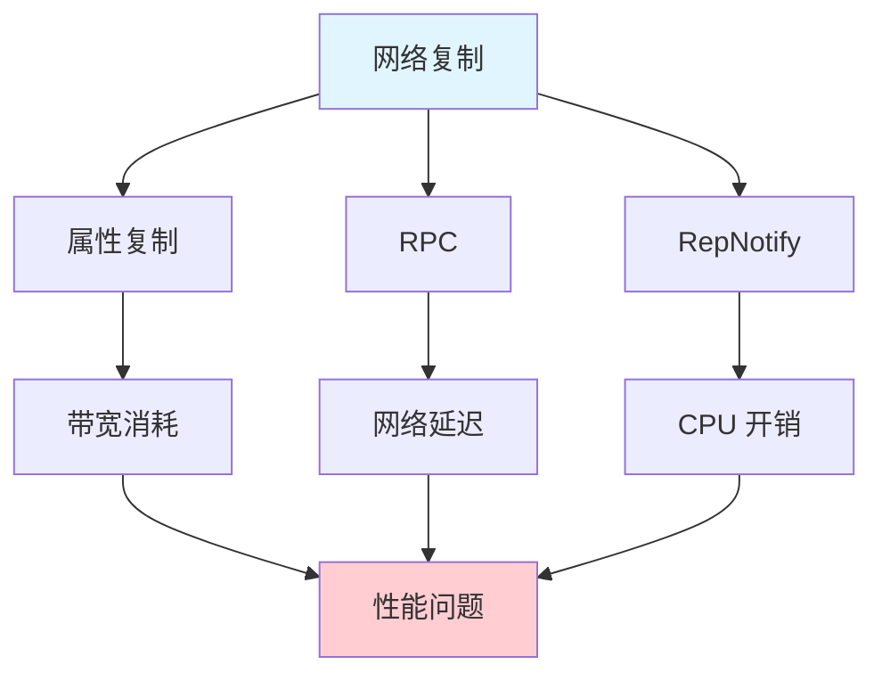
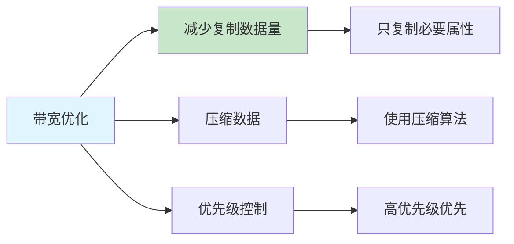
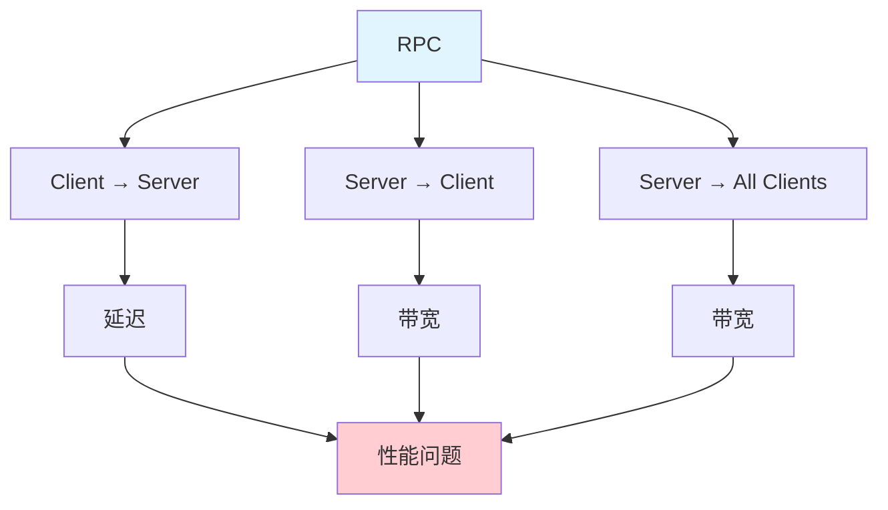
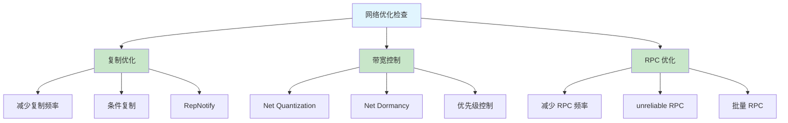

# 网络性能优化

> 优化网络性能，降低延迟和带宽消耗

## 概述

网络性能问题会导致：
- **高延迟**：玩家操作响应慢
- **带宽不足**：网络卡顿、丢包
- **服务器压力大**：无法支持大量玩家

本课将系统讲解网络性能优化的方法和技巧。

## 1. 复制优化

### 1.1 复制的性能影响



### 1.2 复制优化策略

#### 策略一：减少复制频率

```cpp
// ❌ 错误：每帧复制
UPROPERTY(Replicated)
float Health;

void Tick(float DeltaTime)
{
    Health -= DeltaTime * 10.0f;  // 每帧变化，频繁复制
}

// ✅ 正确：降低复制频率
UPROPERTY(ReplicatedUsing=OnRep_Health)
float Health;

UFUNCTION()
void OnRep_Health();

void UpdateHealth(float DeltaTime)
{
    float NewHealth = Health - DeltaTime * 10.0f;

    // 只在健康值变化超过阈值时复制
    if (FMath::Abs(NewHealth - Health) > 1.0f)
    {
        Health = NewHealth;
    }
}
```

#### 策略二：使用条件复制

```cpp
// 使用 ReplicatedUsing 和条件复制
UPROPERTY(ReplicatedUsing=OnRep_Position)
FVector Position;

// 只在特定条件下复制
UPROPERTY(Replicated)
bool bIsAlive;

// 使用 DOREPLIFETIME_ACTIVE_OVERRIDE 控制复制
void AMyActor::GetLifetimeReplicatedProps(TArray<FLifetimeProperty>& OutLifetimeProps) const
{
    Super::GetLifetimeReplicatedProps(OutLifetimeProps);

    // [1] 只在 Health 变化超过 1.0 时复制
    DOREPLIFETIME_ACTIVE_OVERRIDE(AMyActor, Health,
        FMath::Abs(Health - GetRepNotifyAActor()->Health) > 1.0f);

    // [2] 只在 bIsAlive 为 true 时复制 Position
    DOREPLIFETIME_ACTIVE_OVERRIDE(AMyActor, ReplicatedPosition,
        bIsAlive);
}
```

#### 策略三：使用 RepNotify

```cpp
// 使用 RepNotify 减少复制
UPROPERTY(ReplicatedUsing=OnRep_Health)
float Health;

UFUNCTION()
void OnRep_Health()
{
    // 只在客户端收到更新时执行
    UpdateHealthBar();
}
```

### 1.3 代码示例：优化的复制管理

```cpp
// AMyReplicatedActor.h
UCLASS()
class MYGAME_API AMyReplicatedActor : public AActor
{
    GENERATED_BODY()

public:
    AMyReplicatedActor();

protected:
    virtual void GetLifetimeReplicatedProps(TArray<FLifetimeProperty>& OutLifetimeProps) const override;  // [1]

private:
    // [2] 健康值
    UPROPERTY(ReplicatedUsing=OnRep_Health)
    float Health;

    // [3] 最大健康值
    UPROPERTY(ReplicatedUsing=OnRep_MaxHealth)
    float MaxHealth;

    // [4] 位置（条件复制）
    UPROPERTY(Replicated)
    FVector ReplicatedPosition;

    // [5] RepNotify 函数
    UFUNCTION()
    void OnRep_Health();

    UFUNCTION()
    void OnRep_MaxHealth();

    // [6] 更新复制
    void UpdateReplication();
};
```

```cpp
// AMyReplicatedActor.cpp
#include "AMyReplicatedActor.h"

// [1] 构造函数：启用复制
AMyReplicatedActor::AMyReplicatedActor()
{
    bReplicates = true;
    bNetLoadOnClient = true;
}

// [2] 重写 GetLifetimeReplicatedProps
void AMyReplicatedActor::GetLifetimeReplicatedProps(TArray<FLifetimeProperty>& OutLifetimeProps) const
{
    Super::GetLifetimeReplicatedProps(OutLifetimeProps);

    // [3] 复制 Health
    DOREPLIFETIME(AMyReplicatedActor, Health);

    // [4] 条件复制：只在 Health 变化超过 1.0 时复制
    DOREPLIFETIME_ACTIVE_OVERRIDE(AMyReplicatedActor, Health,
        FMath::Abs(Health - GetRepNotifyAActor()->Health) > 1.0f);

    // [5] 复制 MaxHealth
    DOREPLIFETIME(AMyReplicatedActor, MaxHealth);

    // [6] 条件复制：只在 bIsAlive 为 true 时复制 Position
    DOREPLIFETIME_ACTIVE_OVERRIDE(AMyReplicatedActor, ReplicatedPosition,
        bIsAlive);
}

// [7] RepNotify：Health 复制时调用
void AMyReplicatedActor::OnRep_Health()
{
    // 更新 UI
    UpdateHealthBar();
}

// [8] RepNotify：MaxHealth 复制时调用
void AMyReplicatedActor::OnRep_MaxHealth()
{
    // 更新 UI
    UpdateHealthBar();
}

// [9] 更新复制
void AMyReplicatedActor::UpdateReplication()
{
    // 只在必要时更新复制属性
    if (ShouldUpdateReplication())
    {
        Health = CalculateHealth();
        MaxHealth = CalculateMaxHealth();
    }
}
```

## 2. 带宽控制

### 2.1 带宽优化策略



#### 策略一：使用 Net Quantization

```cpp
// 使用 Net Quantization 减少复制数据量
USTRUCT()
struct FMyQuantizedVector
{
    GENERATED_BODY()

    UPROPERTY()
    FVector_NetQuantize Value;  // 量化后的 Vector
};

// FVector_NetQuantize 会自动量化 Vector，减少带宽
```

#### 策略二：使用 Net Dormancy

```cpp
// 使用 Net Dormancy 暂停复制
void AMyActor::BeginPlay()
{
    Super::BeginPlay();

    // 设置 Net Dormancy
    NetDormancy = 1;  // 1 = DORM_DormantAll
}

// 需要复制时唤醒
void AMyActor::WakeUp()
{
    NetDormancy = 0;  // 0 = DORM_Awake
    ForceNetUpdate();
}
```

#### 策略三：优先级控制

```cpp
// 设置复制优先级
void AMyActor::SetReplicationPriority()
{
    // 高优先级 Actor 优先复制
    NetPriority = 1.0f;  // 默认是 0.0f
}
```

### 2.2 代码示例：带宽优化

```cpp
// UMyBandwidthOptimizerComponent.h
UCLASS(ClassGroup=(Custom), meta=(BlueprintSpawnableComponent))
class MYGAME_API UMyBandwidthOptimizerComponent : public UActorComponent
{
    GENERATED_BODY()

public:
    // [1] 构造函数
    UMyBandwidthOptimizerComponent();

    // [2] 设置 Net Dormancy
    UFUNCTION(BlueprintCallable, Category="Performance|Network")
    void SetNetDormancy(uint8 DormancyLevel);

    // [3] 唤醒
    UFUNCTION(BlueprintCallable, Category="Performance|Network")
    void WakeUp();

private:
    // [4] 检查是否需要复制
    bool ShouldReplicate() const;

    // [5] Net Dormancy 级别
    UPROPERTY(EditAnywhere, Category="Performance|Network")
    uint8 DormancyLevel = 1;  // 1 = DORM_DormantAll
};
```

```cpp
// UMyBandwidthOptimizerComponent.cpp
#include "UMyBandwidthOptimizerComponent.h"
#include "GameFramework/Actor.h"

// [1] 构造函数
UMyBandwidthOptimizerComponent::UMyBandwidthOptimizerComponent()
{
    PrimaryComponentTick.bCanEverTick = false;
}

// [2] 设置 Net Dormancy
void UMyBandwidthOptimizerComponent::SetNetDormancy(uint8 DormancyLevel)
{
    AActor* Owner = GetOwner();
    if (Owner && Owner->GetRemoteRole() == ROLE_SimulatedProxy)
    {
        Owner->NetDormancy = DormancyLevel;
    }
}

// [3] 唤醒 Actor（恢复复制）
void UMyBandwidthOptimizerComponent::WakeUp()
{
    AActor* Owner = GetOwner();
    if (Owner)
    {
        Owner->NetDormancy = 0;  // 0 = DORM_Awake
        Owner->ForceNetUpdate();
    }
}

// [4] 检查是否需要复制
bool UMyBandwidthOptimizerComponent::ShouldReplicate() const
{
    // 根据条件判断是否应该复制
    // ...
    return true;
}
```

## 3. RPC 优化

### 3.1 RPC 性能影响



### 3.2 RPC 优化策略

#### 策略一：减少 RPC 频率

```cpp
// ❌ 错误：每帧调用 RPC
void AMyActor::Tick(float DeltaTime)
{
    ServerUpdatePosition(GetActorLocation());  // 每帧调用
}

UFUNCTION(Server, Reliable)
void ServerUpdatePosition(FVector Position);

// ✅ 正确：降低 RPC 频率
void AMyActor::Tick(float DeltaTime)
{
    RPCAccumulator += DeltaTime;
    if (RPCAccumulator > 0.1f)  // 每 0.1 秒调用一次
    {
        ServerUpdatePosition(GetActorLocation());
        RPCAccumulator = 0.0f;
    }
}
```

#### 策略二：使用 unreliable RPC

```cpp
// 使用 unreliable RPC 减少网络压力
UFUNCTION(Server, Unreliable)
void ServerUpdatePosition(FVector Position);  // 不需要可靠传输
```

#### 策略三：批量 RPC

```cpp
// 批量发送数据，减少 RPC 调用次数
UFUNCTION(Server, Reliable)
void ServerUpdateMultiple(const TArray<FVector>& Positions);  // 一次发送多个位置
```

### 3.3 代码示例：RPC 优化

```cpp
// AMyRPCActor.h
UCLASS()
class MYGAME_API AMyRPCActor : public AActor
{
    GENERATED_BODY()

public:
    // [1] 构造函数
    AMyRPCActor();

    // [2] 优化的 RPC（使用 Unreliable 减少网络压力）
    UFUNCTION(Server, Unreliable)
    void ServerUpdatePosition(const FVector& Position);

    // [3] 批量 RPC（一次发送多个位置）
    UFUNCTION(Server, Reliable)
    void ServerUpdateMultiple(const TArray<FVector>& Positions);

private:
    // [4] RPC 累加器（控制 RPC 频率）
    float RPCAccumulator = 0.0f;

    // [5] RPC 间隔（100ms）
    UPROPERTY(EditAnywhere, Category="Performance|Network")
    float RPCInterval = 0.1f;  // 100ms
};
```

```cpp
// AMyRPCActor.cpp
#include "AMyRPCActor.h"

// [1] 构造函数：启用复制
AMyRPCActor::AMyRPCActor()
{
    bReplicates = true;
}

// [2] ServerUpdatePosition 实现（unreliable RPC）
void AMyRPCActor::ServerUpdatePosition_Implementation(const FVector& Position)
{
    SetActorLocation(Position);
}

// [3] ServerUpdateMultiple 实现（批量 RPC）
void AMyRPCActor::ServerUpdateMultiple_Implementation(const TArray<FVector>& Positions)
{
    // 批量处理
    for (int32 i = 0; i < Positions.Num(); i++)
    {
        // ...
    }
}

// [4] Tick：降低 RPC 频率
void AMyRPCActor::Tick(float DeltaTime)
{
    Super::Tick(DeltaTime);

    // 降低 RPC 频率
    RPCAccumulator += DeltaTime;
    if (RPCAccumulator > RPCInterval)
    {
        ServerUpdatePosition(GetActorLocation());
        RPCAccumulator = 0.0f;
    }
}
```

## 4. Lyra 中的网络优化

### 4.1 Lyra 的复制优化

Lyra 使用了多种网络优化技术，核心在 ReplicationGraph 和 Iris：

| Lyra 优化技术 | 实现位置 | 效果 |
|--------------|----------|------|
| ReplicationGraph | `ULyraReplicationGraph` | 选择性复制，减少带宽 |
| Iris 复制系统 | `UEngine.ini` 中 `bUseIrisReplication=true` | 新一代复制，更低 CPU 开销 |
| Net Quantization | `FVector_NetQuantize` | 减少位置复制带宽 |
| `COND_SimulatedOnly` | `DOREPLIFETIME_ACTIVE_OVERRIDE` | 只在 Simulated Proxy 复制 |

关键源码参考：
- `Source/LyraGame/Replication/LyraReplicationGraph.cpp` — `ClassPriorities` 设置复制优先级
- `Source/LyraGame/AbilitySystem/Abilities/LyraGameplayAbility.cpp` — `CanActivateAbility()` 中有网络预测检查

### 4.2 代码示例：Lyra 风格的 RPC 优化

```cpp
// [Lyra 参考] Source/LyraGame/AbilitySystem/Abilities/LyraGameplayAbility.cpp 片段
bool ULyraGameplayAbility::CanActivateAbility(
    const FGameplayAbilitySpecHandle Handle,
    const FPredictionKey PredictionKey,
    const FGameplayAbilityActorInfo* ActorInfo,
    const FGameplayTagContainer* SourceTags,
    const FGameplayTagContainer* TargetTags,
    FPredictionKey* ReplicatedPredictionKey,
    const FGameplayTag& AbilityTag)
{
    // [1] 检查网络预测 Key 是否有效
    if (!PredictionKey.IsValidForActor(ActorInfo->OwnerActor.Get(), false))
    {
        return false;  // [2] 预测失败，拒绝激活
    }

    // [3] 检查 GameplayTag 是否满足
    if (!ActorInfo->OwnerActor->HasAllMatchingGameplayTags(AbilityTag))
    {
        return false;
    }

    return true;
}
```

## 总结与要点

### 关键要点

1. **优化复制** - 减少复制频率、使用条件复制、使用 RepNotify
2. **控制带宽** - 使用 Net Quantization、Net Dormancy、优先级控制
3. **优化 RPC** - 减少 RPC 频率、使用 unreliable RPC、批量 RPC
4. **使用 Replication Graph** - 优化复制决策
5. **持续监控** - 使用 Network Insights 分析网络性能

### 网络优化检查清单



## 相关页面

- [[30-tutorials/performance-optimization/06-Lyra性能实战]] - Lyra 性能实战
- [[30-tutorials/network-sync/06-ReplicationGraph与Lyra实践]] - Replication Graph
- [[30-tutorials/network-sync/iris/00-Iris总览]] - Iris 复制系统概述

## 参考资料

- [Network Performance](https://docs.unrealengine.com/5.0/en-US/performance-and-profiling/)
- [Replication Graph](https://docs.unrealengine.com/5.0/en-US/replication-graph-in-unreal-engine/)
- [Iris Replication System](https://docs.unrealengine.com/5.0/en-US/iris-replication-system-in-unreal-engine/)

<!-- nav:auto -->

---

**导航**: ← [[30-tutorials/performance-optimization/04-内存优化|04-内存优化]] · [[30-tutorials/performance-optimization/06-Lyra性能实战|06-Lyra性能实战]] →

<!-- /nav:auto -->
