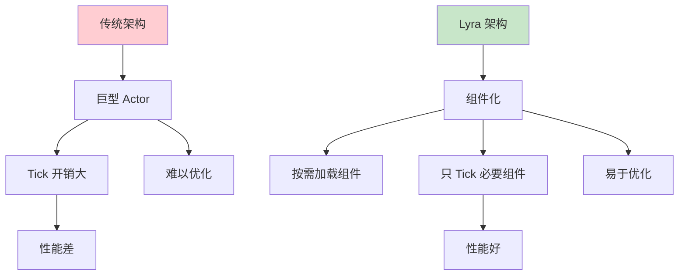
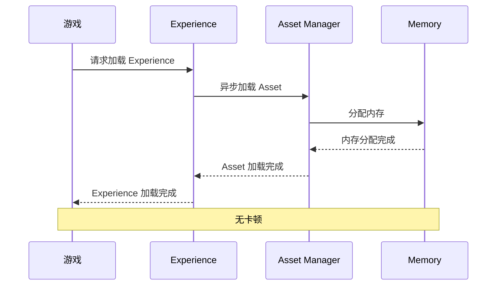
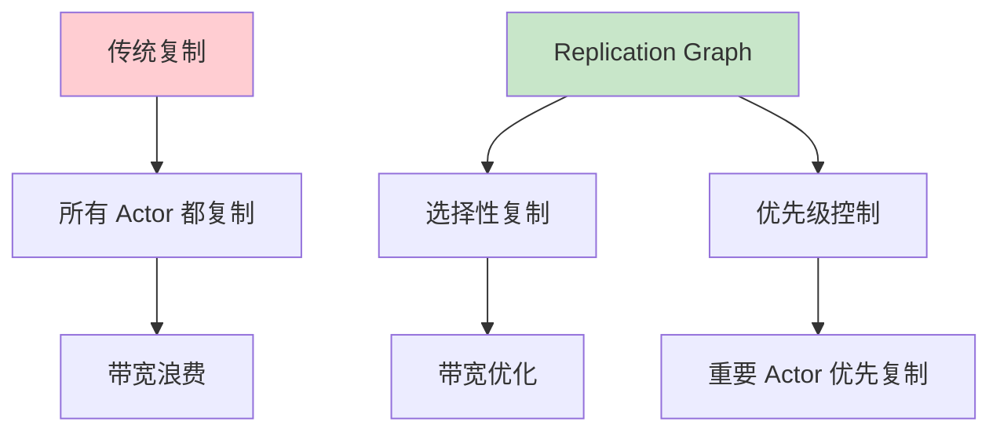
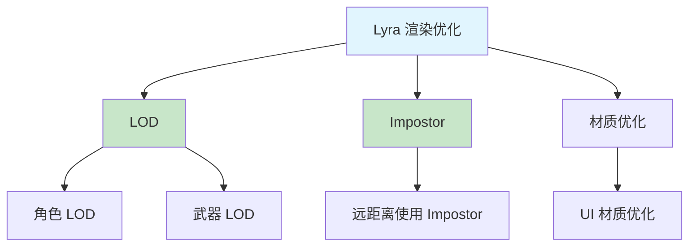
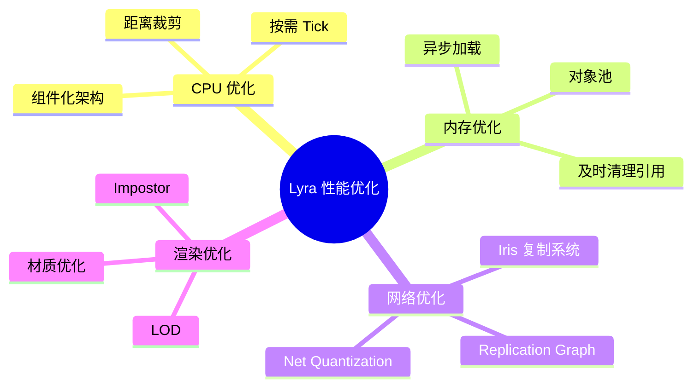
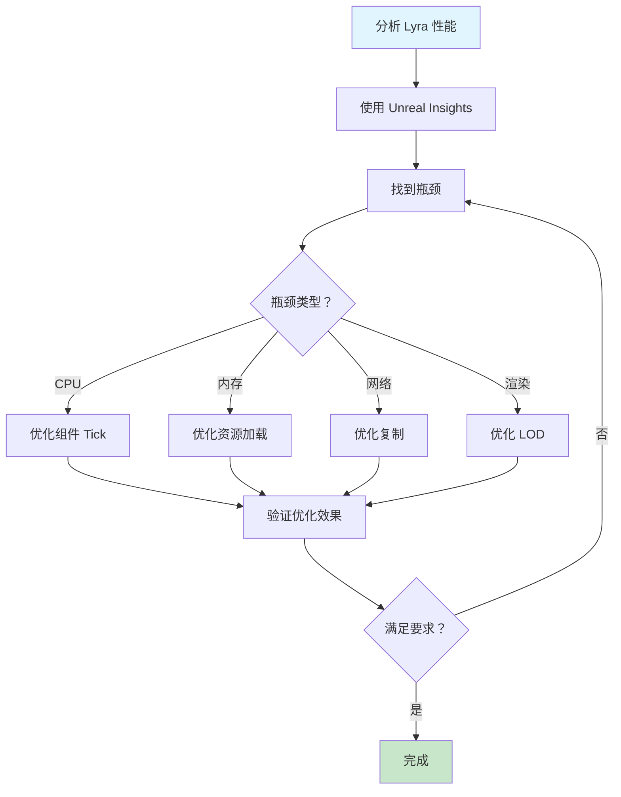

# Lyra性能实战

> 通过 Lyra 项目的真实案例，掌握性能优化的实战技巧

## 概述

Lyra 项目是 UE5 性能优化的最佳实践参考。本课将分析 Lyra 中的性能优化技术，包括：
- **组件化架构**：减少 Tick 开销
- **异步资源加载**：避免卡顿
- **网络复制优化**：Replication Graph 和 Iris
- **LOD 和 Impostor**：渲染优化

## 1. Lyra 的组件化架构优化

### 1.1 Modular Gameplay 的性能优势



Lyra 使用 **Modular Gameplay** 架构，将功能分解为独立的组件：
- **按需加载**：只在需要时加载组件
- **按需 Tick**：只 Tick 必要的组件
- **易于优化**：可以针对单个组件优化

### 1.2 Lyra 的 Pawn Extension Component

```cpp
// Lyra 的 Pawn Extension Component
// 参考：ULyraPawnExtensionComponent

void ULyraPawnExtensionComponent::TickComponent(float DeltaTime, ELevelTick TickType,
                                                  FActorComponentTickFunction* ThisTickFunction)
{
    Super::TickComponent(DeltaTime, TickType, ThisTickFunction);

    // 只在必要时 Tick
    if (!IsReadyToTick())
    {
        PrimaryComponentTick.SetTickFunctionEnable(false);
        return;
    }

    // 优化后的 Tick 逻辑
    // ...
}
```

### 1.3 代码示例：Lyra 风格的组件优化

```cpp
// UMyLyraStyleComponent.h
UCLASS(ClassGroup=(Custom), meta=(BlueprintSpawnableComponent))
class MYGAME_API UMyLyraStyleComponent : public UActorComponent
{
    GENERATED_BODY()

public:
    UMyLyraStyleComponent();

    // 设置是否启用 Tick
    UFUNCTION(BlueprintCallable, Category="Performance")
    void SetTickEnabled(bool bEnabled);

    // 设置 Tick 间隔
    UFUNCTION(BlueprintCallable, Category="Performance")
    void SetTickInterval(float Interval);

private:
    // 是否应该 Tick
    bool ShouldTick() const;

    // 距离裁剪
    void DistanceCulling();

    // 优先级
    UPROPERTY(EditAnywhere, Category="Performance")
    int32 TickPriority = 0;
};
```

```cpp
// UMyLyraStyleComponent.cpp
#include "UMyLyraStyleComponent.h"
#include "GameFramework/Character.h"
#include "GameFramework/PlayerController.h"

UMyLyraStyleComponent::UMyLyraStyleComponent()
{
    PrimaryComponentTick.bCanEverTick = true;
    PrimaryComponentTick.TickInterval = 0.0f;  // 每帧 Tick
    PrimaryComponentTick.TickGroup = TG_PrePhysics;
}

void UMyLyraStyleComponent::SetTickEnabled(bool bEnabled)
{
    PrimaryComponentTick.SetTickFunctionEnable(bEnabled);
}

void UMyLyraStyleComponent::SetTickInterval(float Interval)
{
    PrimaryComponentTick.TickInterval = FMath::Max(0.0f, Interval);
}

bool UMyLyraStyleComponent::ShouldTick() const
{
    AActor* Owner = GetOwner();
    if (!Owner) return false;

    // 检查距离
    ACharacter* PlayerCharacter = UGameplayStatics::GetPlayerCharacter(Owner->GetWorld(), 0);
    if (!PlayerCharacter) return false;

    float Distance = Owner->GetDistanceTo(PlayerCharacter);
    return Distance < 2000.0f;  // 只在 2000 单位内 Tick
}

void UMyLyraStyleComponent::DistanceCulling()
{
    // 根据距离禁用 Tick
    if (!ShouldTick())
    {
        PrimaryComponentTick.SetTickFunctionEnable(false);
    }
}
```

## 2. Lyra 的异步资源加载优化

### 2.1 Experience System 的异步加载



Lyra 的 **Experience System** 使用异步加载，避免游戏卡顿：
- **异步加载 Experience**：不阻塞主线程
- **逐步加载 Action Set**：分批加载，减少峰值内存
- **预加载**：在游戏开始前预加载资源

### 2.2 代码示例：Lyra 风格的异步加载

```cpp
// 参考 Lyra 的 Experience 加载
void ULyraExperienceManagerComponent::LoadExperience()
{
    // 异步加载 Experience
    TSubclassOf<ULyraExperienceDefinition> ExperienceClass = /* ... */;
    UAssetManager& AssetManager = UAssetManager::Get();

    // 创建异步加载句柄
    TSharedPtr<FStreamableHandle> Handle = AssetManager.LoadAssetAsync(
        ExperienceClass,
        FStreamableDelegate::CreateUObject(this, &ThisClass::OnExperienceLoaded)
    );
}
```

## 3. Lyra 的网络复制优化

### 3.1 Replication Graph



Lyra 使用 **Replication Graph** 优化网络复制：
- **选择性复制**：只复制可见的 Actor
- **优先级控制**：重要 Actor 优先复制
- **距离裁剪**：远距离 Actor 不复制

### 3.2 Iris 复制系统

Lyra 还支持新一代 **Iris 复制系统**：
- **更高效**：减少 CPU 开销
- **更灵活**：支持自定义复制策略
- **更可扩展**：支持更多玩家

### 3.3 代码示例：Lyra 风格的复制优化

```cpp
// 参考 Lyra 的复制优化
void ALyraCharacter::GetLifetimeReplicatedProps(TArray<FLifetimeProperty>& OutLifetimeProps) const
{
    Super::GetLifetimeReplicatedProps(OutLifetimeProps);

    // 条件复制：只在存活时复制
    DOREPLIFETIME_ACTIVE_OVERRIDE(ALyraCharacter, ReplicatedHealth, bIsAlive);

    // 使用 Net Quantization 减少带宽
    DOREPLIFETIME(ALyraCharacter, ReplicatedPosition_NetQuantize);
}
```

## 4. Lyra 的渲染优化

### 4.1 LOD 和 Impostor



Lyra 使用多种渲染优化技术：
- **LOD**：根据距离切换模型细节
- **Impostor**：远距离使用公告板替代模型
- **材质优化**：简化 Shader、减少纹理采样

### 4.2 代码示例：Lyra 风格的 LOD 管理

```cpp
// 参考 Lyra 的 LOD 管理
void ALyraCharacter::UpdateLOD()
{
    // 根据距离设置 LOD
    float Distance = GetDistanceTo(GetLocalViewer());
    int32 LODLevel = 0;

    if (Distance > 2000.0f)
    {
        LODLevel = 2;  // 低细节
    }
    else if (Distance > 1000.0f)
    {
        LODLevel = 1;  // 中细节
    }
    else
    {
        LODLevel = 0;  // 高细节
    }

    // 设置 LOD
    GetMesh()->ForcedLodModel = LODLevel + 1;  // LOD 索引从 1 开始
}
```

## 5. Lyra 性能优化总结

### 5.1 Lyra 的优化技术总结



### 5.2 Lyra 性能优化清单

| 优化领域 | Lyra 技术 | 效果 |
|----------|-----------|------|
| **CPU** | Modular Gameplay | ✅ 减少 Tick 开销 |
| **内存** | 异步资源加载 | ✅ 避免卡顿 |
| **网络** | Replication Graph / Iris | ✅ 减少带宽 |
| **渲染** | LOD / Impostor | ✅ 提升帧率 |

## 总结与要点

### 关键要点

1. **组件化架构** - 减少 Tick 开销，易于优化
2. **异步资源加载** - 避免卡顿，提升用户体验
3. **网络复制优化** - 使用 Replication Graph 和 Iris
4. **渲染优化** - LOD、Impostor、材质优化
5. **持续监控** - 使用 Unreal Insights 分析性能

### Lyra 性能优化工作流



## 相关页面

- [[30-tutorials/performance-optimization/05-网络性能优化]] - 网络性能优化
- [[30-tutorials/modular-gameplay/01-ModularGameplay是什么]] - Modular Gameplay
- [[30-tutorials/lyra-practical/02-ExperienceSystem详解]] - Experience 系统

## 参考资料

- [Lyra Sample Game](https://docs.unrealengine.com/5.0/en-US/lyra-sample-game-in-unreal-engine/)
- [Performance Optimization](https://docs.unrealengine.com/5.0/en-US/performance-and-profiling/)
- [Replication Graph](https://docs.unrealengine.com/5.0/en-US/replication-graph-in-unreal-engine/)
- [Iris Replication System](https://docs.unrealengine.com/5.0/en-US/iris-replication-system-in-unreal-engine/)

<!-- nav:auto -->

---

**导航**: ← [[30-tutorials/performance-optimization/05-网络性能优化|05-网络性能优化]]

<!-- /nav:auto -->
