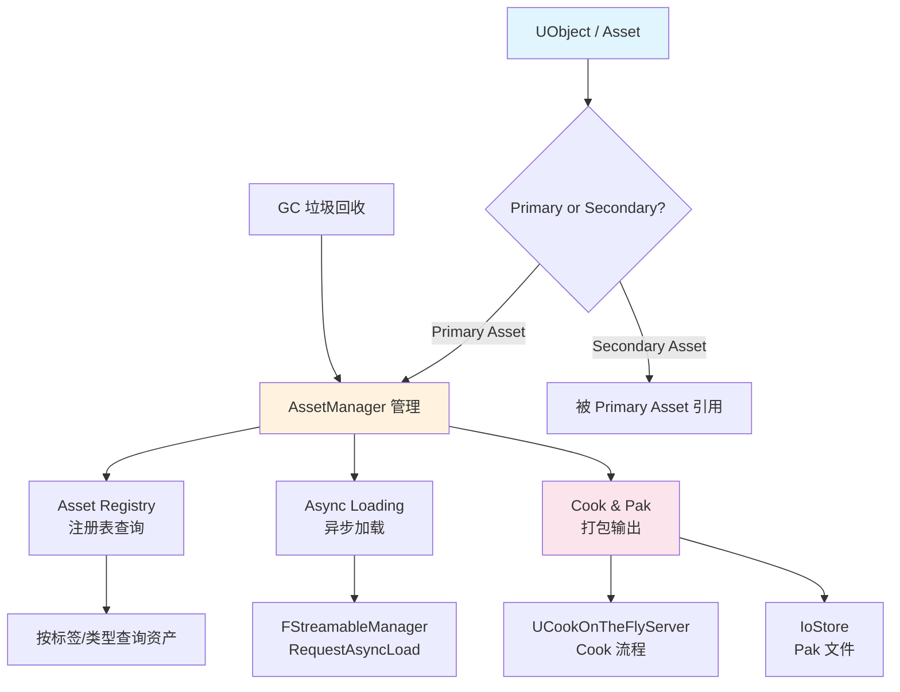

# UE5资源管理系列概览

> 系统学习 UE5 的资源管理体系，从资产分类、异步加载到 Cook/Pak 打包，结合 Lyra 项目真实代码，帮助 C++ 开发者掌握资源管理全流程。

## 为什么要学资源管理？

UE 项目中，资源（Asset）是内容的核心载体——蓝图、材质、动画、音效都以 Asset 形式存在。随着项目规模增长，以下问题会频繁出现：

- 如何按类型批量管理数百个资产？
- 如何异步加载大型资产避免卡顿？
- 打包后资源在哪里？Pak 文件如何管理？
- Lyra 为什么用 `TSoftObjectPtr` 而不是直接引用？

本系列从**怎么用**出发，配合关键引擎源码注释，帮助你建立完整的资源管理心智模型。

---

## 核心概念全景图



---

## 与 Lyra 项目的关系

Lyra 大量使用资源管理机制来实现**模块化加载**：

| Lyra 机制 | 使用的资源管理技术 | 本系列对应课程 |
|-----------|-------------------|---------------|
| `ULyraAssetManager` | `UAssetManager` 子类 | [01 资产分类](#) |
| Experience 系统动态加载 | `TSoftObjectPtr` + 异步加载 | [03 异步加载](#) |
| PawnData / GameData | Primary Asset + Bundle | [01 资产分类](#)、[06 Lyra 实践](#) |
| GameFeature 插件按需加载 | Asset Registry + 引用链 | [02 Asset Registry](#) |
| 打包后的资源组织 | Cook + Pak 文件 | [05 Cook 与 Pak](#) |

---

## 系列阅读指南

### 阶段一：基础概念（建议按顺序阅读）

| 课序 | 标题 | 核心内容 | 预计时间 |
|------|------|---------|---------|
| 00 | **本概览** | 全景图、与 Lyra 的映射 | 5 min |
| 01 | [资产分类体系](#) | Primary Asset、Secondary Asset、AssetManager 配置 | 30 min |

### 阶段二：核心机制

| 课序 | 标题 | 核心内容 | 预计时间 |
|------|------|---------|---------|
| 02 | [Asset Registry](#) | 注册表查询、按标签过滤、FindAssets | 35 min |
| 03 | [异步加载](#) | `FStreamableManager`、`RequestAsyncLoad`、加载句柄 | 40 min |
| 04 | [引用与 GC](#) | UObject 引用链、与 GC 的关系、内存管理 | 35 min |

### 阶段三：打包与部署

| 课序 | 标题 | 核心内容 | 预计时间 |
|------|------|---------|---------|
| 05 | [Cook 与 Pak](#) | Cook 流程、Pak 文件结构、IoStore、按需加载 | 45 min |

### 阶段四：实战与进阶

| 课序 | 标题 | 核心内容 | 预计时间 |
|------|------|---------|---------|
| 06 | [Lyra 实践](#) | `ULyraAssetManager`、Experience 加载、Bundle 管理 | 40 min |
| 07 | [高级主题](#) | IO 虚拟化、性能优化、常见陷阱 | 30 min |

---

## 前置知识

| 知识 | 推荐来源 | 必需程度 |
|------|---------|---------|
| UObject 基础 | `[[30-tutorials/ue-framework/]]`（待创建）或 UE 官方文档 | 推荐 |
| GC 基础概念 | `[[30-tutorials/garbage-collection/00-GC垃圾回收系列概览]]` | 推荐（第 04 课前） |
| C++ 基础 | 外部资料 | 必需 |

---

## 源码引用说明

本系列教程所有技术断言均基于以下来源：

| 优先级 | 来源 | 用途 |
|--------|------|------|
| 1 | Lyra 项目源码（`Source/LyraGame/`） | Lyra 实践部分 |
| 2 | UE 5.7 引擎源码（`/Engine/Source/`） | 引擎机制分析 |
| 3 | UE 官方文档 | 概念定义补充 |

文中代码片段标注格式：
```cpp
// 文件：Engine/Source/.../XXX.h
// UE 5.7
```

---

## 相关页面

- [[30-tutorials/garbage-collection/00-GC垃圾回收系列概览|GC 系列概览]] — 第 04 课前置知识
- [[30-tutorials/ue-framework/00-UE框架概述|UE 框架系列]] — UObject 基础

<!-- nav:auto -->

---

**导航**: [[30-tutorials/resource-management/01-资产分类体系PrimaryAsset与SecondaryAsset|01-资产分类体系PrimaryAsset与SecondaryAsset]] →

<!-- /nav:auto -->
