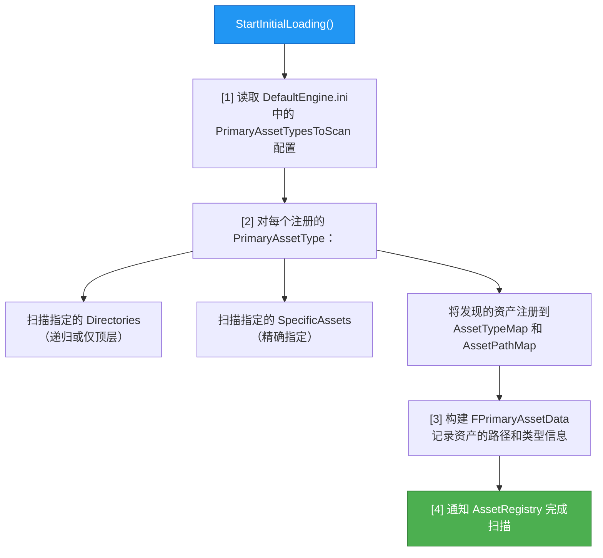

# 资产分类体系PrimaryAsset与SecondaryAsset

> 理解 UE 资源管理的核心分类模型，学会配置 AssetManager，让引擎知道"哪些资源需要主动管理"。

---

## 概述

UE 的资源管理体系建立在一个核心概念之上：**Primary Asset（主资产）** 与 **Secondary Asset（次资产）** 的二分法。

简单来说：
- **Primary Asset** = 你主动告诉引擎"这个资源很重要，请帮我管它的生命周期"
- **Secondary Asset** = 被 Primary Asset 引用才会加载的"从属资源"

本课学完，你将能够：
1. 区分 Primary / Secondary Asset
2. 在 `DefaultEngine.ini` 中配置 Primary Asset 类型
3. 理解 `UAssetManager` 如何扫描和管理这些资产
4. 看懂 Lyra 中 `LyraGameData`、`LyraExperienceDefinition` 的配置方式

---

## 核心概念

### 什么是 Primary Asset？

`PrimaryAsset` 是游戏**明确需要管理生命周期**的资产。典型例子：

| Primary Asset 类型 | 示例 | 为什么是 Primary |
|-------------------|------|-----------------|
| GameData | `ULyraGameData` | 全局配置，游戏启动就必须加载 |
| Experience | `ULyraExperienceDefinition` | 决定游戏模式，动态切换 |
| PawnData | `ULyraPawnData` | 决定角色能力，随 Experience 加载 |
| WeaponData | `ULyraWeaponData` | 武器配置，按需加载 |

Primary Asset 的**唯一标识**是 `FPrimaryAssetId`，由两部分组成：
```text
FPrimaryAssetId
  ├── PrimaryAssetType  (FName, 如 "GameData")
  └── PrimaryAssetName  (FName, 如 "DefaultGameData")
```

### 什么是 Secondary Asset？

Secondary Asset是**不被直接管理，而是被 Primary Asset 引用时才加载**的资产。

```text
Primary Asset: ULyraPawnData
  ├── (硬引用) TSubclassOf<APawn> PawnClass         → 直接加载
  ├── (软引用) TSoftObjectPtr<ULyraInputConfig>  → 需要时才加载
  └── (软引用) TArray<TSoftObjectPtr<ULyraAbilitySet>>
                  └── 每个 AbilitySet 又引用了 GameplayAbility（Secondary）
```

Secondary Asset 不需要在 AssetManager 中注册，引擎通过**引用链**自动发现并加载它们。

---

## 源码深度分析

### 引擎层：`UAssetManager` 的核心设计

**文件**：`\Engine\Source\Runtime\Engine\Classes\Engine\AssetManager.h`（第 35-115 行）

`UAssetManager` 是一个**单例 UObject**，在引擎启动早期构造。它的核心数据结构：

```cpp
// AssetManager.h 中定义（简化）
class UAssetManager : public UObject
{
    // 类型数据映射：PrimaryAssetType → FPrimaryAssetTypeData
    TMap<FName, TSharedRef<FPrimaryAssetTypeData>> AssetTypeMap;

    // 路径映射：SoftObjectPath → FPrimaryAssetId
    TMap<FSoftObjectPath, FPrimaryAssetId> AssetPathMap;

    // 内部 StreamableManager，负责底层异步加载
    FStreamableManager StreamableManager;
};
```

**关键理解**：`UAssetManager` 本身不"拥有"资产的内存，它只管理**加载和卸载的时机**。资产的内存仍然由 `UObject` 的 GC 系统管理（这就是第 04 课要将的内容）。

### AssetManager 如何发现 Primary Asset？

**文件**：`\Engine\Source\Runtime\Engine\Private\AssetManager.cpp`

在 `StartInitialLoading()` 中，AssetManager 会：



配置示例（`DefaultEngine.ini`）：

```ini
[/Script/Engine.AssetManagerSettings]
; 定义一种 Primary Asset 类型
+PrimaryAssetTypes=( \
    PrimaryAssetType="LyraGameData", \
    AssetBaseClass="/Script/LyraGame.LyraGameData", \
    bHasBlueprintClasses=False, \
    bIsEditorOnly=False, \
    Directories=, \
    SpecificAssets=("/Game/DefaultGameData.DefaultGameData"), \
    Rules=(Priority=-1, ChunkId=-1, bApplyRecursively=True, CookRule=AlwaysCook) \
)
```

**逐字段解释**：

| 字段 | 含义 |
|------|------|
| `PrimaryAssetType` | 类型名称，用于构造 `FPrimaryAssetId.PrimaryAssetType` |
| `AssetBaseClass` | 该类型资产的基类（必须是 `UPrimaryDataAsset` 的子类） |
| `bHasBlueprintClasses` | 是否允许蓝图继承此类型 |
| `Directories` | 扫描哪些目录下的资产（可多个） |
| `SpecificAssets` | 精确指定某些资产（不受目录限制） |
| `Rules.Priority` | Cook 优先级，越高越先 Cook |
| `Rules.CookRule` | `EPrimaryAssetCookRule` 枚举，控制是否打包 |

### `UPrimaryDataAsset` —— Primary Asset 的基类

**文件**：`\Engine\Source\Runtime\Engine\Classes\Engine\DataAsset.h`

```cpp
// Engine/Source/Runtime/Engine/Classes/Engine/DataAsset.h
UCLASS(Abstract, BlueprintType)
class UPrimaryDataAsset : public UDataAsset
{
    GENERATED_BODY()

    // Primary Asset 的 ID，由 AssetManager 在扫描时设置
    UPROPERTY()
    FPrimaryAssetId PrimaryAssetId;
};
```

继承自 `UPrimaryDataAsset` 的类，在 `DefaultEngine.ini` 中注册后，就会被 AssetManager 识别和管理。

---

## Lyra 实践

### Lyra 如何配置 Primary Asset？

Lyra 在 `Config/DefaultGame.ini` 中配置了多种 Primary Asset 类型：

| 类型名 | 基类 | 扫描目录 | Cook 规则 |
|--------|------|-----------|-----------|
| `LyraGameData` | `ULyraGameData` | 无（精确指定） | `AlwaysCook` |
| `LyraPawnData` | `ULyraPawnData` | `/Game/System/PawnData` | `AlwaysCook` |
| `LyraExperienceDefinition` | `ULyraExperienceDefinition` | `/Game/System/Experiences` | `AlwaysCook` |
| `LyraWeaponData` | `ULyraWeaponData` | `/Game/System/Weapons` | `AlwaysCook` |

### `ULyraGameData` —— 全局游戏数据

**文件**：`Source/LyraGame/System/LyraGameData.h`

```cpp
UCLASS(MinimalAPI, BlueprintType, Const)
class ULyraGameData : public UPrimaryDataAsset
{
    GENERATED_BODY()

public:
    // 默认伤害 GameplayEffect（软引用，按需加载）
    UPROPERTY(EditDefaultsOnly)
    TSoftClassPtr<UGameplayEffect> DamageGameplayEffect_SetByCaller;

    // 默认治疗 GameplayEffect
    UPROPERTY(EditDefaultsOnly)
    TSoftClassPtr<UGameplayEffect> HealGameplayEffect_SetByCaller;
};
```

注意这里的**设计选择**：`ULyraGameData` 是 Primary Asset（必须主动加载），但它引用的 `UGameplayEffect` 是 Secondary Asset（通过 `TSoftClassPtr` 软引用，不立即加载）。

### `ULyraAssetManager` 的扩展

**文件**：`Source/LyraGame/System/LyraAssetManager.h`（第 30-120 行）

Lyra 覆盖了 `UAssetManager::StartInitialLoading()`，在引擎扫描完成后执行额外的初始化：

```cpp
// LyraAssetManager.cpp 第 106-122 行（简化）
void ULyraAssetManager::StartInitialLoading()
{
    // [1] 先调用父类实现，完成 Primary Asset 扫描
    Super::StartInitialLoading();

    // [2] 添加启动任务：初始化 GameplayCueManager
    STARTUP_JOB(InitializeGameplayCueManager());

    // [3] 添加启动任务：加载 GameData（权重 25.0）
    STARTUP_JOB_WEIGHTED(GetGameData(), 25.f);

    // [4] 执行所有启动任务（支持进度回调）
    DoAllStartupJobs();
}
```

**设计意图**：Lyra 把"加载 GameData"作为启动流程的一部分，确保游戏核心数据在玩家进入前已就绪。

---

## 如何声明一个自定义 Primary Asset 类型

### 步骤 1：定义 C++ 类

```cpp
// MyGameData.h
UCLASS(BlueprintType, Const)
class UMyGameData : public UPrimaryDataAsset
{
    GENERATED_BODY()

public:
    UPROPERTY(EditDefaultsOnly, Category="Config")
    int32 MaxPlayerCount;

    UPROPERTY(EditDefaultsOnly, Category="Config")
    TSoftObjectPtr<UTexture2D> DefaultIcon;
};
```

### 步骤 2：在 `DefaultEngine.ini` 中注册

```ini
[/Script/Engine.AssetManagerSettings]
+PrimaryAssetTypes=( \
    PrimaryAssetType="MyGameData", \
    AssetBaseClass="/Script/MyGame.MyGameData", \
    bHasBlueprintClasses=True, \
    bIsEditorOnly=False, \
    Directories=((Path="/Game/MyGame/Data")), \
    Rules=(Priority=0, ChunkId=-1, bApplyRecursively=True, CookRule=AlwaysCook) \
)
```

### 步骤 3：创建资产实例

在 Content Browser 中右键 → Miscellaneous → Data Asset，选择 `UMyGameData` 作为基类，创建后填入数据。

### 步骤 4：加载使用

```cpp
// 通过 AssetManager 加载
UAssetManager& AssetManager = UAssetManager::Get();

// 方式 1：按类型加载所有 MyGameData
TSharedPtr<FStreamableHandle> Handle = AssetManager.LoadPrimaryAssetsWithType(
    FPrimaryAssetType("MyGameData"));

// 方式 2：加载指定的 MyGameData
FPrimaryAssetId AssetId(FPrimaryAssetType("MyGameData"), FName("MyConfig"));
TSharedPtr<FStreamableHandle> Handle = AssetManager.LoadPrimaryAsset(AssetId);
```

---

## 常见问题与陷阱

### 陷阱 1：忘记注册 Primary Asset 类型

**现象**：调用 `LoadPrimaryAsset()` 返回失败，或资产始终为 `nullptr`。

**原因**：未在 `DefaultEngine.ini` 中注册，AssetManager 不知道这个资产的存在。

**解决**：检查 `DefaultEngine.ini` 中的 `PrimaryAssetTypes` 配置，确保 `AssetBaseClass` 路径正确。

### 陷阱 2：`bApplyRecursively` 的误用

**现象**：子目录中的资产没有被扫描到。

**原因**：`bApplyRecursively` 默认为 `false`，只扫描指定目录的顶层。

```ini
; 错误：只扫描 /Game/Data 顶层
Directories=((Path="/Game/Data"))

; 正确：递归扫描 /Game/Data 及其所有子目录
Directories=((Path="/Game/Data"))
; 注意：bApplyRecursively=True 是在 Rules 外面的独立字段
; 在 PrimaryAssetTypes 的元数据中配置
```

### 陷阱 3：CookRule 设置不当导致 DLC 资产丢失

**现象**：编辑器中能加载，打包后加载失败。

**原因**：`CookRule=NeverCook` 或 `Unknown` 且没有被其他资产引用，导致打包时遗漏。

**解决**：确认 CookRule 设置为 `AlwaysCook`（如果需要始终打包）。

---

## 总结

| 要点 | 说明 |
|------|------|
| Primary Asset | 主动管理的资产，需在 AssetManager 中注册 |
| Secondary Asset | 被引用才加载，不需要注册 |
| 配置位置 | `Config/DefaultEngine.ini` 的 `[/Script/Engine.AssetManagerSettings]` |
| 核心类 | `UAssetManager`（引擎层）、`UPrimaryDataAsset`（基类） |
| Lyra 实践 | GameData、Experience、PawnData、WeaponData 均声明为 Primary Asset |

---

## 相关页面

- [[30-tutorials/resource-management/00-UE5资源管理系列概览|← 00 系列概览]]
- [[30-tutorials/resource-management/02-AssetRegistry资产注册表查询|02 Asset Registry →]]
- [[30-tutorials/garbage-collection/01-UObject基础与内存模型|GC 基础（第 04 课前置）]]

<!-- nav:auto -->

---

**导航**: ← [[30-tutorials/resource-management/00-UE5资源管理系列概览|00-UE5资源管理系列概览]] · [[30-tutorials/resource-management/02-AssetRegistry资产注册表查询|02-AssetRegistry资产注册表查询]] →

<!-- /nav:auto -->
