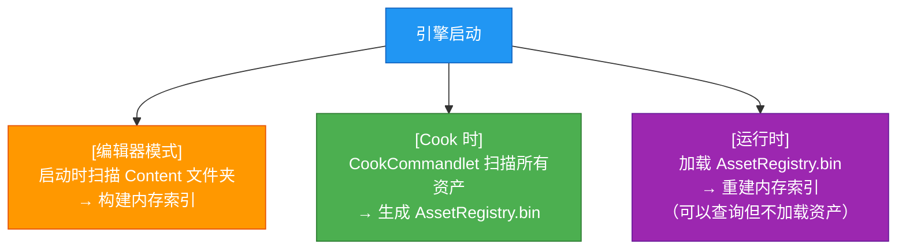
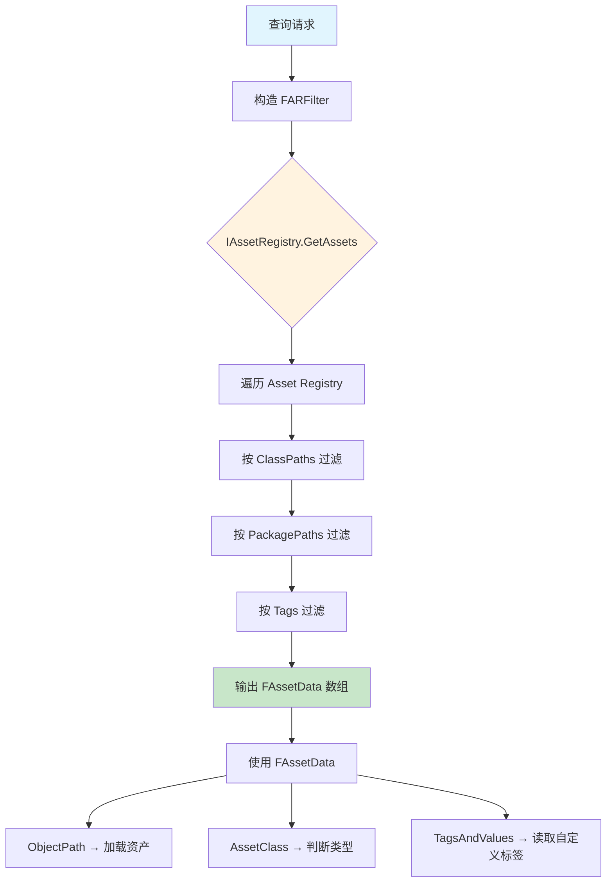

# AssetRegistry资产注册表查询

> 学会用 Asset Registry 按类型、标签、路径批量查询资产，是编写编辑器工具和自动化流程的基础技能。

---

## 概述

**Asset Registry** 是 UE 维护的一个**全局资产数据库**，它在编辑器启动和 Cook 时扫描所有资产，建立索引。

可以把 Asset Registry 理解为：
> 一个只读的"资产目录"，你可以在里面按条件搜索资产，而不需要真正加载它们。

本课学完，你将能够：
1. 理解 Asset Registry 的数据模型（`FAssetData`）
2. 使用 `GetAssets()` 按过滤器查询资产
3. 使用标签（Asset Registry Searchable）过滤资产
4. 在 C++ 和 Python 中调用 Asset Registry
5. 理解 Lyra 中如何使用 Asset Registry

---

## 核心概念

### Asset Registry 是什么时候构建的？



关键点：**运行时默认不构建完整 Asset Registry**（为了节省内存和启动时间），但 Cook 后的 `AssetRegistry.bin` 会被加载。

### `FAssetData` —— 资产的"名片"

`FAssetData` 是 Asset Registry 中的一条记录，它**不包含资产的实际数据**，只包含：

| 字段 | 类型 | 说明 |
|------|------|------|
| `ObjectPath` | `FSoftObjectPath` | 资产的完整路径（如 `/Game/Data/MyGameData.MyGameData`） |
| `PackageName` | `FName` | 包名（如 `/Game/Data/MyGameData`） |
| `AssetClass` | `FName` | 资产类型（如 `Blueprint`, `Texture2D`） |
| `TagsAndValues` | `TMap<FName, FString>` | 用户自定义标签（通过 `UPROPERTY` 的 `AssetRegistrySearchable` 标记） |
| `ChunkIDs` | `TArray<int32>` | 所属的 Chunk（Cook 后有意义） |

**源码位置**：`\Engine\Source\Runtime\AssetRegistry\Public\AssetRegistry\AssetData.h`

---

## Asset Registry 查询流程图



---

## 源码深度分析

### 引擎层：`IAssetRegistry` 接口

**文件**：`\Engine\Source\Runtime\AssetRegistry\Public\AssetRegistry\IAssetRegistry.h`

最常用的查询接口：

```cpp
// 按过滤器查询资产（最核心的接口）
UASSETREGISTRY_API void GetAssets(
    const FARFilter& Filter,
    TArray<FAssetData>& OutAssetData) const;

// 按对象路径精确查询
UASSETREGISTRY_API FAssetData GetAssetByObjectPath(
    const FSoftObjectPath& ObjectPath,
    bool bIncludeOnlyOnDiskAssets = false) const;

// 获取资产的依赖项（此资产引用了谁）
UASSETREGISTRY_API bool GetDependencies(
    const FAssetIdentifier& AssetIdentifier,
    TArray<FAssetIdentifier>& OutDependencies,
    EAssetRegistryDependencyType::Type DependencyType = EAssetRegistryDependencyType::All) const;

// 获取资产的引用者（谁引用了此资产）
UASSETREGISTRY_API bool GetReferencers(
    const FAssetIdentifier& AssetIdentifier,
    TArray<FAssetIdentifier>& OutReferencers) const;
```

### `FARFilter` —— 查询过滤器

**文件**：`\Engine\Source\Runtime\AssetRegistry\Public\AssetRegistry\AssetData.h`

```cpp
struct FARFilter
{
    // 按资产类过滤（如 "Blueprint", "Texture2D"）
    TArray<FTopLevelAssetPath> ClassPaths;

    // 按 Primary Asset 类型过滤
    TArray<FPrimaryAssetType> PrimaryAssetTypes;

    // 包含的包路径（如 "/Game/Data"）
    TArray<FPackageName> PackagePaths;

    // 是否递归扫描子目录
    bool bRecursivePaths = false;

    // 是否递归包含子类
    bool bRecursiveClasses = false;

    // 必须包含的标签/值对
    TArray<TPair<FName, FString>> Tags;
};
```

---

## 实战：C++ 中使用 Asset Registry

### 示例 1：查询所有 `UPrimaryDataAsset` 的子类资产

```cpp
#include "AssetRegistry/AssetRegistryModule.h"
#include "AssetRegistry/IAssetRegistry.h"

void QueryAllPrimaryDataAssets()
{
    // [1] 获取 AssetRegistry 单例
    IAssetRegistry& AssetRegistry = FModuleManager::LoadModuleChecked<FAssetRegistryModule>("AssetRegistry").Get();

    // [2] 构造过滤器
    FARFilter Filter;
    Filter.ClassPaths.Add(FTopLevelAssetPath(TEXT("/Script/Engine.PrimaryDataAsset")));
    Filter.bRecursiveClasses = true;  // 包含子类
    Filter.bRecursivePaths = true;

    // [3] 执行查询
    TArray<FAssetData> AssetDatas;
    AssetRegistry.GetAssets(Filter, AssetData);

    // [4] 处理结果
    for (const FAssetData& AssetData : AssetDatas)
    {
        UE_LOG(LogTemp, Log, TEXT("Found Asset: %s, Class: %s"),
            *AssetData.ObjectPath.ToString(),
            *AssetData.AssetClassPath.ToString());
    }
}
```

### 示例 2：按标签查询（Asset Registry Searchable）

在 UPROPERTY 上标记 `meta = (AssetRegistrySearchable)`：

```cpp
UCLASS()
class UMyItemData : public UPrimaryDataAsset
{
    GENERATED_BODY()

public:
    // 此属性会被写入 AssetRegistry，可用于过滤查询
    UPROPERTY(EditDefaultsOnly, Category = "Item", meta = (AssetRegistrySearchable))
    FGameplayTag ItemSlotTag;

    UPROPERTY(EditDefaultsOnly, Category = "Item", meta = (AssetRegistrySearchable))
    int32 ItemRarity;
};
```

查询带有特定标签值的资产：

```cpp
void QueryItemsByRarity(int32 Rarity)
{
    IAssetRegistry& AssetRegistry = FModuleManager::LoadModuleChecked<FAssetRegistryModule>("AssetRegistry").Get();

    FARFilter Filter;
    Filter.ClassPaths.Add(FTopLevelAssetPath(TEXT("/Script/MyGame.MyItemData")));
    Filter.Tags.Add(TPair<FName, FString>(
        FName("ItemRarity"),
        FString::FromNumeric(Rarity)));

    TArray<FAssetData> Results;
    AssetRegistry.GetAssets(Filter, Results);

    UE_LOG(LogTemp, Log, TEXT("Found %d items with rarity %d"), Results.Num(), Rarity);
}
```

---

## Lyra 中的实践

### Lyra 如何使用 Asset Registry？

Lyra **不直接大量使用 Asset Registry API**，而是通过 `UAssetManager` 间接使用。但有一个关键地方值得注意：

**`ULyraAssetManager::StartInitialLoading()`**

```cpp
// LyraAssetManager.cpp 第 106-122 行（简化）
void ULyraAssetManager::StartInitialLoading()
{
    // 调用父类实现 → 内部会触发 AssetRegistry 扫描
    Super::StartInitialLoading();

    // 此时 AssetRegistry 已扫描完成，
    // PrimaryAssetTypeData 已被填充
    // → 可以安全地调用 LoadPrimaryAsset / GetPrimaryAssetData
}
```

**关键点**：`Super::StartInitialLoading()` 内部调用了 `ScanPathsSynchronous()`，确保 Asset Registry 在游戏逻辑运行前已完成扫描。

### Lyra 的 `ULyraExperienceDefinition` 与 Asset Registry

`ULyraExperienceDefinition` 继承自 `UPrimaryDataAsset`，它的 `Actions` 字段（`TArray<UGameFeatureAction*>`）中的资产引用，在 Cook 时由 Asset Registry 分析依赖关系，自动纳入 Cook 范围。

---

## 常见问题与陷阱

### 陷阱 1：运行时 Asset Registry 不完整

**现象**：打包后用 `GetAssets()` 查询，返回结果很少。

**原因**：默认情况下，运行时只加载 `AssetRegistry.bin` 中的**部分数据**（优化内存）。

**解决**：
```cpp
// 如果需要完整数据，在 DefaultEngine.ini 中：
[/Script/Engine.AssetRegistrySettings]
bUseLegacyInitialization = false   ; 让 AssetRegistry 在运行时也完整加载
```

### 陷阱 2：`AssetRegistrySearchable` 标记不生效

**现象**：标记了 `AssetRegistrySearchable` 的属性，在 `FAssetData.TagsAndValues` 中找不到。

**原因**：
1. 属性必须是 `UPROPERTY()` 直接持有的（不能是 `TSoftObjectPtr` 的内部值）
2. 需要**重新保存资产**（让 Asset Registry 重新扫描）

**解决**：修改后，在编辑器中批量重新保存相关资产。

### 陷阱 3：异步扫描未完成就查询

**现象**：`GetAssets()` 返回空，但资产明明存在。

**原因**：Asset Registry 扫描是异步的，如果在扫描完成前查询，会返回空结果。

**解决**：
```cpp
IAssetRegistry& AssetRegistry = ...;

// 方式 1：等待扫描完成（阻塞，慎用）
AssetRegistry.WaitForCompletion();

// 方式 2：注册扫描完成回调（推荐）
AssetRegistry.OnFilesLoaded().AddLambda([]()
{
    // 在这里执行查询
});
```

---

## 总结

| 要点 | 说明 |
|------|------|
| Asset Registry 作用 | 全局资产索引，支持不加载资产的前提下查询 |
| 核心数据结构 | `FAssetData`（资产的"名片"） |
| 核心查询接口 | `GetAssets(FARFilter, OutAssetData)` |
| 按标签过滤 | 使用 `meta = (AssetRegistrySearchable)` + `FARFilter.Tags` |
| Lyra 使用方式 | 通过 `UAssetManager` 间接使用，不直接调用 |
| 运行时注意事项 | 默认数据不完整，需要配置 `bUseLegacyInitialization` |

---

## 相关页面

- [[30-tutorials/resource-management/01-资产分类体系PrimaryAsset与SecondaryAsset|← 01 资产分类]]
- [[30-tutorials/resource-management/03-异步加载FStreamableManager与RequestAsyncLoad|03 异步加载 →]]
- [[30-tutorials/resource-management/04-引用与GC资源内存管理|04 引用与 GC]]

<!-- nav:auto -->

---

**导航**: ← [[30-tutorials/resource-management/01-资产分类体系PrimaryAsset与SecondaryAsset|01-资产分类体系PrimaryAsset与SecondaryAsset]] · [[30-tutorials/resource-management/03-异步加载FStreamableManager与RequestAsyncLoad|03-异步加载FStreamableManager与RequestAsyncLoad]] →

<!-- /nav:auto -->
