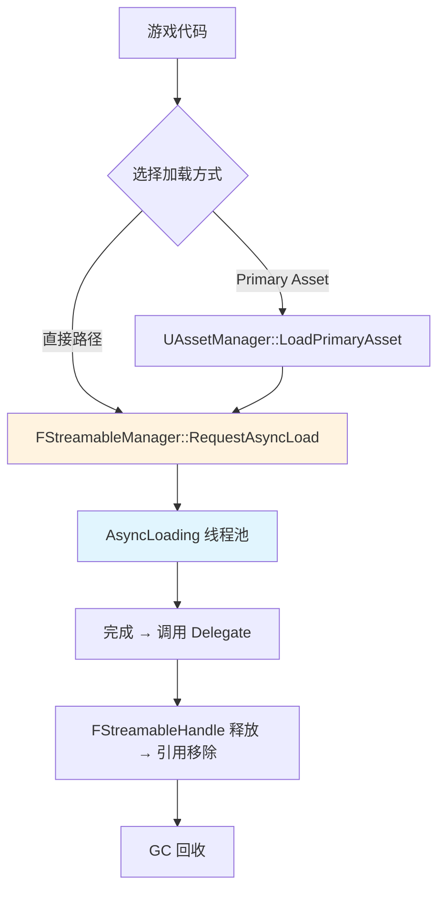
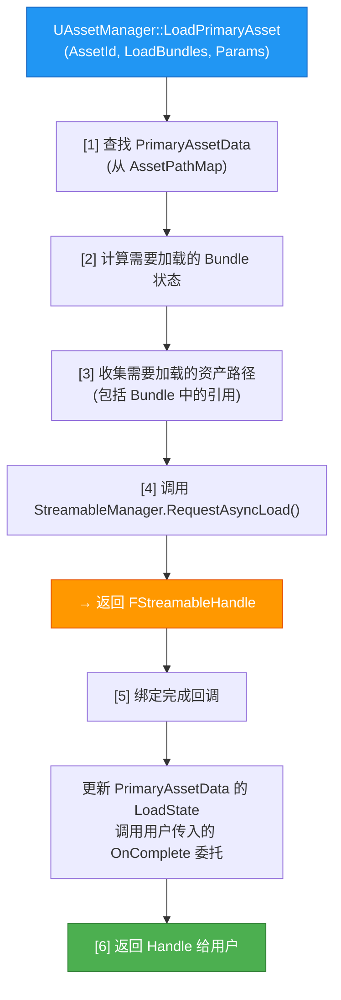

# 异步加载FStreamableManager与RequestAsyncLoad

> 学会用 `FStreamableManager` 异步加载资产，避免主线程卡顿，并理解加载句柄（`FStreamableHandle`）的生命周期管理。

---

## 概述

大型 UE 项目中最常见的卡顿原因之一就是**同步加载大型资产**。异步加载让你可以：
- 在后台加载资产，主线程继续运行
- 显示加载进度条
- 批量加载多个资产，等待全部完成后回调
- 用 `FStreamableHandle` 智能指针自动管理加载状态

本课学完，你将能够：
1. 理解 `FStreamableManager` 的工作原理
2. 使用 `RequestAsyncLoad()` 异步加载单个/多个资产
3. 用 `FStreamableHandle` 跟踪加载状态、取消加载、等待完成
4. 在 Lyra 中看懂 `LoadPrimaryAsset` 的异步加载流程

---

## 核心概念

### 为什么需要异步加载？

```
同步加载（错误示范）：
LoadObject<UTexture2D>(nullptr, TEXT("/Game/Textures/HugeMap"))
→ 主线程阻塞 3 秒 → 画面卡死 → 玩家投诉

异步加载（正确做法）：
RequestAsyncLoad(HugeMapPath, OnLoadedDelegate)
→ 主线程继续运行 → 后台加载 → 完成后调用 OnLoadedDelegate
```

### `FStreamableManager` 在架构中的位置



**关键理解**：`UAssetManager` 内部就是调用 `FStreamableManager` 来完成异步加载的。

---

## 源码深度分析

### `FStreamableManager` 核心接口

**文件**：`\Engine\Source\Runtime\Engine\Classes\Engine\StreamableManager.h`

#### 1. `RequestAsyncLoad` —— 核心异步加载函数

```cpp
// StreamableManager.h 第 75-85 行（简化）
TSharedPtr<FStreamableHandle> RequestAsyncLoad(
    const TArray<FSoftObjectPath>& TargetsToStream,
    FStreamableDelegate DelegateToCall = FStreamableDelegate(),
    TAsyncLoadPriority Priority = DefaultAsyncLoadPriority,
    const FStreamableManagerAsyncLoadStateBetweenUses& StateBetweenUses 
        = FStreamableManagerAsyncLoadStateBetweenUses::Default);
```

**参数解释**：

| 参数 | 类型 | 说明 |
|------|------|------|
| `TargetsToStream` | `TArray<FSoftObjectPath>` | 要加载的资产路径列表 |
| `DelegateToCall` | `FStreamableDelegate` | 全部加载完成后调用的委托 |
| `Priority` | `TAsyncLoadPriority` | 加载优先级（越高越先加载） |
| `StateBetweenUses` | `...AsyncLoadStateBetweenUses` | 加载完成后内存保持策略 |

**返回值**：`TSharedPtr<FStreamableHandle>` —— 加载句柄，用于跟踪和管理这次加载请求。

#### 2. `RequestSyncLoad` —— 同步加载（慎用）

```cpp
// StreamableManager.h 第 759-764 行
TSharedPtr<FStreamableHandle> RequestSyncLoad(
    const TArray<FSoftObjectPath>& TargetsToStream,
    EStreamableManagerSyncLoadType::Type SyncLoadType 
        = EStreamableManagerSyncLoadType::Default,
    TAsyncLoadPriority Priority = DefaultAsyncLoadPriority);
```

**警告**：同步加载会阻塞**调用线程**，在游戏线程调用会导致卡顿。仅用于启动阶段或工具代码。

#### 3. `LoadSynchronous` —— 同步加载并直接返回对象

```cpp
// StreamableManager.h 第 774-778 行
UObject* LoadSynchronous(
    const TSoftObjectPath& TargetToStream,
    TAsyncLoadPriority Priority = DefaultAsyncLoadPriority,
    FStreamableHandleWeakPtr* OutHandle = nullptr);
```

**使用场景**：编辑器工具、启动阶段、或你明确知道资产很小且必须立即使用。

---

### `FStreamableHandle` —— 加载句柄

**文件**：`\Engine\Source\Runtime\Engine\Classes\Engine\StreamableManager.h`（Handle 定义在同文件内部）

`FStreamableHandle` 是一个**引用计数对象**，当它存在时，关联的资产不会被 GC 回收。

| 成员函数 | 说明 |
|-----------|------|
| `IsActive()` | 是否仍在加载中 |
| `IsLoadingInProgress()` | 加载是否正在进行 |
| `GetLoadedAsset()` | 获取已加载的资产（若完成） |
| `GetLoadedAssets(TArray<UObject*>&)` | 获取所有已加载的资产 |
| `WaitUntilComplete(float TimeLimit)` | 阻塞等待完成（慎用） |
| `ReleaseHandle()` | 主动释放句柄（允许 GC 回收） |
| `BindCompleteDelegate(FStreamableDelegate)` | 绑定完成回调 |
| `BindUpdateDelegate(FStreamableUpdateDelegate)` | 绑定进度更新回调 |

**生命周期**：
```
RequestAsyncLoad() 返回 Handle
    → 句柄存在 → 资产保持加载状态
    → 句柄释放（无引用）→ 资产可被 GC 回收
```

---

### `UAssetManager::LoadPrimaryAsset` 调用链

**文件**：`\Engine\Source\Runtime\Engine\Private\AssetManager.cpp`



**关键代码**（`AssetManager.cpp` 约第 2470-2510 行）：

```cpp
TSharedPtr<FStreamableHandle> UAssetManager::LoadPrimaryAsset(
    const FPrimaryAssetId& AssetToLoad,
    const TArray<FName>& LoadBundles,
    FAssetManagerLoadParams&& LoadParams,
    UE::FSourceLocation Location)
{
    // 委托给 LoadPrimaryAssets（支持批量）
    return LoadPrimaryAssets(
        TArray<FPrimaryAssetId>{AssetToLoad},
        LoadBundles,
        MoveTemp(LoadParams),
        MoveTemp(Location));
}
```

---

## 实战：C++ 中使用异步加载

### 示例 1：加载单个资产

```cpp
#include "Engine/StreamableManager.h"
#include "Engine/AssetManager.h"

void UMyGameSubsystem::LoadWeaponDataAsync()
{
    // 软引用路径
    FSoftObjectPath WeaponPath(TEXT("/Game/Weapons/BP_Rifle.BP_Rifle_C"));

    // 发起异步加载
    TSharedPtr<FStreamableHandle> Handle = UAssetManager::GetStreamableManager()
        .RequestAsyncLoad(WeaponPath, FStreamableDelegate::CreateUObject(this, &ThisClass::OnWeaponLoaded));

    // 保存 Handle（否则加载完成前 Handle 释放会导致问题）
    ActiveHandles.Add(MoveTemp(Handle));
}

void UMyGameSubsystem::OnWeaponLoaded()
{
    UE_LOG(LogTemp, Log, TEXT("Weapon data loaded!"));
    // 现在可以安全使用 Weapon 资产
}
```

### 示例 2：加载多个资产并等待全部完成

```cpp
void UMyGameSubsystem::LoadLevelAssets()
{
    TArray<FSoftObjectPath> AssetsToLoad;
    AssetsToLoad.Add(FSoftObjectPath(TEXT("/Game/Maps/Textures/SkyTexture")));
    AssetsToLoad.Add(FSoftObjectPath(TEXT("/Game/Maps/Meshes/TerrainMesh")));
    AssetsToLoad.Add(FSoftObjectPath(TEXT("/Game/Maps/Sounds/AmbientSound")));

    TSharedPtr<FStreamableHandle> Handle = UAssetManager::GetStreamableManager()
        .RequestAsyncLoad(
            AssetsToLoad,
            FStreamableDelegate::CreateUObject(this, &ThisClass::OnAllAssetsLoaded),
            AsyncLoadHighPriority);  // 高优先级

    ActiveHandles.Add(MoveTemp(Handle));
}
```

### 示例 3：使用 `LoadSynchronous`（启动阶段）

```cpp
// 仅在游戏启动、加载屏幕已显示时使用
UMyGameData* UMyGameSubsystem::LoadGameDataSync()
{
    FSoftObjectPath GameDataPath(TEXT("/Game/Data/MyGameData.MyGameData"));

    UObject* LoadedObject = UAssetManager::GetStreamableManager()
        .LoadSynchronous(GameDataPath);

    return Cast<UMyGameData>(LoadedObject);
}
```

### 示例 4：监听加载进度

```cpp
void UMyGameSubsystem::LoadWithProgress()
{
    TArray<FSoftObjectPath> AssetsToLoad = ...;

    TSharedPtr<FStreamableHandle> Handle = UAssetManager::GetStreamableManager()
        .RequestAsyncLoad(AssetsToLoad, FStreamableDelegate());

    // 绑定进度更新委托
    Handle->BindUpdateDelegate(FStreamableUpdateDelegate::CreateUObject(
        this, &ThisClass::OnLoadProgress));

    ActiveHandles.Add(MoveTemp(Handle));
}

void UMyGameSubsystem::OnLoadProgress(float ProgressRatio)
{
    // ProgressRatio: 0.0 → 1.0
    UE_LOG(LogTemp, Log, TEXT("Loading progress: %.1f%%"), ProgressRatio * 100.0f);

    // 更新 UI 进度条
    if (MyLoadingWidget)
    {
        MyLoadingWidget->SetProgress(ProgressRatio);
    }
}
```

---

## Lyra 实践

### `ULyraAssetManager::SynchronousLoadAsset`

**文件**：`\ue_lyra_analysis\Source\LyraGame\System\LyraAssetManager.cpp`（第 55-76 行）

```cpp
UObject* ULyraAssetManager::SynchronousLoadAsset(const FSoftObjectPath& AssetPath)
{
    if (UAssetManager::IsInitialized())
    {
        // 使用 AssetManager 内部的 StreamableManager
        return UAssetManager::GetStreamableManager()
            .LoadSynchronous(AssetPath, false);
    }

    // AssetManager 未初始化时回退到 LoadObject
    return AssetPath.TryLoad();
}
```

**设计意图**：提供一个统一的同步加载入口，优先使用 `StreamableManager`（会更新内部状态），回退到 `LoadObject`。

### Lyra 中 `LoadPrimaryAsset` 的实际调用

在 Lyra 中，你通常不会直接调用 `RequestAsyncLoad`，而是通过 `UAssetManager::LoadPrimaryAsset()`：

```cpp
// 加载 Experience（LyraExperienceManagerComponent.cpp）
FPrimaryAssetId ExperienceId = ...;
TSharedPtr<FStreamableHandle> Handle = UAssetManager::Get()
    .LoadPrimaryAsset(
        ExperienceId,
        { FLyraBundles::Equipped },        // 加载 Equipped Bundle
        FAssetManagerLoadParams{
            .OnComplete = FStreamableDelegate::CreateUObject(this, &ThisClass::OnExperienceLoaded),
            .Priority = AsyncLoadHighPriority
        });
```

---

## 常见问题与陷阱

### 陷阱 1：忘记保存 `FStreamableHandle`

**现象**：异步加载完成委托永远不触发，或加载到的资产立即被 GC 回收。

**原因**：`RequestAsyncLoad` 返回的 `Handle` 是 `TSharedPtr`，如果没有被引用持有，会立即销毁，导致加载请求被取消。

```cpp
// 错误：Handle 立即销毁
UAssetManager::GetStreamableManager().RequestAsyncLoad(...);

// 正确：保存到成员变量
ActiveHandle = UAssetManager::GetStreamableManager().RequestAsyncLoad(...);
// 或用 TArray 管理多个
ActiveHandles.Add(Handle);
```

### 陷阱 2：在游戏线程调用 `WaitUntilComplete`

**现象**：游戏卡死，看似"死锁"。

**原因**：`WaitUntilComplete()` 会阻塞当前线程。如果在游戏线程调用，会卡住渲染和逻辑。

```cpp
// 错误：在游戏线程阻塞
Handle->WaitUntilComplete();  // 卡死！

// 正确：用委托异步通知
Handle->BindCompleteDelegate(FStreamableDelegate::Create...());
```

### 陷阱 3：加载完成后 `GetLoadedAsset()` 返回 `nullptr`

**现象**：委托触发了，但 `GetLoadedAsset()` 返回 `nullptr`。

**原因**：`FStreamableHandle` 可能被多个资产共享，`GetLoadedAsset()` 只返回**第一个**加载完成的资产。

**解决**：用 `GetLoadedAssets(OutAssets)` 获取所有已加载的资产。

---

## 总结

| 要点 | 说明 |
|------|------|
| 核心类 | `FStreamableManager`（底层）、`UAssetManager`（上层封装） |
| 异步加载 | `RequestAsyncLoad()` → 返回 `FStreamableHandle` |
| 同步加载 | `LoadSynchronous()`（仅启动阶段或工具代码使用） |
| Handle 生命周期 | Handle 存在 = 资产不被 GC；Handle 释放 = 允许 GC 回收 |
| Lyra 实践 | 通过 `LoadPrimaryAsset()` 间接使用 `FStreamableManager` |
| 进度监听 | `BindUpdateDelegate` 获取加载进度 |

---

## 相关页面

- [[30-tutorials/resource-management/02-AssetRegistry资产注册表查询|← 02 Asset Registry]]
- [[30-tutorials/resource-management/04-引用与GC资源内存管理|04 引用与 GC →]]
- [[30-tutorials/resource-management/06-Lyra资源管理实践|06 Lyra 实践]]

<!-- nav:auto -->

---

**导航**: ← [[30-tutorials/resource-management/02-AssetRegistry资产注册表查询|02-AssetRegistry资产注册表查询]] · [[30-tutorials/resource-management/04-引用与GC资源内存管理|04-引用与GC资源内存管理]] →

<!-- /nav:auto -->
