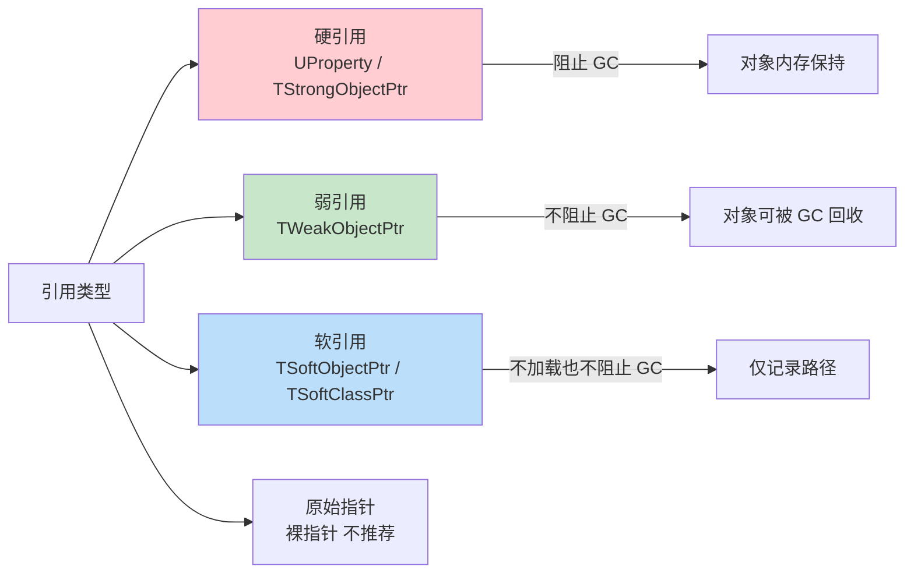
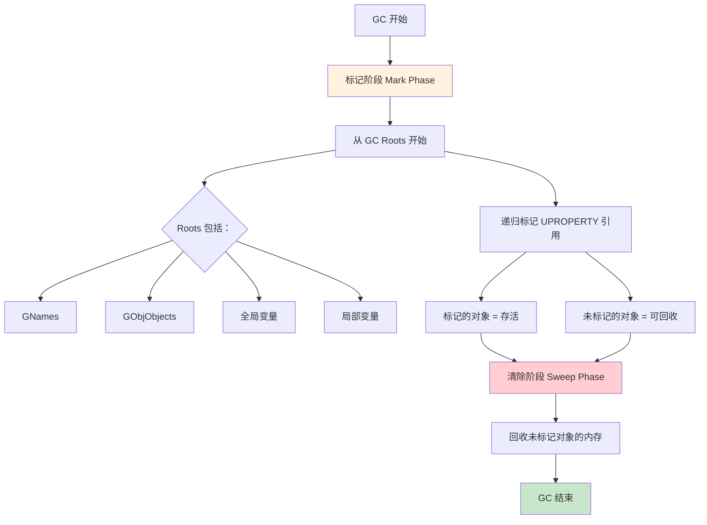
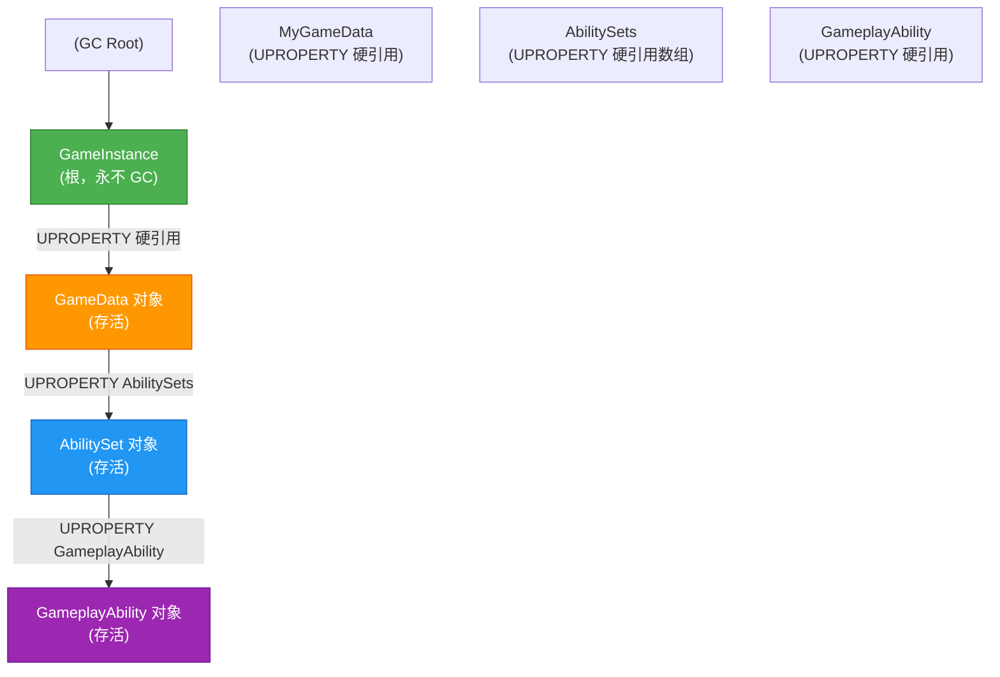
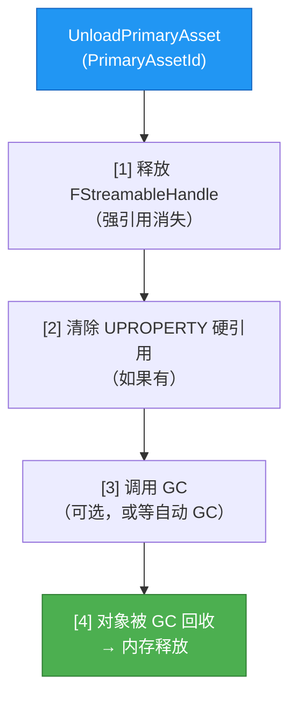

# 引用与GC资源内存管理

> 理解 UObject 的引用类型如何决定资源的内存生命周期，避免"资源加载后永不释放"的内存泄漏。

---

## 概述

资源管理不只是"怎么加载"，更重要的是"怎么卸载"。在 UE 中，**GC（垃圾回收）是唯一决定 UObject 内存释放的机制**，而 GC 是否回收一个对象，**完全取决于引用是否还存在**。

本课学完，你将能够：
1. 区分 `UProperty`（硬引用）、`TStrongObjectPtr`、`TWeakObjectPtr`、`TSoftObjectPtr`
2. 理解引用如何阻止 GC 回收
3. 分析和打破引用链，让资源正确卸载
4. 在 Lyra 中看懂为什么大量使用 `TSoftObjectPtr`

---

## 核心概念

### UE 中四种引用类型对比



| 引用类型 | 是否加载资产 | 是否阻止 GC | 典型用途 |
|-----------|--------------|-------------|-----------|
| `UPROPERTY()` 硬引用 | ✅ 立即加载 | ✅ 强阻止 | 核心资产（PawnClass） |
| `TStrongObjectPtr` | ✅ 立即加载 | ✅ 强阻止 | C++ 中需要强引用的场景 |
| `TWeakObjectPtr` | ❌ 不加载 | ❌ 不阻止 | 避免循环引用、观察者模式 |
| `TSoftObjectPtr` | ❌ 不加载 | ❌ 不阻止 | 可选资产、大数据资产 |
| 裸指针 `UObject*` | 取决于上下文 | ❌ 不阻止 | **不推荐**，除非局部临时使用 |

---

## 源码深度分析

### `UPROPERTY` 硬引用与 GC 标记

**文件**：`\Engine\Source\Runtime\CoreUObject\Private\UObject\GarbageCollection.cpp`

GC 的**标记阶段**会从"GC Roots"出发，递归标记所有被引用的对象：

```cpp
// GarbageCollection.cpp（简化逻辑）
void MarkObjectsAsUnreachable()
{
    // [1] 从 Roots 开始：GNames、GObjObjects、全局变量、局部变量...
    // [2] 对每个 Root 对象，递归标记其 UPROPERTY 引用的对象
    // [3] 被标记的对象 = 存活；未被标记的对象 = 可回收
}
```

**关键结论**：
- `UPROPERTY()` 标记的成员变量 = GC 认为的"有效引用"
- 如果 A 有 `UPROPERTY()` 引用 B，则 B 不会被 GC 回收（只要 A 还存活）

### `FStreamableHandle` 与 GC 的关系

**文件**：`\Engine\Source\Runtime\Engine\Classes\Engine\StreamableManager.h`

`FStreamableHandle` 内部持有加载对象的**强引用**，在 `FStreamableHandle` 释放前，加载的资产不会被 GC 回收：

```cpp
// StreamableManager.h（简化）
class FStreamableHandle
{
    // 强引用列表 —— 阻止 GC 回收
    TArray<TStrongObjectPtr<UObject>> LoadedAssets;

    // 当 Handle 引用计数为 0 时，LoadedAssets 清空
    // → 强引用消失 → GC 可回收
};
```

这也是为什么**必须保存 `FStreamableHandle`**：
```
保存 Handle → LoadedAssets 强引用存在 → 资产不 GC
释放 Handle → LoadedAssets 清空 → 资产可被 GC
```

---

## GC 标记-清除流程图



---

## 引用链分析与内存泄漏排查

### 典型的引用链



**如果 `MyGameData` 是 Primary Asset 且被 `LoadPrimaryAsset` 加载**：
- `FStreamableHandle` 持有强引用
- `GameInstance` 持有硬引用
- **整个链上的对象都不会被 GC 回收**

### 如何"卸载"资源？

正确流程（对应 `UAssetManager::UnloadPrimaryAsset`）：



**关键**：只调用 `UnloadPrimaryAsset` 还不够，如果其他地方还有 `UPROPERTY` 硬引用着，对象仍然不会被 GC 回收。

---

## `TSoftObjectPtr` 详解

### 为什么 Lyra 大量使用 `TSoftObjectPtr`？

**文件**：`\ue_lyra_analysis\Source\LyraGame\System\LyraGameData.h`

```cpp
UCLASS()
class ULyraGameData : public UPrimaryDataAsset
{
    // ❌ 如果这样写（硬引用）：
    // UPROPERTY(EditDefaultsOnly)
    // TSubclassOf<UGameplayEffect> DamageGameplayEffect;
    // → 加载 GameData 时，DamageGameplayEffect 立即被加载
    // → 即使本关卡用不到，也占内存

    // ✅ 实际写法（软引用）：
    UPROPERTY(EditDefaultsOnly)
    TSoftClassPtr<UGameplayEffect> DamageGameplayEffect_SetByCaller;
    // → 加载 GameData 时，不会加载 DamageGameplayEffect
    // → 真正需要时，调用 AssetManager::LoadPrimaryAsset 或 RequestAsyncLoad
};
```

**收益**：
1. **减少初始内存**：只加载需要的资产
2. **加快启动速度**：不加载暂不使用的资产
3. **支持模块化**：被软引用的资产可以不存在（DLC 后添加）

### `TSoftObjectPtr` 如何解析到对象？

```cpp
// 方式 1：同步解析（可能卡顿）
UObject* Obj = MySoftPtr.Get();  // 如果已加载，直接返回；否则返回 nullptr

// 方式 2：强制同步加载（会卡顿，慎用）
UObject* Obj = MySoftPtr.LoadSynchronous();

// 方式 3：异步加载（推荐）
TSharedPtr<FStreamableHandle> Handle = UAssetManager::GetStreamableManager()
    .RequestAsyncLoad(MySoftPtr.ToSoftObjectPath(), OnCompleteDelegate);
```

---

## Lyra 实践

### Lyra 的 `GetAsset` 模板函数

**文件**：`\ue_lyra_analysis\Source\LyraGame\System\LyraAssetManager.h`（第 43-48 行）

```cpp
template<typename AssetType>
static AssetType* GetAsset(const TSoftObjectPtr<AssetType>& AssetPointer, bool bKeepInMemory = true)
{
    AssetType* LoadedAsset = nullptr;

    // [1] 先尝试直接获取（如果已加载）
    if (AssetPointer.ToSoftObjectPath().IsAsset())
    {
        LoadedAsset = AssetPointer.Get();
    }

    // [2] 如果未加载，同步加载（阻塞！）
    if (!LoadedAsset)
    {
        LoadedAsset = Cast<AssetType>(SynchronousLoadAsset(AssetPointer.ToSoftObjectPath()));
    }

    // [3] 如果需要保持内存，加入 LoadedAssets 集合
    if (LoadedAsset && bKeepInMemory)
    {
        AddLoadedAsset(LoadedAsset);  // → 被 FStreamableHandle 或 LoadedAssets 强引用
    }

    return LoadedAsset;
}
```

**设计意图**：提供一个"总是返回有效对象"的便捷函数，内部处理了"已加载/未加载"两种情况。

**注意**：`bKeepInMemory = true` 时，资产会被加入 `LoadedAssets`，阻止 GC 回收。不需要时记得调用对应卸载逻辑。

### Lyra 中 `LoadedAssets` 集合的作用

**文件**：`\ue_lyra_analysis\Source\LyraGame\System\LyraAssetManager.h`（第 115-116 行）

```cpp
// Assets loaded and tracked by the asset manager.
UPROPERTY()
TSet<TObjectPtr<const UObject>> LoadedAssets;
```

这是一个**调试/追踪**集合，方便：
1. 在编辑器中运行 `DumpLoadedAssets()` 命令，查看所有通过 AssetManager 加载的资产
2. 确保重要资产不被意外 GC（通过 `AddLoadedAsset` 加入强引用）

---

## 常见问题与陷阱

### 陷阱 1：`TWeakObjectPtr` 过期后继续使用

**现象**：`WeakPtr.Get()` 突然返回 `nullptr`，之前还好好的。

**原因**：对象被 GC 回收了，`TWeakObjectPtr` 不会阻止 GC。

```cpp
// 错误：保存了裸指针
UObject* RawPtr = MyWeakPtr.Get();  // 此时有效
CallSomeFunction(RawPtr);  // 中间可能触发 GC → RawPtr 悬空

// 正确：每次使用都通过 WeakPtr.Get() 获取
if (UObject* SafePtr = MyWeakPtr.Get())
{
    CallSomeFunction(SafePtr);  // 在使用前检查
}
```

### 陷阱 2：`UPROPERTY` 硬引用导致资产永远不卸载

**现象**：调用 `UnloadPrimaryAsset` 后，内存不降。

**原因**：某个 `UPROPERTY` 硬引用仍然持有该资产。

**排查方法**：
```cpp
// 使用 GC Root 分析命令（编辑器 Console）
obj refs name=MyAssetName

// 会打印出所有引用了此资产的 UPROPERTY 路径
// 找到引用源，决定是否改为软引用
```

### 陷阱 3：`TSoftObjectPtr` 解析时同步加载卡顿

**现象**：调用 `MySoftPtr.Get()` 后画面卡顿。

**原因**：`Get()` 不会加载，但如果之前没加载，返回 `nullptr`；开发者误用了 `LoadSynchronous()` 或 `GetAsset()`（内部调用同步加载）。

**解决**：始终用 `RequestAsyncLoad` 异步加载软引用资产。

---

## 总结

| 要点 | 说明 |
|------|------|
| 硬引用 `UPROPERTY` | 立即加载 + 阻止 GC，用于核心资产 |
| 弱引用 `TWeakObjectPtr` | 不加载 + 不阻止 GC，用于观察者/避免循环引用 |
| 软引用 `TSoftObjectPtr` | 不加载 + 不阻止 GC，用于可选/大资产 |
| `FStreamableHandle` | 异步加载的句柄，持有强引用阻止 GC |
| 卸载资源 | 释放 Handle + 清除硬引用 + 等待 GC |
| Lyra 风格 | 大量使用 `TSoftObjectPtr`，按需异步加载 |

---

## 相关页面

- [[30-tutorials/resource-management/03-异步加载FStreamableManager与RequestAsyncLoad|← 03 异步加载]]
- [[30-tutorials/resource-management/05-Cook与Pak打包流程|05 Cook 与 Pak →]]
- [[30-tutorials/garbage-collection/02-GC算法详解|GC 算法详解]]

<!-- nav:auto -->

---

**导航**: ← [[30-tutorials/resource-management/03-异步加载FStreamableManager与RequestAsyncLoad|03-异步加载FStreamableManager与RequestAsyncLoad]] · [[30-tutorials/resource-management/05-Cook与Pak打包流程|05-Cook与Pak打包流程]] →

<!-- /nav:auto -->
