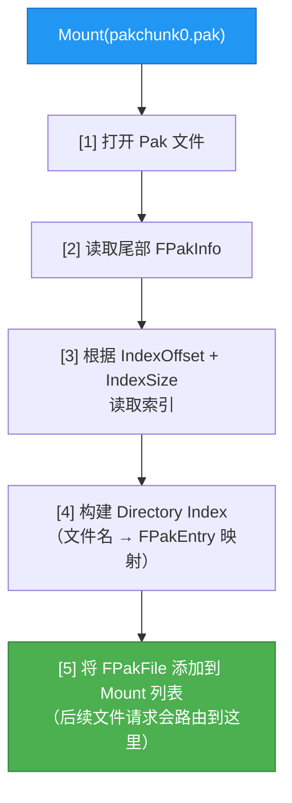
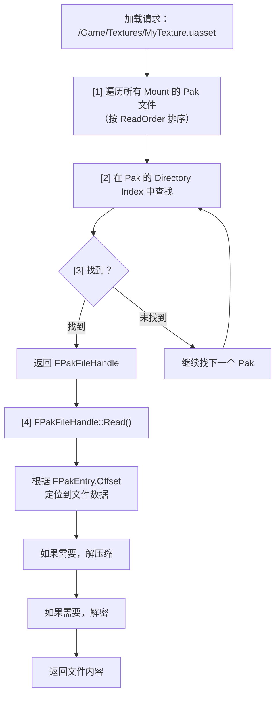

# Cook与Pak打包流程

> 理解从"编辑器中的资产"到"打包后 Pak 文件中的二进制数据"的完整转换过程，以及运行时如何读取。

---

## 概述

当你在编辑器中点击**Package Project**时，UE 做了两件核心事情：

1. **Cook**：把编辑器格式的资产转换为目标平台可读取的运行时格式
2. **Pak/IoStore**：把 Cook 后的资产打包成 `.pak` 或 `.utoc/.ucas` 文件

本课学完，你将能够：
1. 理解 Cook 的触发时机和流程
2. 读懂 Pak 文件二进制结构
3. 配置 `EPrimaryAssetCookRule` 控制资产是否打包
4. 理解 Chunk 系统如何分割 Pak 文件
5. 排查常见的 Cook 失败和资产遗漏问题

---

## 核心概念

### 为什么需要 Cook？

编辑器中的资产（`.uasset`）包含大量**编辑器专用数据**（预览缩略图、编辑器配置、未压缩的原始数据），这些数据：
- 运行时不需要 → 浪费空间
- 格式未优化 → 加载慢
- 包含平台无关数据 → 无法在特定平台运行

Cook 过程就是"为运行时做准备"：
```
编辑器资产（.uasset）
    ↓  Cook
运行时资产（序列化优化、平台特定格式、移除 EditorOnly 数据）
    ↓  Pak/IoStore
Pak 文件（可按需 Mount、支持压缩/加密）
```

### Cook 的两种模式

| 模式 | 触发方式 | 特点 |
|------|---------|------|
| **Cook By The Book** | 编辑器 Package Project / CookCommandlet | 批量 Cook 所有指定内容，用于最终发布 |
| **Cook On The Fly** | 运行时网络请求 / `-CookOnTheFly` | 按需 Cook，用于迭代开发 |

> 📖 相关概念：Cook 流程、Pak 文件（详见项目术语表 `Docs/00-meta/glossary.md`）

---

## 源码深度分析

### `UCookCommandlet` —— Cook 的入口

**文件**：`\Engine\Source\Editor\UnrealEd\Classes\Commandlets\CookCommandlet.h`

```cpp
UCLASS()
class UCookCommandlet : public UCommandlet
{
    GENERATED_BODY()

public:
    // 入口函数
    virtual int32 Main(const FString& CmdLineParams) override;
};
```

**典型命令行**：
```bash
UE5Editor-Cmd.exe MyProject -run=Cook -targetplatform=Win64 -cookall
```

**`Main()` 核心流程**（`CookCommandlet.cpp` 简化）：

```cpp
int32 UCookCommandlet::Main(const FString& CmdLineParams)
{
    // [1] 解析命令行参数
    bool bCookAll = FParse::Param(CmdLine, TEXT("CookAll"));
    bool bIterative = FParse::Param(CmdLine, TEXT("Iterative"));

    // [2] 初始化 Cook 环境（加载 AssetRegistry、建立 Cook 队列）
    InitCook();

    // [3] 收集需要 Cook 的资产
    // -CookAll: 所有资产
    // 否则：只有被 Map 或 Primary Asset 引用的资产
    TArray<FSoftObjectPath> AssetsToCook = CollectAssetsToCook(bCookAll);

    // [4] Cook 每个资产
    for (const FSoftObjectPath& AssetPath : AssetsToCook)
    {
        // 序列化资产到磁盘
        // 移除 EditorOnly 数据
        // 应用平台特定格式
        CookPackage(AssetPath);
    }

    // [5] 生成 AssetRegistry.bin（运行时查询用）
    SaveAssetRegistry();

    // [6] 打包到 Pak / IoStore
    SaveCookedPackages();

    return 0;
}
```

### Pak 文件结构（传统 `.pak`）

**文件**：`\Engine\Source\Runtime\PakFile\Public\IPlatformFilePak.h`（第 137-353 行）

Pak 文件布局（从文件尾开始读）：
```text
┌─────────────────────────────────┐
│       File Content 1           │  ← 文件 1 的数据（可能压缩/加密）
├─────────────────────────────────┤
│       File Content 2           │
├─────────────────────────────────┤
│       ...                      │
├─────────────────────────────────┤
│       File Content N           │
├─────────────────────────────────┤
│       Pak Index                │  ← 索引数据（FPakEntry 数组）
│       (Directory Index)        │
├─────────────────────────────────┤
│       FPakInfo                │  ← 文件尾部（固定大小）
│       (Header, 通常 160 字节) │
└─────────────────────────────────┘
```

**`FPakInfo`（Pak Header）**：
```cpp
struct FPakInfo
{
    uint32 Magic;           // 0x5A6F12E1
    int32  Version;         // Pak 文件版本
    int64  IndexOffset;     // 索引在文件中的偏移量
    int64  IndexSize;       // 索引大小（字节）
    uint8  IndexHash[20];  // 索引的 SHA1 哈希（用于校验）
    uint8  bEncryptedIndex;// 索引是否加密
    FGuid  EncryptionKeyGuid;
    TArray<FName> CompressionMethods;  // 支持的压缩方法列表
};
```

**`FPakEntry`（每个文件的元数据）**：
```cpp
struct FPakEntry
{
    int64  Offset;           // 文件数据在 Pak 中的偏移量
    int64  Size;             // 序列化后大小（压缩后）
    int64  UncompressedSize; // 未压缩大小
    uint8  Hash[20];        // 文件 SHA1
    TArray<FPakCompressedBlock> CompressionBlocks;
    uint32 CompressionBlockSize;
    uint32 CompressionMethodIndex;
    uint8  Flags;            // Flag_Encrypted = 0x01
};
```

### IoStore（`.utoc` / `.ucas`）—— UE5 新一代存储

**文件**：`\Engine\Source\Runtime\Core\Internal\IO\IoStore.h`

IoStore 是 UE5 引入的**替代传统 Pak 的系统**，文件组成：

| 文件扩展名 | 内容 |
|------------|------|
| `.utoc` | Table of Contents（目录文件，存储块元数据） |
| `.ucas` | Container Assets（数据文件，存储实际块数据） |
| `.upipelinehashdb` | 可选，流水线哈希数据库 |

**为什么需要 IoStore？**

| 特性 | 传统 Pak | IoStore |
|------|-----------|----------|
| 加载方式 | 整体读入内存 | 内存映射，按需加载块 |
| 压缩粒度 | 按文件 | 按块（Chunk），更细 |
| DLC 支持 | 通过 Chunk 系统模拟 | 原生容器化 |
| 错误处理 | 整个 Pak 损坏 = 全部丢失 | 块独立校验，局部损坏不影响其他 |

**`FIoStoreTocHeader`**（`.utoc` 文件头）：
```cpp
struct FIoStoreTocHeader
{
    uint8  TocMagic[16];     // "-==--==--==--==-"
    uint8  Version;
    uint32 TocHeaderSize;
    uint32 TocEntryCount;    // TOC 条目数量
    uint32 TocCompressedBlockEntryCount;
    uint32 CompressionMethodNameCount;
    uint32 CompressionMethodNameLength;
    uint32 CompressionBlockSize;
    uint32 DirectoryIndexSize;
    uint32 PartitionCount;
    FIoContainerId ContainerId;
    FGuid  EncryptionKeyGuid;
    EIoContainerFlags ContainerFlags;
    uint64 PartitionSize;
};
```

---

## Pak 文件与 Chunk 系统

### Chunk 是什么？

**Chunk** 是 UE 打包系统的逻辑分组单位。不同 ChunkId 的资产会被打包到不同的 `.pak` 文件：

> 📖 相关概念：Chunk 系统、DLC 分包（详见项目术语表 `Docs/00-meta/glossary.md`）

```
Chunk 0 → pakchunk0-Windows.pak  （始终加载，基础内容）
Chunk 1 → pakchunk1-Windows.pak  （DLC1，可选）
Chunk 2 → pakchunk2-Windows.pak  （DLC2，可选）
```

### 如何在 AssetManager 中配置 Chunk？

**文件**：`\Engine\Source\Runtime\Engine\Classes\Engine\AssetManagerTypes.h`

```cpp
struct FPrimaryAssetRules
{
    // 优先级（越高越先 Cook）
    int32 Priority;

    // ChunkId（-1 = 使用默认 Chunk 0）
    int32 ChunkId;

    // 是否递归应用到引用的 Secondary Asset
    bool bApplyRecursively;

    // Cook 规则
    EPrimaryAssetCookRule CookRule;
};
```

**配置示例**（`DefaultEngine.ini`）：

```ini
[/Script/Engine.AssetManagerSettings]
; 基础游戏内容 → Chunk 0（默认）
+PrimaryAssetTypes=(PrimaryAssetType="GameData", Rules=(ChunkId=-1, CookRule=AlwaysCook))

; DLC 武器包 → Chunk 1
+PrimaryAssetTypes=(PrimaryAssetType="DLC_Weapon", Rules=(ChunkId=1, CookRule=AlwaysCook))
```

---

## 运行时 Pak 文件加载流程

### Pak 文件如何 Mount？

**文件**：`\Engine\Source\Runtime\PakFile\Public\IPlatformFilePak.h`

```cpp
// 1. 创建 FPakPlatformFile
FPakPlatformFile* PakPlatformFile = new FPakPlatformFile();
IPlatformFile& LowerLevel = FPlatformFileManager::Get().GetPlatformFile();
PakPlatformFile->Initialize(&LowerLevel, TEXT(""));

// 2. Mount Pak 文件
FPakMountArgs MountArgs;
MountArgs.PakFilename = TEXT("pakchunk0-Windows.pak");
MountArgs.PakOrder = 0;
MountArgs.Path = TEXT("../../../MyProject/");
MountArgs.bLoadIndex = true;

PakPlatformFile->Mount(*MountArgs.PakFilename, MountArgs.PakOrder, *MountArgs.Path);
```

**Mount 内部流程**：


### 资源请求如何路由到正确的 Pak 文件？



---

## 常见 Cook 问题与调试

### 问题 1：资产未被 Cook（打包后加载失败）

**原因**：
1. 资产不是 Primary Asset，也没有被任何 Cook 的资产引用
2. `CookRule=NeverCook` 或 `Unknown` 且没有依赖者
3. 迭代 Cook 缓存问题

**排查**：
```bash
# 查看 Cook 日志（搜索 "Not Cooking"）
type Saved\Logs\Cook.log | findstr "Not Cooking"

# 强制重新 Cook（忽略迭代缓存）
UE5Editor-Cmd.exe MyProject -run=Cook -targetplatform=Win64 -cookall -iterate
```

### 问题 2：Cook 失败（报错）

**常见原因**：

| 错误信息 | 原因 | 解决 |
|----------|------|------|
| `Failed to load reference` | 资产引用了不存在的文件 | 修复或移除损坏的引用 |
| `Circular dependency detected` | 循环引用 | 重构资产依赖关系 |
| `Ran out of memory` | 内存不足 | 使用 `-UseMultithreadedCooking -NumCookers=2` |
| `Script compilation failed` | 脚本编译失败 | 先成功编译脚本再 Cook |

### 问题 3：Pak 文件过大

**优化手段**：

```ini
; 启用压缩（DefaultEngine.ini）
[/Script/UnrealEd.ProjectPackagingSettings]
bCompressPak = true

; 使用 ZenLoader（UE5.1+，更快的 IO）
[/Script/Engine.GarbageCollectionSettings]
gc.MaxObjectsInEditor = 2097152
```

---

## 总结

| 要点 | 说明 |
|------|------|
| Cook 目的 | 编辑器资产 → 运行时优化格式 |
| Cook 模式 | By The Book（发布）/ On The Fly（迭代） |
| Pak 文件结构 | Header（尾部）+ Index + File Content |
| IoStore | UE5 新系统，`.utoc` + `.ucas`，支持按需加载块 |
| Chunk 系统 | 不同 ChunkId → 不同 `.pak` 文件，支持 DLC |
| 运行时加载 | Mount Pak → 请求路由到对应 Pak → 读数据（可能解压/解密） |

---

## 相关页面

- [[30-tutorials/resource-management/04-引用与GC资源内存管理|← 04 引用与 GC]]
- [[30-tutorials/resource-management/06-Lyra资源管理实践|06 Lyra 实践 →]]
- [[30-tutorials/resource-management/07-高级主题IO虚拟化与性能优化|07 高级主题]]

<!-- nav:auto -->

---

**导航**: ← [[30-tutorials/resource-management/04-引用与GC资源内存管理|04-引用与GC资源内存管理]] · [[30-tutorials/resource-management/06-Lyra资源管理实践|06-Lyra资源管理实践]] →

<!-- /nav:auto -->
