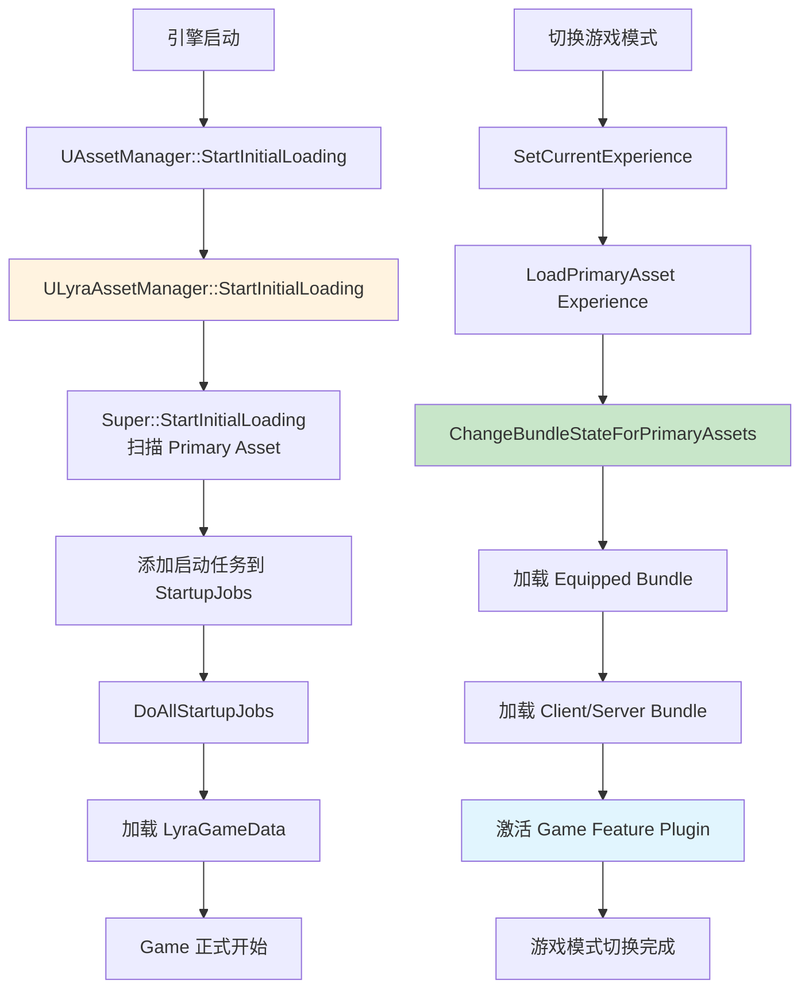
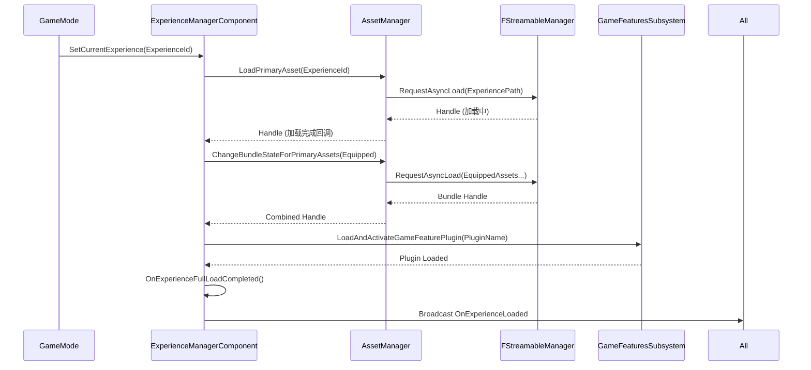

# Lyra资源管理实践

> 通过 Lyra 的真实代码，理解一个大型 UE 项目如何组织资源管理：从启动加载到 Experience 动态切换，从 Bundle 精确到 GC 配合。

---

## 概述

Lyra 是 UE5 官方示例项目，它的资源管理方案代表了 Epic 推荐的最佳实践。核心设计思想是：

1. **所有核心数据声明为 Primary Asset**（`ULyraGameData`、`ULyraPawnData`、`ULyraExperienceDefinition`）
2. **Bundle 系统精确控制加载范围**（`Equipped` / `Client` / `Server`）
3. **Experience 驱动游戏模式切换**（动态加载/卸载整套游戏逻辑）
4. **大量使用 `TSoftObjectPtr`**，避免不必要的硬引用

本课学完，你将能够：
1. 看懂 `ULyraAssetManager` 的启动流程
2. 理解 Experience 动态加载的完整调用链
3. 使用 Bundle 系统按需加载资产
4. 在自己的项目中复用 Lyra 的资源管理模式

---

## 核心架构

### Lyra 资源管理全景图



---

## 源码深度分析

### `ULyraAssetManager::StartInitialLoading`

**文件**：`\ue_lyra_analysis\Source\LyraGame\System\LyraAssetManager.cpp`（第 106-122 行）

```cpp
void ULyraAssetManager::StartInitialLoading()
{
    SCOPED_BOOT_TIMING("ULyraAssetManager::StartInitialLoading");

    // [1] 调用父类实现 → 扫描 DefaultEngine.ini 中注册的所有 Primary Asset
    // 内部会调用 ScanPathsSynchronous()，建立 AssetTypeMap 和 AssetPathMap
    Super::StartInitialLoading();

    // [2] 添加初始化 GameplayCueManager 的任务
    STARTUP_JOB(InitializeGameplayCueManager());

    // [3] 添加加载 GameData 的任务（权重 25.0，占启动进度的 25%）
    {
        STARTUP_JOB_WEIGHTED(GetGameData(), 25.f);
    }

    // [4] 执行所有启动任务，支持进度回调（驱动加载屏幕）
    DoAllStartupJobs();
}
```

**设计意图**：Lyra 把"加载全局游戏数据"作为启动管线的一部分，确保游戏逻辑运行前核心数据已就绪。

### `DoAllStartupJobs` —— 带权重的启动任务系统

**文件**：`\ue_lyra_analysis\Source\LyraGame\System\LyraAssetManager.cpp`（第 193-246 行）

```cpp
void ULyraAssetManager::DoAllStartupJobs()
{
    // [1] 专用服务器：直接顺序执行，无需进度报告
    if (GIsEditor || (GetNetMode() == NM_DedicatedServer))
    {
        for (FLyraAssetManagerStartupJob& Job : StartupJobs)
        {
            Job.DoJob();  // 同步执行，阻塞直到完成
        }
        return;
    }

    // [2] 客户端/编辑器：计算总权重，逐步报告进度
    float TotalJobValue = 0.0f;
    for (const FLyraAssetManagerStartupJob& Job : StartupJobs)
    {
        TotalJobValue += Job.JobWeight;
    }

    float AccumulatedJobValue = 0.0f;
    for (FLyraAssetManagerStartupJob& Job : StartupJobs)
    {
        // 绑定进度回调（支持子步骤进度）
        Job.SubstepProgressDelegate.BindLambda(
            [this, AccumulatedJobValue, JobValue = Job.JobWeight, TotalJobValue]
            (float NewProgress)
            {
                float SubstepAdjustment = FMath::Clamp(NewProgress, 0.0f, 1.0f) * JobValue;
                float OverallPercent = (AccumulatedJobValue + SubstepAdjustment) / TotalJobValue;
                UpdateInitialGameContentLoadPercent(OverallPercent);
            });

        Job.DoJob();  // 执行任务（内部会 WaitUntilComplete）
        AccumulatedJobValue += Job.JobWeight;

        // 报告整体进度
        UpdateInitialGameContentLoadPercent(AccumulatedJobValue / TotalJobValue);
    }
}
```

**设计意图**：支持精准的加载进度报告，让加载屏幕能显示真实进度（而不是"假转圈"）。

---

## Experience 动态加载机制

### Experience 是什么？

**文件**：`\ue_lyra_analysis\Source\LyraGame\GameModes\LyraExperienceDefinition.h`

```cpp
UCLASS(BlueprintType, Const)
class ULyraExperienceDefinition : public UPrimaryDataAsset
{
    GENERATED_BODY()

public:
    // 需要启用的 Game Feature Plugin 列表（按需加载）
    UPROPERTY(EditDefaultsOnly, Category = "Gameplay")
    TArray<FString> GameFeaturesToEnable;

    // 默认 Pawn 数据（软引用，按需加载 Equipped Bundle 时才真正加载）
    UPROPERTY(EditDefaultsOnly, Category = "Gameplay")
    TObjectPtr<const ULyraPawnData> DefaultPawnData;

    // 加载/激活/停用时执行的操作列表（GameFeatureAction）
    UPROPERTY(EditDefaultsOnly, Instanced, Category = "Actions")
    TArray<TObjectPtr<UGameFeatureAction>> Actions;

    // 可组合的额外 Action 集合（也是 Primary Asset）
    UPROPERTY(EditDefaultsOnly, Category = "Gameplay")
    TArray<TObjectPtr<ULyraExperienceActionSet>> ActionSets;
};
```

**为什么需要 Experience？**

| 传统方式 | Experience 方式 |
|-----------|----------------|
| 所有游戏模式的逻辑打包在一起 | 每个模式是独立的 Experience |
| 切换模式 = 加载新 Map + 重启 | 切换模式 = 加载新 Experience（热切换） |
| 无法按需卸载不用的功能 | Bundle 系统精确控制加载/卸载 |

---

### Experience 加载完整调用链

**文件**：`\ue_lyra_analysis\Source\LyraGame\GameModes\LyraExperienceManagerComponent.cpp`



**关键代码**（`LyraExperienceManagerComponent.cpp` 第 123-212 行，简化）：

```cpp
void ULyraExperienceManagerComponent::StartExperienceLoad()
{
    // [1] 收集需要加载的 Primary Asset（Experience + ActionSets）
    TSet<FPrimaryAssetId> BundleAssetList;
    BundleAssetList.Add(CurrentExperience->GetPrimaryAssetId());
    for (const TObjectPtr<ULyraExperienceActionSet>& ActionSet : CurrentExperience->ActionSets)
    {
        if (ActionSet)
        {
            BundleAssetList.Add(ActionSet->GetPrimaryAssetId());
        }
    }

    // [2] 确定需要加载的 Bundle
    TArray<FName> BundlesToLoad;
    BundlesToLoad.Add(FLyraBundles::Equipped);  // 始终加载核心资产

    // 根据平台添加额外 Bundle
    const bool bLoadClient = GIsEditor || (GetNetMode() != NM_DedicatedServer);
    const bool bLoadServer = GIsEditor || (GetNetMode() != NM_Client);
    if (bLoadClient)
    {
        BundlesToLoad.Add(UGameFeaturesSubsystemSettings::LoadStateClient);
    }
    if (bLoadServer)
    {
        BundlesToLoad.Add(UGameFeaturesSubsystemSettings::LoadStateServer);
    }

    // [3] 改变 Bundle 状态 → 触发加载
    TSharedPtr<FStreamableHandle> BundleLoadHandle =
        AssetManager.ChangeBundleStateForPrimaryAssets(
            BundleAssetList.Array(),
            BundlesToLoad,
            {},       // BundlesToRemove
            false,    // bRemoveAllBundles
            FStreamableDelegate(),
            FStreamableManager::AsyncLoadHighPriority);

    // [4] 绑定完成回调
    BundleLoadHandle->BindCompleteDelegate(FStreamableDelegate::CreateUObject(
        this, &ThisClass::OnExperienceLoadComplete));
}
```

---

## Bundle 系统实践

### `FLyraBundles::Equipped` 的作用

**文件**：`\ue_lyra_analysis\Source\LyraGame\System\LyraAssetManager.cpp`（第 18 行）

```cpp
const FName FLyraBundles::Equipped("Equipped");
```

**Bundle 的工作原理**：

```text
ULyraExperienceDefinition（Primary Asset）
  ├── [Bundle: Equipped]    ← 核心资产（始终加载）
  │     ├── DefaultPawnData（软引用，Bundle 加载时才真正加载）
  │     └── Actions（GameFeatureAction 列表）
  │
  ├── [Bundle: Client]     ← 客户端专用资产（仅客户端加载）
  │     └── UI 资源、客户端特效
  │
  └── [Bundle: Server]     ← 服务器专用资产（仅服务器加载）
        └── 服务器逻辑、Dedicated Server 专用配置
```

**如何指定资产属于哪个 Bundle？**

在 `ULyraExperienceDefinition` 的编辑器 Details 面板中：
1. 找到 `Asset Bundle Data`  section
2. 添加 Bundle 名称（`Equipped`、`Client`、`Server`）
3. 将引用的资产拖入对应 Bundle

引擎会在 Cook 时，根据 `UPROPERTY` 的引用关系，自动将资产分配到 Bundle 中。

---

## Lyra 为什么大量使用 `TSoftObjectPtr`？

### 对比：硬引用 vs 软引用

```cpp
// ❌ 如果使用硬引用：
UCLASS()
class ULyraPawnData : public UPrimaryDataAsset
{
    UPROPERTY(EditDefaultsOnly)
    TSubclassOf<ULyraCameraMode> DefaultCameraMode;  // 硬引用 → 加载 PawnData 时立即加载

    UPROPERTY(EditDefaultsOnly)
    TArray<TObjectPtr<ULyraAbilitySet>> AbilitySets;  // 硬引用 → 全部立即加载
};

// ✅ 实际写法（软引用）：
UCLASS()
class ULyraPawnData : public UPrimaryDataAsset
{
    UPROPERTY(EditDefaultsOnly)
    TSoftClassPtr<ULyraCameraMode> DefaultCameraMode;  // 不加载，仅记录路径

    UPROPERTY(EditDefaultsOnly)
    TArray<TSoftObjectPtr<ULyraAbilitySet>> AbilitySets;  // 不加载，Bundle 控制何时加载
};
```

**收益**：

| 场景 | 硬引用 | 软引用（`TSoftObjectPtr`） |
|------|--------|----------------------------|
| 加载 PawnData 时 | 所有 AbilitySet 立即加载 | 仅加载路径，不加载实际资产 |
| 内存占用 | 高（所有引用的资产都在内存） | 低（按需加载） |
| 模块化 | 差（所有依赖必须存在） | 好（可以 DLC 后添加） |
| GC 压力 | 高（强引用阻止 GC） | 低（不阻止 GC） |

---

## Lyra 资源管理最佳实践总结

### 1. 所有核心数据声明为 Primary Asset

```ini
[/Script/Engine.AssetManagerSettings]
+PrimaryAssetTypes=(PrimaryAssetType="LyraGameData", ...)
+PrimaryAssetTypes=(PrimaryAssetType="LyraPawnData", ...)
+PrimaryAssetTypes=(PrimaryAssetType="LyraExperienceDefinition", ...)
```

### 2. 使用 Bundle 控制加载范围

```cpp
// 只加载核心资产
TArray<FName> BundlesToLoad = { FLyraBundles::Equipped };
AssetManager->ChangeBundleStateForPrimaryAssets(AssetIds, BundlesToLoad, ...);

// 卸载非核心资产
TArray<FName> BundlesToRemove = { FLyraBundles::Equipped };
AssetManager->ChangeBundleStateForPrimaryAssets(AssetIds, {}, BundlesToRemove, ...);
```

### 3. 启动任务系统管理加载进度

```cpp
// 在 ULyraAssetManager::StartInitialLoading() 中添加任务
STARTUP_JOB_WEIGHTED(LoadCriticalData(), 30.f);  // 占 30% 进度
STARTUP_JOB_WEIGHTED(LoadMap(), 70.f);          // 占 70% 进度
```

### 4. 用 `TSoftObjectPtr` 替代硬引用

```cpp
// ✅ 推荐
UPROPERTY(EditDefaultsOnly)
TSoftObjectPtr<UTexture2D> Icon;

// ❌ 避免（除非资产很小且必然使用）
UPROPERTY(EditDefaultsOnly)
TObjectPtr<UTexture2D> Icon;
```

---

## 常见问题与陷阱

### 陷阱 1：忘记调用 `ChangeBundleStateForPrimaryAssets`

**现象**：Experience 加载完成，但 `DefaultPawnData` 还是 `nullptr`。

**原因**：只调用了 `LoadPrimaryAsset()`，没有调用 `ChangeBundleStateForPrimaryAssets()` 加载 `Equipped` Bundle。

**解决**：
```cpp
// 加载 Experience 后，必须改变 Bundle 状态
AssetManager->ChangeBundleStateForPrimaryAssets(
    { ExperienceId },
    { FLyraBundles::Equipped },  // 加载 Equipped Bundle
    {},
    false,
    FStreamableDelegate::CreateUObject(this, &OnBundleLoaded));
```

### 陷阱 2：`TSoftObjectPtr` 解析时同步加载卡顿

**现象**：调用 `SoftPtr.Get()` 后游戏卡顿。

**原因**：`Get()` 不会加载，但如果调用了 `LoadSynchronous()` 或 `ULyraAssetManager::GetAsset()`（默认 `bKeepInMemory = true`，会同步加载）。

**解决**：始终用 `RequestAsyncLoad()` 异步加载。

---

## 总结

| 要点 | 说明 |
|------|------|
| Lyra 核心设计 | 所有核心数据 = Primary Asset，Bundle 控制加载范围 |
| Experience | 游戏模式切换的核心机制，支持动态加载/卸载 |
| Bundle 系统 | `Equipped`（核心）+ `Client`/`Server`（平台专用） |
| 启动任务系统 | 带权重的启动管线，支持精准进度报告 |
| 软引用优先 | 大量使用 `TSoftObjectPtr`，避免不必要的硬引用 |

---

## 相关页面

- [[30-tutorials/resource-management/05-Cook与Pak打包流程|← 05 Cook 与 Pak]]
- [[30-tutorials/resource-management/07-高级主题IO虚拟化与性能优化|07 高级主题 →]]
- [[30-tutorials/resource-management/03-异步加载FStreamableManager与RequestAsyncLoad|03 异步加载]]

<!-- nav:auto -->

---

**导航**: ← [[30-tutorials/resource-management/05-Cook与Pak打包流程|05-Cook与Pak打包流程]] · [[30-tutorials/resource-management/07-高级主题IO虚拟化与性能优化|07-高级主题IO虚拟化与性能优化]] →

<!-- /nav:auto -->
