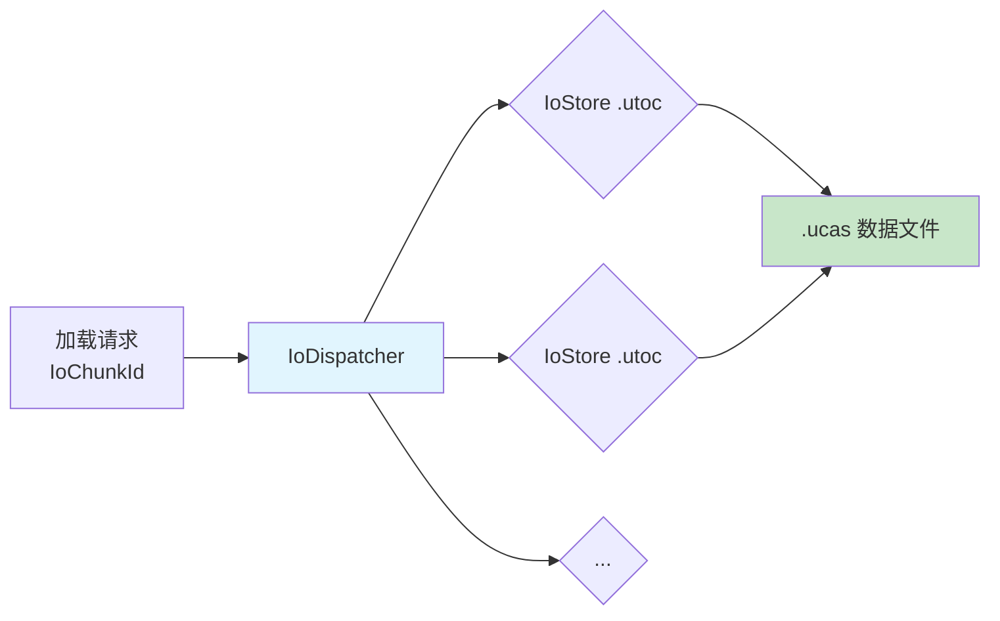

# 高级主题IO虚拟化与性能优化

> 资源管理的高级话题：如何诊断内存问题、优化加载性能、使用 IO 虚拟化，以及 Lyra 中值得借鉴的进阶模式。

---

## 概述

前两课覆盖了"怎么用"，本课覆盖"怎么用得好"：

1. **性能优化**：异步加载优先级、预加载、内存限制
2. **IO 虚拟化**：IoStore 高级特性、按需加载块
3. **内存诊断**：使用 `obj list`、`stat streamable` 等命令
4. **高级 Bundle 用法**：动态改变 Bundle 状态、流式卸载
5. **常见陷阱汇总**：跨课精华，避免踩坑

---

## 性能优化

### 1. 异步加载优先级

`FStreamableManager` 支持为加载请求设置优先级：

```cpp
// StreamableManager.h —— 优先级类型
typedef int32 TAsyncLoadPriority;

// 内置优先级常量
namespace UE::StreamableManager::Private
{
    const TAsyncLoadPriority DefaultAsyncLoadPriority = 0;
    const TAsyncLoadPriority AsyncLoadHighPriority = 100;
    const TAsyncLoadPriority DownloadDefaultPriority = 0;
}

// 使用：高优先级加载关键资产
TSharedPtr<FStreamableHandle> Handle = UAssetManager::GetStreamableManager()
    .RequestAsyncLoad(
        AssetPaths,
        FStreamableDelegate(),
        AsyncLoadHighPriority);  // 高优先级，优先调度
```

**优先级规则**：数值越大 = 优先级越高 = 越先加载。

### 2. 预加载（Preloading）

在玩家进入新区域前，提前加载资源：

```cpp
// 预加载 Experience（玩家选择模式前）
void UMyGameSubsystem::PreloadExperience(FPrimaryAssetId ExperienceId)
{
    TArray<FName> BundlesToPreload = { FLyraBundles::Equipped };

    TSharedPtr<FStreamableHandle> PreloadHandle =
        UAssetManager::Get().ChangeBundleStateForPrimaryAssets(
            { ExperienceId },
            BundlesToPreload,
            {},       // 不移除任何 Bundle
            false);  // 不保持 Handle（加载完即释放）

    // 保存 Handle，等玩家确认后再 ChangeBundleState
    CachedPreloadHandles.Add(MoveTemp(PreloadHandle));
}
```

### 3. 限制并发加载数量

```cpp
// 在 DefaultEngine.ini 中配置
[/Script/Engine.StreamableManager]
MaxConcurrentAsyncLoads=8   ; 最多同时加载 8 个资产（默认 20）
```

---

## IO 虚拟化（IoStore 高级）

### 什么是 IO 虚拟化？

**IO 虚拟化**是 UE5 引入的机制，让资产加载**不依赖具体文件路径**，而是通过 `IoChunkId` 和 `IoStore` 系统路由。



**优势**（相比传统 Pak）：
- 支持**块级按需加载**（不需要整文件加载）
- 支持**内存映射**（`MMap`），减少内存拷贝
- 支持**容器化 DLC**（独立 `.utoc`/`.ucas`）

### IoStore 的内存映射加载

```cpp
// IoDispatcher.h（简化）
class FIoDispatcher
{
    // 打开容器
    TIoStatus<FIoContainerId> Mount(FStringView ContainerPath);

    // 读取块（异步）
    TIoStatus<FIoBuffer> Read(const FIoChunkId& ChunkId);
};
```

**关键点**：IoStore 默认使用内存映射，读取性能显著优于传统 Pak 的 `fread` 方式。

---

## 内存诊断命令

### 常用控制台命令

| 命令 | 说明 |
|------|------|
| `obj list class=Texture2D` | 列出所有已加载的 Texture2D |
| `obj list package=/Game/Data/MyData` | 列出指定包加载的所有对象 |
| `obj refs name=MyAsset` | 列出引用了 `MyAsset` 的所有对象（排查泄漏） |
| `stat streamable` | 显示 `FStreamableManager` 状态（活跃 Handle 数、加载中任务数） |
| `stat asset` | 显示 AssetManager 统计信息 |
| `DumpLoadedAssets` | Lyra 专用命令，列出所有通过 `ULyraAssetManager` 加载的资产 |

### 使用 `obj refs` 排查内存泄漏

```bash
; 编辑器 Console 或游戏控制台输入：
obj refs name=/Game/Weapons/BP_Rifle

; 输出示例：
; Referenced by Root:
;   MyGameInstance -> (UPROPERTY) MyWeaponData
;   FStreamableHandle -> (StrongPtr) BP_Rifle_C
;
; 如果有意外引用，检查对应 UPROPERTY 是否可以改为 TSoftObjectPtr
```

---

## 高级 Bundle 用法

### 动态改变 Bundle 状态（流式卸载）

```cpp
// 进入新区域时，加载新区域的 Bundle，卸载旧区域的 Bundle
void UMyGameSubsystem::SwitchArea(FPrimaryAssetId NewAreaId)
{
    UAssetManager& AM = UAssetManager::Get();

    // [1] 加载新区域的 Equipped Bundle
    TArray<FName> BundlesToLoad = { FLyraBundles::Equipped };
    TSharedPtr<FStreamableHandle> NewHandle =
        AM.ChangeBundleStateForPrimaryAssets(
            { NewAreaId },
            BundlesToLoad,
            {},
            false);

    // [2] 卸载旧区域的 Equipped Bundle
    //（先保存旧 Handle，等新区域加载完再卸载）
    if (CurrentAreaHandle.IsValid())
    {
        TArray<FName> BundlesToUnload = { FLyraBundles::Equipped };
        AM.ChangeBundleStateForPrimaryAssets(
            { CurrentAreaId },
            {},
            BundlesToUnload,
            false);
    }

    CurrentAreaHandle = NewHandle;
    CurrentAreaId = NewAreaId;
}
```

### 按平台加载不同 Bundle

Lyra 中已实现此模式（`LyraExperienceManagerComponent.cpp` 第 148-170 行）：

```cpp
const bool bLoadClient = GIsEditor || (GetNetMode() != NM_DedicatedServer);
const bool bLoadServer = GIsEditor || (GetNetMode() != NM_Client);

if (bLoadClient)
{
    BundlesToLoad.Add(UGameFeaturesSubsystemSettings::LoadStateClient);
}
if (bLoadServer)
{
    BundlesToLoad.Add(UGameFeaturesSubsystemSettings::LoadStateServer);
}
```

**效果**：
- 客户端不加载 `Server` Bundle（节省内存）
- 专用服务器不加载 `Client` Bundle（节省内存 + 安全性）

---

## 常见陷阱汇总

### 陷阱 1：忘记保存 `FStreamableHandle`

**现象**：异步加载完成委托永远不触发。

**根因**：`TSharedPtr` 引用计数为 0 时立即销毁，取消加载请求。

```cpp
// ❌ 错误：Handle 立即销毁
UAssetManager::GetStreamableManager().RequestAsyncLoad(...);

// ✅ 正确：保存到成员变量
ActiveHandle = UAssetManager::GetStreamableManager().RequestAsyncLoad(...);
```

---

### 陷阱 2：`UPROPERTY` 硬引用阻止 GC

**现象**：调用 `UnloadPrimaryAsset` 后内存不降。

**根因**：某个 `UPROPERTY` 仍持有硬引用。

**排查**：`obj refs name=MyAsset` → 找到引用源 → 改为 `TSoftObjectPtr`。

---

### 陷阱 3：同步加载卡顿

**现象**：调用 `LoadSynchronous` 后画面卡死。

**根因**：在主线程同步加载大型资产。

**解决**：改用 `RequestAsyncLoad`，用委托异步通知。

---

### 陷阱 4：Cook 后资产丢失

**现象**：编辑器中能加载，打包后 `LoadPrimaryAsset` 返回失败。

**根因**：资产未被 Cook（`CookRule=Unknown` 且无依赖者）。

**解决**：在 `DefaultEngine.ini` 中确认 `CookRule=AlwaysCook`。

---

### 陷阱 5：`TWeakObjectPtr` 过期后使用

**现象**：`WeakPtr.Get()` 返回 `nullptr`，但之前还好好的。

**根因**：对象被 GC 回收了（`TWeakObjectPtr` 不阻止 GC）。

**解决**：每次使用前都调用 `Get()` 检查有效性，不要缓存裸指针。

---

## Lyra 进阶模式：启动任务系统

### `FLyraAssetManagerStartupJob` 的设计

**文件**：`\ue_lyra_analysis\Source\LyraGame\System\LyraAssetManagerStartupJob.h`

```cpp
struct FLyraAssetManagerStartupJob
{
    // 任务权重（影响启动进度百分比）
    float JobWeight = 1.0f;

    // 任务执行函数（接收此 Job，输出 StreamableHandle）
    TFunction<void(FLyraAssetManagerStartupJob&, TSharedPtr<FStreamableHandle>&)> JobFunc;

    // 执行任务
    TSharedPtr<FStreamableHandle> DoJob() const;
};
```

**设计亮点**：
1. **权重系统**：不同任务占用不同的启动进度百分比
2. **进度回调**：`SubstepProgressDelegate` 支持任务内部细分进度
3. **同步等待**：`DoJob()` 内部调用 `Handle->WaitUntilComplete()`（仅在启动阶段可接受）

### 在自己的项目中复用

```cpp
// MyAssetManager.h
TArray<FLyraAssetManagerStartupJob> StartupJobs;

#define MY_STARTUP_JOB(JobFunc) \
    StartupJobs.Add(FLyraAssetManagerStartupJob::Create(#JobFunc, JobFunc, 1.0f));

#define MY_STARTUP_JOB_WEIGHTED(JobFunc, Weight) \
    StartupJobs.Add(FLyraAssetManagerStartupJob::Create(#JobFunc, JobFunc, Weight));

// MyAssetManager.cpp
void UMyAssetManager::StartInitialLoading()
{
    Super::StartInitialLoading();

    MY_STARTUP_JOB_WEIGHTED(LoadGlobalData(), 30.f);
    MY_STARTUP_JOB_WEIGHTED(LoadMainMenu(), 20.f);
    MY_STARTUP_JOB(LoadDefaultMap());

    DoAllStartupJobs();
}
```

---

## 总结

| 主题 | 要点 |
|------|------|
| 性能优化 | 优先级（`AsyncLoadHighPriority`）、预加载、限制并发 |
| IO 虚拟化 | IoStore 块级加载、内存映射、容器化 DLC |
| 内存诊断 | `obj refs`、`stat streamable`、`DumpLoadedAssets` |
| 高级 Bundle | 动态切换、按平台加载不同 Bundle |
| 启动任务系统 | 权重化启动管线，Lyra 最佳实践 |

---

## 相关页面

- [[30-tutorials/resource-management/06-Lyra资源管理实践|← 06 Lyra 实践]]
- [[30-tutorials/resource-management/00-UE5资源管理系列概览|系列概览 ↑]]
- [[30-tutorials/garbage-collection/06-GC性能优化策略|GC 性能优化]]

<!-- nav:auto -->

---

**导航**: ← [[30-tutorials/resource-management/06-Lyra资源管理实践|06-Lyra资源管理实践]]

<!-- /nav:auto -->
