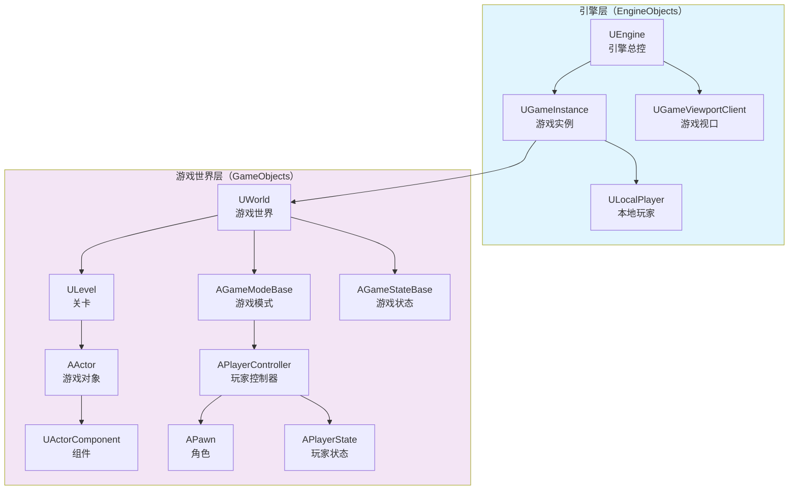
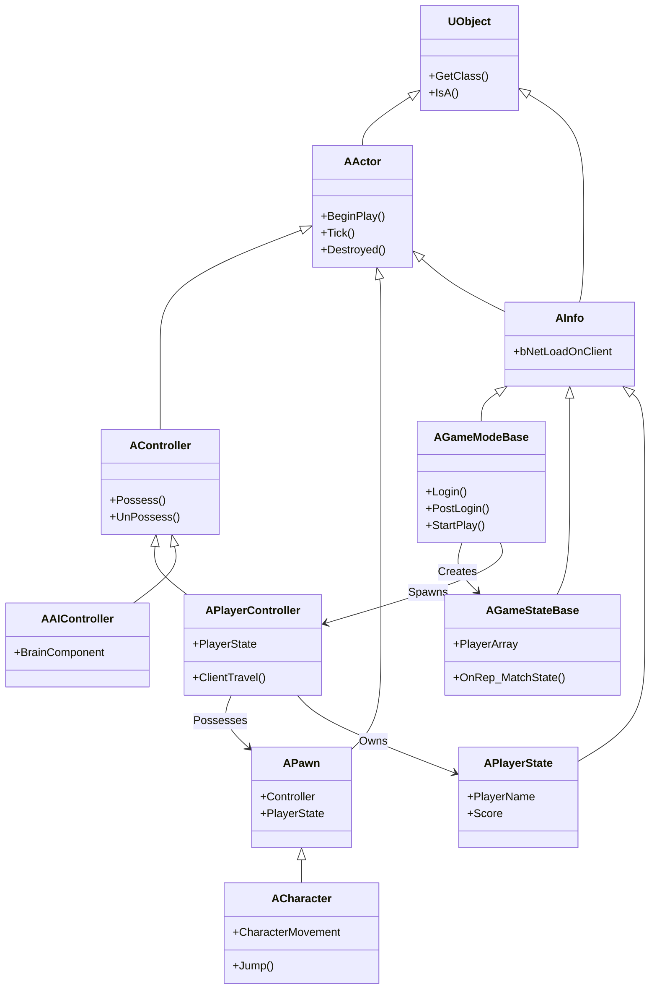
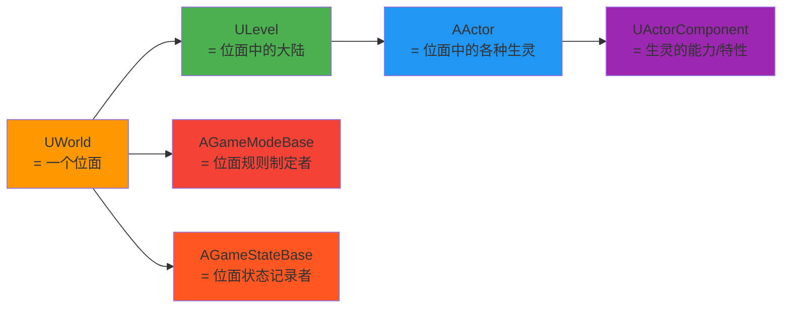
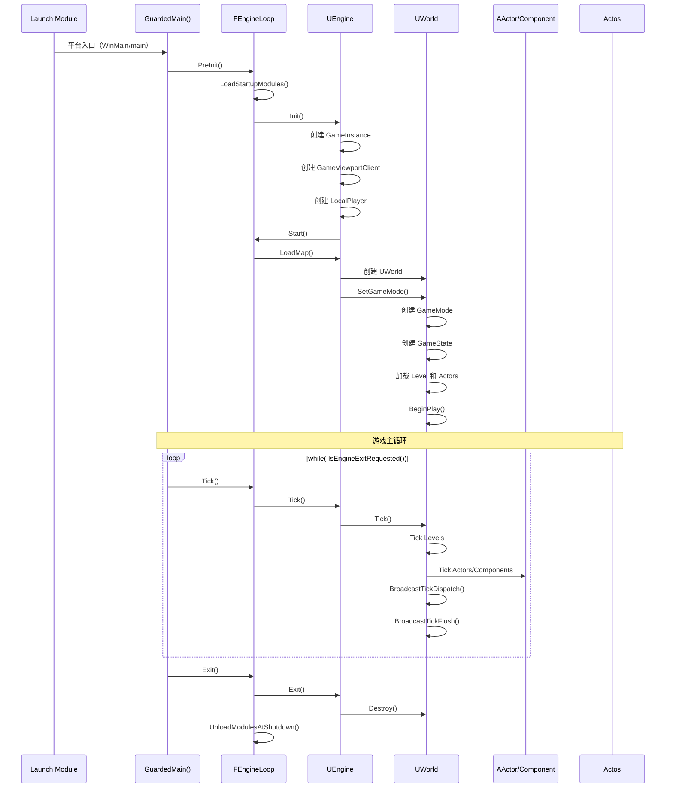
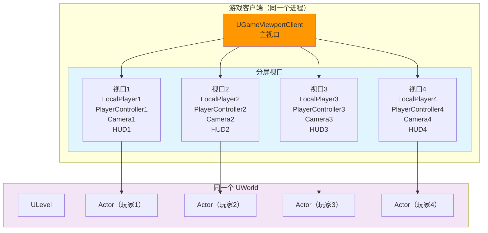
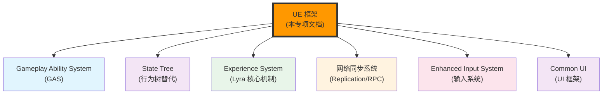

# UE框架概述

## 概述

> UE（Unreal Engine）框架是一套完整的游戏开发架构，采用**分层设计**思想，将游戏系统划分为**引擎层（EngineObjects）**和**游戏世界层（GameObjects）**两大层次。本文档作为 UE 框架技术专项文档的入口，提供整体架构概览和核心概念说明。

---

## 核心概念

### EngineObjects vs GameObjects

UE 框架将游戏系统分为两个层次，分别对应不同的生命周期和职责范围：

#### 引擎层（EngineObjects）

**生命周期**：引擎层面，在 World 创建之前就存在，独立于 World 之外。

| 类名 | 职责 | 创建时机 |
|------|------|----------|
| `UEngine` | 引擎总控，负责初始化 GameInstance、GameViewport、LocalPlayer，驱动游戏主循环 | 引擎启动 |
| `UGameInstance` | 游戏实例，管理跨 Level/World 的全局数据，管理 LocalPlayer 列表 | Engine::Init() |
| `UGameViewportClient` | 游戏视口，提供渲染、输入、UI 的高级接口 | Engine::Init() |
| `ULocalPlayer` | 本地玩家，代表坐在屏幕前的用户，持有 PlayerController | GameViewportClient 初始化 |

**特点**：
- ✅ 独立于 World，跨地图持久存在
- ✅ 负责引擎级别的初始化和管理
- ✅ 处理渲染、输入、本地玩家管理

#### 游戏世界层（GameObjects）

**生命周期**：World 层面，在 World 创建后才生成，属于 World 内部的对象。

| 类名 | 职责 | 创建时机 |
|------|------|----------|
| `UWorld` | 游戏世界，管理 Level、Actor、GameMode 等 | LoadMap() |
| `ULevel` | 关卡，包含多个 Actor | World 初始化 |
| `AActor` | 游戏对象，UE 中最基本的游戏实体 | 关卡加载/运行时生成 |
| `UActorComponent` | 组件，赋予 Actor 各种能力和特性 | Actor 创建时 |
| `AGameModeBase` | 游戏模式，定义游戏规则和玩法 | World::SetGameMode() |
| `AGameStateBase` | 游戏状态，保存游戏状态数据并复制同步 | GameMode::PreInitializeComponents() |
| `APlayerController` | 玩家控制器，控制 Pawn 的行为 | GameMode::Login() |
| `APawn` | 角色，玩家在游戏中的实体表示 | GameMode::PostLogin() |
| `APlayerState` | 玩家状态，存放玩家游戏过程中的数据 | PlayerController::PostInitializeComponents() |

**特点**：
- ✅ 依赖于 World，随 World 销毁
- ✅ 负责游戏逻辑的实现
- ✅ 支持网络复制（Replication）

---

## 架构解析

### UE 框架核心类继承关系

### 游戏世界类比说明

为了更好地理解 UE 框架的设计哲学，可以使用以下类比：

> 如果将 UE 构建的游戏世界视为网络小说中存在多个位面的世界，那么：

---

## 执行流程

### 游戏主循环：Init → Tick → Exit

UE 游戏的执行本质是一个大循环，遵循 **初始化 → 主循环 → 退出** 的经典模式：

**关键阶段说明**：

| 阶段 | 关键函数 | 主要工作 |
|------|----------|----------|
| **PreInit** | `FEngineLoop::PreInit()` | 加载模块（Module）、注册 UObject 类、初始化低级系统 |
| **Init** | `FEngineLoop::Init()` | 创建 Engine 对象、初始化 GameInstance、创建视口和本地玩家 |
| **Start** | `UEngine::Start()` | 加载默认地图、创建 World、初始化游戏世界 |
| **Tick** | `FEngineLoop::Tick()` | 驱动游戏主循环、更新所有 World/Actor/Component |
| **Exit** | `FEngineLoop::Exit()` | 销毁 World、卸载模块、释放资源 |

---

## 分屏机制

UE 支持同一个游戏客户端的分成多个玩家独立操作的分屏机制，这是理解 `LocalPlayer`、`PlayerController` 可能存在多个的关键。

**分屏机制特点**：
- ✅ 每个分屏视口代表一个独立的玩家
- ✅ 每个玩家有独立的 `LocalPlayer`、`PlayerController`、摄像机、HUD
- ✅ 所有玩家处于**同一个 World** 中
- ✅ 输入事件通过 `GameViewportClient` 路由到对应玩家的 `PlayerController`
- ✅ 分屏机制下也支持联网模式，共用一个物理连接（NetConnection），通过 `ChildConnection` 实现网络数据隔离

**典型应用**：
- 🎮 《双人成行》：双人分屏合作
- 🎮 《马里奥赛车》：四人同屏竞技

---

## 与其他模块的关系

UE 框架作为游戏开发的基础架构，与以下系统紧密相关：

**关系说明**：

| 相关模块 | 关系 | 说明 |
|----------|------|------|
| **GAS** | GameMode 创建 AbilitySystem | Gameplay Ability System 依赖 GameMode/PlayerState 创建 AbilitySystemComponent |
| **State Tree** | AIController 使用 | UE5 新行为树系统，替代传统 Behavior Tree |
| **Experience** | GameMode 加载 Experience | Lyra 项目的核心机制，动态组合游戏玩法 |
| **网络同步** | GameState/PlayerState 复制 | 游戏状态通过网络复制同步到客户端 |
| **Enhanced Input** | PlayerController 设置输入 | UE5 新输入系统，替代传统 Input System |
| **Common UI** | GameViewportClient 显示 UI | UE 提供的跨平台 UI 框架 |

---

## 参考资料

### UE 官方文档
- [UE5 官方文档](https://docs.unrealengine.com/5.0/zh-CN/)
- [Lyra 示例项目说明](https://docs.unrealengine.com/5.0/zh-CN/lyra-sample-game-in-unreal-engine/)
- [Gameplay Ability System](https://docs.unrealengine.com/5.0/zh-CN/gameplay-ability-system-for-unreal-engine/)

### 内部文档
- [[30-tutorials/ue-framework/01-UE游戏主循环详解|游戏主循环详解]]
- [[30-tutorials/ue-framework/10-engine-layer/00-UE引擎层详解|引擎层详解]]
- [[30-tutorials/network-sync/iris/00-Iris总览|Iris 网络同步详解]]

---

**文档版本**：v1.0  
**最后更新**：2026-05-16  
**维护者**：AI Agent（按项目规范维护）

<!-- nav:auto -->

---

**导航**: [[30-tutorials/ue-framework/01-UE游戏主循环详解|01-UE游戏主循环详解]] →

<!-- /nav:auto -->
