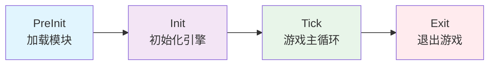
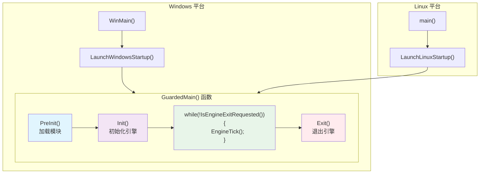
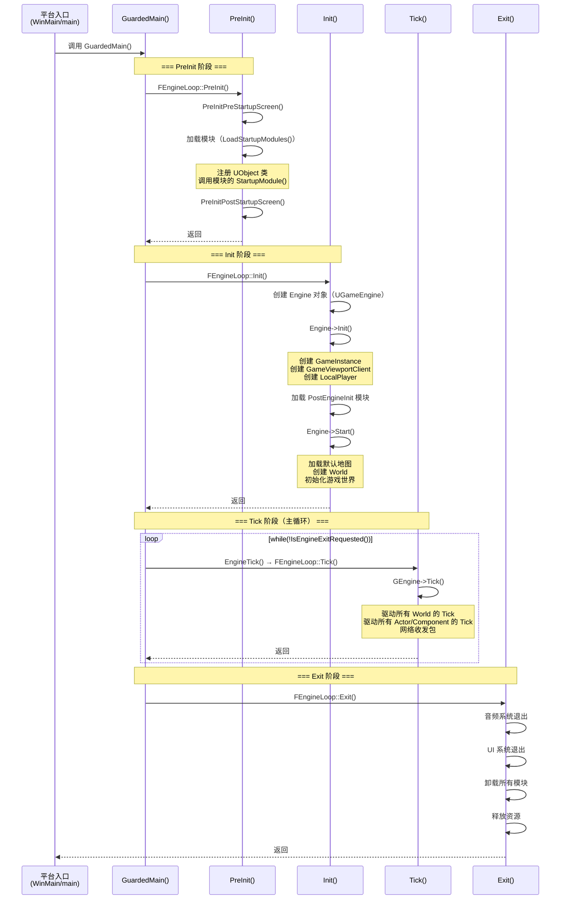
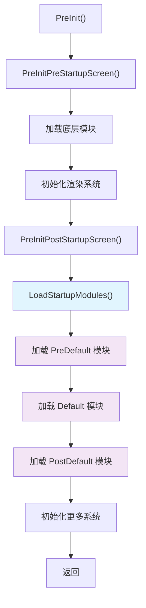
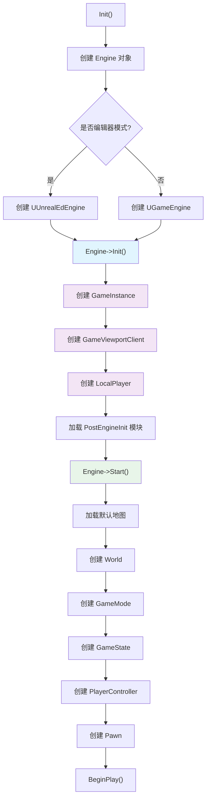
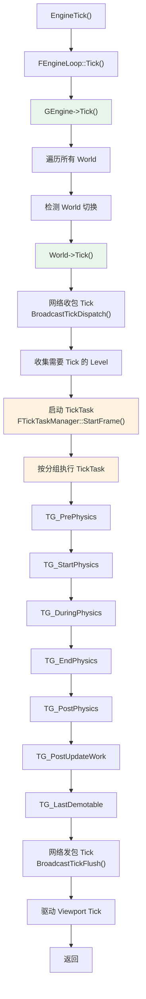
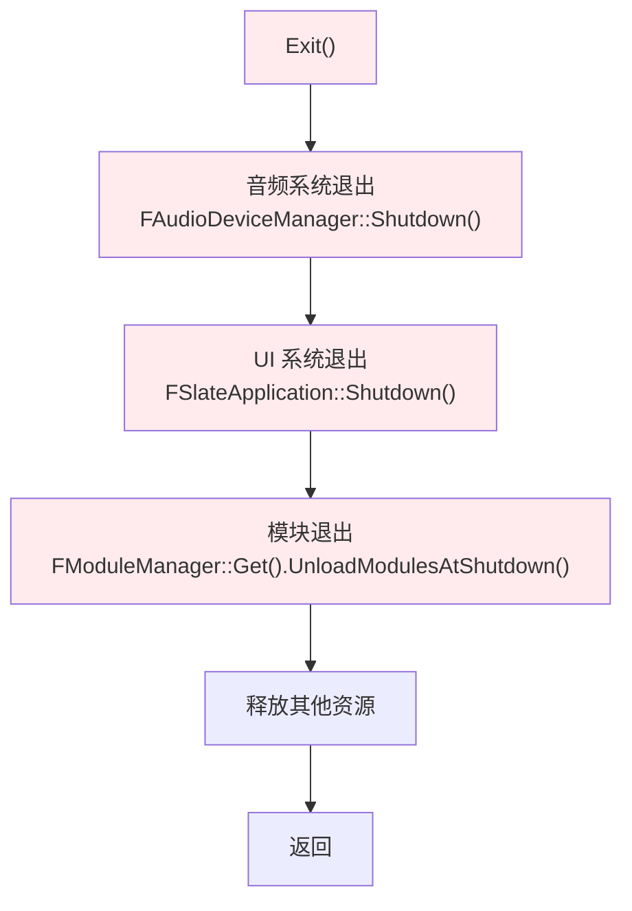
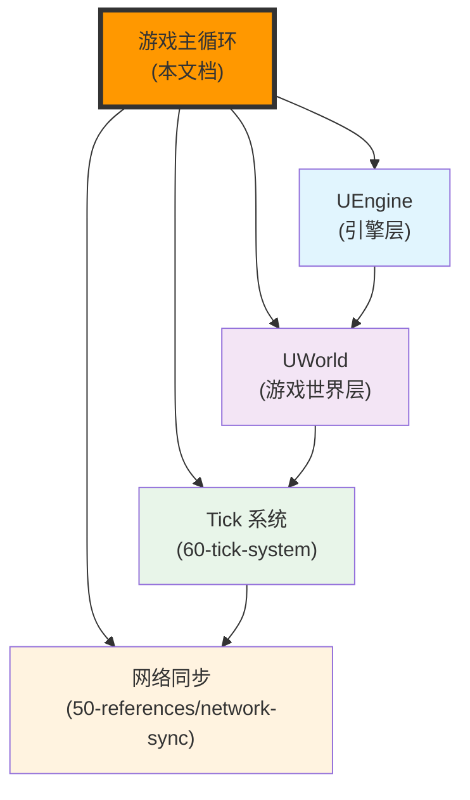

# UE游戏主循环详解

## 概述

> UE 游戏的执行本质是一个大循环，遵循 **初始化（Init）→ 主循环（Loop）→ 退出（Exit）** 的经典模式。本文档详细解析 UE 游戏从启动到退出的完整执行流程，帮助开发者理解引擎的驱动机制。

---

## 核心概念

### 游戏主程序的本质

任何游戏主程序简化后都是 **初始化操作 + While 循环 + 退出操作**：

```cpp
// 伪代码：游戏主程序的本质
void Main()
{
    // 游戏初始化操作
    InitGame();
    
    // 游戏主循环
    while(IsExitGame())
    {
        RunGameLoop();
    }
    
    // 游戏退出操作
    ExitGame();
}
```

UE 的一切源头都在 `GuardedMain` 函数中实现这个模式。

### UE 的三大阶段



| 阶段 | 关键函数 | 主要工作 |
|------|----------|----------|
| **PreInit** | `FEngineLoop::PreInit()` | 加载模块（Module）、注册 UObject 类、初始化低级系统 |
| **Init** | `FEngineLoop::Init()` | 创建 Engine 对象、初始化 GameInstance、创建视口和本地玩家 |
| **Tick** | `FEngineLoop::Tick()` | 驱动游戏主循环、更新所有 World/Actor/Component |
| **Exit** | `FEngineLoop::Exit()` | 销毁 World、卸载模块、释放资源 |

---

## 架构解析

### FEngineLoop 类

`FEngineLoop` 是 UE 游戏循环的全局管理器，负责驱动整个引擎的生命周期。

**关键方法**：

| 方法 | 功能 | 调用时机 |
|------|------|----------|
| `PreInit()` | 预初始化引擎，加载模块 | 游戏启动第 1 步 |
| `Init()` | 初始化引擎，创建 Engine 对象 | PreInit 成功后 |
| `Tick()` | 驱动引擎主循环 | 每帧调用 |
| `Exit()` | 退出引擎，释放资源 | 游戏退出时 |

### 平台启动模块（Launch）

不同平台的启动模块调用 `Launch.cpp` 中的 `GuardedMain` 函数：



**Windows 平台示例**：

```cpp
// Windows 平台的入口函数
int32 WINAPI WinMain(...)
{
    int32 Result = LaunchWindowsStartup(hInInstance, hPrevInstance, pCmdLine, nCmdShow, nullptr);
    LaunchWindowsShutdown();
    return Result;
}

LAUNCH_API int32 LaunchWindowsStartup(...)
{
    // ...
    if (GUELibraryOverrideSettings.bIsEmbedded || bNoExceptionHandler || 
        (FPlatformMisc::IsDebuggerPresent() && !GAlwaysReportCrash))
    {
        ErrorLevel = GuardedMain(CmdLine);
    }
    else
    {
        ErrorLevel = GuardedMainWrapper(CmdLine);  // 带崩溃处理
    }
    // ...
}
```

---

## 执行流程

### 完整执行流程图



### PreInit 阶段详解

**功能**：加载必要的模块（Module），注册 UObject 类，初始化低级系统。

**执行流程**：



**关键代码**：

```cpp
int32 FEngineLoop::PreInit(const TCHAR* CmdLine)
{
    const int32 rv1 = PreInitPreStartupScreen(CmdLine);
    if (rv1 != 0)
    {
        PreInitContext.Cleanup();
        return rv1;
    }
    
    const int32 rv2 = PreInitPostStartupScreen(CmdLine);
    if (rv2 != 0)
    {
        PreInitContext.Cleanup();
        return rv2;
    }
    
    return 0;
}

bool FEngineLoop::LoadStartupModules()
{
    // 加载 PreDefault 阶段的模块
    if (!IProjectManager::Get().LoadModulesForProject(ELoadingPhase::PreDefault) ||
        !IPluginManager::Get().LoadModulesForEnabledPlugins(ELoadingPhase::PreDefault))
    {
        return false;
    }
    
    // 加载 Default 阶段的模块
    if (!IProjectManager::Get().LoadModulesForProject(ELoadingPhase::Default) ||
        !IPluginManager::Get().LoadModulesForEnabledPlugins(ELoadingPhase::Default))
    {
        return false;
    }
    
    // 加载 PostDefault 阶段的模块
    if (!IProjectManager::Get().LoadModulesForProject(ELoadingPhase::PostDefault) ||
        !IPluginManager::Get().LoadModulesForEnabledPlugins(ELoadingPhase::PostDefault))
    {
        return false;
    }
    
    return true;
}
```

**⚠️ 重要说明**：

> 当模块被加载时，发生了什么？
> 1. 引擎会注册在该模块中定义的任何 UObject 类，这使得反射系统知道这些类，并且它还为每个类构造一个 CDO（Class Default Object）
> 2. 引擎会循环分配被标记为 UCLASS 的类的默认实例，然后运行其构造函数，将父类的 CDO 作为模板导入
> 3. 注册完所有类后，引擎会调用模块的 `StartupModule()` 函数，该函数与 `ShutdownModule()` 匹配，让你有机会处理需要与模块生命周期相关联的任何初始化
> 4. 此时 GEngineLoop 已经加载了所有必须的引擎、项目和插件模块

### Init 阶段详解

**功能**：创建 Engine 对象，完成引擎初始化，准备游戏世界。

**执行流程**：



**关键代码**：

```cpp
int32 FEngineLoop::Init()
{
    // 根据配置创建引擎对象
    UClass* EngineClass = nullptr;
    
    if (!GIsEditor)
    {
        // 打包的 App 创建引擎对象（-game、-server 参数启动的独立模式游戏进程）
        FString GameEngineClassName;
        GConfig->GetString(TEXT("/Script/Engine.Engine"), TEXT("GameEngine"), GameEngineClassName, GEngineIni);
        
        EngineClass = StaticLoadClass(UGameEngine::StaticClass(), nullptr, *GameEngineClassName);
        GEngine = NewObject<UEngine>(GetTransientPackage(), EngineClass);
    }
    else
    {
        // 编辑器模式下创建引擎对象
        // ...
    }
    
    // 引擎对象 GEngine 初始化
    {
        SCOPED_BOOT_TIMING("GEngine->Init");
        GEngine->Init(this);
    }
    
    // 加载 PostEngineInit 类型的模块
    if (!IProjectManager::Get().LoadModulesForProject(ELoadingPhase::PostEngineInit) ||
        !IPluginManager::Get().LoadModulesForEnabledPlugins(ELoadingPhase::PostEngineInit))
    {
        RequestEngineExit(TEXT("One or more modules failed PostEngineInit"));
        return 1;
    }
    
    // 启动引擎（加载地图，创建 World）
    {
        SCOPED_BOOT_TIMING("GEngine->Start()");
        GEngine->Start();
    }
    
    return 0;
}
```

### Tick 阶段详解

**功能**：驱动游戏主循环，更新所有 World、Actor、Component。

**执行流程**：



**关键代码**：

```cpp
void FEngineLoop::Tick()
{
    // ...
    
    // 驱动引擎的主程序 Tick（World、Game Objects 等）
    GEngine->Tick(FApp::GetDeltaTime(), bIdleMode);
    
    // ...
}

void UGameEngine::Tick(float DeltaSeconds, bool bIdleMode)
{
    // 保留主 World
    FName OriginalGWorldContext = NAME_None;
    for (int32 i = 0; i < WorldList.Num(); ++i)
    {
        if (WorldList[i].World() == GWorld)
        {
            OriginalGWorldContext = WorldList[i].ContextHandle;
            break;
        }
    }
    
    // 遍历所有 World
    for (int32 WorldIdx = 0; WorldIdx < WorldList.Num(); ++WorldIdx)
    {
        FWorldContext& Context = WorldList[WorldIdx];
        if (Context.World() == nullptr || !Context.World()->ShouldTick())
        {
            continue;
        }
        
        // 驱动 World 心跳之前，先临时修改下 GWorld
        GWorld = Context.World();
        
        {
            // 检测 World 是否需要切换
            TickWorldTravel(Context, DeltaSeconds);
        }
        
        if (!bIdleMode)
        {
            // 驱动 World 心跳
            Context.World()->Tick(LEVELTICK_All, DeltaSeconds);
        }
    }
    
    // 还原下 GWorld 为主 World
    if (OriginalGWorldContext != NAME_None)
    {
        GWorld = GetWorldContextFromHandleChecked(OriginalGWorldContext).World();
    }
    
    // 驱动 viewport Tick
    if (GameViewport != nullptr && !bIdleMode)
    {
        SCOPE_TIME_GUARD(TEXT("UGameEngine::Tick - TickViewport"));
        SCOPE_CYCLE_COUNTER(STAT_GameViewportTick);
        GameViewport->Tick(DeltaSeconds);
    }
}
```

### Exit 阶段详解

**功能**：退出游戏，释放所有资源。

**执行流程**：



**关键代码**：

```cpp
void FEngineLoop::Exit()
{
    // ...
    
    // 音频系统退出
    FAudioDeviceManager::Shutdown();
    
    // UI 系统退出
    FSlateApplication::Shutdown();
    
    // Module 退出
    FModuleManager::Get().UnloadModulesAtShutdown();
    
    // ...
}
```

---

## 与其他模块的关系

游戏主循环作为 UE 框架的核心驱动机制，与以下系统紧密相关：



**关系说明**：

| 相关模块 | 关系 | 说明 |
|----------|------|------|
| **UEngine** | 被主循环驱动 | `GEngine->Tick()` 在主循环中调用 |
| **UWorld** | 被 Engine 驱动 | `World->Tick()` 在 Engine Tick 中调用 |
| **Tick 系统** | 被 World 驱动 | `FTickTaskManager` 在 World Tick 中调度 |
| **网络同步** | 在 Tick 中处理 | 网络收发包在 World Tick 中处理 |

---

## 常见陷阱与最佳实践

### ⚠️ 常见陷阱

1. **在 PreInit 阶段访问 GameInstance**
   - ❌ 错误：在 `PreInit()` 中尝试访问 `GameInstance`
   - ✅ 正确：`GameInstance` 在 `Engine::Init()` 中创建，只能在之后访问

2. **在 Init 阶段访问 World**
   - ❌ 错误：在 `Init()` 中尝试访问 `World`
   - ✅ 正确：`World` 在 `Engine::Start()` 中创建，只能在之后访问

3. **阻塞主循环**
   - ❌ 错误：在 `Tick()` 中执行耗时操作
   - ✅ 正确：将耗时操作放到后台线程，避免阻塞主循环

### ✅ 最佳实践

1. **模块加载时机**
   - 需要在 PreInit 阶段加载的模块 → 设置为 `PreDefault` 或 `Default` 阶段
   - 需要在 Engine 初始化后加载的模块 → 设置为 `PostEngineInit` 阶段

2. **游戏初始化流程**
   - 在 `GameInstance::Init()` 中初始化游戏实例级别的系统
   - 在 `GameMode::InitGame()` 中初始化游戏级别的系统
   - 在 `Actor::BeginPlay()` 中初始化 Actor 级别的系统

3. **性能优化**
   - 使用 `Tick()` 时，尽量减少不必要的计算
   - 使用 `TickFunction` 的 `TickInterval` 属性降低 Tick 频率
   - 使用 `TickFunction` 的 `bStartWithTickEnabled` 属性控制是否启用 Tick

---

## 参考资料

### UE 官方文档
- [UE5 官方文档](https://docs.unrealengine.com/5.0/zh-CN/)
- [Lyra 示例项目说明](https://docs.unrealengine.com/5.0/zh-CN/lyra-sample-game-in-unreal-engine/)

### 内部文档
- [[30-tutorials/ue-framework/00-UE框架概述|UE 框架概述]]
- [[30-tutorials/ue-framework/10-engine-layer/00-UE引擎层详解|引擎层详解]]
- [[30-tutorials/ue-framework/60-tick-system/00-Tick系统架构概述|Tick 系统概述]]

### 原文档
- 

---

**文档版本**：v1.0  
**最后更新**：2026-05-16  
**维护者**：AI Agent（按项目规范维护）

<!-- nav:auto -->

---

**导航**: ← [[30-tutorials/ue-framework/00-UE框架概述|00-UE框架概述]] · [[30-tutorials/ue-framework/10-engine-layer/00-UE引擎层详解|00-UE引擎层详解]] →

<!-- /nav:auto -->
