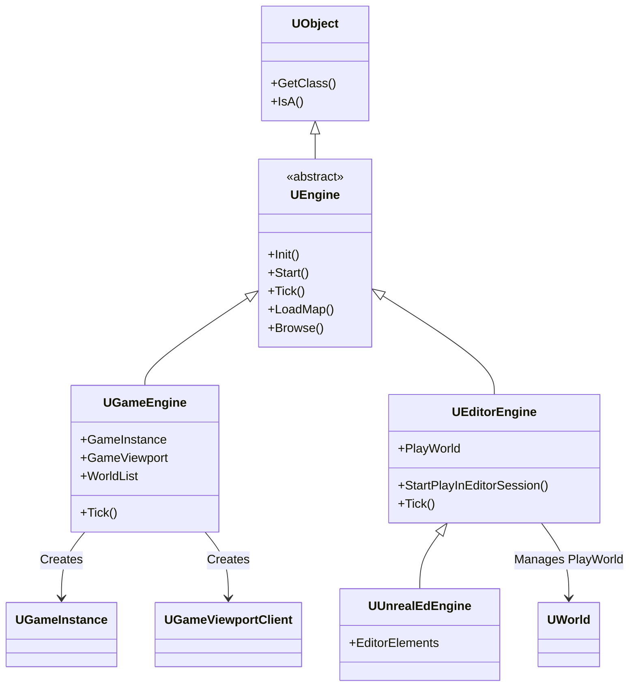
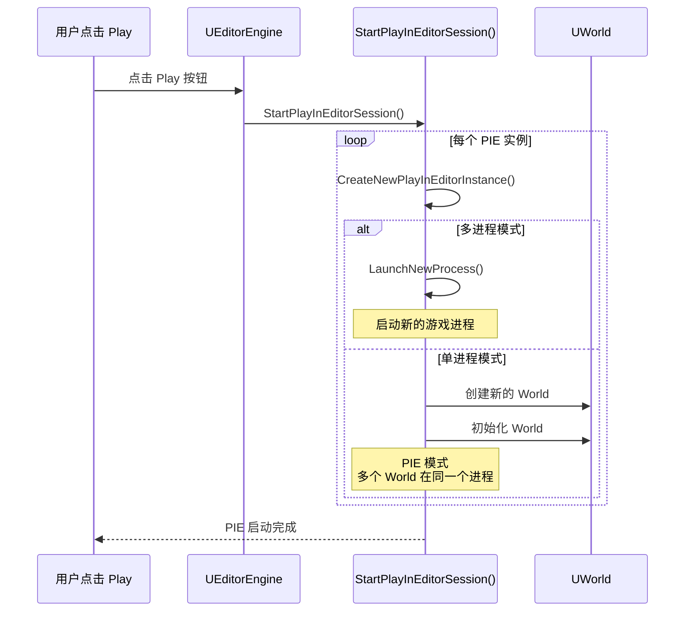
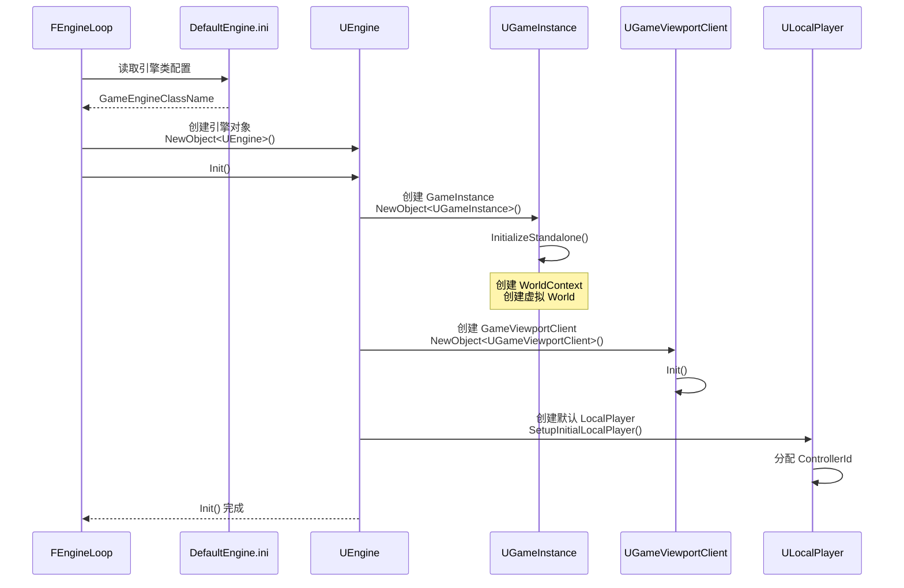
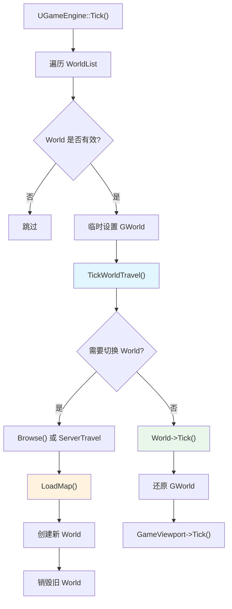
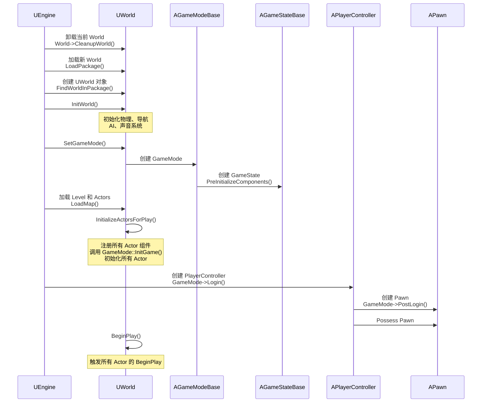
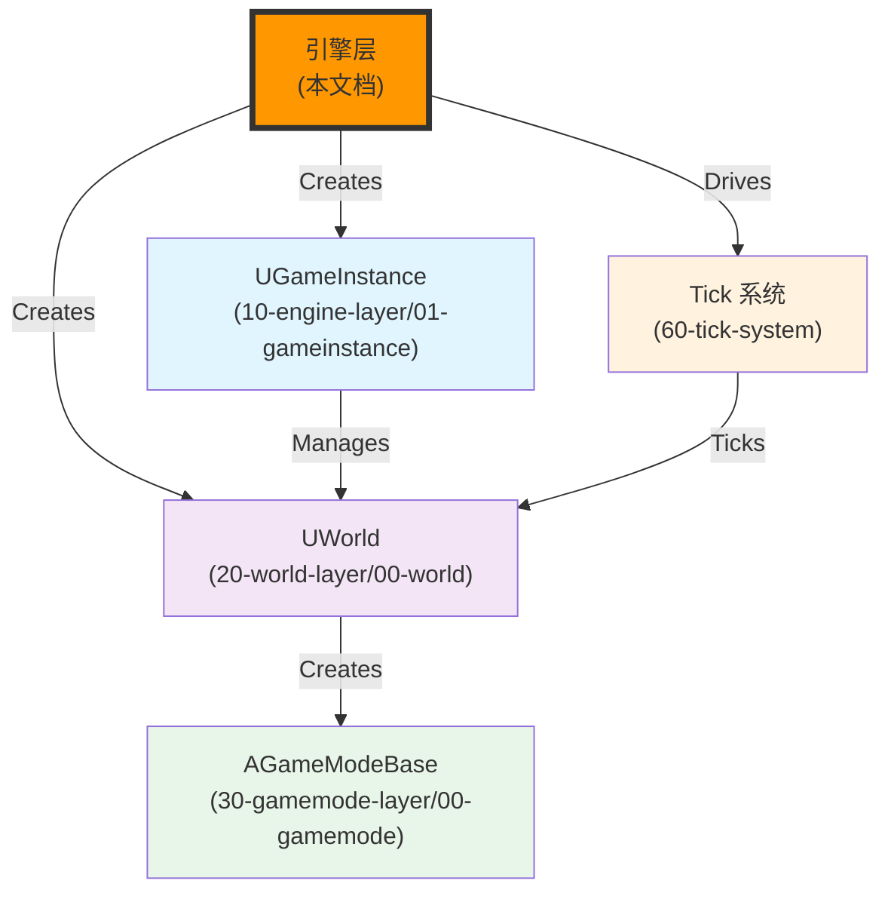

# UE引擎层详解

## 概述

> `UEngine` 是 Unreal Engine 中所有引擎类的抽象基类，负责初始化、管理和驱动游戏世界。`UGameEngine` 和 `UEditorEngine` 分别处理游戏模式和编辑器模式。本文档详细解析 UE 引擎层的架构、关键方法和执行流程。

---

## 核心概念

### UEngine 类继承关系



### 引擎类型对比

| 类名 | 使用场景 | 创建时机 |
|------|----------|----------|
| **UGameEngine** | 打包后的游戏进程，或通过 `-game` 或 `-server` 参数启动的独立游戏模式 | `FEngineLoop::Init()` 中根据配置创建 |
| **UUnrealEdEngine** | 编辑器模式（打开 UE 编辑器） | 编辑器启动时创建 |
| **UEditorEngine** | 执行 Commandlet 时（启动时加 `-run=CommandletName`） | `FEngineLoop::PreInit()` 中创建（精简版引擎） |

**⚠️ 注意**：
- 编辑器模式下加 `-game` 参数启动时，创建的是 `UGameEngine` 对象（`GIsEditor` 为 `false`）
- 执行 Commandlet 时，在 `PreInit` 阶段就创建引擎对象并退出，不需要后续的 `Init` 和 `Tick` 阶段

### 引擎配置

引擎类通过 `DefaultEngine.ini` 配置文件指定：

```ini
[/Script/Engine.Engine]
; 游戏模式使用的引擎类
GameEngine=/Script/Engine.GameEngine

; 编辑器模式使用的引擎类
UnrealEdEngine=/Script/UnrealEd.UnrealEdEngine

; 执行 Commandlet 时使用的引擎类（通常和 UnrealEdEngine 相同）
EditorEngine=/Script/UnrealEd.UnrealEdEngine
```

---

## 架构解析

### UEngine 基类

**核心职责**：
- 定义引擎的通用接口（Init、Start、Tick、LoadMap 等）
- 管理默认的引擎类（字体、视口、玩家等）
- 提供引擎级别的配置管理

**关键属性**：

```cpp
UCLASS(abstract, config=Engine, meta=(ShortTooltip="Base class of the engine."))
class ENGINE_API UEngine : public UObject, public FExec
{
    // 视口客户端类
    UPROPERTY(config, EditAnywhere, BlueprintReadOnly, Category=Classes, NoClear, meta=(MetaClass="GameViewportClient"))
    FSoftClassPath GameViewportClientClass;
    
    // 本地玩家类
    UPROPERTY(config, EditAnywhere, BlueprintReadOnly, Category=Classes, NoClear, meta=(MetaClass="LocalPlayer"))
    FSoftClassPath LocalPlayerClass;
    
    // 控制台类
    UPROPERTY(config, EditAnywhere, BlueprintReadOnly, Category=Classes, NoClear, meta=(MetaClass="Console"))
    FSoftClassPath ConsoleClass;
    
    // 默认字体
    UPROPERTY()
    TObjectPtr<UFont> TinyFont;
    
    UPROPERTY()
    TObjectPtr<UFont> SmallFont;
    
    UPROPERTY()
    TObjectPtr<UFont> MediumFont;
    
    UPROPERTY()
    TObjectPtr<UFont> LargeFont;
};
```

**关键方法**：

| 方法 | 功能 | 调用时机 |
|------|------|----------|
| `Init()` | 初始化引擎 | `FEngineLoop::Init()` 中调用 |
| `Start()` | 启动引擎，加载地图 | `FEngineLoop::Init()` 末尾调用 |
| `Tick()` | 驱动引擎主循环 | `FEngineLoop::Tick()` 中调用 |
| `LoadMap()` | 加载地图，创建 World | `Start()` 或地图切换时调用 |
| `Browse()` | 根据 URL 加载地图或连接服务器 | `LoadMap()` 或网络切换时调用 |
| `TickWorldTravel()` | 检测是否需要切换 World | `UGameEngine::Tick()` 中调用 |
| `Exec()` | 处理控制台命令 | 控制台输入时调用 |

### UGameEngine 类

**核心职责**：
- 管理 GameInstance 的创建和初始化
- 管理 GameViewportClient 的创建和渲染
- 管理 LocalPlayer 的创建和输入路由
- 管理 World 列表和 World 切换
- 驱动 World 的 Tick

**关键属性**：

```cpp
UCLASS(transient, config=Engine)
class ENGINE_API UGameEngine : public UEngine
{
    // 游戏实例
    UPROPERTY()
    TObjectPtr<UGameInstance> GameInstance;
    
    // 游戏视口
    UPROPERTY()
    TObjectPtr<UGameViewportClient> GameViewport;
    
    // World 列表（WorldContext 数组）
    UPROPERTY()
    TArray<FWorldContext> WorldList;
};
```

**关键方法**：

```cpp
// 初始化引擎
void UGameEngine::Init(IEngineLoop* InEngineLoop)
{
    // 创建 GameInstance
    {
        FSoftClassPath GameInstanceClassName = GetDefault<UGameMapsSettings>()->GameInstanceClass;
        UClass* GameInstanceClass = LoadObject<UClass>(nullptr, *GameInstanceClassName.ToString());
        if (GameInstanceClass == nullptr)
        {
            GameInstanceClass = UGameInstance::StaticClass();
        }
        
        GameInstance = NewObject<UGameInstance>(this, GameInstanceClass);
        GameInstance->InitializeStandalone();
    }
    
    // 创建 GameViewportClient
    if (GIsClient)
    {
        UGameViewportClient* ViewportClient = NewObject<UGameViewportClient>(this, GameViewportClientClass);
        ViewportClient->Init(*GameInstance->GetWorldContext(), GameInstance);
        GameViewport = ViewportClient;
        GameInstance->GetWorldContext()->GameViewport = ViewportClient;
    }
    
    // 创建默认 LocalPlayer
    if (ViewportClient->SetupInitialLocalPlayer(Error) == nullptr)
    {
        UE_LOG(LogEngine, Fatal, TEXT("%s"), *Error);
    }
}

// 启动引擎
void UGameEngine::Start()
{
    // 加载默认地图
    const FString& DefaultMap = GetDefault<UGameMapsSettings>()->GetGameDefaultMap();
    FURL URL(nullptr, *DefaultMap, TRAVEL_Absolute);
    
    BrowseRet = GEngine->Browse(*WorldContext, URL, Error);
}

// 引擎 Tick
void UGameEngine::Tick(float DeltaSeconds, bool bIdleMode)
{
    // 保留主 World
    FName OriginalGWorldContext = NAME_None;
    for (int32 i = 0; i < WorldList.Num(); ++i)
    {
        if (WorldList[i].World() == GWorld)
        {
            OriginalGWorldContext = WorldList[i].ContextHandle;
            break;
        }
    }
    
    // 遍历所有 World
    for (int32 WorldIdx = 0; WorldIdx < WorldList.Num(); ++WorldIdx)
    {
        FWorldContext& Context = WorldList[WorldIdx];
        if (Context.World() == nullptr || !Context.World()->ShouldTick())
        {
            continue;
        }
        
        // 临时修改 GWorld，方便 Tick 的逻辑使用
        GWorld = Context.World();
        
        {
            // 检测 World 是否需要切换
            TickWorldTravel(Context, DeltaSeconds);
        }
        
        if (!bIdleMode)
        {
            // 驱动 World 心跳
            Context.World()->Tick(LEVELTICK_All, DeltaSeconds);
        }
    }
    
    // 还原 GWorld 为主 World
    if (OriginalGWorldContext != NAME_None)
    {
        GWorld = GetWorldContextFromHandleChecked(OriginalGWorldContext).World();
    }
    
    // 驱动 viewport Tick
    if (GameViewport != nullptr && !bIdleMode)
    {
        SCOPE_TIME_GUARD(TEXT("UGameEngine::Tick - TickViewport"));
        SCOPE_CYCLE_COUNTER(STAT_GameViewportTick);
        GameViewport->Tick(DeltaSeconds);
    }
}
```

### UEditorEngine 类（简要说明）

**核心职责**：
- 管理编辑器世界的创建和销毁
- 管理 PIE（Play In Editor）模式的启动和停止
- 管理编辑器 UI 和菜单
- 管理资源编辑和保存

**PIE 模式启动流程**：



**⚠️ 注意**：
- 编辑器模式下，单进程启动 DS 和多个客户端就是**多个 World**
- PIE 模式（包括同一进程的多个 PIE）、Editor 本身、各种资源预览窗口（比如动画资产预览）是**同一个 Engine 下的不同 World**（平行宇宙）

---

## 执行流程

### Engine 初始化流程



### World 管理流程



### 地图加载流程（LoadMap）



---

## 与其他模块的关系

引擎层作为 UE 框架的核心，与以下系统紧密相关：



**关系说明**：

| 相关模块 | 关系 | 说明 |
|----------|------|------|
| **UGameInstance** | 被引擎创建 | `UGameEngine::Init()` 中创建 `GameInstance` |
| **UWorld** | 被引擎创建 | `UGameEngine::Start()` 或 `LoadMap()` 中创建 `World` |
| **AGameModeBase** | 被 World 创建 | `UWorld::SetGameMode()` 中创建 `GameMode` |
| **Tick 系统** | 被引擎驱动 | `UGameEngine::Tick()` 中驱动 `World->Tick()` |

---

## 常见陷阱与最佳实践

### ⚠️ 常见陷阱

1. **在正确的时机访问 GameInstance**
   - ❌ 错误：在 `FEngineLoop::PreInit()` 中尝试访问 `GameInstance`
   - ✅ 正确：`GameInstance` 在 `UGameEngine::Init()` 中创建，只能在之后访问

2. **在正确的时机访问 World**
   - ❌ 错误：在 `UGameEngine::Init()` 中尝试访问 `World`
   - ✅ 正确：`World` 在 `UGameEngine::Start()` 或 `LoadMap()` 中创建，只能在之后访问

3. **理解 PIE 模式的 World 管理**
   - ❌ 错误：认为 PIE 模式只有一个 World
   - ✅ 正确：PIE 模式可以有多个 World（DS + 多个客户端），它们在同一个进程中被管理

### ✅ 最佳实践

1. **自定义引擎类**
   - 如果需要扩展引擎功能，创建自定义引擎类继承自 `UGameEngine` 或 `UUnrealEdEngine`
   - 在 `DefaultEngine.ini` 中配置自定义引擎类

2. **World 切换处理**
   - 在 `TickWorldTravel()` 中处理 World 切换逻辑
   - 使用 `Browse()` 或 `ServerTravel()` 进行 World 切换
   - 处理网络同步时的 World 切换（客户端和服务器）

3. **多 World 管理**
   - 游戏进程一般只能运行一个**主 World**
   - 可以运行多个预览 World（GamePreview/EditorPreview）
   - 编辑器模式下单进程启动 DS 和多个客户端是**多个主 World**

---

## 参考资料

### UE 官方文档
- [UE5 官方文档](https://docs.unrealengine.com/5.0/zh-CN/)
- [Lyra 示例项目说明](https://docs.unrealengine.com/5.0/zh-CN/lyra-sample-game-in-unreal-engine/)

### 内部文档
- [[30-tutorials/ue-framework/00-UE框架概述|UE 框架概述]]
- [[30-tutorials/ue-framework/01-UE游戏主循环详解|游戏主循环详解]]
- [[30-tutorials/ue-framework/10-engine-layer/01-UGameInstance详解|GameInstance 详解]]

### 原文档
- 

---

**文档版本**：v1.0  
**最后更新**：2026-05-16  
**维护者**：AI Agent（按项目规范维护）

<!-- nav:auto -->

---

**导航**: ← [[30-tutorials/ue-framework/01-UE游戏主循环详解|01-UE游戏主循环详解]] · [[30-tutorials/ue-framework/10-engine-layer/01-UGameInstance详解|01-UGameInstance详解]] →

<!-- /nav:auto -->
