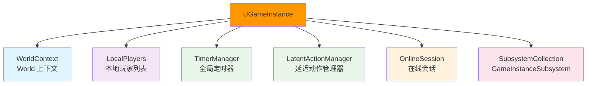
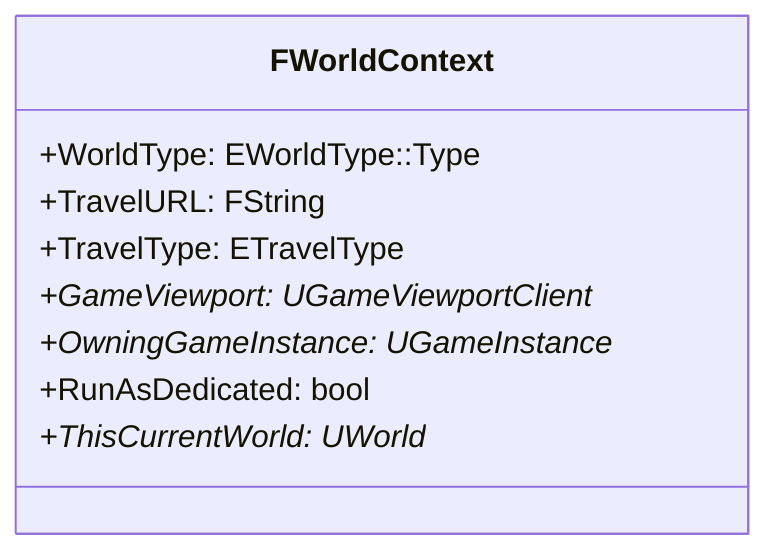
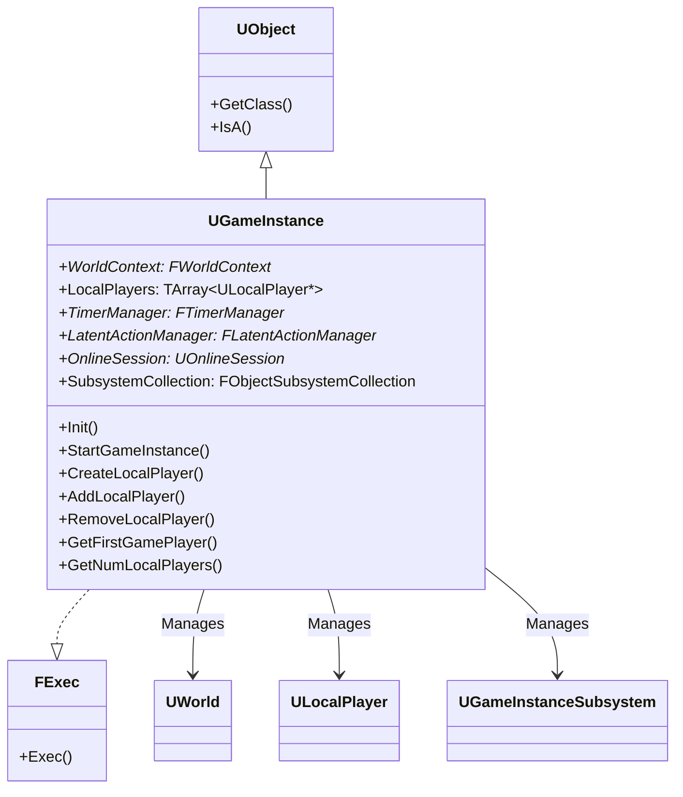
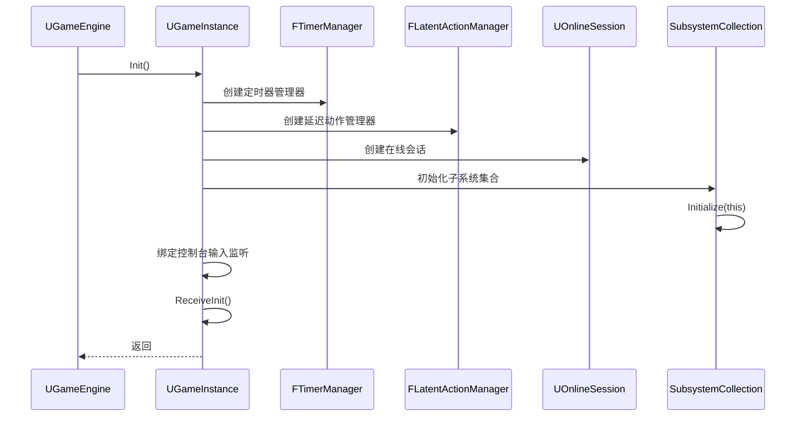
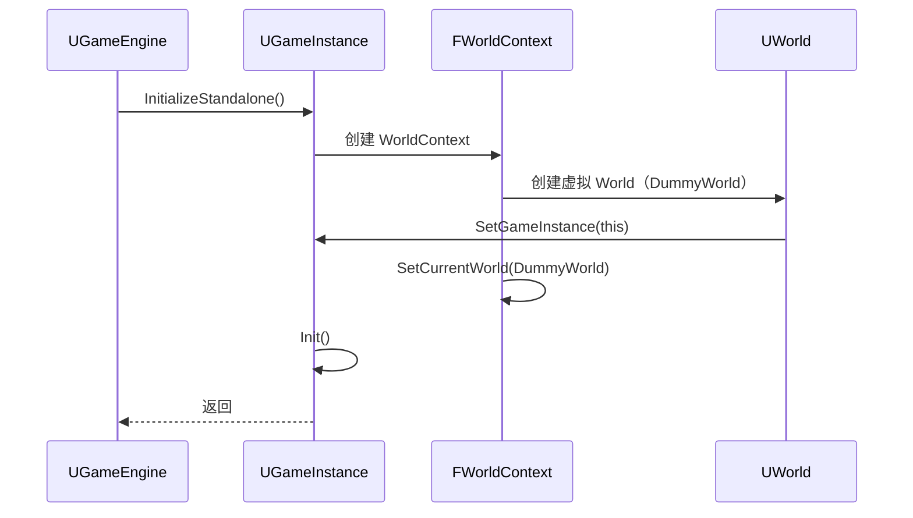
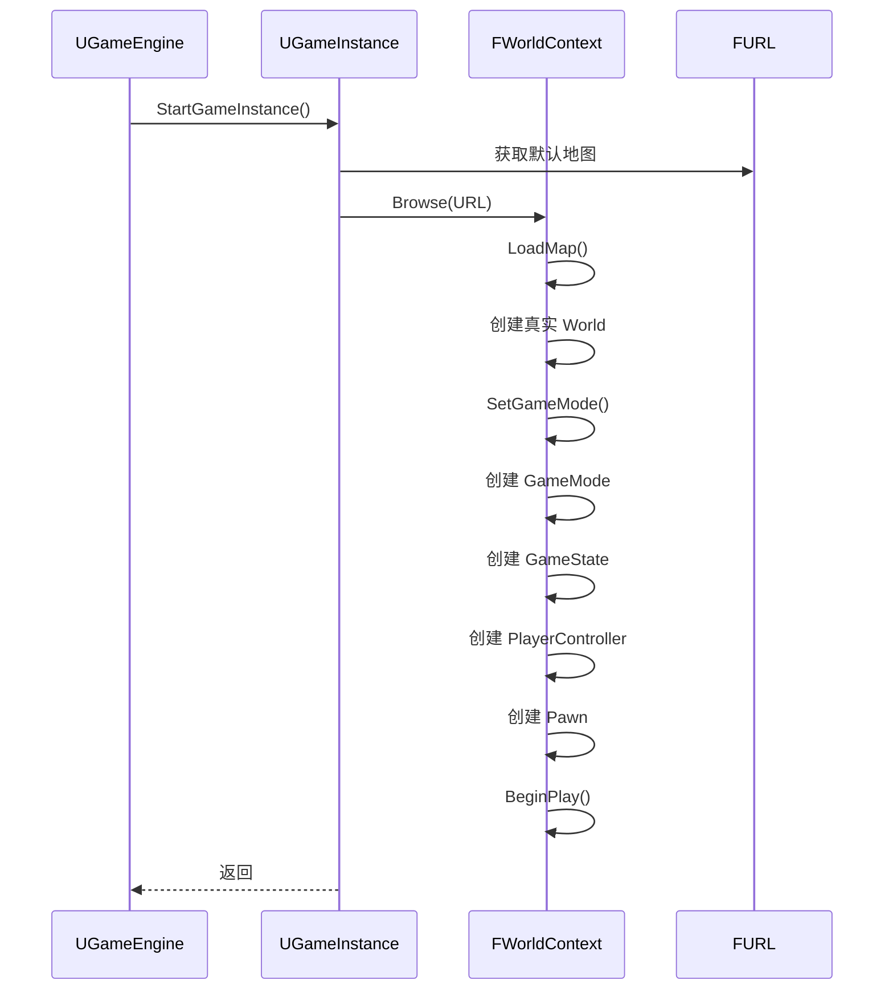
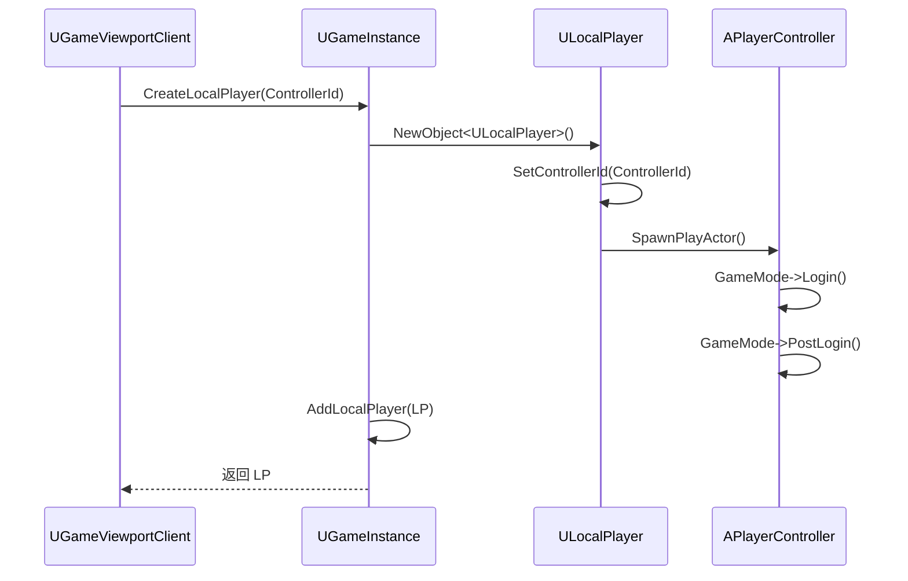
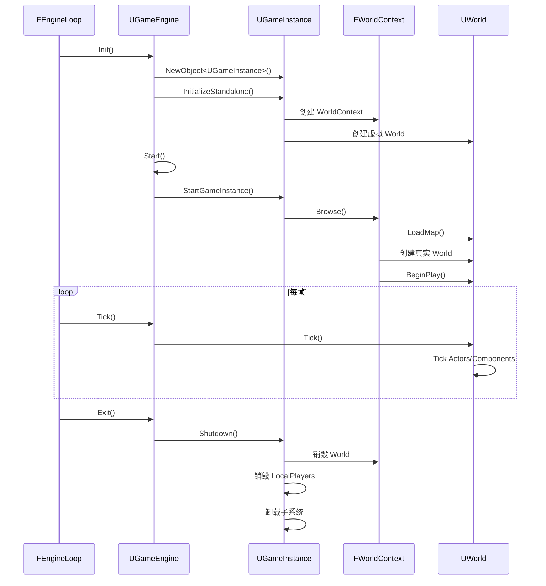
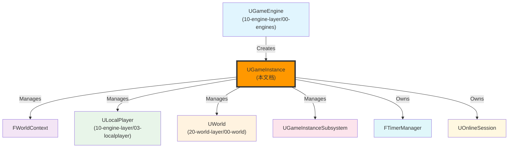

# UGameInstance详解

## 概述

> `UGameInstance` 是 UE 5.7 中用于处理一些原本由 Engine 对象处理的、更特定于游戏玩法层面的功能的类。`UGameInstance` 是在游戏创建时生成的全局唯一对象实例，直到游戏实例关闭才被销毁，作为游戏主程序生命周期内跨 Level、跨 World 的全局数据管理。

---

## 核心概念

### GameInstance 的职责

`UGameInstance` 是游戏玩法层面（Gameplay）的总控，负责管理：



**核心职责**：
1. **World 管理**：通过 `WorldContext` 管理当前 World 和 World 切换信息
2. **玩家管理**：管理 `LocalPlayer` 列表（支持分屏游戏）
3. **子系统管理**：管理 `UGameInstanceSubsystem` 的初始化和生命周期
4. **定时器管理**：提供全局 `FTimerManager`
5. **在线会话管理**：管理 `UOnlineSession`（网络联机）

### WorldContext 结构

`FWorldContext` 保存当前主 World 信息及 World 切换的信息：



**关键字段说明**：

| 字段 | 类型 | 说明 |
|------|------|------|
| `WorldType` | `EWorldType::Type` | World 的类型（Game/Editor/PIE/EditorPreview/GamePreview） |
| `TravelURL` | `FString` | 客户端即将传送的地图链接 |
| `TravelType` | `ETravelType` | 客户端即将传送的地图链接类型（`TRAVEL_Absolute`/`TRAVEL_Relative`） |
| `GameViewport` | `UGameViewportClient*` | 当前游戏视口 |
| `OwningGameInstance` | `UGameInstance*` | 所属的 GameInstance |
| `RunAsDedicated` | `bool` | 是否是 DS（专用服务器） |
| `ThisCurrentWorld` | `UWorld*` | 当前的 World |

---

## 架构解析

### UGameInstance 类继承关系



### 关键方法详解

#### Init() - 初始化 GameInstance

**功能**：初始化 GameInstance，在 `UGameEngine::Init()` 中调用。

**执行流程**：



**关键代码**：

```cpp
void UGameInstance::Init()
{
    // 初始化定时器管理器
    TimerManager = MakeShareable(new FTimerManager());
    
    // 初始化延迟动作管理器
    LatentActionManager = MakeShareable(new FLatentActionManager());
    
    // 初始化 OnlineSession
    // ...
    
    // 初始化 SubsystemCollection
    SubsystemCollection.Initialize(this);
    
    // 绑定控制台输入监听（非 DS）
    if (!IsDedicatedServerInstance())
    {
        TSharedPtr<GenericApplication> App = FSlateApplication::Get().GetPlatformApplication();
        if (App.IsValid())
        {
            App->RegisterConsoleCommandListener(GenericApplication::FOnConsoleCommandListener::CreateUObject(this, &ThisClass::OnConsoleInput));
        }
    }
    
    // 触发 Blueprint 事件
    ReceiveInit();
}
```

#### InitializeStandalone() - 初始化独立运行的 GameInstance

**功能**：初始化独立运行的 GameInstance，创建 WorldContext 和虚拟 World。

**执行流程**：



**关键代码**：

```cpp
void UGameInstance::InitializeStandalone(const FName InPackageName, UPackage* InWorldPackage)
{
    // 创建 WorldContext
    WorldContext = &GetEngine()->CreateNewWorldContext(EWorldType::Game);
    WorldContext->OwningGameInstance = this;
    
    // 创建一个虚拟的 World（DummyWorld）
    // 以避免在通过 UEngine::LoadMap 加载真实 World 之前没有世界的问题
    UWorld* DummyWorld = UWorld::CreateWorld(EWorldType::Game, false, InPackageName, InWorldPackage);
    DummyWorld->SetGameInstance(this);
    WorldContext->SetCurrentWorld(DummyWorld);
    
    // 初始化
    Init();
}
```

#### StartGameInstance() - 启动游戏实例

**功能**：启动游戏实例，加载默认地图，触发 World 创建。

**执行流程**：



**关键代码**：

```cpp
void UGameInstance::StartGameInstance()
{
    // 获取默认地图
    const FString& DefaultMap = GetDefault<UGameMapsSettings>()->GetGameDefaultMap();
    FURL URL(nullptr, *DefaultMap, TRAVEL_Absolute);
    
    // 加载地图（创建 World）
    FString Error;
    EBrowseReturnVal::Type BrowseRet = GetEngine()->Browse(*WorldContext, URL, Error);
    
    if (BrowseRet != EBrowseReturnVal::Success)
    {
        UE_LOG(LogEngine, Fatal, TEXT("Failed to enter %s: %s"), *DefaultMap, *Error);
    }
}
```

#### CreateLocalPlayer() - 创建本地玩家

**功能**：创建本地玩家（LocalPlayer），在 `UGameViewportClient::SetupInitialLocalPlayer()` 中调用。

**执行流程**：



**关键代码**：

```cpp
ULocalPlayer* UGameInstance::CreateLocalPlayer(int32 ControllerId)
{
    // 创建 LocalPlayer
    ULocalPlayer* NewPlayer = NewObject<ULocalPlayer>(GetEngine(), LocalPlayerClass);
    NewPlayer->SetControllerId(ControllerId);
    
    // 生成玩家 Actor（调用 GameMode->Login() 和 PostLogin()）
    FString Error;
    if (!NewPlayer->SpawnPlayActor(URL, Error, GetWorld()))
    {
        UE_LOG(LogEngine, Error, TEXT("Failed to spawn player: %s"), *Error);
        return nullptr;
    }
    
    // 添加到 LocalPlayers 列表
    AddLocalPlayer(NewPlayer, FPlatformUserId());
    
    return NewPlayer;
}
```

---

## 执行流程

### GameInstance 完整生命周期

```mermaid
stateDiagram-v2
    [*] --> Created: UGameEngine::Init()
    Created --> Initialized: GameInstance::Init()
    Initialized --> WorldCreated: GameInstance::StartGameInstance()
    WorldCreated --> WorldRunning: World::BeginPlay()
    WorldRunning --> WorldSwitching: TickWorldTravel()
    WorldSwitching --> WorldRunning: LoadMap()
    WorldRunning --> ShuttingDown: RequestEngineExit()
    ShuttingDown --> [*]: GameInstance::Shutdown()
    
    note right of Created
        - 创建 WorldContext
        - 创建虚拟 World
    end note
    
    note right of Initialized
        - 初始化 TimerManager
        - 初始化 LatentActionManager
        - 初始化 OnlineSession
        - 初始化 SubsystemCollection
        - 绑定控制台输入监听
    end note
    
    note right of WorldCreated
        - 加载默认地图
        - 创建真实 World
        - 创建 GameMode
        - 创建 GameState
        - 创建 PlayerController
        - 创建 Pawn
    end note
    
    note right of WorldRunning
        - Tick 驱动
        - 处理输入
        - 更新定时器
        - 处理延迟动作
    end note
    
    note right of WorldSwitching
        - 检测 World 切换
        - 卸载旧 World
        - 加载新 World
    end note
    
    note right of ShuttingDown
        - 销毁 World
        - 销毁 LocalPlayers
        - 卸载子系统
        - 释放资源
    end note
```

### GameInstance 与 Engine 的交互



---

## 与其他模块的关系

`UGameInstance` 作为游戏玩法层面的总控，与以下系统紧密相关：



**关系说明**：

| 相关模块 | 关系 | 说明 |
|----------|------|------|
| **UGameEngine** | 创建 GameInstance | `UGameEngine::Init()` 中创建 `GameInstance` |
| **FWorldContext** | 被 GameInstance 管理 | `GameInstance` 通过 `WorldContext` 管理当前 World 和 World 切换信息 |
| **ULocalPlayer** | 被 GameInstance 管理 | `GameInstance` 管理 `LocalPlayer` 列表（支持分屏游戏） |
| **UWorld** | 被 GameInstance 管理 | `GameInstance` 通过 `WorldContext` 管理 World |
| **UGameInstanceSubsystem** | 被 GameInstance 管理 | `GameInstance` 管理 `GameInstanceSubsystem` 的初始化和生命周期 |
| **FTimerManager** | 被 GameInstance 拥有 | `GameInstance` 提供全局定时器 |
| **UOnlineSession** | 被 GameInstance 拥有 | `GameInstance` 管理在线会话（网络联机） |

---

## 常见陷阱与最佳实践

### ⚠️ 常见陷阱

1. **在错误的时机访问 GameInstance**
   - ❌ 错误：在 `FEngineLoop::PreInit()` 中尝试访问 `GameInstance`
   - ✅ 正确：`GameInstance` 在 `UGameEngine::Init()` 中创建，只能在之后访问

2. **在错误的时机访问 World**
   - ❌ 错误：在 `GameInstance::Init()` 中尝试访问 `World`
   - ✅ 正确：`World` 在 `GameInstance::StartGameInstance()` 中创建，只能在之后访问

3. **不理解 GameInstance 的生命周期**
   - ❌ 错误：认为 `GameInstance` 会在 World 切换时销毁
   - ✅ 正确：`GameInstance` 是全局唯一的，直到游戏实例关闭才被销毁

### ✅ 最佳实践

1. **使用 GameInstance 管理全局数据**
   - 需要在多个 Level/World 之间共享的数据 → 放在 `GameInstance` 中
   - 需要在游戏整个生命周期内存在的数据 → 放在 `GameInstance` 中

2. **使用 GameInstanceSubsystem 管理子系统**
   - 需要全局管理的子系统 → 继承自 `UGameInstanceSubsystem`
   - 在 `GameInstance::Init()` 中自动初始化

3. **使用 TimerManager 管理定时器**
   - 需要全局定时器 → 使用 `GameInstance->GetTimerManager()`
   - 避免在 Actor 中管理全局定时器

4. **理解分屏游戏的多玩家管理**
   - 分屏游戏有多个 `LocalPlayer` → 使用 `GameInstance->GetLocalPlayers()` 获取
   - 每个 `LocalPlayer` 有独立的 `PlayerController`、`Camera`、`HUD`

---

## 参考资料

### UE 官方文档
- [UE5 官方文档](https://docs.unrealengine.com/5.0/zh-CN/)
- [GameInstance 官方文档](https://docs.unrealengine.com/5.0/zh-CN/gameinstance-in-unreal-engine/)

### 内部文档
- [[30-tutorials/ue-framework/00-UE框架概述|UE 框架概述]]
- [[30-tutorials/ue-framework/01-UE游戏主循环详解|游戏主循环详解]]
- [[30-tutorials/ue-framework/10-engine-layer/00-UE引擎层详解|引擎层详解]]

### 原文档
- 

---

**文档版本**：v1.0  
**最后更新**：2026-05-16  
**维护者**：AI Agent（按项目规范维护）

<!-- nav:auto -->

---

**导航**: ← [[30-tutorials/ue-framework/10-engine-layer/00-UE引擎层详解|00-UE引擎层详解]] · [[30-tutorials/ue-framework/20-world-layer/00-UWorld详解|00-UWorld详解]] →

<!-- /nav:auto -->
