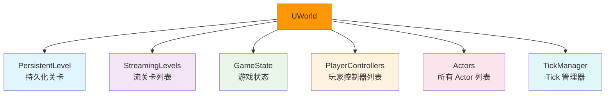
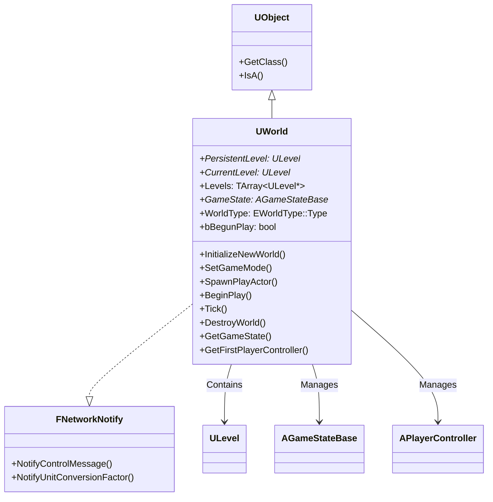
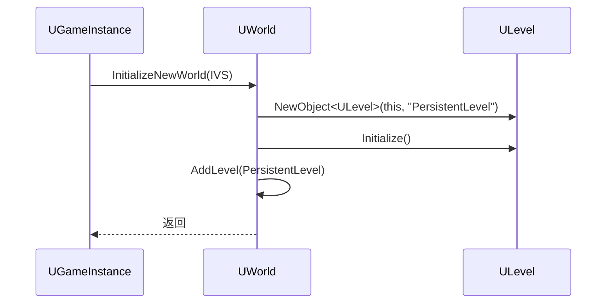
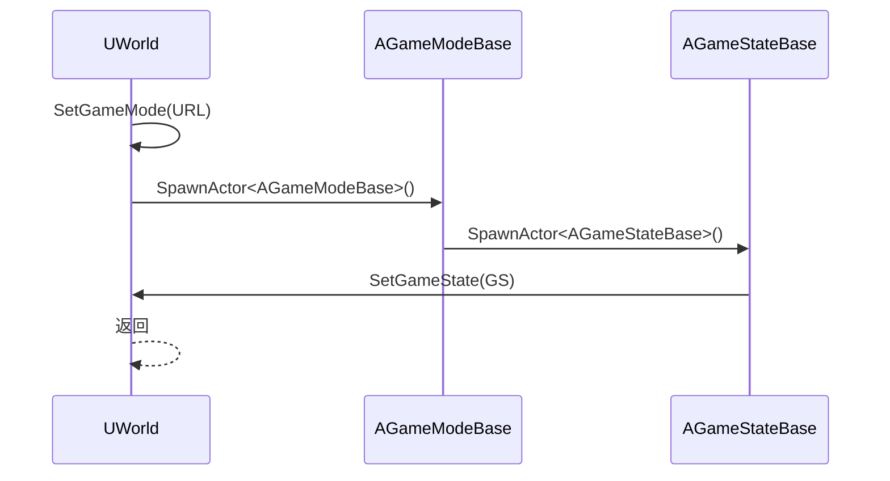
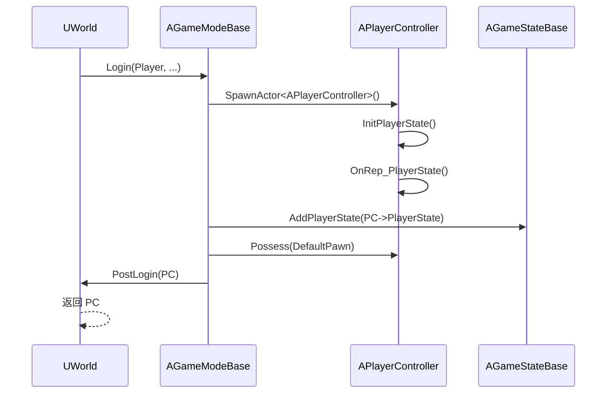
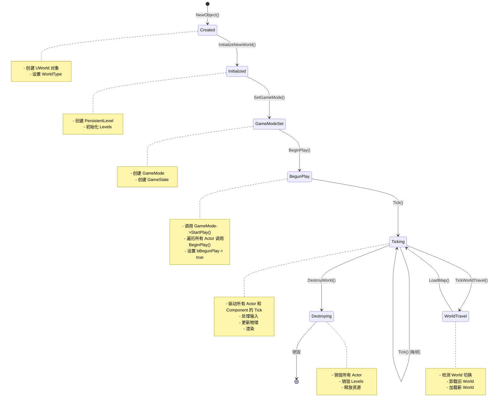
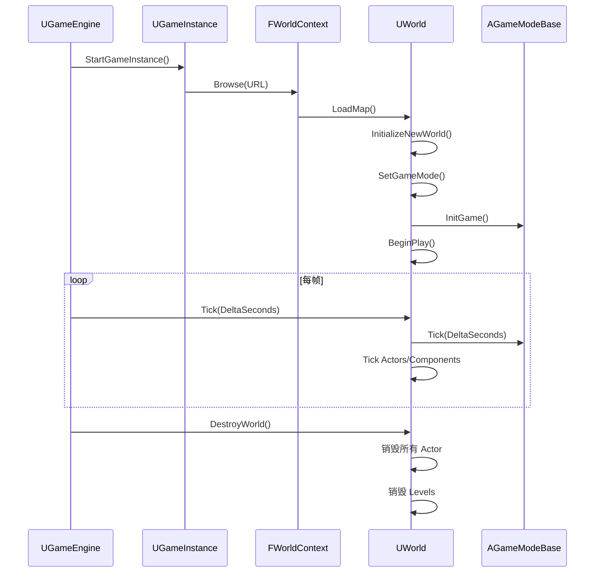
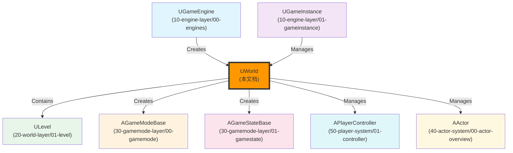

# UWorld详解

## 概述

> `UWorld` 是 Unreal Engine 中最高级别的对象，代表一个地图或沙盒（sandbox），所有 Actor 和 Component 都在其中存在和渲染。一个游戏进程只能运行一个**主 World**，但可以运行多个预览 World（GamePreview/EditorPreview）。

---

## 核心概念

### World 的职责

`UWorld` 是游戏世界的核心载体，负责管理：



**核心职责**：
1. **关卡管理**：管理 `PersistentLevel` 和 `StreamingLevels`
2. **Actor 管理**：管理 World 中的所有 Actor
3. **游戏状态管理**：管理 `GameState`
4. **PlayerController 管理**：管理所有 `PlayerController`
5. **Tick 驱动**：驱动 World 中的所有 Actor 和 Component 的 Tick
6. **World 切换**：支持 `ServerTravel` 和 `ClientTravel`

### World 类型（EWorldType）

```cpp
namespace EWorldType
{
    enum Type
    {
        // Game 模式下的 World（打包后的游戏进程或编辑器启动的独立游戏进程）
        Game,
        // 编辑器模式下的 World
        Editor,
        // 在编辑器内运行游戏进程的 World
        PIE,
        // 编辑器模式下的资源编辑的预览 World（FPreviewScene）
        EditorPreview,
        // 游戏运行时预览的 World（用于游戏的一些预览功能）
        GamePreview,
        GameRPC,
    };
}
```

**类型说明**：

| 类型 | 说明 | 使用场景 |
|------|------|----------|
| `Game` | 游戏 World | 打包后的游戏、编辑器独立游戏进程 |
| `Editor` | 编辑器 World | 编辑器模式下的主 World |
| `PIE` | Play In Editor World | 在编辑器内运行游戏 |
| `EditorPreview` | 编辑器预览 World | 编辑器内预览资源（如材质、蓝图） |
| `GamePreview` | 游戏预览 World | 游戏运行时的预览功能（如角色选择器） |

> 💡 **注意**：编辑器模式下单进程启动 DS 和多个客户端，就是多个 World（PIE 模式）。

---

## 架构解析

### UWorld 类继承关系



### 关键方法详解

#### InitializeNewWorld() - 初始化新 World

**功能**：初始化新创建的 World，创建 `PersistentLevel`。

**执行流程**：



**关键代码**：

```cpp
void UWorld::InitializeNewWorld(const InitializationValues IVS, bool bInSkipInitWorld)
{
    // 创建一个主关卡（PersistentLevel）
    PersistentLevel = NewObject<ULevel>(this, TEXT("PersistentLevel"));
    PersistentLevel->Initialize();
    
    // 添加到 Levels 列表
    Levels.Add(PersistentLevel);
    
    // 设置当前 Level
    CurrentLevel = PersistentLevel;
}
```

#### SetGameMode() - 设置 GameMode

**功能**：为 World 生成 `GameMode` 和 `GameState`。

**执行流程**：



**关键代码**：

```cpp
bool UWorld::SetGameMode(const FURL& InURL)
{
    // 从 URL 或 GameMode Override 中获取 GameMode 类
    TSubclassOf<AGameModeBase> GameModeClass = GetGameModeForURL(InURL);
    
    // Spawn GameMode
    AGameModeBase* GameMode = GetWorld()->SpawnActor<AGameModeBase>(GameModeClass);
    
    // GameMode 会创建 GameState
    GameMode->InitGame(InURL.Open(), ...);
    GameMode->StartPlay();
    
    return true;
}
```

#### SpawnPlayActor() - 生成玩家 Actor

**功能**：生成 `PlayerController`，并绑定到指定的 `Player`。

**执行流程**：



**关键代码**：

```cpp
APlayerController* UWorld::SpawnPlayActor(UPlayer* Player, ENetRole RemoteRole, const FURL& InURL, const FUniqueNetIdRepl& UniqueId, FString& Error, uint8 InNetPlayerIndex, int32 InLocalPlayerIdentifier)
{
    // 调用 GameMode->Login()
    APlayerController* NewPlayerController = GetAuthGameMode()->Login(Player, RemoteRole, InURL, Error);
    
    // GameMode->PostLogin()
    GetAuthGameMode()->PostLogin(NewPlayerController);
    
    return NewPlayerController;
}
```

#### BeginPlay() - 开始游戏

**功能**：启动游戏逻辑，触发所有 Actor 的 `BeginPlay()`。

**执行流程**：

```mermaid
sequenceDiagram
    participant World as UWorld
    participant GM as AGameModeBase
    participant Actor as AActor
    
    World->>World: BeginPlay()
    World->>GM: StartPlay()
    GM->>GM: StartMatch()
    World->>Actor: 遍历所有 Actor
    Actor->>Actor: BeginPlay()
    World->>World: bBegunPlay = true
```

**关键代码**：

```cpp
void UWorld::BeginPlay()
{
    // 调用 GameMode->StartPlay()
    GetAuthGameMode()->StartPlay();
    
    // 遍历所有 Actor，调用 BeginPlay()
    for (TActorIterator<AActor> It(this); It; ++It)
    {
        AActor* Actor = *It;
        Actor->BeginPlay();
    }
    
    // 标记 World 已开始播放
    bBegunPlay = true;
}
```

#### Tick() - World Tick

**功能**：驱动 World 中的所有 Actor 和 Component 的 Tick。

**执行流程**：

```mermaid
sequenceDiagram
    participant Engine as UGameEngine
    participant World as UWorld
    participant TickMgr as FTickTaskManager
    participant Actor as AActor
    participant Comp as UActorComponent
    
    Engine->>World: Tick(TickType, DeltaSeconds)
    World->>TickMgr: StartFrame(DeltaSeconds)
    TickMgr->>Actor: Tick(DeltaSeconds)
    Actor->>Comp: TickComponent(DeltaSeconds)
    World->>World: TickWorldTravel()
    World->>World: UpdateLevelStreaming()
    World->>TickMgr: EndFrame()
```

**关键代码**：

```cpp
void UWorld::Tick(ELevelTick TickType, float DeltaSeconds)
{
    // 开始 Tick 帧
    FTickTaskManager::Get().StartFrame(DeltaSeconds, TickType, ...);
    
    // Tick 所有 Actor
    for (TActorIterator<AActor> It(this); It; ++It)
    {
        AActor* Actor = *It;
        Actor->Tick(DeltaSeconds);
    }
    
    // 处理 World 切换（ServerTravel/ClientTravel）
    TickWorldTravel();
    
    // 更新 Level Streaming
    UpdateLevelStreaming();
    
    // 结束 Tick 帧
    FTickTaskManager::Get().EndFrame();
}
```

---

## 执行流程

### World 完整生命周期



### World 与 Engine/GameInstance 的交互



---

## 与其他模块的关系

`UWorld` 作为游戏世界的核心载体，与以下系统紧密相关：



**关系说明**：

| 相关模块 | 关系 | 说明 |
|----------|------|------|
| **UGameEngine** | 创建 World | `UGameEngine::LoadMap()` 中创建 `UWorld` |
| **UGameInstance** | 管理 World | `UGameInstance` 通过 `WorldContext` 管理当前 World |
| **ULevel** | 被 World 包含 | `UWorld` 包含 `PersistentLevel` 和 `StreamingLevels` |
| **AGameModeBase** | 被 World 创建 | `UWorld::SetGameMode()` 中创建 `GameMode` |
| **AGameStateBase** | 被 World 创建 | `AGameModeBase::InitGame()` 中创建 `GameState` |
| **APlayerController** | 被 World 管理 | `UWorld::SpawnPlayActor()` 中创建 `PlayerController` |
| **AActor** | 被 World 管理 | `UWorld` 管理 World 中的所有 Actor |

---

## 常见陷阱与最佳实践

### ⚠️ 常见陷阱

1. **在错误的时机访问 World**
   - ❌ 错误：在 `UGameInstance::Init()` 中尝试访问 `GetWorld()`
   - ✅ 正确：`World` 在 `UGameInstance::StartGameInstance()` 中创建，只能在之后访问

2. **不理解 World 的生命周期**
   - ❌ 错误：认为 `World` 会在加载新关卡时立即销毁
   - ✅ 正确：`World` 会在 `LoadMap()` 中先创建新 World，再销毁旧 World

3. **混淆 World 类型**
   - ❌ 错误：在 `Game` 类型的 World 中使用编辑器功能
   - ✅ 正确：根据 `WorldType` 判断当前 World 的用途

### ✅ 最佳实践

1. **使用 GetWorld() 获取 World**
   - 需要获取 World → 使用 `GetWorld()`（AActor/UObject 的方法）
   - 避免在构造函数中访问 World

2. **理解 World 切换机制**
   - 服务器发起的关卡切换 → 使用 `ServerTravel`
   - 客户端发起的关卡切换 → 使用 `ClientTravel`
   - 无缝地图切换 → 使用 `ServerTravel` 并保留指定 Actor

3. **使用 Level Streaming 优化大地图**
   - 大地图 → 使用 `Level Streaming` 分区加载
   - 动态加载/卸载关卡 → 使用 `ULevelStreaming::RequestLevel()`

---

## 参考资料

### UE 官方文档
- [UE5 官方文档](https://docs.unrealengine.com/5.0/zh-CN/)
- [World 官方文档](https://docs.unrealengine.com/5.0/zh-CN/uframework-in-unreal-engine/)

### 内部文档
- [[30-tutorials/ue-framework/00-UE框架概述|UE 框架概述]]
- [[30-tutorials/ue-framework/01-UE游戏主循环详解|游戏主循环详解]]
- [[30-tutorials/ue-framework/10-engine-layer/00-UE引擎层详解|引擎层详解]]
- [[30-tutorials/ue-framework/10-engine-layer/01-UGameInstance详解|GameInstance 详解]]
- [[30-tutorials/ue-framework/20-world-layer/01-ULevel与LevelStreaming详解|Level 与流关卡详解]]

### 原文档
- 

---

**文档版本**：v1.0  
**最后更新**：2026-05-16  
**维护者**：AI Agent（按项目规范维护）

<!-- nav:auto -->

---

**导航**: ← [[30-tutorials/ue-framework/10-engine-layer/01-UGameInstance详解|01-UGameInstance详解]] · [[30-tutorials/ue-framework/20-world-layer/01-ULevel与LevelStreaming详解|01-ULevel与LevelStreaming详解]] →

<!-- /nav:auto -->
